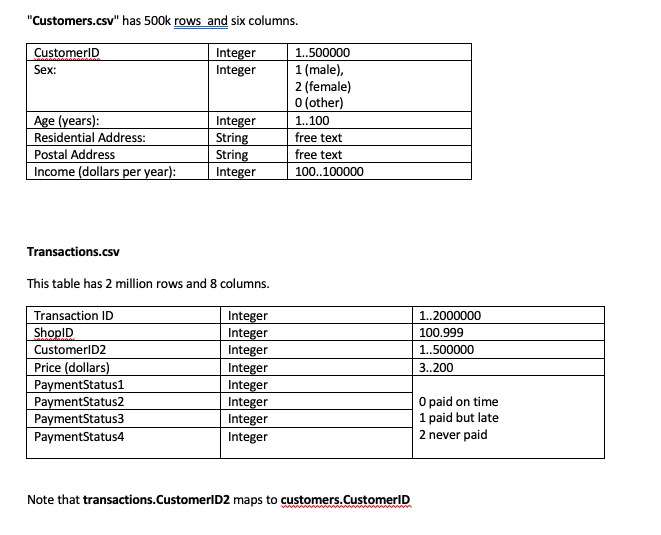

# Interview Coding Test

## Objective

To explore and discover any risk factors that might likely contribute to late payments or non-payments.

## Scenario

ViaBill allows customers to purchase an item, and pay for it in 4 equal installments over the next 4 weeks. Most customers will pay these required installments on time. However, some customers will pay them late and some customers will unfortunately dishonor their agreement (default) and not pay all the installments.
By exploring the synthetic data, can you find identify factors which may be used to predict which customers will pay late?
And even more importantly, can you identify factors which may be used to predict which customers will not pay an installment at all?

## Available Tools

Use the analytical platform of your choice to analyze the data.

## Presentation

The first 10-15 minutes of the interview will be allocated for you to report your findings.
Please note that if you wish to send any presentations to the panel members, please ensure that it is either (i) an Adobe PDF document, (ii) a Microsoft Word document, or (iii) a Microsoft PowerPoint file.
Send it at least two hours before your interview to  jc@viabill.com

## Data

Two CSV tables: "customers.csv" and "transactions.csv" have been provided.

