```python
import numpy as np
import pandas as pd
import re
import seaborn as sns
import matplotlib.pyplot as plt 
from scipy.stats import chi2_contingency
import geocoder
import statistics
```


```python
%reload_kedro
```

    2021-04-19 16:45:15,701 - root - INFO - Registered hooks from 2 installed plugin(s): kedro-mlflow-0.7.0
    2021-04-19 16:45:15,728 - kedro.framework.session.store - INFO - `read()` not implemented for `BaseSessionStore`. Assuming empty store.


    /Users/xszpo/miniconda3/envs/viabill/lib/python3.8/site-packages/kedro/framework/project/__init__.py:133: UserWarning: Found duplicate pipeline entries. The following will be overwritten: __default__
      warn(


    2021-04-19 16:45:15,964 - root - INFO - ** Kedro project viabill
    2021-04-19 16:45:15,978 - root - INFO - Defined global variable `context`, `session` and `catalog`
    2021-04-19 16:45:16,002 - root - INFO - Registered line magic `run_viz`


## Load data


```python
df_cust = catalog.load("customers")
d_sex = {1: 'male', 2:'female', 0: 'other'}
df_cust.sex = df_cust.sex.apply(lambda x: d_sex[x])

df_cust['residentialAddress_clean'] = df_cust.residentialAddress.apply(lambda x: re.sub(r'[0-9]+', '', x))
df_cust['postalAddress_clean']  = df_cust.postalAddress.apply(lambda x: re.sub(r'[0-9]+', '', x) if x==x else '')
df_cust['same_address'] = (df_cust.residentialAddress==df_cust.postalAddress).astype(int)

```

    2021-04-19 16:45:16,052 - kedro.io.data_catalog - INFO - Loading data from `customers` (CSVDataSet)...


```python
df_trans = catalog.load("transactions")
df_trans['late'] = df_trans.filter(regex='payment').apply(lambda x: x==1).any(axis=1).astype(int)
df_trans['default'] = df_trans.filter(regex='payment').apply(lambda x: x==2).any(axis=1).astype(int)

df_trans["defualted_payment"] = df_trans.replace({
    'paymentStatus1': {1: 0, 2: 1},
    'paymentStatus2': {1: 0, 2: 2},
    'paymentStatus3': {1: 0, 2: 3},
    'paymentStatus4': {1: 0, 2: 4},
}).filter(regex='payment').replace({0: np.nan}).min(axis=1).fillna(0)

df_trans["late_payment_first"] = df_trans.replace({
    'paymentStatus1': {1: 1, 2: 0},
    'paymentStatus2': {1: 2, 2: 0},
    'paymentStatus3': {1: 3, 2: 0},
    'paymentStatus4': {1: 4, 2: 0},
}).filter(regex='payment').replace({0: np.nan}).min(axis=1).fillna(0)
```

    2021-04-19 16:45:20,526 - kedro.io.data_catalog - INFO - Loading data from `transactions` (CSVDataSet)...
    2021-04-19 16:45:22,496 - numexpr.utils - INFO - NumExpr defaulting to 4 threads.


```python
df_trans['money_lost'] = df_trans['defualted_payment']/4 * df_trans['price']
```


```python
print(f"""
Numer of rows in 'customers' table - {df_cust.shape[0]/1000:.0f} K.
Numer of columns in 'customers' table - {df_cust.shape[1]}.

Numer of rows in 'transactions' table - {df_trans.shape[0]/1000000:.0f} M.
Numer of columns in 'transactions' table - {df_trans.shape[1]}.

Numer of uniqe customers in 'customers' table - {len(df_cust.customerID.unique())/1000:.0f} K.
Numer of uniqe customers in 'transactions' table - {len(df_trans.customerID.unique())/1000:.0f} K.
""")
```

    
    Numer of rows in 'customers' table - 500 K.
    Numer of columns in 'customers' table - 9.
    
    Numer of rows in 'transactions' table - 2 M.
    Numer of columns in 'transactions' table - 13.
    
    Numer of uniqe customers in 'customers' table - 500 K.
    Numer of uniqe customers in 'transactions' table - 491 K.
    


Check if rows in data in Customer and Transactions tables are not duplicated


```python
if df_cust.customerID.nunique() == df_cust.shape[0]:
    print("Data in Customer table are NOT duplicated.")
else:
    print("Data in Customer table ARE duplicated.")
```

    Data in Customer table are NOT duplicated.


```python
if df_trans.transactionID.nunique() == df_trans.shape[0]:
    print("Data in Transactions table are NOT duplicated.")
else:
    print("Data in Transactions table ARE duplicated.")
```

    Data in Transactions table are NOT duplicated.


## Customers table


```python
df_cust.head()
```


<div>
<style scoped>
    .dataframe tbody tr th:only-of-type {
        vertical-align: middle;
    }

    .dataframe tbody tr th {
        vertical-align: top;
    }

    .dataframe thead th {
        text-align: right;
    }
</style>
<table border="1" class="dataframe">
  <thead>
    <tr style="text-align: right;">
      <th></th>
      <th>customerID</th>
      <th>sex</th>
      <th>age</th>
      <th>residentialAddress</th>
      <th>postalAddress</th>
      <th>income</th>
      <th>residentialAddress_clean</th>
      <th>postalAddress_clean</th>
      <th>same_address</th>
    </tr>
  </thead>
  <tbody>
    <tr>
      <th>0</th>
      <td>1</td>
      <td>male</td>
      <td>25</td>
      <td>28 Irvine Place</td>
      <td>28 Irvine Place</td>
      <td>NaN</td>
      <td>Irvine Place</td>
      <td>Irvine Place</td>
      <td>1</td>
    </tr>
    <tr>
      <th>1</th>
      <td>2</td>
      <td>male</td>
      <td>19</td>
      <td>72 Bertha Street</td>
      <td>72 Bertha Street</td>
      <td>43200.0</td>
      <td>Bertha Street</td>
      <td>Bertha Street</td>
      <td>1</td>
    </tr>
    <tr>
      <th>2</th>
      <td>3</td>
      <td>female</td>
      <td>22</td>
      <td>63 Ladberry Street</td>
      <td>63 Ladberry Street</td>
      <td>70200.0</td>
      <td>Ladberry Street</td>
      <td>Ladberry Street</td>
      <td>1</td>
    </tr>
    <tr>
      <th>3</th>
      <td>4</td>
      <td>other</td>
      <td>24</td>
      <td>98 Linneman Close</td>
      <td>98 Linneman Close</td>
      <td>93900.0</td>
      <td>Linneman Close</td>
      <td>Linneman Close</td>
      <td>1</td>
    </tr>
    <tr>
      <th>4</th>
      <td>5</td>
      <td>male</td>
      <td>53</td>
      <td>56 Salonica Road</td>
      <td>56 Salonica Road</td>
      <td>77000.0</td>
      <td>Salonica Road</td>
      <td>Salonica Road</td>
      <td>1</td>
    </tr>
  </tbody>
</table>
</div>


```python
print("Nulls percentage:")
(df_cust.replace('',np.nan).isna().sum()/ df_cust.shape[0]).map(lambda x:'{:.2f}%'.format(x*100))
```

    Nulls percentage:


    customerID                  0.00%
    sex                         0.00%
    age                         0.00%
    residentialAddress          0.00%
    postalAddress               2.02%
    income                      1.99%
    residentialAddress_clean    0.00%
    postalAddress_clean         2.02%
    same_address                0.00%
    dtype: object


```python
%matplotlib inline
df_cust.hist(bins=50, figsize=(15,7)) 
plt.show()
```


    
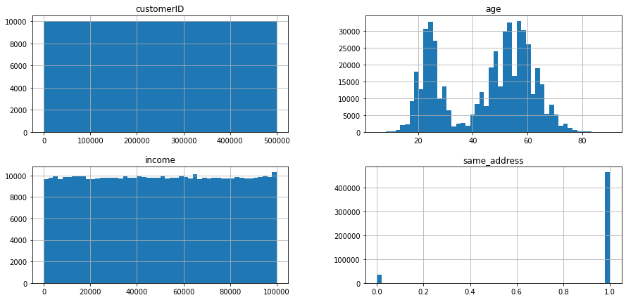
    


### sex vs age


```python
%matplotlib inline
fig, ax = plt.subplots(figsize=(7,5))
sns.histplot(df_cust, x="age", hue="sex", ax=ax, alpha=0.5, bins=20, element="step", stat="probability", common_norm=False)
plt.show()
```


    
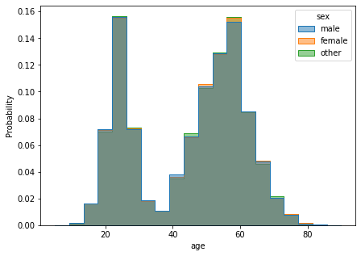
    


```python
_tmp = pd.crosstab(df_cust.sex, pd.cut(df_cust.age, 7), rownames=['sex'], colnames=['age'])
_tmp.style.background_gradient(cmap ='Blues',axis=1)

```


<style  type="text/css" >
#T_ebc29_row0_col0,#T_ebc29_row1_col0,#T_ebc29_row2_col0{
            background-color:  #eef5fc;
            color:  #000000;
        }#T_ebc29_row0_col1{
            background-color:  #084c95;
            color:  #f1f1f1;
        }#T_ebc29_row0_col2{
            background-color:  #d5e5f4;
            color:  #000000;
        }#T_ebc29_row0_col3{
            background-color:  #1967ad;
            color:  #f1f1f1;
        }#T_ebc29_row0_col4,#T_ebc29_row1_col4,#T_ebc29_row2_col4{
            background-color:  #08306b;
            color:  #f1f1f1;
        }#T_ebc29_row0_col5,#T_ebc29_row2_col5{
            background-color:  #d3e3f3;
            color:  #000000;
        }#T_ebc29_row0_col6,#T_ebc29_row1_col6,#T_ebc29_row2_col6{
            background-color:  #f7fbff;
            color:  #000000;
        }#T_ebc29_row1_col1{
            background-color:  #084990;
            color:  #f1f1f1;
        }#T_ebc29_row1_col2{
            background-color:  #d3e4f3;
            color:  #000000;
        }#T_ebc29_row1_col3{
            background-color:  #1966ad;
            color:  #f1f1f1;
        }#T_ebc29_row1_col5{
            background-color:  #d2e3f3;
            color:  #000000;
        }#T_ebc29_row2_col1{
            background-color:  #084a91;
            color:  #f1f1f1;
        }#T_ebc29_row2_col2{
            background-color:  #d6e5f4;
            color:  #000000;
        }#T_ebc29_row2_col3{
            background-color:  #1865ac;
            color:  #f1f1f1;
        }</style><table id="T_ebc29_" ><thead>    <tr>        <th class="index_name level0" >age</th>        <th class="col_heading level0 col0" >(4.915, 17.143]</th>        <th class="col_heading level0 col1" >(17.143, 29.286]</th>        <th class="col_heading level0 col2" >(29.286, 41.429]</th>        <th class="col_heading level0 col3" >(41.429, 53.571]</th>        <th class="col_heading level0 col4" >(53.571, 65.714]</th>        <th class="col_heading level0 col5" >(65.714, 77.857]</th>        <th class="col_heading level0 col6" >(77.857, 90.0]</th>    </tr>    <tr>        <th class="index_name level0" >sex</th>        <th class="blank" ></th>        <th class="blank" ></th>        <th class="blank" ></th>        <th class="blank" ></th>        <th class="blank" ></th>        <th class="blank" ></th>        <th class="blank" ></th>    </tr></thead><tbody>
                <tr>
                        <th id="T_ebc29_level0_row0" class="row_heading level0 row0" >female</th>
                        <td id="T_ebc29_row0_col0" class="data row0 col0" >1778</td>
                        <td id="T_ebc29_row0_col1" class="data row0 col1" >28840</td>
                        <td id="T_ebc29_row0_col2" class="data row0 col2" >5806</td>
                        <td id="T_ebc29_row0_col3" class="data row0 col3" >25381</td>
                        <td id="T_ebc29_row0_col4" class="data row0 col4" >32238</td>
                        <td id="T_ebc29_row0_col5" class="data row0 col5" >6095</td>
                        <td id="T_ebc29_row0_col6" class="data row0 col6" >190</td>
            </tr>
            <tr>
                        <th id="T_ebc29_level0_row1" class="row_heading level0 row1" >male</th>
                        <td id="T_ebc29_row1_col0" class="data row1 col0" >6574</td>
                        <td id="T_ebc29_row1_col1" class="data row1 col1" >108134</td>
                        <td id="T_ebc29_row1_col2" class="data row1 col2" >22081</td>
                        <td id="T_ebc29_row1_col3" class="data row1 col3" >94778</td>
                        <td id="T_ebc29_row1_col4" class="data row1 col4" >119441</td>
                        <td id="T_ebc29_row1_col5" class="data row1 col5" >22950</td>
                        <td id="T_ebc29_row1_col6" class="data row1 col6" >587</td>
            </tr>
            <tr>
                        <th id="T_ebc29_level0_row2" class="row_heading level0 row2" >other</th>
                        <td id="T_ebc29_row2_col0" class="data row2 col0" >438</td>
                        <td id="T_ebc29_row2_col1" class="data row2 col1" >7246</td>
                        <td id="T_ebc29_row2_col2" class="data row2 col2" >1408</td>
                        <td id="T_ebc29_row2_col3" class="data row2 col3" >6409</td>
                        <td id="T_ebc29_row2_col4" class="data row2 col4" >8053</td>
                        <td id="T_ebc29_row2_col5" class="data row2 col5" >1532</td>
                        <td id="T_ebc29_row2_col6" class="data row2 col6" >41</td>
            </tr>
    </tbody></table>


```python
# Tests whether two categorical variables are related or independent.
# assumptions:
# * Observations used in the calculation of the contingency table are independent.
# 25 or more examples in each cell of the contingency table.
#H0: the two samples are independent.
#H1: there is a dependency between the samples.

# Example of the Chi-Squared Test
table = [_tmp.values]
stat, p, dof, expected = chi2_contingency(table)
print('stat=%.3f, p=%.3f' % (stat, p))
if p > 0.05:
    print('Probably independent')
else:
    print('Probably dependent')
```

    stat=12.594, p=0.399
    Probably independent


### sex vs income


```python
%matplotlib inline

def move_legend(ax, new_loc, **kws):
    old_legend = ax.legend_
    handles = old_legend.legendHandles
    labels = [t.get_text() for t in old_legend.get_texts()]
    title = old_legend.get_title().get_text()
    ax.legend(handles, labels, loc=new_loc, title=title, **kws)
    
fig, ax = plt.subplots(figsize=(7,5))
g = sns.histplot(df_cust, x="income", hue="sex", ax=ax, alpha=0.5, bins=5, 
             element="step", stat="probability", common_norm=False)

move_legend(ax, 4)

```


    
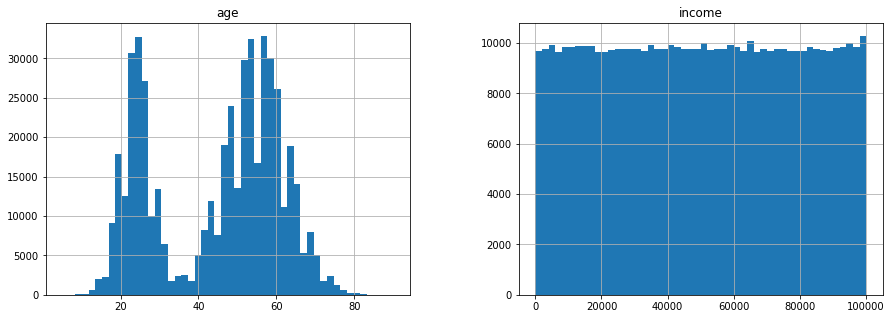
    


```python
_tmp = pd.crosstab(df_cust.sex, pd.cut(df_cust.income, 5), rownames=['sex'], colnames=['income'])
_tmp.style.background_gradient(cmap ='Blues',axis=1)
```


<style  type="text/css" >
#T_9aac8_row0_col0{
            background-color:  #6fb0d7;
            color:  #000000;
        }#T_9aac8_row0_col1{
            background-color:  #add0e6;
            color:  #000000;
        }#T_9aac8_row0_col2,#T_9aac8_row1_col4,#T_9aac8_row2_col0{
            background-color:  #f7fbff;
            color:  #000000;
        }#T_9aac8_row0_col3{
            background-color:  #529dcc;
            color:  #000000;
        }#T_9aac8_row0_col4,#T_9aac8_row1_col0,#T_9aac8_row2_col1{
            background-color:  #08306b;
            color:  #f1f1f1;
        }#T_9aac8_row1_col1{
            background-color:  #e6f0f9;
            color:  #000000;
        }#T_9aac8_row1_col2{
            background-color:  #084f99;
            color:  #f1f1f1;
        }#T_9aac8_row1_col3{
            background-color:  #eef5fc;
            color:  #000000;
        }#T_9aac8_row2_col2{
            background-color:  #0b559f;
            color:  #f1f1f1;
        }#T_9aac8_row2_col3{
            background-color:  #cde0f1;
            color:  #000000;
        }#T_9aac8_row2_col4{
            background-color:  #71b1d7;
            color:  #000000;
        }</style><table id="T_9aac8_" ><thead>    <tr>        <th class="index_name level0" >income</th>        <th class="col_heading level0 col0" >(-100.0, 20000.0]</th>        <th class="col_heading level0 col1" >(20000.0, 40000.0]</th>        <th class="col_heading level0 col2" >(40000.0, 60000.0]</th>        <th class="col_heading level0 col3" >(60000.0, 80000.0]</th>        <th class="col_heading level0 col4" >(80000.0, 100000.0]</th>    </tr>    <tr>        <th class="index_name level0" >sex</th>        <th class="blank" ></th>        <th class="blank" ></th>        <th class="blank" ></th>        <th class="blank" ></th>        <th class="blank" ></th>    </tr></thead><tbody>
                <tr>
                        <th id="T_9aac8_level0_row0" class="row_heading level0 row0" >female</th>
                        <td id="T_9aac8_row0_col0" class="data row0 col0" >19683</td>
                        <td id="T_9aac8_row0_col1" class="data row0 col1" >19591</td>
                        <td id="T_9aac8_row0_col2" class="data row0 col2" >19400</td>
                        <td id="T_9aac8_row0_col3" class="data row0 col3" >19731</td>
                        <td id="T_9aac8_row0_col4" class="data row0 col4" >19976</td>
            </tr>
            <tr>
                        <th id="T_9aac8_level0_row1" class="row_heading level0 row1" >male</th>
                        <td id="T_9aac8_row1_col0" class="data row1 col0" >73967</td>
                        <td id="T_9aac8_row1_col1" class="data row1 col1" >73099</td>
                        <td id="T_9aac8_row1_col2" class="data row1 col2" >73852</td>
                        <td id="T_9aac8_row1_col3" class="data row1 col3" >73061</td>
                        <td id="T_9aac8_row1_col4" class="data row1 col4" >73017</td>
            </tr>
            <tr>
                        <th id="T_9aac8_level0_row2" class="row_heading level0 row2" >other</th>
                        <td id="T_9aac8_row2_col0" class="data row2 col0" >4879</td>
                        <td id="T_9aac8_row2_col1" class="data row2 col1" >4978</td>
                        <td id="T_9aac8_row2_col2" class="data row2 col2" >4964</td>
                        <td id="T_9aac8_row2_col3" class="data row2 col3" >4900</td>
                        <td id="T_9aac8_row2_col4" class="data row2 col4" >4927</td>
            </tr>
    </tbody></table>


```python
# Example of the Chi-Squared Test
table = [_tmp.values]
stat, p, dof, expected = chi2_contingency(table)
print('stat=%.3f, p=%.3f' % (stat, p))
if p > 0.05:
    print('Probably independent')
else:
    print('Probably dependent')
```

    stat=16.843, p=0.032
    Probably dependent


Highlights:
* there are two customer segments, given age: ~25 years, ~55 years, 
* there's no dependency between age and sex,
* there may be dependency between sex and income, 

### age vs income


```python
from pandas.plotting import scatter_matrix
```


```python
%matplotlib inline
attributes = ['age','income']
scatter_matrix(df_cust[attributes].fillna(-999), figsize=(8, 6))
plt.show()
```


    
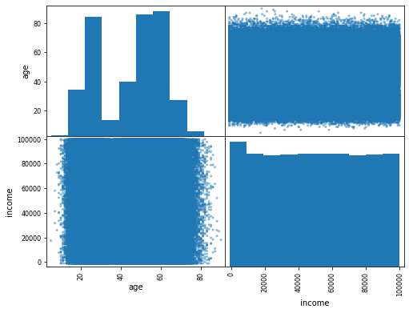
    


```python
_tmp = pd.crosstab(pd.cut(df_cust.fillna(-999).income, 7), pd.cut(df_cust.age, 7), rownames=['income'], colnames=['age'])
_tmp.style.background_gradient(cmap ='Blues',axis=1)
```


<style  type="text/css" >
#T_4a212_row0_col0,#T_4a212_row2_col0,#T_4a212_row3_col0,#T_4a212_row4_col0{
            background-color:  #eef5fc;
            color:  #000000;
        }#T_4a212_row0_col1,#T_4a212_row2_col1,#T_4a212_row6_col1{
            background-color:  #084990;
            color:  #f1f1f1;
        }#T_4a212_row0_col2,#T_4a212_row2_col2,#T_4a212_row4_col2,#T_4a212_row5_col2{
            background-color:  #d4e4f4;
            color:  #000000;
        }#T_4a212_row0_col3,#T_4a212_row1_col3{
            background-color:  #1764ab;
            color:  #f1f1f1;
        }#T_4a212_row0_col4,#T_4a212_row1_col4,#T_4a212_row2_col4,#T_4a212_row3_col4,#T_4a212_row4_col4,#T_4a212_row5_col4,#T_4a212_row6_col4{
            background-color:  #08306b;
            color:  #f1f1f1;
        }#T_4a212_row0_col5,#T_4a212_row1_col5,#T_4a212_row6_col5{
            background-color:  #d2e3f3;
            color:  #000000;
        }#T_4a212_row0_col6,#T_4a212_row1_col6,#T_4a212_row2_col6,#T_4a212_row3_col6,#T_4a212_row4_col6,#T_4a212_row5_col6,#T_4a212_row6_col6{
            background-color:  #f7fbff;
            color:  #000000;
        }#T_4a212_row1_col0,#T_4a212_row5_col0,#T_4a212_row6_col0{
            background-color:  #edf4fc;
            color:  #000000;
        }#T_4a212_row1_col1{
            background-color:  #08478d;
            color:  #f1f1f1;
        }#T_4a212_row1_col2,#T_4a212_row2_col5,#T_4a212_row3_col5,#T_4a212_row5_col5{
            background-color:  #d3e3f3;
            color:  #000000;
        }#T_4a212_row2_col3{
            background-color:  #1865ac;
            color:  #f1f1f1;
        }#T_4a212_row3_col1{
            background-color:  #08488e;
            color:  #f1f1f1;
        }#T_4a212_row3_col2{
            background-color:  #d5e5f4;
            color:  #000000;
        }#T_4a212_row3_col3{
            background-color:  #1c6bb0;
            color:  #f1f1f1;
        }#T_4a212_row4_col1{
            background-color:  #084a91;
            color:  #f1f1f1;
        }#T_4a212_row4_col3{
            background-color:  #1a68ae;
            color:  #f1f1f1;
        }#T_4a212_row4_col5,#T_4a212_row6_col2{
            background-color:  #d3e4f3;
            color:  #000000;
        }#T_4a212_row5_col1{
            background-color:  #084e98;
            color:  #f1f1f1;
        }#T_4a212_row5_col3{
            background-color:  #1966ad;
            color:  #f1f1f1;
        }#T_4a212_row6_col3{
            background-color:  #1663aa;
            color:  #f1f1f1;
        }</style><table id="T_4a212_" ><thead>    <tr>        <th class="index_name level0" >age</th>        <th class="col_heading level0 col0" >(4.915, 17.143]</th>        <th class="col_heading level0 col1" >(17.143, 29.286]</th>        <th class="col_heading level0 col2" >(29.286, 41.429]</th>        <th class="col_heading level0 col3" >(41.429, 53.571]</th>        <th class="col_heading level0 col4" >(53.571, 65.714]</th>        <th class="col_heading level0 col5" >(65.714, 77.857]</th>        <th class="col_heading level0 col6" >(77.857, 90.0]</th>    </tr>    <tr>        <th class="index_name level0" >income</th>        <th class="blank" ></th>        <th class="blank" ></th>        <th class="blank" ></th>        <th class="blank" ></th>        <th class="blank" ></th>        <th class="blank" ></th>        <th class="blank" ></th>    </tr></thead><tbody>
                <tr>
                        <th id="T_4a212_level0_row0" class="row_heading level0 row0" >(-1099.999, 13429.429]</th>
                        <td id="T_4a212_row0_col0" class="data row0 col0" >1324</td>
                        <td id="T_4a212_row0_col1" class="data row0 col1" >21957</td>
                        <td id="T_4a212_row0_col2" class="data row0 col2" >4434</td>
                        <td id="T_4a212_row0_col3" class="data row0 col3" >19351</td>
                        <td id="T_4a212_row0_col4" class="data row0 col4" >24249</td>
                        <td id="T_4a212_row0_col5" class="data row0 col5" >4669</td>
                        <td id="T_4a212_row0_col6" class="data row0 col6" >120</td>
            </tr>
            <tr>
                        <th id="T_4a212_level0_row1" class="row_heading level0 row1" >(13429.429, 27857.857]</th>
                        <td id="T_4a212_row1_col0" class="data row1 col0" >1244</td>
                        <td id="T_4a212_row1_col1" class="data row1 col1" >20311</td>
                        <td id="T_4a212_row1_col2" class="data row1 col2" >4188</td>
                        <td id="T_4a212_row1_col3" class="data row1 col3" >17871</td>
                        <td id="T_4a212_row1_col4" class="data row1 col4" >22293</td>
                        <td id="T_4a212_row1_col5" class="data row1 col5" >4348</td>
                        <td id="T_4a212_row1_col6" class="data row1 col6" >113</td>
            </tr>
            <tr>
                        <th id="T_4a212_level0_row2" class="row_heading level0 row2" >(27857.857, 42286.286]</th>
                        <td id="T_4a212_row2_col0" class="data row2 col0" >1238</td>
                        <td id="T_4a212_row2_col1" class="data row2 col1" >20360</td>
                        <td id="T_4a212_row2_col2" class="data row2 col2" >4114</td>
                        <td id="T_4a212_row2_col3" class="data row2 col3" >17930</td>
                        <td id="T_4a212_row2_col4" class="data row2 col4" >22551</td>
                        <td id="T_4a212_row2_col5" class="data row2 col5" >4312</td>
                        <td id="T_4a212_row2_col6" class="data row2 col6" >110</td>
            </tr>
            <tr>
                        <th id="T_4a212_level0_row3" class="row_heading level0 row3" >(42286.286, 56714.714]</th>
                        <td id="T_4a212_row3_col0" class="data row3 col0" >1203</td>
                        <td id="T_4a212_row3_col1" class="data row3 col1" >20784</td>
                        <td id="T_4a212_row3_col2" class="data row3 col2" >4091</td>
                        <td id="T_4a212_row3_col3" class="data row3 col3" >17650</td>
                        <td id="T_4a212_row3_col4" class="data row3 col4" >22829</td>
                        <td id="T_4a212_row3_col5" class="data row3 col5" >4332</td>
                        <td id="T_4a212_row3_col6" class="data row3 col6" >125</td>
            </tr>
            <tr>
                        <th id="T_4a212_level0_row4" class="row_heading level0 row4" >(56714.714, 71143.143]</th>
                        <td id="T_4a212_row4_col0" class="data row4 col0" >1258</td>
                        <td id="T_4a212_row4_col1" class="data row4 col1" >20409</td>
                        <td id="T_4a212_row4_col2" class="data row4 col2" >4162</td>
                        <td id="T_4a212_row4_col3" class="data row4 col3" >17753</td>
                        <td id="T_4a212_row4_col4" class="data row4 col4" >22666</td>
                        <td id="T_4a212_row4_col5" class="data row4 col5" >4231</td>
                        <td id="T_4a212_row4_col6" class="data row4 col6" >121</td>
            </tr>
            <tr>
                        <th id="T_4a212_level0_row5" class="row_heading level0 row5" >(71143.143, 85571.571]</th>
                        <td id="T_4a212_row5_col0" class="data row5 col0" >1273</td>
                        <td id="T_4a212_row5_col1" class="data row5 col1" >19978</td>
                        <td id="T_4a212_row5_col2" class="data row5 col2" >4100</td>
                        <td id="T_4a212_row5_col3" class="data row5 col3" >17859</td>
                        <td id="T_4a212_row5_col4" class="data row5 col4" >22549</td>
                        <td id="T_4a212_row5_col5" class="data row5 col5" >4275</td>
                        <td id="T_4a212_row5_col6" class="data row5 col6" >121</td>
            </tr>
            <tr>
                        <th id="T_4a212_level0_row6" class="row_heading level0 row6" >(85571.571, 100000.0]</th>
                        <td id="T_4a212_row6_col0" class="data row6 col0" >1250</td>
                        <td id="T_4a212_row6_col1" class="data row6 col1" >20421</td>
                        <td id="T_4a212_row6_col2" class="data row6 col2" >4206</td>
                        <td id="T_4a212_row6_col3" class="data row6 col3" >18154</td>
                        <td id="T_4a212_row6_col4" class="data row6 col4" >22595</td>
                        <td id="T_4a212_row6_col5" class="data row6 col5" >4410</td>
                        <td id="T_4a212_row6_col6" class="data row6 col6" >108</td>
            </tr>
    </tbody></table>


```python
# Example of the Chi-Squared Test
table = [_tmp.values]
stat, p, dof, expected = chi2_contingency(table)
print('stat=%.3f, p=%.3f' % (stat, p))
if p > 0.05:
    print('Probably independent')
else:
    print('Probably dependent')
```

    stat=34.090, p=0.560
    Probably independent


# Transactions table

Look for outliers


```python
df_trans.describe().T.style.format({'mean': '{:.2f}'})
```


<style  type="text/css" >
</style><table id="T_caa9a_" ><thead>    <tr>        <th class="blank level0" ></th>        <th class="col_heading level0 col0" >count</th>        <th class="col_heading level0 col1" >mean</th>        <th class="col_heading level0 col2" >std</th>        <th class="col_heading level0 col3" >min</th>        <th class="col_heading level0 col4" >25%</th>        <th class="col_heading level0 col5" >50%</th>        <th class="col_heading level0 col6" >75%</th>        <th class="col_heading level0 col7" >max</th>    </tr></thead><tbody>
                <tr>
                        <th id="T_caa9a_level0_row0" class="row_heading level0 row0" >transactionID</th>
                        <td id="T_caa9a_row0_col0" class="data row0 col0" >2000000.000000</td>
                        <td id="T_caa9a_row0_col1" class="data row0 col1" >1000000.50</td>
                        <td id="T_caa9a_row0_col2" class="data row0 col2" >577350.413527</td>
                        <td id="T_caa9a_row0_col3" class="data row0 col3" >1.000000</td>
                        <td id="T_caa9a_row0_col4" class="data row0 col4" >500000.750000</td>
                        <td id="T_caa9a_row0_col5" class="data row0 col5" >1000000.500000</td>
                        <td id="T_caa9a_row0_col6" class="data row0 col6" >1500000.250000</td>
                        <td id="T_caa9a_row0_col7" class="data row0 col7" >2000000.000000</td>
            </tr>
            <tr>
                        <th id="T_caa9a_level0_row1" class="row_heading level0 row1" >shopID</th>
                        <td id="T_caa9a_row1_col0" class="data row1 col0" >2000000.000000</td>
                        <td id="T_caa9a_row1_col1" class="data row1 col1" >549.25</td>
                        <td id="T_caa9a_row1_col2" class="data row1 col2" >259.847443</td>
                        <td id="T_caa9a_row1_col3" class="data row1 col3" >100.000000</td>
                        <td id="T_caa9a_row1_col4" class="data row1 col4" >324.000000</td>
                        <td id="T_caa9a_row1_col5" class="data row1 col5" >549.000000</td>
                        <td id="T_caa9a_row1_col6" class="data row1 col6" >774.000000</td>
                        <td id="T_caa9a_row1_col7" class="data row1 col7" >999.000000</td>
            </tr>
            <tr>
                        <th id="T_caa9a_level0_row2" class="row_heading level0 row2" >customerID</th>
                        <td id="T_caa9a_row2_col0" class="data row2 col0" >1979983.000000</td>
                        <td id="T_caa9a_row2_col1" class="data row2 col1" >250095.15</td>
                        <td id="T_caa9a_row2_col2" class="data row2 col2" >144288.944851</td>
                        <td id="T_caa9a_row2_col3" class="data row2 col3" >1.000000</td>
                        <td id="T_caa9a_row2_col4" class="data row2 col4" >125139.000000</td>
                        <td id="T_caa9a_row2_col5" class="data row2 col5" >250096.000000</td>
                        <td id="T_caa9a_row2_col6" class="data row2 col6" >375093.000000</td>
                        <td id="T_caa9a_row2_col7" class="data row2 col7" >500000.000000</td>
            </tr>
            <tr>
                        <th id="T_caa9a_level0_row3" class="row_heading level0 row3" >price</th>
                        <td id="T_caa9a_row3_col0" class="data row3 col0" >2000000.000000</td>
                        <td id="T_caa9a_row3_col1" class="data row3 col1" >101.53</td>
                        <td id="T_caa9a_row3_col2" class="data row3 col2" >57.175753</td>
                        <td id="T_caa9a_row3_col3" class="data row3 col3" >3.000000</td>
                        <td id="T_caa9a_row3_col4" class="data row3 col4" >52.000000</td>
                        <td id="T_caa9a_row3_col5" class="data row3 col5" >102.000000</td>
                        <td id="T_caa9a_row3_col6" class="data row3 col6" >151.000000</td>
                        <td id="T_caa9a_row3_col7" class="data row3 col7" >200.000000</td>
            </tr>
            <tr>
                        <th id="T_caa9a_level0_row4" class="row_heading level0 row4" >paymentStatus1</th>
                        <td id="T_caa9a_row4_col0" class="data row4 col0" >2000000.000000</td>
                        <td id="T_caa9a_row4_col1" class="data row4 col1" >0.12</td>
                        <td id="T_caa9a_row4_col2" class="data row4 col2" >0.360735</td>
                        <td id="T_caa9a_row4_col3" class="data row4 col3" >0.000000</td>
                        <td id="T_caa9a_row4_col4" class="data row4 col4" >0.000000</td>
                        <td id="T_caa9a_row4_col5" class="data row4 col5" >0.000000</td>
                        <td id="T_caa9a_row4_col6" class="data row4 col6" >0.000000</td>
                        <td id="T_caa9a_row4_col7" class="data row4 col7" >2.000000</td>
            </tr>
            <tr>
                        <th id="T_caa9a_level0_row5" class="row_heading level0 row5" >paymentStatus2</th>
                        <td id="T_caa9a_row5_col0" class="data row5 col0" >2000000.000000</td>
                        <td id="T_caa9a_row5_col1" class="data row5 col1" >0.15</td>
                        <td id="T_caa9a_row5_col2" class="data row5 col2" >0.427886</td>
                        <td id="T_caa9a_row5_col3" class="data row5 col3" >0.000000</td>
                        <td id="T_caa9a_row5_col4" class="data row5 col4" >0.000000</td>
                        <td id="T_caa9a_row5_col5" class="data row5 col5" >0.000000</td>
                        <td id="T_caa9a_row5_col6" class="data row5 col6" >0.000000</td>
                        <td id="T_caa9a_row5_col7" class="data row5 col7" >2.000000</td>
            </tr>
            <tr>
                        <th id="T_caa9a_level0_row6" class="row_heading level0 row6" >paymentStatus3</th>
                        <td id="T_caa9a_row6_col0" class="data row6 col0" >2000000.000000</td>
                        <td id="T_caa9a_row6_col1" class="data row6 col1" >0.19</td>
                        <td id="T_caa9a_row6_col2" class="data row6 col2" >0.505364</td>
                        <td id="T_caa9a_row6_col3" class="data row6 col3" >0.000000</td>
                        <td id="T_caa9a_row6_col4" class="data row6 col4" >0.000000</td>
                        <td id="T_caa9a_row6_col5" class="data row6 col5" >0.000000</td>
                        <td id="T_caa9a_row6_col6" class="data row6 col6" >0.000000</td>
                        <td id="T_caa9a_row6_col7" class="data row6 col7" >2.000000</td>
            </tr>
            <tr>
                        <th id="T_caa9a_level0_row7" class="row_heading level0 row7" >paymentStatus4</th>
                        <td id="T_caa9a_row7_col0" class="data row7 col0" >2000000.000000</td>
                        <td id="T_caa9a_row7_col1" class="data row7 col1" >0.27</td>
                        <td id="T_caa9a_row7_col2" class="data row7 col2" >0.616858</td>
                        <td id="T_caa9a_row7_col3" class="data row7 col3" >0.000000</td>
                        <td id="T_caa9a_row7_col4" class="data row7 col4" >0.000000</td>
                        <td id="T_caa9a_row7_col5" class="data row7 col5" >0.000000</td>
                        <td id="T_caa9a_row7_col6" class="data row7 col6" >0.000000</td>
                        <td id="T_caa9a_row7_col7" class="data row7 col7" >2.000000</td>
            </tr>
            <tr>
                        <th id="T_caa9a_level0_row8" class="row_heading level0 row8" >late</th>
                        <td id="T_caa9a_row8_col0" class="data row8 col0" >2000000.000000</td>
                        <td id="T_caa9a_row8_col1" class="data row8 col1" >0.29</td>
                        <td id="T_caa9a_row8_col2" class="data row8 col2" >0.455622</td>
                        <td id="T_caa9a_row8_col3" class="data row8 col3" >0.000000</td>
                        <td id="T_caa9a_row8_col4" class="data row8 col4" >0.000000</td>
                        <td id="T_caa9a_row8_col5" class="data row8 col5" >0.000000</td>
                        <td id="T_caa9a_row8_col6" class="data row8 col6" >1.000000</td>
                        <td id="T_caa9a_row8_col7" class="data row8 col7" >1.000000</td>
            </tr>
            <tr>
                        <th id="T_caa9a_level0_row9" class="row_heading level0 row9" >default</th>
                        <td id="T_caa9a_row9_col0" class="data row9 col0" >2000000.000000</td>
                        <td id="T_caa9a_row9_col1" class="data row9 col1" >0.09</td>
                        <td id="T_caa9a_row9_col2" class="data row9 col2" >0.289078</td>
                        <td id="T_caa9a_row9_col3" class="data row9 col3" >0.000000</td>
                        <td id="T_caa9a_row9_col4" class="data row9 col4" >0.000000</td>
                        <td id="T_caa9a_row9_col5" class="data row9 col5" >0.000000</td>
                        <td id="T_caa9a_row9_col6" class="data row9 col6" >0.000000</td>
                        <td id="T_caa9a_row9_col7" class="data row9 col7" >1.000000</td>
            </tr>
            <tr>
                        <th id="T_caa9a_level0_row10" class="row_heading level0 row10" >defualted_payment</th>
                        <td id="T_caa9a_row10_col0" class="data row10 col0" >2000000.000000</td>
                        <td id="T_caa9a_row10_col1" class="data row10 col1" >0.28</td>
                        <td id="T_caa9a_row10_col2" class="data row10 col2" >0.926016</td>
                        <td id="T_caa9a_row10_col3" class="data row10 col3" >0.000000</td>
                        <td id="T_caa9a_row10_col4" class="data row10 col4" >0.000000</td>
                        <td id="T_caa9a_row10_col5" class="data row10 col5" >0.000000</td>
                        <td id="T_caa9a_row10_col6" class="data row10 col6" >0.000000</td>
                        <td id="T_caa9a_row10_col7" class="data row10 col7" >4.000000</td>
            </tr>
            <tr>
                        <th id="T_caa9a_level0_row11" class="row_heading level0 row11" >late_payment_first</th>
                        <td id="T_caa9a_row11_col0" class="data row11 col0" >2000000.000000</td>
                        <td id="T_caa9a_row11_col1" class="data row11 col1" >0.90</td>
                        <td id="T_caa9a_row11_col2" class="data row11 col2" >1.360083</td>
                        <td id="T_caa9a_row11_col3" class="data row11 col3" >0.000000</td>
                        <td id="T_caa9a_row11_col4" class="data row11 col4" >0.000000</td>
                        <td id="T_caa9a_row11_col5" class="data row11 col5" >0.000000</td>
                        <td id="T_caa9a_row11_col6" class="data row11 col6" >2.000000</td>
                        <td id="T_caa9a_row11_col7" class="data row11 col7" >4.000000</td>
            </tr>
            <tr>
                        <th id="T_caa9a_level0_row12" class="row_heading level0 row12" >money_lost</th>
                        <td id="T_caa9a_row12_col0" class="data row12 col0" >2000000.000000</td>
                        <td id="T_caa9a_row12_col1" class="data row12 col1" >7.00</td>
                        <td id="T_caa9a_row12_col2" class="data row12 col2" >27.283984</td>
                        <td id="T_caa9a_row12_col3" class="data row12 col3" >0.000000</td>
                        <td id="T_caa9a_row12_col4" class="data row12 col4" >0.000000</td>
                        <td id="T_caa9a_row12_col5" class="data row12 col5" >0.000000</td>
                        <td id="T_caa9a_row12_col6" class="data row12 col6" >0.000000</td>
                        <td id="T_caa9a_row12_col7" class="data row12 col7" >200.000000</td>
            </tr>
    </tbody></table>


25% of customers are late with second payment    
max price is `$200`, average price is `$102`
 


```python
print("Nulls percentage:")
(df_trans.replace('',np.nan).isna().sum()/ df_trans.shape[0]).map(lambda x:'{:.2f}%'.format(x*100))
```

    Nulls percentage:


    transactionID         0.00%
    shopID                0.00%
    customerID            1.00%
    price                 0.00%
    paymentStatus1        0.00%
    paymentStatus2        0.00%
    paymentStatus3        0.00%
    paymentStatus4        0.00%
    late                  0.00%
    default               0.00%
    defualted_payment     0.00%
    late_payment_first    0.00%
    money_lost            0.00%
    dtype: object


There are some transacions withou customer ID.   
Lets have a look at it


```python
_tmp = pd.concat([
    df_trans.describe().T[['mean']].reset_index(drop=False),
    df_trans.query("customerID != customerID").describe().T[['mean']].reset_index(drop=True)
], axis=1)
_tmp.columns=['column','all-mean','noCustId-mean']
_tmp.style.format({'all-mean': '{:.2f}','noCustId-mean': '{:.2f}'})
```


<style  type="text/css" >
</style><table id="T_38a88_" ><thead>    <tr>        <th class="blank level0" ></th>        <th class="col_heading level0 col0" >column</th>        <th class="col_heading level0 col1" >all-mean</th>        <th class="col_heading level0 col2" >noCustId-mean</th>    </tr></thead><tbody>
                <tr>
                        <th id="T_38a88_level0_row0" class="row_heading level0 row0" >0</th>
                        <td id="T_38a88_row0_col0" class="data row0 col0" >transactionID</td>
                        <td id="T_38a88_row0_col1" class="data row0 col1" >1000000.50</td>
                        <td id="T_38a88_row0_col2" class="data row0 col2" >994726.03</td>
            </tr>
            <tr>
                        <th id="T_38a88_level0_row1" class="row_heading level0 row1" >1</th>
                        <td id="T_38a88_row1_col0" class="data row1 col0" >shopID</td>
                        <td id="T_38a88_row1_col1" class="data row1 col1" >549.25</td>
                        <td id="T_38a88_row1_col2" class="data row1 col2" >551.78</td>
            </tr>
            <tr>
                        <th id="T_38a88_level0_row2" class="row_heading level0 row2" >2</th>
                        <td id="T_38a88_row2_col0" class="data row2 col0" >customerID</td>
                        <td id="T_38a88_row2_col1" class="data row2 col1" >250095.15</td>
                        <td id="T_38a88_row2_col2" class="data row2 col2" >nan</td>
            </tr>
            <tr>
                        <th id="T_38a88_level0_row3" class="row_heading level0 row3" >3</th>
                        <td id="T_38a88_row3_col0" class="data row3 col0" >price</td>
                        <td id="T_38a88_row3_col1" class="data row3 col1" >101.53</td>
                        <td id="T_38a88_row3_col2" class="data row3 col2" >102.37</td>
            </tr>
            <tr>
                        <th id="T_38a88_level0_row4" class="row_heading level0 row4" >4</th>
                        <td id="T_38a88_row4_col0" class="data row4 col0" >paymentStatus1</td>
                        <td id="T_38a88_row4_col1" class="data row4 col1" >0.12</td>
                        <td id="T_38a88_row4_col2" class="data row4 col2" >0.12</td>
            </tr>
            <tr>
                        <th id="T_38a88_level0_row5" class="row_heading level0 row5" >5</th>
                        <td id="T_38a88_row5_col0" class="data row5 col0" >paymentStatus2</td>
                        <td id="T_38a88_row5_col1" class="data row5 col1" >0.15</td>
                        <td id="T_38a88_row5_col2" class="data row5 col2" >0.15</td>
            </tr>
            <tr>
                        <th id="T_38a88_level0_row6" class="row_heading level0 row6" >6</th>
                        <td id="T_38a88_row6_col0" class="data row6 col0" >paymentStatus3</td>
                        <td id="T_38a88_row6_col1" class="data row6 col1" >0.19</td>
                        <td id="T_38a88_row6_col2" class="data row6 col2" >0.18</td>
            </tr>
            <tr>
                        <th id="T_38a88_level0_row7" class="row_heading level0 row7" >7</th>
                        <td id="T_38a88_row7_col0" class="data row7 col0" >paymentStatus4</td>
                        <td id="T_38a88_row7_col1" class="data row7 col1" >0.27</td>
                        <td id="T_38a88_row7_col2" class="data row7 col2" >0.27</td>
            </tr>
            <tr>
                        <th id="T_38a88_level0_row8" class="row_heading level0 row8" >8</th>
                        <td id="T_38a88_row8_col0" class="data row8 col0" >late</td>
                        <td id="T_38a88_row8_col1" class="data row8 col1" >0.29</td>
                        <td id="T_38a88_row8_col2" class="data row8 col2" >0.29</td>
            </tr>
            <tr>
                        <th id="T_38a88_level0_row9" class="row_heading level0 row9" >9</th>
                        <td id="T_38a88_row9_col0" class="data row9 col0" >default</td>
                        <td id="T_38a88_row9_col1" class="data row9 col1" >0.09</td>
                        <td id="T_38a88_row9_col2" class="data row9 col2" >0.09</td>
            </tr>
            <tr>
                        <th id="T_38a88_level0_row10" class="row_heading level0 row10" >10</th>
                        <td id="T_38a88_row10_col0" class="data row10 col0" >defualted_payment</td>
                        <td id="T_38a88_row10_col1" class="data row10 col1" >0.28</td>
                        <td id="T_38a88_row10_col2" class="data row10 col2" >0.28</td>
            </tr>
            <tr>
                        <th id="T_38a88_level0_row11" class="row_heading level0 row11" >11</th>
                        <td id="T_38a88_row11_col0" class="data row11 col0" >late_payment_first</td>
                        <td id="T_38a88_row11_col1" class="data row11 col1" >0.90</td>
                        <td id="T_38a88_row11_col2" class="data row11 col2" >0.90</td>
            </tr>
            <tr>
                        <th id="T_38a88_level0_row12" class="row_heading level0 row12" >12</th>
                        <td id="T_38a88_row12_col0" class="data row12 col0" >money_lost</td>
                        <td id="T_38a88_row12_col1" class="data row12 col1" >7.00</td>
                        <td id="T_38a88_row12_col2" class="data row12 col2" >7.24</td>
            </tr>
    </tbody></table>


there is almost no difference in data distribution, it makes no harm 

## Shops


```python
df_trans.head()
```


<div>
<style scoped>
    .dataframe tbody tr th:only-of-type {
        vertical-align: middle;
    }

    .dataframe tbody tr th {
        vertical-align: top;
    }

    .dataframe thead th {
        text-align: right;
    }
</style>
<table border="1" class="dataframe">
  <thead>
    <tr style="text-align: right;">
      <th></th>
      <th>transactionID</th>
      <th>shopID</th>
      <th>customerID</th>
      <th>price</th>
      <th>paymentStatus1</th>
      <th>paymentStatus2</th>
      <th>paymentStatus3</th>
      <th>paymentStatus4</th>
      <th>late</th>
      <th>default</th>
      <th>defualted_payment</th>
      <th>late_payment_first</th>
      <th>money_lost</th>
    </tr>
  </thead>
  <tbody>
    <tr>
      <th>0</th>
      <td>1</td>
      <td>114</td>
      <td>2869.0</td>
      <td>140</td>
      <td>0</td>
      <td>0</td>
      <td>0</td>
      <td>0</td>
      <td>0</td>
      <td>0</td>
      <td>0.0</td>
      <td>0.0</td>
      <td>0.0</td>
    </tr>
    <tr>
      <th>1</th>
      <td>2</td>
      <td>855</td>
      <td>124077.0</td>
      <td>70</td>
      <td>0</td>
      <td>0</td>
      <td>0</td>
      <td>0</td>
      <td>0</td>
      <td>0</td>
      <td>0.0</td>
      <td>0.0</td>
      <td>0.0</td>
    </tr>
    <tr>
      <th>2</th>
      <td>3</td>
      <td>752</td>
      <td>86184.0</td>
      <td>85</td>
      <td>0</td>
      <td>0</td>
      <td>0</td>
      <td>0</td>
      <td>0</td>
      <td>0</td>
      <td>0.0</td>
      <td>0.0</td>
      <td>0.0</td>
    </tr>
    <tr>
      <th>3</th>
      <td>4</td>
      <td>246</td>
      <td>248861.0</td>
      <td>43</td>
      <td>1</td>
      <td>0</td>
      <td>0</td>
      <td>0</td>
      <td>1</td>
      <td>0</td>
      <td>0.0</td>
      <td>1.0</td>
      <td>0.0</td>
    </tr>
    <tr>
      <th>4</th>
      <td>5</td>
      <td>973</td>
      <td>162112.0</td>
      <td>127</td>
      <td>0</td>
      <td>0</td>
      <td>0</td>
      <td>0</td>
      <td>0</td>
      <td>0</td>
      <td>0.0</td>
      <td>0.0</td>
      <td>0.0</td>
    </tr>
  </tbody>
</table>
</div>


```python
pd.DataFrame(df_trans.shopID.value_counts().values, columns=['Number of transactions in Shops']).describe()
```


<div>
<style scoped>
    .dataframe tbody tr th:only-of-type {
        vertical-align: middle;
    }

    .dataframe tbody tr th {
        vertical-align: top;
    }

    .dataframe thead th {
        text-align: right;
    }
</style>
<table border="1" class="dataframe">
  <thead>
    <tr style="text-align: right;">
      <th></th>
      <th>Number of transactions in Shops</th>
    </tr>
  </thead>
  <tbody>
    <tr>
      <th>count</th>
      <td>900.000000</td>
    </tr>
    <tr>
      <th>mean</th>
      <td>2222.222222</td>
    </tr>
    <tr>
      <th>std</th>
      <td>46.310741</td>
    </tr>
    <tr>
      <th>min</th>
      <td>2087.000000</td>
    </tr>
    <tr>
      <th>25%</th>
      <td>2192.000000</td>
    </tr>
    <tr>
      <th>50%</th>
      <td>2223.000000</td>
    </tr>
    <tr>
      <th>75%</th>
      <td>2253.000000</td>
    </tr>
    <tr>
      <th>max</th>
      <td>2379.000000</td>
    </tr>
  </tbody>
</table>
</div>


```python
pd.DataFrame(df_trans.shopID.value_counts().values, columns=['Number of transactions in Shops']).hist()
```


    array([[<AxesSubplot:title={'center':'Number of transactions in Shops'}>]],
          dtype=object)


    
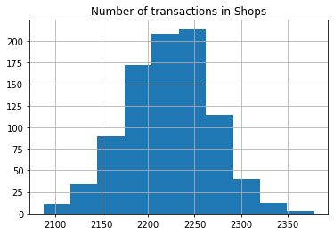
    


```python
fig, ax = plt.subplots(figsize=(7,5))

df_trans.groupby('shopID').agg(
    transaction_count=('transactionID', 'count'),
    price=('price', 'mean')
).reset_index().plot(x='shopID',y='transaction_count', c= 'price', kind='scatter',colormap="Blues", ax=ax)
```


    <AxesSubplot:xlabel='shopID', ylabel='transaction_count'>


    

    


Number of transactions and average price are almost the same for all shops.


```python
fig, ax = plt.subplots(figsize=(7,5))

df_trans.groupby('shopID').agg(
    transaction_count=('transactionID', 'count'),
    default=('default', 'mean')
).reset_index().plot(x='shopID',y='transaction_count', c= 'default', kind='scatter',colormap="Blues", ax=ax)
```


    <AxesSubplot:xlabel='shopID', ylabel='transaction_count'>


    
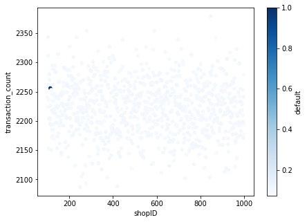
    


There is one shop that seems to be fraud.


```python
df_trans.groupby('shopID').agg(
    transaction_count=('transactionID', 'count'),
    default=('default', 'mean')
).sort_values(by='default').tail(5)
```


<div>
<style scoped>
    .dataframe tbody tr th:only-of-type {
        vertical-align: middle;
    }

    .dataframe tbody tr th {
        vertical-align: top;
    }

    .dataframe thead th {
        text-align: right;
    }
</style>
<table border="1" class="dataframe">
  <thead>
    <tr style="text-align: right;">
      <th></th>
      <th>transaction_count</th>
      <th>default</th>
    </tr>
    <tr>
      <th>shopID</th>
      <th></th>
      <th></th>
    </tr>
  </thead>
  <tbody>
    <tr>
      <th>190</th>
      <td>2260</td>
      <td>0.107080</td>
    </tr>
    <tr>
      <th>623</th>
      <td>2269</td>
      <td>0.107096</td>
    </tr>
    <tr>
      <th>658</th>
      <td>2123</td>
      <td>0.107866</td>
    </tr>
    <tr>
      <th>450</th>
      <td>2199</td>
      <td>0.108686</td>
    </tr>
    <tr>
      <th>113</th>
      <td>2256</td>
      <td>1.000000</td>
    </tr>
  </tbody>
</table>
</div>


Instalments from shop "113" are never paid back- it either corrupted data or fraud.    
I will indicate this shop initially as fraud and will be omitting in further analysis.    


```python
df_trans.loc[df_trans.shopID == 113]
```


<div>
<style scoped>
    .dataframe tbody tr th:only-of-type {
        vertical-align: middle;
    }

    .dataframe tbody tr th {
        vertical-align: top;
    }

    .dataframe thead th {
        text-align: right;
    }
</style>
<table border="1" class="dataframe">
  <thead>
    <tr style="text-align: right;">
      <th></th>
      <th>transactionID</th>
      <th>shopID</th>
      <th>customerID</th>
      <th>price</th>
      <th>paymentStatus1</th>
      <th>paymentStatus2</th>
      <th>paymentStatus3</th>
      <th>paymentStatus4</th>
      <th>late</th>
      <th>default</th>
      <th>defualted_payment</th>
      <th>late_payment_first</th>
      <th>money_lost</th>
    </tr>
  </thead>
  <tbody>
    <tr>
      <th>1701</th>
      <td>1702</td>
      <td>113</td>
      <td>9169.0</td>
      <td>9</td>
      <td>2</td>
      <td>2</td>
      <td>2</td>
      <td>2</td>
      <td>0</td>
      <td>1</td>
      <td>1.0</td>
      <td>1.0</td>
      <td>2.25</td>
    </tr>
    <tr>
      <th>2530</th>
      <td>2531</td>
      <td>113</td>
      <td>325418.0</td>
      <td>122</td>
      <td>2</td>
      <td>2</td>
      <td>2</td>
      <td>2</td>
      <td>0</td>
      <td>1</td>
      <td>1.0</td>
      <td>1.0</td>
      <td>30.50</td>
    </tr>
    <tr>
      <th>3567</th>
      <td>3568</td>
      <td>113</td>
      <td>457004.0</td>
      <td>123</td>
      <td>2</td>
      <td>2</td>
      <td>2</td>
      <td>2</td>
      <td>0</td>
      <td>1</td>
      <td>1.0</td>
      <td>1.0</td>
      <td>30.75</td>
    </tr>
    <tr>
      <th>4577</th>
      <td>4578</td>
      <td>113</td>
      <td>93714.0</td>
      <td>70</td>
      <td>2</td>
      <td>2</td>
      <td>2</td>
      <td>2</td>
      <td>0</td>
      <td>1</td>
      <td>1.0</td>
      <td>1.0</td>
      <td>17.50</td>
    </tr>
    <tr>
      <th>4723</th>
      <td>4724</td>
      <td>113</td>
      <td>177400.0</td>
      <td>96</td>
      <td>2</td>
      <td>2</td>
      <td>2</td>
      <td>2</td>
      <td>0</td>
      <td>1</td>
      <td>1.0</td>
      <td>1.0</td>
      <td>24.00</td>
    </tr>
    <tr>
      <th>...</th>
      <td>...</td>
      <td>...</td>
      <td>...</td>
      <td>...</td>
      <td>...</td>
      <td>...</td>
      <td>...</td>
      <td>...</td>
      <td>...</td>
      <td>...</td>
      <td>...</td>
      <td>...</td>
      <td>...</td>
    </tr>
    <tr>
      <th>1995352</th>
      <td>1995353</td>
      <td>113</td>
      <td>337672.0</td>
      <td>80</td>
      <td>2</td>
      <td>2</td>
      <td>2</td>
      <td>2</td>
      <td>0</td>
      <td>1</td>
      <td>1.0</td>
      <td>1.0</td>
      <td>20.00</td>
    </tr>
    <tr>
      <th>1996060</th>
      <td>1996061</td>
      <td>113</td>
      <td>120027.0</td>
      <td>180</td>
      <td>2</td>
      <td>2</td>
      <td>2</td>
      <td>2</td>
      <td>0</td>
      <td>1</td>
      <td>1.0</td>
      <td>1.0</td>
      <td>45.00</td>
    </tr>
    <tr>
      <th>1998490</th>
      <td>1998491</td>
      <td>113</td>
      <td>287125.0</td>
      <td>34</td>
      <td>2</td>
      <td>2</td>
      <td>2</td>
      <td>2</td>
      <td>0</td>
      <td>1</td>
      <td>1.0</td>
      <td>1.0</td>
      <td>8.50</td>
    </tr>
    <tr>
      <th>1998904</th>
      <td>1998905</td>
      <td>113</td>
      <td>419778.0</td>
      <td>180</td>
      <td>2</td>
      <td>2</td>
      <td>2</td>
      <td>2</td>
      <td>0</td>
      <td>1</td>
      <td>1.0</td>
      <td>1.0</td>
      <td>45.00</td>
    </tr>
    <tr>
      <th>1999599</th>
      <td>1999600</td>
      <td>113</td>
      <td>146421.0</td>
      <td>160</td>
      <td>2</td>
      <td>2</td>
      <td>2</td>
      <td>2</td>
      <td>0</td>
      <td>1</td>
      <td>1.0</td>
      <td>1.0</td>
      <td>40.00</td>
    </tr>
  </tbody>
</table>
<p>2256 rows × 13 columns</p>
</div>


```python
df_trans['fraud'] = 0
df_trans.loc[df_trans.shopID == 113,'fraud'] = 1
```

### shops without fraudulent one


```python
fig, ax = plt.subplots(figsize=(7,5))

df_trans.query("fraud==0").groupby('shopID').agg(
    transaction_count=('transactionID', 'count'),
    default=('default', 'mean')
).reset_index().plot(x='shopID',y='transaction_count', c= 'default', kind='scatter',colormap="Blues", ax=ax)

```


    <AxesSubplot:xlabel='shopID', ylabel='transaction_count'>


    
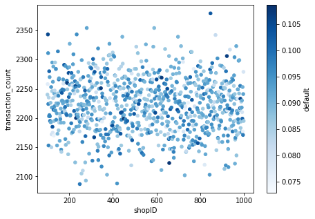
    


```python
df_trans.query("fraud==0").groupby('shopID').agg(
    transaction_count=('transactionID', 'count'),
    defualted_payment=('defualted_payment', 'mean')
).reset_index().sort_values('defualted_payment')
```


<div>
<style scoped>
    .dataframe tbody tr th:only-of-type {
        vertical-align: middle;
    }

    .dataframe tbody tr th {
        vertical-align: top;
    }

    .dataframe thead th {
        text-align: right;
    }
</style>
<table border="1" class="dataframe">
  <thead>
    <tr style="text-align: right;">
      <th></th>
      <th>shopID</th>
      <th>transaction_count</th>
      <th>defualted_payment</th>
    </tr>
  </thead>
  <tbody>
    <tr>
      <th>463</th>
      <td>564</td>
      <td>2289</td>
      <td>0.211883</td>
    </tr>
    <tr>
      <th>252</th>
      <td>353</td>
      <td>2278</td>
      <td>0.216418</td>
    </tr>
    <tr>
      <th>629</th>
      <td>730</td>
      <td>2216</td>
      <td>0.216606</td>
    </tr>
    <tr>
      <th>598</th>
      <td>699</td>
      <td>2179</td>
      <td>0.217531</td>
    </tr>
    <tr>
      <th>1</th>
      <td>101</td>
      <td>2258</td>
      <td>0.219221</td>
    </tr>
    <tr>
      <th>...</th>
      <td>...</td>
      <td>...</td>
      <td>...</td>
    </tr>
    <tr>
      <th>883</th>
      <td>984</td>
      <td>2233</td>
      <td>0.330945</td>
    </tr>
    <tr>
      <th>821</th>
      <td>922</td>
      <td>2306</td>
      <td>0.331310</td>
    </tr>
    <tr>
      <th>562</th>
      <td>663</td>
      <td>2215</td>
      <td>0.331828</td>
    </tr>
    <tr>
      <th>349</th>
      <td>450</td>
      <td>2199</td>
      <td>0.332879</td>
    </tr>
    <tr>
      <th>89</th>
      <td>190</td>
      <td>2260</td>
      <td>0.339823</td>
    </tr>
  </tbody>
</table>
<p>899 rows × 3 columns</p>
</div>


```python
fig, ax = plt.subplots(figsize=(7,5))

df_trans.query("fraud==0").groupby('shopID').agg(
    transaction_count=('transactionID', 'count'),
    late=('late', 'mean')
).reset_index().plot(x='shopID',y='transaction_count', c= 'late', kind='scatter',colormap="Blues", ax=ax)
```


    <AxesSubplot:xlabel='shopID', ylabel='transaction_count'>


    
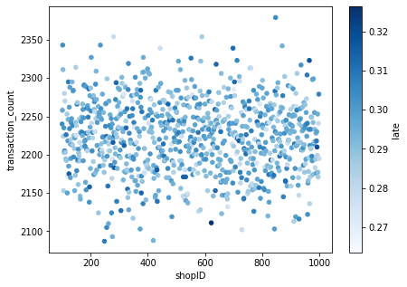
    


### transaction table - customerID


```python
df_trans
```


<div>
<style scoped>
    .dataframe tbody tr th:only-of-type {
        vertical-align: middle;
    }

    .dataframe tbody tr th {
        vertical-align: top;
    }

    .dataframe thead th {
        text-align: right;
    }
</style>
<table border="1" class="dataframe">
  <thead>
    <tr style="text-align: right;">
      <th></th>
      <th>transactionID</th>
      <th>shopID</th>
      <th>customerID</th>
      <th>price</th>
      <th>paymentStatus1</th>
      <th>paymentStatus2</th>
      <th>paymentStatus3</th>
      <th>paymentStatus4</th>
      <th>late</th>
      <th>default</th>
      <th>defualted_payment</th>
      <th>late_payment_first</th>
      <th>money_lost</th>
      <th>fraud</th>
    </tr>
  </thead>
  <tbody>
    <tr>
      <th>0</th>
      <td>1</td>
      <td>114</td>
      <td>2869.0</td>
      <td>140</td>
      <td>0</td>
      <td>0</td>
      <td>0</td>
      <td>0</td>
      <td>0</td>
      <td>0</td>
      <td>0.0</td>
      <td>0.0</td>
      <td>0.0</td>
      <td>0</td>
    </tr>
    <tr>
      <th>1</th>
      <td>2</td>
      <td>855</td>
      <td>124077.0</td>
      <td>70</td>
      <td>0</td>
      <td>0</td>
      <td>0</td>
      <td>0</td>
      <td>0</td>
      <td>0</td>
      <td>0.0</td>
      <td>0.0</td>
      <td>0.0</td>
      <td>0</td>
    </tr>
    <tr>
      <th>2</th>
      <td>3</td>
      <td>752</td>
      <td>86184.0</td>
      <td>85</td>
      <td>0</td>
      <td>0</td>
      <td>0</td>
      <td>0</td>
      <td>0</td>
      <td>0</td>
      <td>0.0</td>
      <td>0.0</td>
      <td>0.0</td>
      <td>0</td>
    </tr>
    <tr>
      <th>3</th>
      <td>4</td>
      <td>246</td>
      <td>248861.0</td>
      <td>43</td>
      <td>1</td>
      <td>0</td>
      <td>0</td>
      <td>0</td>
      <td>1</td>
      <td>0</td>
      <td>0.0</td>
      <td>1.0</td>
      <td>0.0</td>
      <td>0</td>
    </tr>
    <tr>
      <th>4</th>
      <td>5</td>
      <td>973</td>
      <td>162112.0</td>
      <td>127</td>
      <td>0</td>
      <td>0</td>
      <td>0</td>
      <td>0</td>
      <td>0</td>
      <td>0</td>
      <td>0.0</td>
      <td>0.0</td>
      <td>0.0</td>
      <td>0</td>
    </tr>
    <tr>
      <th>...</th>
      <td>...</td>
      <td>...</td>
      <td>...</td>
      <td>...</td>
      <td>...</td>
      <td>...</td>
      <td>...</td>
      <td>...</td>
      <td>...</td>
      <td>...</td>
      <td>...</td>
      <td>...</td>
      <td>...</td>
      <td>...</td>
    </tr>
    <tr>
      <th>1999995</th>
      <td>1999996</td>
      <td>758</td>
      <td>333312.0</td>
      <td>12</td>
      <td>0</td>
      <td>0</td>
      <td>1</td>
      <td>1</td>
      <td>1</td>
      <td>0</td>
      <td>0.0</td>
      <td>3.0</td>
      <td>0.0</td>
      <td>0</td>
    </tr>
    <tr>
      <th>1999996</th>
      <td>1999997</td>
      <td>932</td>
      <td>31802.0</td>
      <td>145</td>
      <td>0</td>
      <td>2</td>
      <td>2</td>
      <td>2</td>
      <td>0</td>
      <td>1</td>
      <td>2.0</td>
      <td>2.0</td>
      <td>72.5</td>
      <td>0</td>
    </tr>
    <tr>
      <th>1999997</th>
      <td>1999998</td>
      <td>932</td>
      <td>449391.0</td>
      <td>19</td>
      <td>0</td>
      <td>0</td>
      <td>0</td>
      <td>0</td>
      <td>0</td>
      <td>0</td>
      <td>0.0</td>
      <td>0.0</td>
      <td>0.0</td>
      <td>0</td>
    </tr>
    <tr>
      <th>1999998</th>
      <td>1999999</td>
      <td>878</td>
      <td>433902.0</td>
      <td>198</td>
      <td>0</td>
      <td>1</td>
      <td>0</td>
      <td>0</td>
      <td>1</td>
      <td>0</td>
      <td>0.0</td>
      <td>2.0</td>
      <td>0.0</td>
      <td>0</td>
    </tr>
    <tr>
      <th>1999999</th>
      <td>2000000</td>
      <td>175</td>
      <td>229142.0</td>
      <td>48</td>
      <td>0</td>
      <td>0</td>
      <td>0</td>
      <td>1</td>
      <td>1</td>
      <td>0</td>
      <td>0.0</td>
      <td>4.0</td>
      <td>0.0</td>
      <td>0</td>
    </tr>
  </tbody>
</table>
<p>2000000 rows × 14 columns</p>
</div>


```python
_tmp = df_trans.groupby("customerID").agg(
    transaction_count=('transactionID', 'count'),
    price=('price', 'mean'),
    late=('late', 'mean'),
    late_payment_first = ('late_payment_first', 'mean'),
    default=('default', 'mean'),
    defualted_payment=('defualted_payment', 'mean'),
    money_lost=('money_lost', 'sum')
).reset_index()
```


```python
_tmp.describe()
```


<div>
<style scoped>
    .dataframe tbody tr th:only-of-type {
        vertical-align: middle;
    }

    .dataframe tbody tr th {
        vertical-align: top;
    }

    .dataframe thead th {
        text-align: right;
    }
</style>
<table border="1" class="dataframe">
  <thead>
    <tr style="text-align: right;">
      <th></th>
      <th>customerID</th>
      <th>transaction_count</th>
      <th>price</th>
      <th>late</th>
      <th>late_payment_first</th>
      <th>default</th>
      <th>defualted_payment</th>
      <th>money_lost</th>
    </tr>
  </thead>
  <tbody>
    <tr>
      <th>count</th>
      <td>490533.000000</td>
      <td>490533.000000</td>
      <td>490533.000000</td>
      <td>490533.000000</td>
      <td>490533.000000</td>
      <td>490533.000000</td>
      <td>490533.000000</td>
      <td>490533.000000</td>
    </tr>
    <tr>
      <th>mean</th>
      <td>249973.179978</td>
      <td>4.036391</td>
      <td>101.538044</td>
      <td>0.294494</td>
      <td>0.901574</td>
      <td>0.091845</td>
      <td>0.274886</td>
      <td>28.238682</td>
    </tr>
    <tr>
      <th>std</th>
      <td>144332.983398</td>
      <td>1.927140</td>
      <td>32.957038</td>
      <td>0.294082</td>
      <td>0.841424</td>
      <td>0.185714</td>
      <td>0.583178</td>
      <td>63.619696</td>
    </tr>
    <tr>
      <th>min</th>
      <td>1.000000</td>
      <td>1.000000</td>
      <td>3.000000</td>
      <td>0.000000</td>
      <td>0.000000</td>
      <td>0.000000</td>
      <td>0.000000</td>
      <td>0.000000</td>
    </tr>
    <tr>
      <th>25%</th>
      <td>124989.000000</td>
      <td>3.000000</td>
      <td>80.600000</td>
      <td>0.000000</td>
      <td>0.000000</td>
      <td>0.000000</td>
      <td>0.000000</td>
      <td>0.000000</td>
    </tr>
    <tr>
      <th>50%</th>
      <td>249977.000000</td>
      <td>4.000000</td>
      <td>101.500000</td>
      <td>0.250000</td>
      <td>0.800000</td>
      <td>0.000000</td>
      <td>0.000000</td>
      <td>0.000000</td>
    </tr>
    <tr>
      <th>75%</th>
      <td>374973.000000</td>
      <td>5.000000</td>
      <td>122.500000</td>
      <td>0.500000</td>
      <td>1.400000</td>
      <td>0.142857</td>
      <td>0.285714</td>
      <td>14.250000</td>
    </tr>
    <tr>
      <th>max</th>
      <td>500000.000000</td>
      <td>16.000000</td>
      <td>200.000000</td>
      <td>1.000000</td>
      <td>4.000000</td>
      <td>1.000000</td>
      <td>4.000000</td>
      <td>970.000000</td>
    </tr>
  </tbody>
</table>
</div>


average lost on client is ~`$28`.  


```python
%matplotlib inline
attributes = ['transaction_count','price','default','defualted_payment','money_lost']
scatter_matrix(_tmp[attributes].sample(10000, random_state=1), figsize=(11, 11), diagonal='kde')
plt.show()
```


    
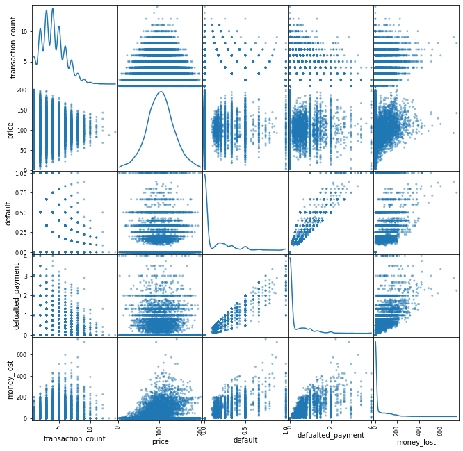
    


```python
_tmp.groupby('transaction_count').agg(price=('price', 'mean')).plot()
```


    <AxesSubplot:xlabel='transaction_count'>


    
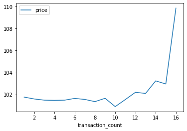
    


```python
%matplotlib inline
attributes = ['transaction_count','price','late','late_payment_first']
scatter_matrix(_tmp[attributes].sample(10000, random_state=1), figsize=(10, 10), diagonal='kde')
plt.show()
```


    
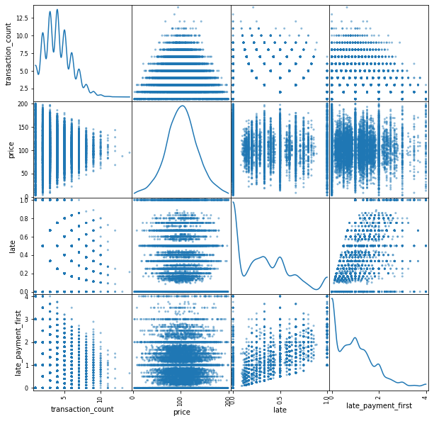
    


### Default rate, late payments


```python
    late=('late', 'mean'),
    late_payment_first = ('late_payment_first', 'mean'),
    default=('default', 'mean'),
    defualted_payment=('defualted_payment', 'mean'),
    
```


```python
_tmp = df_trans.query("fraud==0").groupby('shopID').agg(
    transaction_count=('transactionID', 'count'),
    price=('price', 'mean'),
    late=('late', 'mean'),
    default=('default', 'mean'),
    defualted_payment=('defualted_payment', 'mean'),
    money_lost=('money_lost', 'sum')
).reset_index()
_tmp.describe()
```


<div>
<style scoped>
    .dataframe tbody tr th:only-of-type {
        vertical-align: middle;
    }

    .dataframe tbody tr th {
        vertical-align: top;
    }

    .dataframe thead th {
        text-align: right;
    }
</style>
<table border="1" class="dataframe">
  <thead>
    <tr style="text-align: right;">
      <th></th>
      <th>shopID</th>
      <th>transaction_count</th>
      <th>price</th>
      <th>late</th>
      <th>default</th>
      <th>defualted_payment</th>
      <th>money_lost</th>
    </tr>
  </thead>
  <tbody>
    <tr>
      <th>count</th>
      <td>899.000000</td>
      <td>899.000000</td>
      <td>899.000000</td>
      <td>899.000000</td>
      <td>899.000000</td>
      <td>899.000000</td>
      <td>899.000000</td>
    </tr>
    <tr>
      <th>mean</th>
      <td>549.985539</td>
      <td>2222.184650</td>
      <td>101.529381</td>
      <td>0.294394</td>
      <td>0.091015</td>
      <td>0.274566</td>
      <td>15506.116518</td>
    </tr>
    <tr>
      <th>std</th>
      <td>259.687968</td>
      <td>46.322792</td>
      <td>1.228684</td>
      <td>0.009453</td>
      <td>0.006199</td>
      <td>0.020652</td>
      <td>1310.049416</td>
    </tr>
    <tr>
      <th>min</th>
      <td>100.000000</td>
      <td>2087.000000</td>
      <td>97.857409</td>
      <td>0.263541</td>
      <td>0.072958</td>
      <td>0.211883</td>
      <td>11584.750000</td>
    </tr>
    <tr>
      <th>25%</th>
      <td>325.500000</td>
      <td>2192.000000</td>
      <td>100.716603</td>
      <td>0.287597</td>
      <td>0.087015</td>
      <td>0.260724</td>
      <td>14606.625000</td>
    </tr>
    <tr>
      <th>50%</th>
      <td>550.000000</td>
      <td>2223.000000</td>
      <td>101.510975</td>
      <td>0.294742</td>
      <td>0.091150</td>
      <td>0.274833</td>
      <td>15455.000000</td>
    </tr>
    <tr>
      <th>75%</th>
      <td>774.500000</td>
      <td>2253.000000</td>
      <td>102.306196</td>
      <td>0.301154</td>
      <td>0.095195</td>
      <td>0.288432</td>
      <td>16382.500000</td>
    </tr>
    <tr>
      <th>max</th>
      <td>999.000000</td>
      <td>2379.000000</td>
      <td>105.557029</td>
      <td>0.326386</td>
      <td>0.108686</td>
      <td>0.339823</td>
      <td>20457.000000</td>
    </tr>
  </tbody>
</table>
</div>


```python
%matplotlib inline

sns.set_style("whitegrid")
fig, axs = plt.subplots(2, 3, figsize=(10, 7))

sns.histplot(data=_tmp, x="transaction_count", kde=True, color="skyblue", ax=axs[0, 0], element="step", stat="probability")
sns.histplot(data=_tmp.astype(np.float32), x="price", kde=True, color="olive", ax=axs[0, 1], element="step", stat="probability")
sns.histplot(data=_tmp, x="late", kde=True, color="gold", ax=axs[1, 0], element="step", stat="probability")
sns.histplot(data=_tmp, x="default", kde=True, color="teal", ax=axs[1, 1], element="step", stat="probability")
sns.histplot(data=_tmp, x="defualted_payment", kde=True, color="teal", ax=axs[0, 2], element="step", stat="probability")
sns.histplot(data=_tmp, x="money_lost", kde=True, color="teal", ax=axs[1, 2], element="step", stat="probability")

plt.show()
```


    
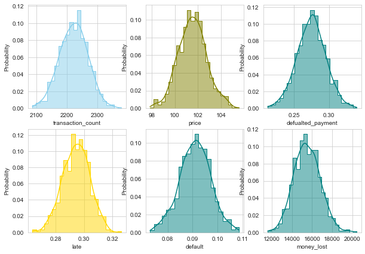
    


## Default and late payment on one transactions

### Late


```python
# late
_tmp = (df_trans.query("fraud==0").filter(regex='payment') == 1).astype(int)
_tmp.mean(axis=0).plot()
plt.legend() 
plt.show()
```


    
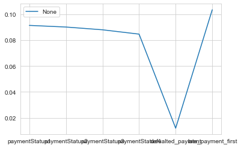
    


### Default


```python
# default
_tmp = (df_trans.query("fraud==0").filter(regex='payment') == 2).astype(int)
_tmp.mean(axis=0).plot()
plt.legend() 
plt.show()
```


    
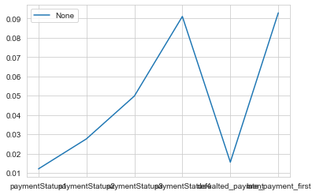
    


```python
df_trans.query("fraud==0").query("paymentStatus1>1").head()
```


<div>
<style scoped>
    .dataframe tbody tr th:only-of-type {
        vertical-align: middle;
    }

    .dataframe tbody tr th {
        vertical-align: top;
    }

    .dataframe thead th {
        text-align: right;
    }
</style>
<table border="1" class="dataframe">
  <thead>
    <tr style="text-align: right;">
      <th></th>
      <th>transactionID</th>
      <th>shopID</th>
      <th>customerID</th>
      <th>price</th>
      <th>paymentStatus1</th>
      <th>paymentStatus2</th>
      <th>paymentStatus3</th>
      <th>paymentStatus4</th>
      <th>late</th>
      <th>default</th>
      <th>defualted_payment</th>
      <th>late_payment_first</th>
      <th>money_lost</th>
      <th>fraud</th>
    </tr>
  </thead>
  <tbody>
    <tr>
      <th>91</th>
      <td>92</td>
      <td>449</td>
      <td>455927.0</td>
      <td>96</td>
      <td>2</td>
      <td>2</td>
      <td>2</td>
      <td>2</td>
      <td>0</td>
      <td>1</td>
      <td>1.0</td>
      <td>1.0</td>
      <td>24.00</td>
      <td>0</td>
    </tr>
    <tr>
      <th>136</th>
      <td>137</td>
      <td>796</td>
      <td>447255.0</td>
      <td>114</td>
      <td>2</td>
      <td>2</td>
      <td>2</td>
      <td>2</td>
      <td>0</td>
      <td>1</td>
      <td>1.0</td>
      <td>1.0</td>
      <td>28.50</td>
      <td>0</td>
    </tr>
    <tr>
      <th>304</th>
      <td>305</td>
      <td>192</td>
      <td>393571.0</td>
      <td>192</td>
      <td>2</td>
      <td>2</td>
      <td>2</td>
      <td>2</td>
      <td>0</td>
      <td>1</td>
      <td>1.0</td>
      <td>1.0</td>
      <td>48.00</td>
      <td>0</td>
    </tr>
    <tr>
      <th>323</th>
      <td>324</td>
      <td>608</td>
      <td>378840.0</td>
      <td>118</td>
      <td>2</td>
      <td>2</td>
      <td>2</td>
      <td>2</td>
      <td>0</td>
      <td>1</td>
      <td>1.0</td>
      <td>1.0</td>
      <td>29.50</td>
      <td>0</td>
    </tr>
    <tr>
      <th>430</th>
      <td>431</td>
      <td>102</td>
      <td>236139.0</td>
      <td>89</td>
      <td>2</td>
      <td>2</td>
      <td>2</td>
      <td>2</td>
      <td>0</td>
      <td>1</td>
      <td>1.0</td>
      <td>1.0</td>
      <td>22.25</td>
      <td>0</td>
    </tr>
  </tbody>
</table>
</div>


### Transaction payment instalments

### First late, next late


```python
def check_dependency(x_0, x_1, name='paymentStatus1', test=False):
    if test:
        table = [x_0,x_1]
    else:
        table = [list(x_0.sum()),list(x_1.sum())]
    stat, p, dof, expected = chi2_contingency(table)
    print(table)
    print('stat=%.3f, p=%.3f' % (stat, p))
    if p > 0.05:
        print('Probably independent')
    else:
        print('Probably dependent')
    if test:
        return None
    return x_0.mean().to_frame(name=f'{name}_0').join(x_1.mean().to_frame(name=f'{name}_1'))
```


```python
_tmp_f0 = df_trans.query("fraud==0").loc[df_trans.paymentStatus1==0].filter(regex='paymentStatus[2-4]').apply(lambda x: x==1).astype(int)
_tmp_f1 = df_trans.query("fraud==0").loc[df_trans.paymentStatus1==1].filter(regex='paymentStatus[2-4]').apply(lambda x: x==1).astype(int)

check_dependency(_tmp_f0, _tmp_f1).style.background_gradient(cmap ='Blues',axis=1)
```

    [[157382, 153374, 147757], [22530, 22275, 21235]]
    stat=2.167, p=0.338
    Probably independent


<style  type="text/css" >
#T_c2fba_row0_col0,#T_c2fba_row1_col0,#T_c2fba_row2_col0{
            background-color:  #f7fbff;
            color:  #000000;
        }#T_c2fba_row0_col1,#T_c2fba_row1_col1,#T_c2fba_row2_col1{
            background-color:  #08306b;
            color:  #f1f1f1;
        }</style><table id="T_c2fba_" ><thead>    <tr>        <th class="blank level0" ></th>        <th class="col_heading level0 col0" >paymentStatus1_0</th>        <th class="col_heading level0 col1" >paymentStatus1_1</th>    </tr></thead><tbody>
                <tr>
                        <th id="T_c2fba_level0_row0" class="row_heading level0 row0" >paymentStatus2</th>
                        <td id="T_c2fba_row0_col0" class="data row0 col0" >0.087864</td>
                        <td id="T_c2fba_row0_col1" class="data row0 col1" >0.123492</td>
            </tr>
            <tr>
                        <th id="T_c2fba_level0_row1" class="row_heading level0 row1" >paymentStatus3</th>
                        <td id="T_c2fba_row1_col0" class="data row1 col0" >0.085627</td>
                        <td id="T_c2fba_row1_col1" class="data row1 col1" >0.122094</td>
            </tr>
            <tr>
                        <th id="T_c2fba_level0_row2" class="row_heading level0 row2" >paymentStatus4</th>
                        <td id="T_c2fba_row2_col0" class="data row2 col0" >0.082491</td>
                        <td id="T_c2fba_row2_col1" class="data row2 col1" >0.116394</td>
            </tr>
    </tbody></table>


### First late, next default


```python
_tmp_f0 = df_trans.query("fraud==0").loc[df_trans.paymentStatus1==0].filter(regex='paymentStatus[2-4]').apply(lambda x: x==2).astype(int)
_tmp_f1 = df_trans.query("fraud==0").loc[df_trans.paymentStatus1==1].filter(regex='paymentStatus[2-4]').apply(lambda x: x==2).astype(int)

check_dependency(_tmp_f0, _tmp_f1).style.background_gradient(cmap ='Blues',axis=1)
```

    [[28201, 68647, 143732], [2857, 6739, 13974]]
    stat=3.685, p=0.158
    Probably independent


<style  type="text/css" >
#T_4cf52_row0_col0,#T_4cf52_row1_col0,#T_4cf52_row2_col0{
            background-color:  #08306b;
            color:  #f1f1f1;
        }#T_4cf52_row0_col1,#T_4cf52_row1_col1,#T_4cf52_row2_col1{
            background-color:  #f7fbff;
            color:  #000000;
        }</style><table id="T_4cf52_" ><thead>    <tr>        <th class="blank level0" ></th>        <th class="col_heading level0 col0" >paymentStatus1_0</th>        <th class="col_heading level0 col1" >paymentStatus1_1</th>    </tr></thead><tbody>
                <tr>
                        <th id="T_4cf52_level0_row0" class="row_heading level0 row0" >paymentStatus2</th>
                        <td id="T_4cf52_row0_col0" class="data row0 col0" >0.015744</td>
                        <td id="T_4cf52_row0_col1" class="data row0 col1" >0.015660</td>
            </tr>
            <tr>
                        <th id="T_4cf52_level0_row1" class="row_heading level0 row1" >paymentStatus3</th>
                        <td id="T_4cf52_row1_col0" class="data row1 col0" >0.038325</td>
                        <td id="T_4cf52_row1_col1" class="data row1 col1" >0.036938</td>
            </tr>
            <tr>
                        <th id="T_4cf52_level0_row2" class="row_heading level0 row2" >paymentStatus4</th>
                        <td id="T_4cf52_row2_col0" class="data row2 col0" >0.080244</td>
                        <td id="T_4cf52_row2_col1" class="data row2 col1" >0.076595</td>
            </tr>
    </tbody></table>


### Second late, next late


```python
_tmp_s0 = df_trans.query("fraud==0").loc[df_trans.paymentStatus2==0].filter(regex='paymentStatus[3-4]').apply(lambda x: x==1).astype(int)
_tmp_s1 = df_trans.query("fraud==0").loc[df_trans.paymentStatus2==1].filter(regex='paymentStatus[3-4]').apply(lambda x: x==1).astype(int)

check_dependency(_tmp_s0, _tmp_s1).style.background_gradient(cmap ='Blues',axis=1)
```

    [[153563, 147509], [22086, 21483]]
    stat=1.483, p=0.223
    Probably independent


<style  type="text/css" >
#T_a6101_row0_col0,#T_a6101_row1_col0{
            background-color:  #f7fbff;
            color:  #000000;
        }#T_a6101_row0_col1,#T_a6101_row1_col1{
            background-color:  #08306b;
            color:  #f1f1f1;
        }</style><table id="T_a6101_" ><thead>    <tr>        <th class="blank level0" ></th>        <th class="col_heading level0 col0" >paymentStatus1_0</th>        <th class="col_heading level0 col1" >paymentStatus1_1</th>    </tr></thead><tbody>
                <tr>
                        <th id="T_a6101_level0_row0" class="row_heading level0 row0" >paymentStatus3</th>
                        <td id="T_a6101_row0_col0" class="data row0 col0" >0.087120</td>
                        <td id="T_a6101_row0_col1" class="data row0 col1" >0.122760</td>
            </tr>
            <tr>
                        <th id="T_a6101_level0_row1" class="row_heading level0 row1" >paymentStatus4</th>
                        <td id="T_a6101_row1_col0" class="data row1 col0" >0.083685</td>
                        <td id="T_a6101_row1_col1" class="data row1 col1" >0.119408</td>
            </tr>
    </tbody></table>


### Second late, next default


```python
_tmp_s0 = df_trans.query("fraud==0").loc[df_trans.paymentStatus2==0].filter(regex='paymentStatus[3-4]').apply(lambda x: x==2).astype(int)
_tmp_s1 = df_trans.query("fraud==0").loc[df_trans.paymentStatus2==1].filter(regex='paymentStatus[3-4]').apply(lambda x: x==2).astype(int)

check_dependency(_tmp_s0, _tmp_s1).style.background_gradient(cmap ='Blues',axis=1)
```

    [[40431, 115478], [3897, 11170]]
    stat=0.030, p=0.863
    Probably independent


<style  type="text/css" >
#T_8d7f7_row0_col0,#T_8d7f7_row1_col0{
            background-color:  #08306b;
            color:  #f1f1f1;
        }#T_8d7f7_row0_col1,#T_8d7f7_row1_col1{
            background-color:  #f7fbff;
            color:  #000000;
        }</style><table id="T_8d7f7_" ><thead>    <tr>        <th class="blank level0" ></th>        <th class="col_heading level0 col0" >paymentStatus1_0</th>        <th class="col_heading level0 col1" >paymentStatus1_1</th>    </tr></thead><tbody>
                <tr>
                        <th id="T_8d7f7_level0_row0" class="row_heading level0 row0" >paymentStatus3</th>
                        <td id="T_8d7f7_row0_col0" class="data row0 col0" >0.022937</td>
                        <td id="T_8d7f7_row0_col1" class="data row0 col1" >0.021661</td>
            </tr>
            <tr>
                        <th id="T_8d7f7_level0_row1" class="row_heading level0 row1" >paymentStatus4</th>
                        <td id="T_8d7f7_row1_col0" class="data row1 col0" >0.065513</td>
                        <td id="T_8d7f7_row1_col1" class="data row1 col1" >0.062086</td>
            </tr>
    </tbody></table>


## Customers  transactions history

remove transactions connected with fraudulent shop, and withocut customerID


```python
df_trans = df_trans.loc[df_trans.fraud==0].dropna(subset=['customerID']).reset_index(drop=True)
```


```python
df_trans['rank']=df_trans.groupby("customerID")["transactionID"].rank("dense", ascending=True)
```


```python
df_trans
```


<div>
<style scoped>
    .dataframe tbody tr th:only-of-type {
        vertical-align: middle;
    }

    .dataframe tbody tr th {
        vertical-align: top;
    }

    .dataframe thead th {
        text-align: right;
    }
</style>
<table border="1" class="dataframe">
  <thead>
    <tr style="text-align: right;">
      <th></th>
      <th>transactionID</th>
      <th>shopID</th>
      <th>customerID</th>
      <th>price</th>
      <th>paymentStatus1</th>
      <th>paymentStatus2</th>
      <th>paymentStatus3</th>
      <th>paymentStatus4</th>
      <th>late</th>
      <th>default</th>
      <th>defualted_payment</th>
      <th>late_payment_first</th>
      <th>money_lost</th>
      <th>fraud</th>
      <th>rank</th>
    </tr>
  </thead>
  <tbody>
    <tr>
      <th>0</th>
      <td>1</td>
      <td>114</td>
      <td>2869.0</td>
      <td>140</td>
      <td>0</td>
      <td>0</td>
      <td>0</td>
      <td>0</td>
      <td>0</td>
      <td>0</td>
      <td>0.0</td>
      <td>0.0</td>
      <td>0.0</td>
      <td>0</td>
      <td>1.0</td>
    </tr>
    <tr>
      <th>1</th>
      <td>2</td>
      <td>855</td>
      <td>124077.0</td>
      <td>70</td>
      <td>0</td>
      <td>0</td>
      <td>0</td>
      <td>0</td>
      <td>0</td>
      <td>0</td>
      <td>0.0</td>
      <td>0.0</td>
      <td>0.0</td>
      <td>0</td>
      <td>1.0</td>
    </tr>
    <tr>
      <th>2</th>
      <td>3</td>
      <td>752</td>
      <td>86184.0</td>
      <td>85</td>
      <td>0</td>
      <td>0</td>
      <td>0</td>
      <td>0</td>
      <td>0</td>
      <td>0</td>
      <td>0.0</td>
      <td>0.0</td>
      <td>0.0</td>
      <td>0</td>
      <td>1.0</td>
    </tr>
    <tr>
      <th>3</th>
      <td>4</td>
      <td>246</td>
      <td>248861.0</td>
      <td>43</td>
      <td>1</td>
      <td>0</td>
      <td>0</td>
      <td>0</td>
      <td>1</td>
      <td>0</td>
      <td>0.0</td>
      <td>1.0</td>
      <td>0.0</td>
      <td>0</td>
      <td>1.0</td>
    </tr>
    <tr>
      <th>4</th>
      <td>5</td>
      <td>973</td>
      <td>162112.0</td>
      <td>127</td>
      <td>0</td>
      <td>0</td>
      <td>0</td>
      <td>0</td>
      <td>0</td>
      <td>0</td>
      <td>0.0</td>
      <td>0.0</td>
      <td>0.0</td>
      <td>0</td>
      <td>1.0</td>
    </tr>
    <tr>
      <th>...</th>
      <td>...</td>
      <td>...</td>
      <td>...</td>
      <td>...</td>
      <td>...</td>
      <td>...</td>
      <td>...</td>
      <td>...</td>
      <td>...</td>
      <td>...</td>
      <td>...</td>
      <td>...</td>
      <td>...</td>
      <td>...</td>
      <td>...</td>
    </tr>
    <tr>
      <th>1977753</th>
      <td>1999996</td>
      <td>758</td>
      <td>333312.0</td>
      <td>12</td>
      <td>0</td>
      <td>0</td>
      <td>1</td>
      <td>1</td>
      <td>1</td>
      <td>0</td>
      <td>0.0</td>
      <td>3.0</td>
      <td>0.0</td>
      <td>0</td>
      <td>4.0</td>
    </tr>
    <tr>
      <th>1977754</th>
      <td>1999997</td>
      <td>932</td>
      <td>31802.0</td>
      <td>145</td>
      <td>0</td>
      <td>2</td>
      <td>2</td>
      <td>2</td>
      <td>0</td>
      <td>1</td>
      <td>2.0</td>
      <td>2.0</td>
      <td>72.5</td>
      <td>0</td>
      <td>4.0</td>
    </tr>
    <tr>
      <th>1977755</th>
      <td>1999998</td>
      <td>932</td>
      <td>449391.0</td>
      <td>19</td>
      <td>0</td>
      <td>0</td>
      <td>0</td>
      <td>0</td>
      <td>0</td>
      <td>0</td>
      <td>0.0</td>
      <td>0.0</td>
      <td>0.0</td>
      <td>0</td>
      <td>5.0</td>
    </tr>
    <tr>
      <th>1977756</th>
      <td>1999999</td>
      <td>878</td>
      <td>433902.0</td>
      <td>198</td>
      <td>0</td>
      <td>1</td>
      <td>0</td>
      <td>0</td>
      <td>1</td>
      <td>0</td>
      <td>0.0</td>
      <td>2.0</td>
      <td>0.0</td>
      <td>0</td>
      <td>7.0</td>
    </tr>
    <tr>
      <th>1977757</th>
      <td>2000000</td>
      <td>175</td>
      <td>229142.0</td>
      <td>48</td>
      <td>0</td>
      <td>0</td>
      <td>0</td>
      <td>1</td>
      <td>1</td>
      <td>0</td>
      <td>0.0</td>
      <td>4.0</td>
      <td>0.0</td>
      <td>0</td>
      <td>2.0</td>
    </tr>
  </tbody>
</table>
<p>1977758 rows × 15 columns</p>
</div>


```python
df_trans['default_lag1'] = df_trans. \
    set_index('rank'). \
    groupby('customerID')[['default']]. \
    shift(1).reset_index(drop=True)

df_trans['defualted_payment_lag1'] = df_trans. \
    set_index('rank'). \
    groupby('customerID')[['defualted_payment']]. \
    shift(1).reset_index(drop=True)

df_trans['money_lost_lag1'] = df_trans. \
    set_index('rank'). \
    groupby('customerID')[['money_lost']]. \
    shift(1).reset_index(drop=True)

df_trans['late_lag1'] = df_trans. \
    set_index('rank'). \
    groupby('customerID')[['late']]. \
    shift(1).reset_index(drop=True)

df_trans['price_lag1'] = df_trans. \
    set_index('rank'). \
    groupby('customerID')[['price']]. \
    shift(1).reset_index(drop=True)

df_trans['late_payment_first_lag1'] = df_trans. \
    set_index('rank'). \
    groupby('customerID')[['late_payment_first']]. \
    shift(1).reset_index(drop=True)

```


```python
df_trans.sort_values(['customerID','rank']).head()
```


<div>
<style scoped>
    .dataframe tbody tr th:only-of-type {
        vertical-align: middle;
    }

    .dataframe tbody tr th {
        vertical-align: top;
    }

    .dataframe thead th {
        text-align: right;
    }
</style>
<table border="1" class="dataframe">
  <thead>
    <tr style="text-align: right;">
      <th></th>
      <th>transactionID</th>
      <th>shopID</th>
      <th>customerID</th>
      <th>price</th>
      <th>paymentStatus1</th>
      <th>paymentStatus2</th>
      <th>paymentStatus3</th>
      <th>paymentStatus4</th>
      <th>late</th>
      <th>default</th>
      <th>...</th>
      <th>late_payment_first</th>
      <th>money_lost</th>
      <th>fraud</th>
      <th>rank</th>
      <th>default_lag1</th>
      <th>defualted_payment_lag1</th>
      <th>money_lost_lag1</th>
      <th>late_lag1</th>
      <th>price_lag1</th>
      <th>late_payment_first_lag1</th>
    </tr>
  </thead>
  <tbody>
    <tr>
      <th>117899</th>
      <td>119294</td>
      <td>634</td>
      <td>1.0</td>
      <td>88</td>
      <td>0</td>
      <td>0</td>
      <td>0</td>
      <td>0</td>
      <td>0</td>
      <td>0</td>
      <td>...</td>
      <td>0.0</td>
      <td>0.0</td>
      <td>0</td>
      <td>1.0</td>
      <td>NaN</td>
      <td>NaN</td>
      <td>NaN</td>
      <td>NaN</td>
      <td>NaN</td>
      <td>NaN</td>
    </tr>
    <tr>
      <th>822744</th>
      <td>832074</td>
      <td>942</td>
      <td>1.0</td>
      <td>177</td>
      <td>1</td>
      <td>0</td>
      <td>0</td>
      <td>0</td>
      <td>1</td>
      <td>0</td>
      <td>...</td>
      <td>1.0</td>
      <td>0.0</td>
      <td>0</td>
      <td>2.0</td>
      <td>0.0</td>
      <td>0.0</td>
      <td>0.0</td>
      <td>0.0</td>
      <td>88.0</td>
      <td>0.0</td>
    </tr>
    <tr>
      <th>858829</th>
      <td>868540</td>
      <td>361</td>
      <td>1.0</td>
      <td>93</td>
      <td>0</td>
      <td>0</td>
      <td>0</td>
      <td>0</td>
      <td>0</td>
      <td>0</td>
      <td>...</td>
      <td>0.0</td>
      <td>0.0</td>
      <td>0</td>
      <td>3.0</td>
      <td>0.0</td>
      <td>0.0</td>
      <td>0.0</td>
      <td>1.0</td>
      <td>177.0</td>
      <td>1.0</td>
    </tr>
    <tr>
      <th>1678935</th>
      <td>1697842</td>
      <td>248</td>
      <td>1.0</td>
      <td>147</td>
      <td>0</td>
      <td>0</td>
      <td>0</td>
      <td>0</td>
      <td>0</td>
      <td>0</td>
      <td>...</td>
      <td>0.0</td>
      <td>0.0</td>
      <td>0</td>
      <td>4.0</td>
      <td>0.0</td>
      <td>0.0</td>
      <td>0.0</td>
      <td>0.0</td>
      <td>93.0</td>
      <td>0.0</td>
    </tr>
    <tr>
      <th>972463</th>
      <td>983409</td>
      <td>741</td>
      <td>2.0</td>
      <td>71</td>
      <td>1</td>
      <td>0</td>
      <td>0</td>
      <td>0</td>
      <td>1</td>
      <td>0</td>
      <td>...</td>
      <td>1.0</td>
      <td>0.0</td>
      <td>0</td>
      <td>1.0</td>
      <td>NaN</td>
      <td>NaN</td>
      <td>NaN</td>
      <td>NaN</td>
      <td>NaN</td>
      <td>NaN</td>
    </tr>
  </tbody>
</table>
<p>5 rows × 21 columns</p>
</div>


```python
%matplotlib inline
fig, ax = plt.subplots(figsize=(7,5))
sns.histplot(df_trans, x="rank", hue="default", ax=ax, alpha=0.5, bins=20, element="step", stat="probability", common_norm=False)
plt.show()
```


    
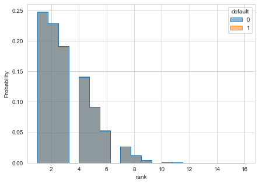
    


```python
import time
start_time = time.time()

parameters = dict()
parameters["trans_back_aggreg_list"] = [6]

aggreate_list = df_trans.filter(regex="lag").columns.to_list()

results = []
for i in parameters["trans_back_aggreg_list"]:
    
    print(f"starting aggregation for #{i} transactions back")

    names_sum = [f'{k}_lst_{str(i).zfill(2)}_sum' for k in list(map(lambda x: x.replace('_lag1',''), aggreate_list))]
    names_avg = [f'{k}_lst_{str(i).zfill(2)}_avg' for k in list(map(lambda x: x.replace('_lag1',''), aggreate_list))]

    if len(results) == 0 or len(parameters["trans_back_aggreg_list"]) <= 1:
        results += [pd.concat([
            df_trans.set_index('rank').groupby('customerID')[aggreate_list].rolling(i, min_periods=1).sum().reset_index(),
            df_trans.set_index('rank').groupby('customerID')[aggreate_list].rolling(i, min_periods=1).mean().reset_index().iloc[:, 2:]
            ], axis=1)]

        results[-1].columns = ['customerID', 'rank']+names_sum+names_avg
    else:
        results += [pd.concat([
            df_trans.set_index('rank').groupby('customerID')[aggreate_list].rolling(i, min_periods=1).sum().reset_index().iloc[:, 2:],
            df_trans.set_index('rank').groupby('customerID')[aggreate_list].rolling(i, min_periods=1).mean().reset_index().iloc[:, 2:]
            ], axis=1)]

        results[-1].columns = names_sum+names_avg
    print("--- %s seconds ---" % (time.time() - start_time))


defaults = pd.concat(results, axis=1)


```

    starting aggregation for #6 transactions back
    --- 432.0459167957306 seconds ---


```python
defaults
```


<div>
<style scoped>
    .dataframe tbody tr th:only-of-type {
        vertical-align: middle;
    }

    .dataframe tbody tr th {
        vertical-align: top;
    }

    .dataframe thead th {
        text-align: right;
    }
</style>
<table border="1" class="dataframe">
  <thead>
    <tr style="text-align: right;">
      <th></th>
      <th>customerID</th>
      <th>rank</th>
      <th>default_lst_06_sum</th>
      <th>defualted_payment_lst_06_sum</th>
      <th>money_lost_lst_06_sum</th>
      <th>late_lst_06_sum</th>
      <th>price_lst_06_sum</th>
      <th>late_payment_first_lst_06_sum</th>
      <th>default_lst_06_avg</th>
      <th>defualted_payment_lst_06_avg</th>
      <th>money_lost_lst_06_avg</th>
      <th>late_lst_06_avg</th>
      <th>price_lst_06_avg</th>
      <th>late_payment_first_lst_06_avg</th>
    </tr>
  </thead>
  <tbody>
    <tr>
      <th>0</th>
      <td>1.0</td>
      <td>1.0</td>
      <td>NaN</td>
      <td>NaN</td>
      <td>NaN</td>
      <td>NaN</td>
      <td>NaN</td>
      <td>NaN</td>
      <td>NaN</td>
      <td>NaN</td>
      <td>NaN</td>
      <td>NaN</td>
      <td>NaN</td>
      <td>NaN</td>
    </tr>
    <tr>
      <th>1</th>
      <td>1.0</td>
      <td>2.0</td>
      <td>0.0</td>
      <td>0.0</td>
      <td>0.0</td>
      <td>0.0</td>
      <td>88.0</td>
      <td>0.0</td>
      <td>0.0</td>
      <td>0.0</td>
      <td>0.0</td>
      <td>0.000000</td>
      <td>88.000000</td>
      <td>0.000000</td>
    </tr>
    <tr>
      <th>2</th>
      <td>1.0</td>
      <td>3.0</td>
      <td>0.0</td>
      <td>0.0</td>
      <td>0.0</td>
      <td>1.0</td>
      <td>265.0</td>
      <td>1.0</td>
      <td>0.0</td>
      <td>0.0</td>
      <td>0.0</td>
      <td>0.500000</td>
      <td>132.500000</td>
      <td>0.500000</td>
    </tr>
    <tr>
      <th>3</th>
      <td>1.0</td>
      <td>4.0</td>
      <td>0.0</td>
      <td>0.0</td>
      <td>0.0</td>
      <td>1.0</td>
      <td>358.0</td>
      <td>1.0</td>
      <td>0.0</td>
      <td>0.0</td>
      <td>0.0</td>
      <td>0.333333</td>
      <td>119.333333</td>
      <td>0.333333</td>
    </tr>
    <tr>
      <th>4</th>
      <td>2.0</td>
      <td>1.0</td>
      <td>NaN</td>
      <td>NaN</td>
      <td>NaN</td>
      <td>NaN</td>
      <td>NaN</td>
      <td>NaN</td>
      <td>NaN</td>
      <td>NaN</td>
      <td>NaN</td>
      <td>NaN</td>
      <td>NaN</td>
      <td>NaN</td>
    </tr>
    <tr>
      <th>...</th>
      <td>...</td>
      <td>...</td>
      <td>...</td>
      <td>...</td>
      <td>...</td>
      <td>...</td>
      <td>...</td>
      <td>...</td>
      <td>...</td>
      <td>...</td>
      <td>...</td>
      <td>...</td>
      <td>...</td>
      <td>...</td>
    </tr>
    <tr>
      <th>1977753</th>
      <td>499999.0</td>
      <td>4.0</td>
      <td>0.0</td>
      <td>0.0</td>
      <td>0.0</td>
      <td>0.0</td>
      <td>381.0</td>
      <td>0.0</td>
      <td>0.0</td>
      <td>0.0</td>
      <td>0.0</td>
      <td>0.000000</td>
      <td>127.000000</td>
      <td>0.000000</td>
    </tr>
    <tr>
      <th>1977754</th>
      <td>499999.0</td>
      <td>5.0</td>
      <td>0.0</td>
      <td>0.0</td>
      <td>0.0</td>
      <td>0.0</td>
      <td>523.0</td>
      <td>0.0</td>
      <td>0.0</td>
      <td>0.0</td>
      <td>0.0</td>
      <td>0.000000</td>
      <td>130.750000</td>
      <td>0.000000</td>
    </tr>
    <tr>
      <th>1977755</th>
      <td>499999.0</td>
      <td>6.0</td>
      <td>0.0</td>
      <td>0.0</td>
      <td>0.0</td>
      <td>0.0</td>
      <td>664.0</td>
      <td>0.0</td>
      <td>0.0</td>
      <td>0.0</td>
      <td>0.0</td>
      <td>0.000000</td>
      <td>132.800000</td>
      <td>0.000000</td>
    </tr>
    <tr>
      <th>1977756</th>
      <td>500000.0</td>
      <td>1.0</td>
      <td>NaN</td>
      <td>NaN</td>
      <td>NaN</td>
      <td>NaN</td>
      <td>NaN</td>
      <td>NaN</td>
      <td>NaN</td>
      <td>NaN</td>
      <td>NaN</td>
      <td>NaN</td>
      <td>NaN</td>
      <td>NaN</td>
    </tr>
    <tr>
      <th>1977757</th>
      <td>500000.0</td>
      <td>2.0</td>
      <td>0.0</td>
      <td>0.0</td>
      <td>0.0</td>
      <td>0.0</td>
      <td>20.0</td>
      <td>0.0</td>
      <td>0.0</td>
      <td>0.0</td>
      <td>0.0</td>
      <td>0.000000</td>
      <td>20.000000</td>
      <td>0.000000</td>
    </tr>
  </tbody>
</table>
<p>1977758 rows × 14 columns</p>
</div>


```python
defaults = pd.concat(results, axis=1)
```


```python
defaults
```


<div>
<style scoped>
    .dataframe tbody tr th:only-of-type {
        vertical-align: middle;
    }

    .dataframe tbody tr th {
        vertical-align: top;
    }

    .dataframe thead th {
        text-align: right;
    }
</style>
<table border="1" class="dataframe">
  <thead>
    <tr style="text-align: right;">
      <th></th>
      <th>customerID</th>
      <th>rank</th>
      <th>default_lst_06_sum</th>
      <th>defualted_payment_lst_06_sum</th>
      <th>money_lost_lst_06_sum</th>
      <th>late_lst_06_sum</th>
      <th>price_lst_06_sum</th>
      <th>late_payment_first_lst_06_sum</th>
      <th>default_lst_06_avg</th>
      <th>defualted_payment_lst_06_avg</th>
      <th>money_lost_lst_06_avg</th>
      <th>late_lst_06_avg</th>
      <th>price_lst_06_avg</th>
      <th>late_payment_first_lst_06_avg</th>
    </tr>
  </thead>
  <tbody>
    <tr>
      <th>0</th>
      <td>1.0</td>
      <td>1.0</td>
      <td>NaN</td>
      <td>NaN</td>
      <td>NaN</td>
      <td>NaN</td>
      <td>NaN</td>
      <td>NaN</td>
      <td>NaN</td>
      <td>NaN</td>
      <td>NaN</td>
      <td>NaN</td>
      <td>NaN</td>
      <td>NaN</td>
    </tr>
    <tr>
      <th>1</th>
      <td>1.0</td>
      <td>2.0</td>
      <td>0.0</td>
      <td>0.0</td>
      <td>0.0</td>
      <td>0.0</td>
      <td>88.0</td>
      <td>0.0</td>
      <td>0.0</td>
      <td>0.0</td>
      <td>0.0</td>
      <td>0.000000</td>
      <td>88.000000</td>
      <td>0.000000</td>
    </tr>
    <tr>
      <th>2</th>
      <td>1.0</td>
      <td>3.0</td>
      <td>0.0</td>
      <td>0.0</td>
      <td>0.0</td>
      <td>1.0</td>
      <td>265.0</td>
      <td>1.0</td>
      <td>0.0</td>
      <td>0.0</td>
      <td>0.0</td>
      <td>0.500000</td>
      <td>132.500000</td>
      <td>0.500000</td>
    </tr>
    <tr>
      <th>3</th>
      <td>1.0</td>
      <td>4.0</td>
      <td>0.0</td>
      <td>0.0</td>
      <td>0.0</td>
      <td>1.0</td>
      <td>358.0</td>
      <td>1.0</td>
      <td>0.0</td>
      <td>0.0</td>
      <td>0.0</td>
      <td>0.333333</td>
      <td>119.333333</td>
      <td>0.333333</td>
    </tr>
    <tr>
      <th>4</th>
      <td>2.0</td>
      <td>1.0</td>
      <td>NaN</td>
      <td>NaN</td>
      <td>NaN</td>
      <td>NaN</td>
      <td>NaN</td>
      <td>NaN</td>
      <td>NaN</td>
      <td>NaN</td>
      <td>NaN</td>
      <td>NaN</td>
      <td>NaN</td>
      <td>NaN</td>
    </tr>
    <tr>
      <th>...</th>
      <td>...</td>
      <td>...</td>
      <td>...</td>
      <td>...</td>
      <td>...</td>
      <td>...</td>
      <td>...</td>
      <td>...</td>
      <td>...</td>
      <td>...</td>
      <td>...</td>
      <td>...</td>
      <td>...</td>
      <td>...</td>
    </tr>
    <tr>
      <th>1977753</th>
      <td>499999.0</td>
      <td>4.0</td>
      <td>0.0</td>
      <td>0.0</td>
      <td>0.0</td>
      <td>0.0</td>
      <td>381.0</td>
      <td>0.0</td>
      <td>0.0</td>
      <td>0.0</td>
      <td>0.0</td>
      <td>0.000000</td>
      <td>127.000000</td>
      <td>0.000000</td>
    </tr>
    <tr>
      <th>1977754</th>
      <td>499999.0</td>
      <td>5.0</td>
      <td>0.0</td>
      <td>0.0</td>
      <td>0.0</td>
      <td>0.0</td>
      <td>523.0</td>
      <td>0.0</td>
      <td>0.0</td>
      <td>0.0</td>
      <td>0.0</td>
      <td>0.000000</td>
      <td>130.750000</td>
      <td>0.000000</td>
    </tr>
    <tr>
      <th>1977755</th>
      <td>499999.0</td>
      <td>6.0</td>
      <td>0.0</td>
      <td>0.0</td>
      <td>0.0</td>
      <td>0.0</td>
      <td>664.0</td>
      <td>0.0</td>
      <td>0.0</td>
      <td>0.0</td>
      <td>0.0</td>
      <td>0.000000</td>
      <td>132.800000</td>
      <td>0.000000</td>
    </tr>
    <tr>
      <th>1977756</th>
      <td>500000.0</td>
      <td>1.0</td>
      <td>NaN</td>
      <td>NaN</td>
      <td>NaN</td>
      <td>NaN</td>
      <td>NaN</td>
      <td>NaN</td>
      <td>NaN</td>
      <td>NaN</td>
      <td>NaN</td>
      <td>NaN</td>
      <td>NaN</td>
      <td>NaN</td>
    </tr>
    <tr>
      <th>1977757</th>
      <td>500000.0</td>
      <td>2.0</td>
      <td>0.0</td>
      <td>0.0</td>
      <td>0.0</td>
      <td>0.0</td>
      <td>20.0</td>
      <td>0.0</td>
      <td>0.0</td>
      <td>0.0</td>
      <td>0.0</td>
      <td>0.000000</td>
      <td>20.000000</td>
      <td>0.000000</td>
    </tr>
  </tbody>
</table>
<p>1977758 rows × 14 columns</p>
</div>


```python
df_trans_all = df_trans.merge(defaults, on=['customerID','rank'], how='left')
```

# Create an Observation for modeling - LAST TRANSACTION


```python
df_trans['rank_reverse'] = df_trans.groupby("customerID")["transactionID"].rank("dense", ascending=False)
```


```python
df_trans_newest = df_trans.loc[df_trans.rank_reverse==1].reset_index(drop=True)
df_trans_history = df_trans.loc[df_trans.rank_reverse>1].reset_index(drop=True)
```

Prepare some basic aggregation


```python
"""
df_trans_history_aggr = df_trans_history. \
    groupby('customerID'). \
    agg(
        trans_count=('default', 'count'),
        default_sum=('default', 'sum'),
        default_mean=('default', 'mean'),
        late_sum=('late', 'sum'),
        late_mean=('late', 'mean'),
        price_sum=('price', 'sum'),
        price_mean=('price', 'mean'),
).reset_index(drop=False)
"""
df_trans_history_aggr = df_trans_history. \
    groupby('customerID'). \
    agg(
        hist_trans_count=('default', 'count'),
        hist_default_sum=('default', 'sum'),
        hist_default_avg=('default', 'mean'),
        hist_late_sum=('late', 'sum'),
        hist_late_avg=('late', 'mean'),
        hist_price_sum=('price', 'sum'),
        hist_price_avg=('price', 'mean')
    ).reset_index(drop=False)
```


```python
df_trans_newest = df_trans_newest.merge(df_trans_history_aggr, on='customerID', how='left')
```


```python
df_trans_newest = df_trans_newest.merge(defaults, on=['customerID','rank'], how='left')
```


```python
df_cust_trans = df_cust.merge(df_trans_newest, on = ['customerID'], how='left')
```

drop clients without transactions


```python
df_cust_trans = df_cust_trans.dropna(subset=['default'])
```

## Clients age, incom, sex vs default


```python
df_cust_trans[['default','income','age']].fillna({'income':-999}).corr()
```


<div>
<style scoped>
    .dataframe tbody tr th:only-of-type {
        vertical-align: middle;
    }

    .dataframe tbody tr th {
        vertical-align: top;
    }

    .dataframe thead th {
        text-align: right;
    }
</style>
<table border="1" class="dataframe">
  <thead>
    <tr style="text-align: right;">
      <th></th>
      <th>default</th>
      <th>income</th>
      <th>age</th>
    </tr>
  </thead>
  <tbody>
    <tr>
      <th>default</th>
      <td>1.000000</td>
      <td>-0.001673</td>
      <td>-0.001520</td>
    </tr>
    <tr>
      <th>income</th>
      <td>-0.001673</td>
      <td>1.000000</td>
      <td>0.001813</td>
    </tr>
    <tr>
      <th>age</th>
      <td>-0.001520</td>
      <td>0.001813</td>
      <td>1.000000</td>
    </tr>
  </tbody>
</table>
</div>


## Check Address


```python
from sklearn.preprocessing import MinMaxScaler, StandardScaler
```


```python
addres_clusters_data = df_cust_trans.groupby('residentialAddress_clean'). \
    agg(
        trans_count=('default', 'count'),
        default_sum=('default', 'sum'),
        money_lost_sum=('money_lost', 'sum'),
        default_mean=('default', 'mean'),
        late_sum=('late', 'sum'),
        late_mean=('late', 'mean'),
        price_sum=('price', 'sum'),
        price_mean=('price', 'mean'),
).reset_index(drop=False).sort_values('default_mean')
addres_clusters_data
```


<div>
<style scoped>
    .dataframe tbody tr th:only-of-type {
        vertical-align: middle;
    }

    .dataframe tbody tr th {
        vertical-align: top;
    }

    .dataframe thead th {
        text-align: right;
    }
</style>
<table border="1" class="dataframe">
  <thead>
    <tr style="text-align: right;">
      <th></th>
      <th>residentialAddress_clean</th>
      <th>trans_count</th>
      <th>default_sum</th>
      <th>money_lost_sum</th>
      <th>default_mean</th>
      <th>late_sum</th>
      <th>late_mean</th>
      <th>price_sum</th>
      <th>price_mean</th>
    </tr>
  </thead>
  <tbody>
    <tr>
      <th>9242</th>
      <td>Omeo Grove</td>
      <td>28</td>
      <td>0.0</td>
      <td>0.00</td>
      <td>0.000000</td>
      <td>9.0</td>
      <td>0.321429</td>
      <td>2501.0</td>
      <td>89.321429</td>
    </tr>
    <tr>
      <th>5792</th>
      <td>Hester Court</td>
      <td>25</td>
      <td>0.0</td>
      <td>0.00</td>
      <td>0.000000</td>
      <td>7.0</td>
      <td>0.280000</td>
      <td>2165.0</td>
      <td>86.600000</td>
    </tr>
    <tr>
      <th>613</th>
      <td>Assynt Street</td>
      <td>26</td>
      <td>0.0</td>
      <td>0.00</td>
      <td>0.000000</td>
      <td>11.0</td>
      <td>0.423077</td>
      <td>3149.0</td>
      <td>121.115385</td>
    </tr>
    <tr>
      <th>5796</th>
      <td>Hethorn Street</td>
      <td>28</td>
      <td>0.0</td>
      <td>0.00</td>
      <td>0.000000</td>
      <td>7.0</td>
      <td>0.250000</td>
      <td>2998.0</td>
      <td>107.071429</td>
    </tr>
    <tr>
      <th>3203</th>
      <td>Cribb Street</td>
      <td>30</td>
      <td>0.0</td>
      <td>0.00</td>
      <td>0.000000</td>
      <td>5.0</td>
      <td>0.166667</td>
      <td>3050.0</td>
      <td>101.666667</td>
    </tr>
    <tr>
      <th>...</th>
      <td>...</td>
      <td>...</td>
      <td>...</td>
      <td>...</td>
      <td>...</td>
      <td>...</td>
      <td>...</td>
      <td>...</td>
      <td>...</td>
    </tr>
    <tr>
      <th>316</th>
      <td>Amery Street</td>
      <td>27</td>
      <td>9.0</td>
      <td>423.00</td>
      <td>0.333333</td>
      <td>5.0</td>
      <td>0.185185</td>
      <td>2179.0</td>
      <td>80.703704</td>
    </tr>
    <tr>
      <th>6921</th>
      <td>Knapp Street</td>
      <td>12</td>
      <td>4.0</td>
      <td>362.50</td>
      <td>0.333333</td>
      <td>5.0</td>
      <td>0.416667</td>
      <td>1268.0</td>
      <td>105.666667</td>
    </tr>
    <tr>
      <th>11117</th>
      <td>Sixteenth Avenue</td>
      <td>24</td>
      <td>8.0</td>
      <td>358.25</td>
      <td>0.333333</td>
      <td>6.0</td>
      <td>0.250000</td>
      <td>2238.0</td>
      <td>93.250000</td>
    </tr>
    <tr>
      <th>9186</th>
      <td>Octave Court</td>
      <td>17</td>
      <td>6.0</td>
      <td>640.00</td>
      <td>0.352941</td>
      <td>5.0</td>
      <td>0.294118</td>
      <td>1704.0</td>
      <td>100.235294</td>
    </tr>
    <tr>
      <th>7337</th>
      <td>Leroy Street</td>
      <td>25</td>
      <td>9.0</td>
      <td>443.00</td>
      <td>0.360000</td>
      <td>3.0</td>
      <td>0.120000</td>
      <td>1888.0</td>
      <td>75.520000</td>
    </tr>
  </tbody>
</table>
<p>13260 rows × 9 columns</p>
</div>


### Try to create a segments of the similar shops

There are many shops and it's hard to look and analyse each one.    
Check if it is possible to create segments of similar shops.   


```python
scaler = MinMaxScaler()
X=scaler.fit_transform(addres_clusters_data.iloc[:,1:])
```


```python
from sklearn.manifold import TSNE
data_sample_pca_embedded = TSNE(n_components=2, verbose=1, perplexity=40, n_iter=300).fit_transform(X)

```

    [t-SNE] Computing 121 nearest neighbors...
    [t-SNE] Indexed 13260 samples in 0.007s...
    [t-SNE] Computed neighbors for 13260 samples in 0.913s...
    [t-SNE] Computed conditional probabilities for sample 1000 / 13260
    [t-SNE] Computed conditional probabilities for sample 2000 / 13260
    [t-SNE] Computed conditional probabilities for sample 3000 / 13260
    [t-SNE] Computed conditional probabilities for sample 4000 / 13260
    [t-SNE] Computed conditional probabilities for sample 5000 / 13260
    [t-SNE] Computed conditional probabilities for sample 6000 / 13260
    [t-SNE] Computed conditional probabilities for sample 7000 / 13260
    [t-SNE] Computed conditional probabilities for sample 8000 / 13260
    [t-SNE] Computed conditional probabilities for sample 9000 / 13260
    [t-SNE] Computed conditional probabilities for sample 10000 / 13260
    [t-SNE] Computed conditional probabilities for sample 11000 / 13260
    [t-SNE] Computed conditional probabilities for sample 12000 / 13260
    [t-SNE] Computed conditional probabilities for sample 13000 / 13260
    [t-SNE] Computed conditional probabilities for sample 13260 / 13260
    [t-SNE] Mean sigma: 0.032247
    [t-SNE] KL divergence after 250 iterations with early exaggeration: 84.964577
    [t-SNE] KL divergence after 300 iterations: 3.089866


```python

from sklearn.cluster import DBSCAN
from sklearn.decomposition import PCA, IncrementalPCA

clustering = DBSCAN(eps=0.04, min_samples=20).fit(X)
set(clustering.labels_)

pca_clusters = pd.DataFrame(data_sample_pca_embedded, columns=['x','y']).assign(
    cluster=clustering.labels_, 
    dr=addres_clusters_data.iloc[:,1:].default_mean)
sns.scatterplot(data=pca_clusters, x="x", y="y", hue="cluster")


```


    <AxesSubplot:xlabel='x', ylabel='y'>


    
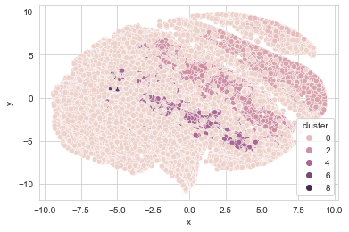
    


```python
addres_clusters_data['cluster'] = clustering.labels_
addres_clusters_data.groupby('cluster')['default_mean'].mean()
```


    cluster
    -1    0.106069
     0    0.000000
     1    0.035543
     2    0.068308
     3    0.077363
     4    0.101078
     5    0.087783
     6    0.096456
     7    0.115645
     8    0.116081
     9    0.124193
    Name: default_mean, dtype: float64


```python
df_cust_trans = df_cust_trans.merge(addres_clusters_data[['residentialAddress_clean','cluster']], on='residentialAddress_clean', how='left')

```

## What country and city

Use openstreetmap api to geocode residentialAddress to get information like: country, city, district/neighbourhood


```python
residentialAddress_geocoded = []
for adr in df_cust_trans.residentialAddress.sample(500, random_state=1).to_list():
    residentialAddress_geocoded += [geocoder.osm(adr.strip()).json]

```

    2021-04-19 16:54:27,644 - geocoder.base - INFO - Requested https://nominatim.openstreetmap.org/search?q=93+Carnoustie+Court&format=jsonv2&addressdetails=1&limit=1
    2021-04-19 16:54:28,053 - geocoder.base - INFO - Requested https://nominatim.openstreetmap.org/search?q=79+Meadowlands+Road&format=jsonv2&addressdetails=1&limit=1
    2021-04-19 16:54:28,446 - geocoder.base - INFO - Requested https://nominatim.openstreetmap.org/search?q=7+Windeyer+Street&format=jsonv2&addressdetails=1&limit=1
    2021-04-19 16:54:30,547 - geocoder.base - INFO - Requested https://nominatim.openstreetmap.org/search?q=19+Forest+Court&format=jsonv2&addressdetails=1&limit=1
    2021-04-19 16:54:30,927 - geocoder.base - INFO - Requested https://nominatim.openstreetmap.org/search?q=5+Sumners+Road&format=jsonv2&addressdetails=1&limit=1
    2021-04-19 16:54:31,590 - geocoder.base - INFO - Requested https://nominatim.openstreetmap.org/search?q=86+Horton+Place&format=jsonv2&addressdetails=1&limit=1
    2021-04-19 16:54:31,934 - geocoder.base - INFO - Requested https://nominatim.openstreetmap.org/search?q=7+Brisbane+Avenue&format=jsonv2&addressdetails=1&limit=1
    2021-04-19 16:54:32,360 - geocoder.base - INFO - Requested https://nominatim.openstreetmap.org/search?q=69+Netting+Street&format=jsonv2&addressdetails=1&limit=1
    2021-04-19 16:54:33,801 - geocoder.base - INFO - Requested https://nominatim.openstreetmap.org/search?q=57+Ellison+Road&format=jsonv2&addressdetails=1&limit=1
    2021-04-19 16:54:34,038 - geocoder.base - INFO - Requested https://nominatim.openstreetmap.org/search?q=49+Coorong+Street&format=jsonv2&addressdetails=1&limit=1
    2021-04-19 16:54:34,590 - geocoder.base - INFO - Requested https://nominatim.openstreetmap.org/search?q=50+Lowan+Street&format=jsonv2&addressdetails=1&limit=1
    2021-04-19 16:54:36,619 - geocoder.base - INFO - Requested https://nominatim.openstreetmap.org/search?q=16+Elliot+Street&format=jsonv2&addressdetails=1&limit=1
    2021-04-19 16:54:36,835 - geocoder.base - INFO - Requested https://nominatim.openstreetmap.org/search?q=99+Bebbington+Street&format=jsonv2&addressdetails=1&limit=1
    2021-04-19 16:54:37,490 - geocoder.base - INFO - Requested https://nominatim.openstreetmap.org/search?q=2+Mt+flinders+Place&format=jsonv2&addressdetails=1&limit=1
    2021-04-19 16:54:37,883 - geocoder.base - INFO - Requested https://nominatim.openstreetmap.org/search?q=41+Mclennan+Close&format=jsonv2&addressdetails=1&limit=1
    2021-04-19 16:54:38,539 - geocoder.base - INFO - Requested https://nominatim.openstreetmap.org/search?q=58+Lothian+Street&format=jsonv2&addressdetails=1&limit=1
    2021-04-19 16:54:39,130 - geocoder.base - INFO - Requested https://nominatim.openstreetmap.org/search?q=99+Hermitage+Place&format=jsonv2&addressdetails=1&limit=1
    2021-04-19 16:54:39,707 - geocoder.base - INFO - Requested https://nominatim.openstreetmap.org/search?q=44+Sherbrooke+Road&format=jsonv2&addressdetails=1&limit=1
    2021-04-19 16:54:40,040 - geocoder.base - INFO - Requested https://nominatim.openstreetmap.org/search?q=88+Wagtail+Street&format=jsonv2&addressdetails=1&limit=1
    2021-04-19 16:54:40,322 - geocoder.base - INFO - Requested https://nominatim.openstreetmap.org/search?q=33+Davidshone+Close&format=jsonv2&addressdetails=1&limit=1
    2021-04-19 16:54:41,719 - geocoder.base - INFO - Requested https://nominatim.openstreetmap.org/search?q=51+Harcourt+Street&format=jsonv2&addressdetails=1&limit=1
    2021-04-19 16:54:42,210 - geocoder.base - INFO - Requested https://nominatim.openstreetmap.org/search?q=6+Harvard+Street&format=jsonv2&addressdetails=1&limit=1
    2021-04-19 16:54:42,458 - geocoder.base - INFO - Requested https://nominatim.openstreetmap.org/search?q=88+Wadley+Street&format=jsonv2&addressdetails=1&limit=1
    2021-04-19 16:54:42,872 - geocoder.base - INFO - Requested https://nominatim.openstreetmap.org/search?q=49+Laughland+Street&format=jsonv2&addressdetails=1&limit=1
    2021-04-19 16:54:43,781 - geocoder.base - INFO - Requested https://nominatim.openstreetmap.org/search?q=88+Bristol+Road&format=jsonv2&addressdetails=1&limit=1
    2021-04-19 16:54:44,018 - geocoder.base - INFO - Requested https://nominatim.openstreetmap.org/search?q=16+Maughan+Street&format=jsonv2&addressdetails=1&limit=1
    2021-04-19 16:54:44,493 - geocoder.base - INFO - Requested https://nominatim.openstreetmap.org/search?q=71+Coventry+Circuit&format=jsonv2&addressdetails=1&limit=1
    2021-04-19 16:54:44,940 - geocoder.base - INFO - Requested https://nominatim.openstreetmap.org/search?q=76+Ballybritt+Street&format=jsonv2&addressdetails=1&limit=1
    2021-04-19 16:54:45,458 - geocoder.base - INFO - Requested https://nominatim.openstreetmap.org/search?q=10+Amara+Crescent&format=jsonv2&addressdetails=1&limit=1
    2021-04-19 16:54:45,983 - geocoder.base - INFO - Requested https://nominatim.openstreetmap.org/search?q=53+Kiandra+Close&format=jsonv2&addressdetails=1&limit=1
    2021-04-19 16:54:46,614 - geocoder.base - INFO - Requested https://nominatim.openstreetmap.org/search?q=50+Calliope+Street&format=jsonv2&addressdetails=1&limit=1
    2021-04-19 16:54:47,088 - geocoder.base - INFO - Requested https://nominatim.openstreetmap.org/search?q=88+Bracken+ridge+Road&format=jsonv2&addressdetails=1&limit=1
    2021-04-19 16:54:47,975 - geocoder.base - INFO - Requested https://nominatim.openstreetmap.org/search?q=93+Georgia+Place&format=jsonv2&addressdetails=1&limit=1
    2021-04-19 16:54:50,073 - geocoder.base - INFO - Requested https://nominatim.openstreetmap.org/search?q=92+Albion+Road&format=jsonv2&addressdetails=1&limit=1
    2021-04-19 16:54:51,121 - geocoder.base - INFO - Requested https://nominatim.openstreetmap.org/search?q=61+Bland+Street&format=jsonv2&addressdetails=1&limit=1
    2021-04-19 16:54:52,216 - geocoder.base - INFO - Requested https://nominatim.openstreetmap.org/search?q=92+Aberdeen+Court&format=jsonv2&addressdetails=1&limit=1
    2021-04-19 16:54:52,391 - geocoder.base - INFO - Requested https://nominatim.openstreetmap.org/search?q=8+Angy+Street&format=jsonv2&addressdetails=1&limit=1
    2021-04-19 16:54:53,217 - geocoder.base - INFO - Requested https://nominatim.openstreetmap.org/search?q=72+Bradman+Street&format=jsonv2&addressdetails=1&limit=1
    2021-04-19 16:54:54,561 - geocoder.base - INFO - Requested https://nominatim.openstreetmap.org/search?q=38+Bush+Street&format=jsonv2&addressdetails=1&limit=1
    2021-04-19 16:54:55,429 - geocoder.base - INFO - Requested https://nominatim.openstreetmap.org/search?q=46+Marine+Drive&format=jsonv2&addressdetails=1&limit=1
    2021-04-19 16:54:55,610 - geocoder.base - INFO - Requested https://nominatim.openstreetmap.org/search?q=17+Seton+Close&format=jsonv2&addressdetails=1&limit=1
    2021-04-19 16:54:57,885 - geocoder.base - INFO - Requested https://nominatim.openstreetmap.org/search?q=2+Boyd+Road&format=jsonv2&addressdetails=1&limit=1
    2021-04-19 16:54:58,107 - geocoder.base - INFO - Requested https://nominatim.openstreetmap.org/search?q=83+Knowsley+Street&format=jsonv2&addressdetails=1&limit=1
    2021-04-19 16:54:58,957 - geocoder.base - INFO - Requested https://nominatim.openstreetmap.org/search?q=66+Murphy+Court&format=jsonv2&addressdetails=1&limit=1
    2021-04-19 16:55:00,556 - geocoder.base - INFO - Requested https://nominatim.openstreetmap.org/search?q=72+Chambers+Street&format=jsonv2&addressdetails=1&limit=1
    2021-04-19 16:55:01,107 - geocoder.base - INFO - Requested https://nominatim.openstreetmap.org/search?q=84+Venetia+Street&format=jsonv2&addressdetails=1&limit=1
    2021-04-19 16:55:01,269 - geocoder.base - INFO - Requested https://nominatim.openstreetmap.org/search?q=48+Silverdell+Crescent&format=jsonv2&addressdetails=1&limit=1
    2021-04-19 16:55:02,289 - geocoder.base - INFO - Requested https://nominatim.openstreetmap.org/search?q=63+Rose+Terrace&format=jsonv2&addressdetails=1&limit=1
    2021-04-19 16:55:03,354 - geocoder.base - INFO - Requested https://nominatim.openstreetmap.org/search?q=96+Waller+Street&format=jsonv2&addressdetails=1&limit=1
    2021-04-19 16:55:04,464 - geocoder.base - INFO - Requested https://nominatim.openstreetmap.org/search?q=45+Woodfield+Road&format=jsonv2&addressdetails=1&limit=1
    2021-04-19 16:55:04,889 - geocoder.base - INFO - Requested https://nominatim.openstreetmap.org/search?q=29+Queens+wharf+Road&format=jsonv2&addressdetails=1&limit=1
    2021-04-19 16:55:07,408 - geocoder.base - INFO - Requested https://nominatim.openstreetmap.org/search?q=5+Robertson+Street&format=jsonv2&addressdetails=1&limit=1
    2021-04-19 16:55:07,897 - geocoder.base - INFO - Requested https://nominatim.openstreetmap.org/search?q=34+Park+Road&format=jsonv2&addressdetails=1&limit=1
    2021-04-19 16:55:08,327 - geocoder.base - INFO - Requested https://nominatim.openstreetmap.org/search?q=64+Kingston+Road&format=jsonv2&addressdetails=1&limit=1
    2021-04-19 16:55:08,623 - geocoder.base - INFO - Requested https://nominatim.openstreetmap.org/search?q=88+Kiltie+Street&format=jsonv2&addressdetails=1&limit=1
    2021-04-19 16:55:09,559 - geocoder.base - INFO - Requested https://nominatim.openstreetmap.org/search?q=63+Princess+Street&format=jsonv2&addressdetails=1&limit=1
    2021-04-19 16:55:10,480 - geocoder.base - INFO - Requested https://nominatim.openstreetmap.org/search?q=74+Harrison+Street&format=jsonv2&addressdetails=1&limit=1
    2021-04-19 16:55:10,791 - geocoder.base - INFO - Requested https://nominatim.openstreetmap.org/search?q=99+Royal+Esplanade&format=jsonv2&addressdetails=1&limit=1
    2021-04-19 16:55:12,577 - geocoder.base - INFO - Requested https://nominatim.openstreetmap.org/search?q=51+Stephens+Road&format=jsonv2&addressdetails=1&limit=1
    2021-04-19 16:55:14,836 - geocoder.base - INFO - Requested https://nominatim.openstreetmap.org/search?q=32+Royal+Avenue&format=jsonv2&addressdetails=1&limit=1
    2021-04-19 16:55:15,243 - geocoder.base - INFO - Requested https://nominatim.openstreetmap.org/search?q=84+Boundary+Street&format=jsonv2&addressdetails=1&limit=1
    2021-04-19 16:55:15,690 - geocoder.base - INFO - Requested https://nominatim.openstreetmap.org/search?q=68+Burgess+Place&format=jsonv2&addressdetails=1&limit=1
    2021-04-19 16:55:16,419 - geocoder.base - INFO - Requested https://nominatim.openstreetmap.org/search?q=91+Sandy+camp+Road&format=jsonv2&addressdetails=1&limit=1
    2021-04-19 16:55:17,836 - geocoder.base - INFO - Requested https://nominatim.openstreetmap.org/search?q=39+Newman+Road&format=jsonv2&addressdetails=1&limit=1
    2021-04-19 16:55:20,003 - geocoder.base - INFO - Requested https://nominatim.openstreetmap.org/search?q=80+Jean+Street&format=jsonv2&addressdetails=1&limit=1
    2021-04-19 16:55:20,480 - geocoder.base - INFO - Requested https://nominatim.openstreetmap.org/search?q=7+Fairley+Street&format=jsonv2&addressdetails=1&limit=1
    2021-04-19 16:55:20,740 - geocoder.base - INFO - Requested https://nominatim.openstreetmap.org/search?q=78+Lisadell+Court&format=jsonv2&addressdetails=1&limit=1
    2021-04-19 16:55:21,167 - geocoder.base - INFO - Requested https://nominatim.openstreetmap.org/search?q=99+Yanum+Place&format=jsonv2&addressdetails=1&limit=1
    2021-04-19 16:55:21,949 - geocoder.base - INFO - Requested https://nominatim.openstreetmap.org/search?q=9+Curlew+Place&format=jsonv2&addressdetails=1&limit=1
    2021-04-19 16:55:24,102 - geocoder.base - INFO - Requested https://nominatim.openstreetmap.org/search?q=53+Noble+Street&format=jsonv2&addressdetails=1&limit=1
    2021-04-19 16:55:24,289 - geocoder.base - INFO - Requested https://nominatim.openstreetmap.org/search?q=8+Ebrington+Street&format=jsonv2&addressdetails=1&limit=1
    2021-04-19 16:55:24,904 - geocoder.base - INFO - Requested https://nominatim.openstreetmap.org/search?q=5+Wacol+station+Road&format=jsonv2&addressdetails=1&limit=1
    2021-04-19 16:55:25,298 - geocoder.base - INFO - Requested https://nominatim.openstreetmap.org/search?q=14+Landor+Street&format=jsonv2&addressdetails=1&limit=1
    2021-04-19 16:55:25,756 - geocoder.base - INFO - Requested https://nominatim.openstreetmap.org/search?q=77+Lather+Road&format=jsonv2&addressdetails=1&limit=1
    2021-04-19 16:55:26,803 - geocoder.base - INFO - Requested https://nominatim.openstreetmap.org/search?q=63+Sylvia+Street&format=jsonv2&addressdetails=1&limit=1
    2021-04-19 16:55:26,964 - geocoder.base - INFO - Requested https://nominatim.openstreetmap.org/search?q=18+Lindfield+Street&format=jsonv2&addressdetails=1&limit=1
    2021-04-19 16:55:28,039 - geocoder.base - INFO - Requested https://nominatim.openstreetmap.org/search?q=21+Oxley+Road&format=jsonv2&addressdetails=1&limit=1
    2021-04-19 16:55:29,526 - geocoder.base - INFO - Requested https://nominatim.openstreetmap.org/search?q=77+Bolton+Street&format=jsonv2&addressdetails=1&limit=1
    2021-04-19 16:55:30,964 - geocoder.base - INFO - Requested https://nominatim.openstreetmap.org/search?q=99+Weaver+Street&format=jsonv2&addressdetails=1&limit=1
    2021-04-19 16:55:31,146 - geocoder.base - INFO - Requested https://nominatim.openstreetmap.org/search?q=64+Wallum+Street&format=jsonv2&addressdetails=1&limit=1
    2021-04-19 16:55:32,014 - geocoder.base - INFO - Requested https://nominatim.openstreetmap.org/search?q=41+Nelson+Street&format=jsonv2&addressdetails=1&limit=1
    2021-04-19 16:55:32,205 - geocoder.base - INFO - Requested https://nominatim.openstreetmap.org/search?q=2+Beaulieu+Crescent&format=jsonv2&addressdetails=1&limit=1
    2021-04-19 16:55:32,703 - geocoder.base - INFO - Requested https://nominatim.openstreetmap.org/search?q=87+Salway+Street&format=jsonv2&addressdetails=1&limit=1
    2021-04-19 16:55:33,294 - geocoder.base - INFO - Requested https://nominatim.openstreetmap.org/search?q=11+Seabrook+Street&format=jsonv2&addressdetails=1&limit=1
    2021-04-19 16:55:33,801 - geocoder.base - INFO - Requested https://nominatim.openstreetmap.org/search?q=6+Wayne+Street&format=jsonv2&addressdetails=1&limit=1
    2021-04-19 16:55:34,330 - geocoder.base - INFO - Requested https://nominatim.openstreetmap.org/search?q=49+Boss+Road&format=jsonv2&addressdetails=1&limit=1
    2021-04-19 16:55:34,713 - geocoder.base - INFO - Requested https://nominatim.openstreetmap.org/search?q=36+Lapin+Street&format=jsonv2&addressdetails=1&limit=1
    2021-04-19 16:55:35,275 - geocoder.base - INFO - Requested https://nominatim.openstreetmap.org/search?q=37+Lana+Street&format=jsonv2&addressdetails=1&limit=1
    2021-04-19 16:55:35,976 - geocoder.base - INFO - Requested https://nominatim.openstreetmap.org/search?q=50+Northey+Street&format=jsonv2&addressdetails=1&limit=1
    2021-04-19 16:55:38,023 - geocoder.base - INFO - Requested https://nominatim.openstreetmap.org/search?q=80+Clifford+Street&format=jsonv2&addressdetails=1&limit=1
    2021-04-19 16:55:38,402 - geocoder.base - INFO - Requested https://nominatim.openstreetmap.org/search?q=18+Wentworth+Court&format=jsonv2&addressdetails=1&limit=1
    2021-04-19 16:55:39,067 - geocoder.base - INFO - Requested https://nominatim.openstreetmap.org/search?q=15+Savannah+Place&format=jsonv2&addressdetails=1&limit=1
    2021-04-19 16:55:40,402 - geocoder.base - INFO - Requested https://nominatim.openstreetmap.org/search?q=5+Raven+Street&format=jsonv2&addressdetails=1&limit=1
    2021-04-19 16:55:41,451 - geocoder.base - INFO - Requested https://nominatim.openstreetmap.org/search?q=32+Oxford+Place&format=jsonv2&addressdetails=1&limit=1
    2021-04-19 16:55:41,665 - geocoder.base - INFO - Requested https://nominatim.openstreetmap.org/search?q=95+Solomon+Crescent&format=jsonv2&addressdetails=1&limit=1
    2021-04-19 16:55:42,134 - geocoder.base - INFO - Requested https://nominatim.openstreetmap.org/search?q=23+Worchester+Crescent&format=jsonv2&addressdetails=1&limit=1
    2021-04-19 16:55:42,890 - geocoder.base - INFO - Requested https://nominatim.openstreetmap.org/search?q=1+Vulture+Street&format=jsonv2&addressdetails=1&limit=1
    2021-04-19 16:55:43,159 - geocoder.base - INFO - Requested https://nominatim.openstreetmap.org/search?q=47+Crockford+Street&format=jsonv2&addressdetails=1&limit=1
    2021-04-19 16:55:43,850 - geocoder.base - INFO - Requested https://nominatim.openstreetmap.org/search?q=70+Garth+Street&format=jsonv2&addressdetails=1&limit=1
    2021-04-19 16:55:44,596 - geocoder.base - INFO - Requested https://nominatim.openstreetmap.org/search?q=5+Station+Street&format=jsonv2&addressdetails=1&limit=1
    2021-04-19 16:55:44,989 - geocoder.base - INFO - Requested https://nominatim.openstreetmap.org/search?q=21+Mary+Street&format=jsonv2&addressdetails=1&limit=1
    2021-04-19 16:55:46,216 - geocoder.base - INFO - Requested https://nominatim.openstreetmap.org/search?q=68+Seymour+Road&format=jsonv2&addressdetails=1&limit=1
    2021-04-19 16:55:46,373 - geocoder.base - INFO - Requested https://nominatim.openstreetmap.org/search?q=33+Parkham+Avenue&format=jsonv2&addressdetails=1&limit=1
    2021-04-19 16:55:46,990 - geocoder.base - INFO - Requested https://nominatim.openstreetmap.org/search?q=61+Busby+Street&format=jsonv2&addressdetails=1&limit=1
    2021-04-19 16:55:47,412 - geocoder.base - INFO - Requested https://nominatim.openstreetmap.org/search?q=58+Debenham+Street&format=jsonv2&addressdetails=1&limit=1
    2021-04-19 16:55:47,883 - geocoder.base - INFO - Requested https://nominatim.openstreetmap.org/search?q=10+Mcdermott+Close&format=jsonv2&addressdetails=1&limit=1
    2021-04-19 16:55:48,383 - geocoder.base - INFO - Requested https://nominatim.openstreetmap.org/search?q=7+Gerler+Street&format=jsonv2&addressdetails=1&limit=1
    2021-04-19 16:55:49,077 - geocoder.base - INFO - Requested https://nominatim.openstreetmap.org/search?q=18+Miles+platting+Road&format=jsonv2&addressdetails=1&limit=1
    2021-04-19 16:55:49,375 - geocoder.base - INFO - Requested https://nominatim.openstreetmap.org/search?q=24+Meecham+Street&format=jsonv2&addressdetails=1&limit=1
    2021-04-19 16:55:49,902 - geocoder.base - INFO - Requested https://nominatim.openstreetmap.org/search?q=61+Bleasby+Road&format=jsonv2&addressdetails=1&limit=1
    2021-04-19 16:55:50,887 - geocoder.base - INFO - Requested https://nominatim.openstreetmap.org/search?q=81+Ashby+Street&format=jsonv2&addressdetails=1&limit=1
    2021-04-19 16:55:51,344 - geocoder.base - INFO - Requested https://nominatim.openstreetmap.org/search?q=100+Hutcheson+Street&format=jsonv2&addressdetails=1&limit=1
    2021-04-19 16:55:51,590 - geocoder.base - INFO - Requested https://nominatim.openstreetmap.org/search?q=38+Delphinus+Street&format=jsonv2&addressdetails=1&limit=1
    2021-04-19 16:55:52,064 - geocoder.base - INFO - Requested https://nominatim.openstreetmap.org/search?q=90+Ribands+Place&format=jsonv2&addressdetails=1&limit=1
    2021-04-19 16:55:52,984 - geocoder.base - INFO - Requested https://nominatim.openstreetmap.org/search?q=48+Beenleigh+Road&format=jsonv2&addressdetails=1&limit=1
    2021-04-19 16:55:53,624 - geocoder.base - INFO - Requested https://nominatim.openstreetmap.org/search?q=76+Peterson+Street&format=jsonv2&addressdetails=1&limit=1
    2021-04-19 16:55:53,763 - geocoder.base - INFO - Requested https://nominatim.openstreetmap.org/search?q=88+Duporth+Road&format=jsonv2&addressdetails=1&limit=1
    2021-04-19 16:55:55,082 - geocoder.base - INFO - Requested https://nominatim.openstreetmap.org/search?q=41+Susan+Street&format=jsonv2&addressdetails=1&limit=1
    2021-04-19 16:55:55,353 - geocoder.base - INFO - Requested https://nominatim.openstreetmap.org/search?q=72+Cassandra+Street&format=jsonv2&addressdetails=1&limit=1
    2021-04-19 16:55:56,417 - geocoder.base - INFO - Requested https://nominatim.openstreetmap.org/search?q=71+High+Street&format=jsonv2&addressdetails=1&limit=1
    2021-04-19 16:55:56,683 - geocoder.base - INFO - Requested https://nominatim.openstreetmap.org/search?q=39+Karvella+Street&format=jsonv2&addressdetails=1&limit=1
    2021-04-19 16:55:57,208 - geocoder.base - INFO - Requested https://nominatim.openstreetmap.org/search?q=88+Inverary+Place&format=jsonv2&addressdetails=1&limit=1
    2021-04-19 16:55:57,694 - geocoder.base - INFO - Requested https://nominatim.openstreetmap.org/search?q=89+Gilliver+Street&format=jsonv2&addressdetails=1&limit=1
    2021-04-19 16:55:59,008 - geocoder.base - INFO - Requested https://nominatim.openstreetmap.org/search?q=19+Phoenix+Street&format=jsonv2&addressdetails=1&limit=1
    2021-04-19 16:55:59,401 - geocoder.base - INFO - Requested https://nominatim.openstreetmap.org/search?q=82+Naldham+Close&format=jsonv2&addressdetails=1&limit=1
    2021-04-19 16:55:59,889 - geocoder.base - INFO - Requested https://nominatim.openstreetmap.org/search?q=63+Delville+Avenue&format=jsonv2&addressdetails=1&limit=1
    2021-04-19 16:56:01,630 - geocoder.base - INFO - Requested https://nominatim.openstreetmap.org/search?q=23+Dublin+Street&format=jsonv2&addressdetails=1&limit=1
    2021-04-19 16:56:01,990 - geocoder.base - INFO - Requested https://nominatim.openstreetmap.org/search?q=39+Bunya+Street&format=jsonv2&addressdetails=1&limit=1
    2021-04-19 16:56:02,429 - geocoder.base - INFO - Requested https://nominatim.openstreetmap.org/search?q=98+Castlebar+Street&format=jsonv2&addressdetails=1&limit=1
    2021-04-19 16:56:02,865 - geocoder.base - INFO - Requested https://nominatim.openstreetmap.org/search?q=25+Dance+Crescent&format=jsonv2&addressdetails=1&limit=1
    2021-04-19 16:56:03,470 - geocoder.base - INFO - Requested https://nominatim.openstreetmap.org/search?q=4+Keitel+Close&format=jsonv2&addressdetails=1&limit=1
    2021-04-19 16:56:03,864 - geocoder.base - INFO - Requested https://nominatim.openstreetmap.org/search?q=57+Coomera+Court&format=jsonv2&addressdetails=1&limit=1
    2021-04-19 16:56:04,544 - geocoder.base - INFO - Requested https://nominatim.openstreetmap.org/search?q=61+Derelle+Street&format=jsonv2&addressdetails=1&limit=1
    2021-04-19 16:56:04,910 - geocoder.base - INFO - Requested https://nominatim.openstreetmap.org/search?q=18+Geelong+Avenue&format=jsonv2&addressdetails=1&limit=1
    2021-04-19 16:56:05,777 - geocoder.base - INFO - Requested https://nominatim.openstreetmap.org/search?q=12+Grand+Avenue&format=jsonv2&addressdetails=1&limit=1
    2021-04-19 16:56:06,051 - geocoder.base - INFO - Requested https://nominatim.openstreetmap.org/search?q=70+Walsall+Street&format=jsonv2&addressdetails=1&limit=1
    2021-04-19 16:56:06,688 - geocoder.base - INFO - Requested https://nominatim.openstreetmap.org/search?q=62+Burke+Court&format=jsonv2&addressdetails=1&limit=1
    2021-04-19 16:56:07,118 - geocoder.base - INFO - Requested https://nominatim.openstreetmap.org/search?q=64+Smith+Street&format=jsonv2&addressdetails=1&limit=1
    2021-04-19 16:56:07,664 - geocoder.base - INFO - Requested https://nominatim.openstreetmap.org/search?q=97+Bilsen+Road&format=jsonv2&addressdetails=1&limit=1
    2021-04-19 16:56:08,713 - geocoder.base - INFO - Requested https://nominatim.openstreetmap.org/search?q=35+Balfour+Street&format=jsonv2&addressdetails=1&limit=1
    2021-04-19 16:56:08,890 - geocoder.base - INFO - Requested https://nominatim.openstreetmap.org/search?q=3+Beauvardia+Street&format=jsonv2&addressdetails=1&limit=1
    2021-04-19 16:56:09,762 - geocoder.base - INFO - Requested https://nominatim.openstreetmap.org/search?q=78+Wylie+Street&format=jsonv2&addressdetails=1&limit=1
    2021-04-19 16:56:09,914 - geocoder.base - INFO - Requested https://nominatim.openstreetmap.org/search?q=50+Signac+Close&format=jsonv2&addressdetails=1&limit=1
    2021-04-19 16:56:10,425 - geocoder.base - INFO - Requested https://nominatim.openstreetmap.org/search?q=48+Albar+Street&format=jsonv2&addressdetails=1&limit=1
    2021-04-19 16:56:10,922 - geocoder.base - INFO - Requested https://nominatim.openstreetmap.org/search?q=31+Greencamp+Road&format=jsonv2&addressdetails=1&limit=1
    2021-04-19 16:56:11,535 - geocoder.base - INFO - Requested https://nominatim.openstreetmap.org/search?q=70+Stradbroke+Street&format=jsonv2&addressdetails=1&limit=1
    2021-04-19 16:56:12,038 - geocoder.base - INFO - Requested https://nominatim.openstreetmap.org/search?q=8+Ashburton+Street&format=jsonv2&addressdetails=1&limit=1
    2021-04-19 16:56:12,531 - geocoder.base - INFO - Requested https://nominatim.openstreetmap.org/search?q=18+Rymera+Crescent&format=jsonv2&addressdetails=1&limit=1
    2021-04-19 16:56:12,909 - geocoder.base - INFO - Requested https://nominatim.openstreetmap.org/search?q=89+Carranya+Street&format=jsonv2&addressdetails=1&limit=1
    2021-04-19 16:56:13,956 - geocoder.base - INFO - Requested https://nominatim.openstreetmap.org/search?q=83+Newcombe+Street&format=jsonv2&addressdetails=1&limit=1
    2021-04-19 16:56:14,401 - geocoder.base - INFO - Requested https://nominatim.openstreetmap.org/search?q=72+Grand+Street&format=jsonv2&addressdetails=1&limit=1
    2021-04-19 16:56:15,004 - geocoder.base - INFO - Requested https://nominatim.openstreetmap.org/search?q=92+Berry+Street&format=jsonv2&addressdetails=1&limit=1
    2021-04-19 16:56:15,151 - geocoder.base - INFO - Requested https://nominatim.openstreetmap.org/search?q=48+Glencam+Street&format=jsonv2&addressdetails=1&limit=1
    2021-04-19 16:56:17,571 - geocoder.base - INFO - Requested https://nominatim.openstreetmap.org/search?q=53+Fuller+Street&format=jsonv2&addressdetails=1&limit=1
    2021-04-19 16:56:18,265 - geocoder.base - INFO - Requested https://nominatim.openstreetmap.org/search?q=3+Douglas+Road&format=jsonv2&addressdetails=1&limit=1
    2021-04-19 16:56:18,417 - geocoder.base - INFO - Requested https://nominatim.openstreetmap.org/search?q=70+Northcliffe+Street&format=jsonv2&addressdetails=1&limit=1
    2021-04-19 16:56:19,198 - geocoder.base - INFO - Requested https://nominatim.openstreetmap.org/search?q=9+Guildford+Street&format=jsonv2&addressdetails=1&limit=1
    2021-04-19 16:56:19,604 - geocoder.base - INFO - Requested https://nominatim.openstreetmap.org/search?q=14+New+cleveland+Road&format=jsonv2&addressdetails=1&limit=1
    2021-04-19 16:56:19,943 - geocoder.base - INFO - Requested https://nominatim.openstreetmap.org/search?q=6+Don+young+Road&format=jsonv2&addressdetails=1&limit=1
    2021-04-19 16:56:20,681 - geocoder.base - INFO - Requested https://nominatim.openstreetmap.org/search?q=50+Paul+Street&format=jsonv2&addressdetails=1&limit=1
    2021-04-19 16:56:20,941 - geocoder.base - INFO - Requested https://nominatim.openstreetmap.org/search?q=42+Helicia+Street&format=jsonv2&addressdetails=1&limit=1
    2021-04-19 16:56:21,539 - geocoder.base - INFO - Requested https://nominatim.openstreetmap.org/search?q=84+Stannard+Road&format=jsonv2&addressdetails=1&limit=1
    2021-04-19 16:56:21,925 - geocoder.base - INFO - Requested https://nominatim.openstreetmap.org/search?q=89+Gralton+Street&format=jsonv2&addressdetails=1&limit=1
    2021-04-19 16:56:22,825 - geocoder.base - INFO - Requested https://nominatim.openstreetmap.org/search?q=53+Sandalwood+Street&format=jsonv2&addressdetails=1&limit=1
    2021-04-19 16:56:23,009 - geocoder.base - INFO - Requested https://nominatim.openstreetmap.org/search?q=81+Winsome+Road&format=jsonv2&addressdetails=1&limit=1
    2021-04-19 16:56:24,441 - geocoder.base - INFO - Requested https://nominatim.openstreetmap.org/search?q=91+Pickett+Street&format=jsonv2&addressdetails=1&limit=1
    2021-04-19 16:56:24,617 - geocoder.base - INFO - Requested https://nominatim.openstreetmap.org/search?q=76+Sugargum+Close&format=jsonv2&addressdetails=1&limit=1
    2021-04-19 16:56:25,116 - geocoder.base - INFO - Requested https://nominatim.openstreetmap.org/search?q=71+Adria+Street&format=jsonv2&addressdetails=1&limit=1
    2021-04-19 16:56:25,603 - geocoder.base - INFO - Requested https://nominatim.openstreetmap.org/search?q=33+Lapworth+Place&format=jsonv2&addressdetails=1&limit=1
    2021-04-19 16:56:27,276 - geocoder.base - INFO - Requested https://nominatim.openstreetmap.org/search?q=45+Sanctuary+Drive&format=jsonv2&addressdetails=1&limit=1
    2021-04-19 16:56:28,132 - geocoder.base - INFO - Requested https://nominatim.openstreetmap.org/search?q=6+Diane+Court&format=jsonv2&addressdetails=1&limit=1
    2021-04-19 16:56:28,635 - geocoder.base - INFO - Requested https://nominatim.openstreetmap.org/search?q=11+Byrnes+Street&format=jsonv2&addressdetails=1&limit=1
    2021-04-19 16:56:29,683 - geocoder.base - INFO - Requested https://nominatim.openstreetmap.org/search?q=42+Kipling+Street&format=jsonv2&addressdetails=1&limit=1
    2021-04-19 16:56:29,917 - geocoder.base - INFO - Requested https://nominatim.openstreetmap.org/search?q=24+Goorna+Close&format=jsonv2&addressdetails=1&limit=1
    2021-04-19 16:56:30,732 - geocoder.base - INFO - Requested https://nominatim.openstreetmap.org/search?q=60+Karo+Street&format=jsonv2&addressdetails=1&limit=1
    2021-04-19 16:56:30,956 - geocoder.base - INFO - Requested https://nominatim.openstreetmap.org/search?q=97+Battersea+Close&format=jsonv2&addressdetails=1&limit=1
    2021-04-19 16:56:31,435 - geocoder.base - INFO - Requested https://nominatim.openstreetmap.org/search?q=56+Bleasby+Road&format=jsonv2&addressdetails=1&limit=1
    2021-04-19 16:56:33,529 - geocoder.base - INFO - Requested https://nominatim.openstreetmap.org/search?q=79+Gardner+Road&format=jsonv2&addressdetails=1&limit=1
    2021-04-19 16:56:33,878 - geocoder.base - INFO - Requested https://nominatim.openstreetmap.org/search?q=89+Turrana+Street&format=jsonv2&addressdetails=1&limit=1
    2021-04-19 16:56:34,271 - geocoder.base - INFO - Requested https://nominatim.openstreetmap.org/search?q=58+Balrothery+Street&format=jsonv2&addressdetails=1&limit=1
    2021-04-19 16:56:35,199 - geocoder.base - INFO - Requested https://nominatim.openstreetmap.org/search?q=18+Jewel+Street&format=jsonv2&addressdetails=1&limit=1
    2021-04-19 16:56:36,060 - geocoder.base - INFO - Requested https://nominatim.openstreetmap.org/search?q=57+Panama+Street&format=jsonv2&addressdetails=1&limit=1
    2021-04-19 16:56:36,436 - geocoder.base - INFO - Requested https://nominatim.openstreetmap.org/search?q=87+Bond+Place&format=jsonv2&addressdetails=1&limit=1
    2021-04-19 16:56:36,797 - geocoder.base - INFO - Requested https://nominatim.openstreetmap.org/search?q=48+Clovelly+Street&format=jsonv2&addressdetails=1&limit=1
    2021-04-19 16:56:37,205 - geocoder.base - INFO - Requested https://nominatim.openstreetmap.org/search?q=27+Bunya+Street&format=jsonv2&addressdetails=1&limit=1
    2021-04-19 16:56:38,073 - geocoder.base - INFO - Requested https://nominatim.openstreetmap.org/search?q=41+Wellington+Road&format=jsonv2&addressdetails=1&limit=1
    2021-04-19 16:56:38,291 - geocoder.base - INFO - Requested https://nominatim.openstreetmap.org/search?q=26+Maywood+Crescent&format=jsonv2&addressdetails=1&limit=1
    2021-04-19 16:56:38,750 - geocoder.base - INFO - Requested https://nominatim.openstreetmap.org/search?q=94+Woodswallow+Place&format=jsonv2&addressdetails=1&limit=1
    2021-04-19 16:56:39,293 - geocoder.base - INFO - Requested https://nominatim.openstreetmap.org/search?q=10+Gilia+Court&format=jsonv2&addressdetails=1&limit=1
    2021-04-19 16:56:40,177 - geocoder.base - INFO - Requested https://nominatim.openstreetmap.org/search?q=18+Rembrandt+Street&format=jsonv2&addressdetails=1&limit=1
    2021-04-19 16:56:40,350 - geocoder.base - INFO - Requested https://nominatim.openstreetmap.org/search?q=92+Miandetta+Street&format=jsonv2&addressdetails=1&limit=1
    2021-04-19 16:56:42,329 - geocoder.base - INFO - Requested https://nominatim.openstreetmap.org/search?q=15+Montague+Road&format=jsonv2&addressdetails=1&limit=1
    2021-04-19 16:56:42,771 - geocoder.base - INFO - Requested https://nominatim.openstreetmap.org/search?q=76+Mt+crosby+Road&format=jsonv2&addressdetails=1&limit=1
    2021-04-19 16:56:43,020 - geocoder.base - INFO - Requested https://nominatim.openstreetmap.org/search?q=62+Worrin+Court&format=jsonv2&addressdetails=1&limit=1
    2021-04-19 16:56:44,479 - geocoder.base - INFO - Requested https://nominatim.openstreetmap.org/search?q=55+Cavendish+Road&format=jsonv2&addressdetails=1&limit=1
    2021-04-19 16:56:44,927 - geocoder.base - INFO - Requested https://nominatim.openstreetmap.org/search?q=17+Harris+Street&format=jsonv2&addressdetails=1&limit=1
    2021-04-19 16:56:45,411 - geocoder.base - INFO - Requested https://nominatim.openstreetmap.org/search?q=86+Panorama+Place&format=jsonv2&addressdetails=1&limit=1
    2021-04-19 16:56:45,677 - geocoder.base - INFO - Requested https://nominatim.openstreetmap.org/search?q=99+Rosa+Place&format=jsonv2&addressdetails=1&limit=1
    2021-04-19 16:56:46,116 - geocoder.base - INFO - Requested https://nominatim.openstreetmap.org/search?q=34+Clivia+Court&format=jsonv2&addressdetails=1&limit=1
    2021-04-19 16:56:46,623 - geocoder.base - INFO - Requested https://nominatim.openstreetmap.org/search?q=89+Shettleston+Street&format=jsonv2&addressdetails=1&limit=1
    2021-04-19 16:56:47,220 - geocoder.base - INFO - Requested https://nominatim.openstreetmap.org/search?q=96+Dargie+Street&format=jsonv2&addressdetails=1&limit=1
    2021-04-19 16:56:47,746 - geocoder.base - INFO - Requested https://nominatim.openstreetmap.org/search?q=12+Torquay+Crescent&format=jsonv2&addressdetails=1&limit=1
    2021-04-19 16:56:49,636 - geocoder.base - INFO - Requested https://nominatim.openstreetmap.org/search?q=57+St+james+Street&format=jsonv2&addressdetails=1&limit=1
    2021-04-19 16:56:49,842 - geocoder.base - INFO - Requested https://nominatim.openstreetmap.org/search?q=11+Wandi+Close&format=jsonv2&addressdetails=1&limit=1
    2021-04-19 16:56:50,317 - geocoder.base - INFO - Requested https://nominatim.openstreetmap.org/search?q=50+Willowie+Street&format=jsonv2&addressdetails=1&limit=1
    2021-04-19 16:56:50,885 - geocoder.base - INFO - Requested https://nominatim.openstreetmap.org/search?q=38+Brevis+Lane&format=jsonv2&addressdetails=1&limit=1
    2021-04-19 16:56:51,339 - geocoder.base - INFO - Requested https://nominatim.openstreetmap.org/search?q=24+Trident+Street&format=jsonv2&addressdetails=1&limit=1
    2021-04-19 16:56:51,793 - geocoder.base - INFO - Requested https://nominatim.openstreetmap.org/search?q=67+Carowell+Street&format=jsonv2&addressdetails=1&limit=1
    2021-04-19 16:56:52,286 - geocoder.base - INFO - Requested https://nominatim.openstreetmap.org/search?q=93+Yantara+Court&format=jsonv2&addressdetails=1&limit=1
    2021-04-19 16:56:52,840 - geocoder.base - INFO - Requested https://nominatim.openstreetmap.org/search?q=11+Lemnos+Street&format=jsonv2&addressdetails=1&limit=1
    2021-04-19 16:56:53,316 - geocoder.base - INFO - Requested https://nominatim.openstreetmap.org/search?q=6+Mcghie+Street&format=jsonv2&addressdetails=1&limit=1
    2021-04-19 16:56:53,801 - geocoder.base - INFO - Requested https://nominatim.openstreetmap.org/search?q=83+Kinkuna+Street&format=jsonv2&addressdetails=1&limit=1
    2021-04-19 16:56:54,322 - geocoder.base - INFO - Requested https://nominatim.openstreetmap.org/search?q=9+Woodsiana+Street&format=jsonv2&addressdetails=1&limit=1
    2021-04-19 16:56:57,484 - geocoder.base - INFO - Requested https://nominatim.openstreetmap.org/search?q=92+Marie+Street&format=jsonv2&addressdetails=1&limit=1
    2021-04-19 16:56:57,646 - geocoder.base - INFO - Requested https://nominatim.openstreetmap.org/search?q=73+Bunratty+Street&format=jsonv2&addressdetails=1&limit=1
    2021-04-19 16:56:58,406 - geocoder.base - INFO - Requested https://nominatim.openstreetmap.org/search?q=51+Bottlebrush+Street&format=jsonv2&addressdetails=1&limit=1
    2021-04-19 16:56:58,730 - geocoder.base - INFO - Requested https://nominatim.openstreetmap.org/search?q=48+Toorak+Street&format=jsonv2&addressdetails=1&limit=1
    2021-04-19 16:56:59,617 - geocoder.base - INFO - Requested https://nominatim.openstreetmap.org/search?q=52+Edmond+Street&format=jsonv2&addressdetails=1&limit=1
    2021-04-19 16:56:59,796 - geocoder.base - INFO - Requested https://nominatim.openstreetmap.org/search?q=73+Lockyer+Place&format=jsonv2&addressdetails=1&limit=1
    2021-04-19 16:57:00,322 - geocoder.base - INFO - Requested https://nominatim.openstreetmap.org/search?q=30+Noraville+Street&format=jsonv2&addressdetails=1&limit=1
    2021-04-19 16:57:00,862 - geocoder.base - INFO - Requested https://nominatim.openstreetmap.org/search?q=93+Goswell+Street&format=jsonv2&addressdetails=1&limit=1
    2021-04-19 16:57:01,322 - geocoder.base - INFO - Requested https://nominatim.openstreetmap.org/search?q=11+Raff+Lane&format=jsonv2&addressdetails=1&limit=1
    2021-04-19 16:57:01,781 - geocoder.base - INFO - Requested https://nominatim.openstreetmap.org/search?q=91+Cripps+Street&format=jsonv2&addressdetails=1&limit=1
    2021-04-19 16:57:02,602 - geocoder.base - INFO - Requested https://nominatim.openstreetmap.org/search?q=37+Hall+Street&format=jsonv2&addressdetails=1&limit=1
    2021-04-19 16:57:02,940 - geocoder.base - INFO - Requested https://nominatim.openstreetmap.org/search?q=60+Strathmore+Street&format=jsonv2&addressdetails=1&limit=1
    2021-04-19 16:57:03,301 - geocoder.base - INFO - Requested https://nominatim.openstreetmap.org/search?q=29+Wylma+Street&format=jsonv2&addressdetails=1&limit=1
    2021-04-19 16:57:04,752 - geocoder.base - INFO - Requested https://nominatim.openstreetmap.org/search?q=23+Lawrence+Road&format=jsonv2&addressdetails=1&limit=1
    2021-04-19 16:57:05,335 - geocoder.base - INFO - Requested https://nominatim.openstreetmap.org/search?q=13+Chapel+Street&format=jsonv2&addressdetails=1&limit=1
    2021-04-19 16:57:05,512 - geocoder.base - INFO - Requested https://nominatim.openstreetmap.org/search?q=54+Mt+d%27aguilar+Crescent&format=jsonv2&addressdetails=1&limit=1
    2021-04-19 16:57:06,424 - geocoder.base - INFO - Requested https://nominatim.openstreetmap.org/search?q=7+Clarke+Lane&format=jsonv2&addressdetails=1&limit=1
    2021-04-19 16:57:06,657 - geocoder.base - INFO - Requested https://nominatim.openstreetmap.org/search?q=27+Wolverhampton+Street&format=jsonv2&addressdetails=1&limit=1
    2021-04-19 16:57:07,066 - geocoder.base - INFO - Requested https://nominatim.openstreetmap.org/search?q=48+Peden+Court&format=jsonv2&addressdetails=1&limit=1
    2021-04-19 16:57:08,246 - geocoder.base - INFO - Requested https://nominatim.openstreetmap.org/search?q=95+Hove+Street&format=jsonv2&addressdetails=1&limit=1
    2021-04-19 16:57:08,674 - geocoder.base - INFO - Requested https://nominatim.openstreetmap.org/search?q=16+Travorten+Drive&format=jsonv2&addressdetails=1&limit=1
    2021-04-19 16:57:09,194 - geocoder.base - INFO - Requested https://nominatim.openstreetmap.org/search?q=40+Weinholt+Street&format=jsonv2&addressdetails=1&limit=1
    2021-04-19 16:57:09,921 - geocoder.base - INFO - Requested https://nominatim.openstreetmap.org/search?q=12+Northcote+Street&format=jsonv2&addressdetails=1&limit=1
    2021-04-19 16:57:10,207 - geocoder.base - INFO - Requested https://nominatim.openstreetmap.org/search?q=98+Vista+Circuit&format=jsonv2&addressdetails=1&limit=1
    2021-04-19 16:57:10,691 - geocoder.base - INFO - Requested https://nominatim.openstreetmap.org/search?q=5+Beechal+Street&format=jsonv2&addressdetails=1&limit=1
    2021-04-19 16:57:11,826 - geocoder.base - INFO - Requested https://nominatim.openstreetmap.org/search?q=58+Butternut+Street&format=jsonv2&addressdetails=1&limit=1
    2021-04-19 16:57:12,102 - geocoder.base - INFO - Requested https://nominatim.openstreetmap.org/search?q=100+Laar+Crescent&format=jsonv2&addressdetails=1&limit=1
    2021-04-19 16:57:12,675 - geocoder.base - INFO - Requested https://nominatim.openstreetmap.org/search?q=12+Glenside+Place&format=jsonv2&addressdetails=1&limit=1
    2021-04-19 16:57:13,723 - geocoder.base - INFO - Requested https://nominatim.openstreetmap.org/search?q=84+Laurel+Avenue&format=jsonv2&addressdetails=1&limit=1
    2021-04-19 16:57:15,198 - geocoder.base - INFO - Requested https://nominatim.openstreetmap.org/search?q=99+Wattle+Street&format=jsonv2&addressdetails=1&limit=1
    2021-04-19 16:57:17,041 - geocoder.base - INFO - Requested https://nominatim.openstreetmap.org/search?q=28+Lucas+Street&format=jsonv2&addressdetails=1&limit=1
    2021-04-19 16:57:17,342 - geocoder.base - INFO - Requested https://nominatim.openstreetmap.org/search?q=7+The+parkway&format=jsonv2&addressdetails=1&limit=1
    2021-04-19 16:57:17,916 - geocoder.base - INFO - Requested https://nominatim.openstreetmap.org/search?q=30+Ryena+Street&format=jsonv2&addressdetails=1&limit=1
    2021-04-19 16:57:18,217 - geocoder.base - INFO - Requested https://nominatim.openstreetmap.org/search?q=97+Adsett+Street&format=jsonv2&addressdetails=1&limit=1
    2021-04-19 16:57:18,967 - geocoder.base - INFO - Requested https://nominatim.openstreetmap.org/search?q=67+Digby+Street&format=jsonv2&addressdetails=1&limit=1
    2021-04-19 16:57:19,187 - geocoder.base - INFO - Requested https://nominatim.openstreetmap.org/search?q=24+Aratula+Street&format=jsonv2&addressdetails=1&limit=1
    2021-04-19 16:57:19,759 - geocoder.base - INFO - Requested https://nominatim.openstreetmap.org/search?q=53+Glencoe+Close&format=jsonv2&addressdetails=1&limit=1
    2021-04-19 16:57:20,780 - geocoder.base - INFO - Requested https://nominatim.openstreetmap.org/search?q=27+Cobden+Street&format=jsonv2&addressdetails=1&limit=1
    2021-04-19 16:57:21,206 - geocoder.base - INFO - Requested https://nominatim.openstreetmap.org/search?q=66+Corrie+Street&format=jsonv2&addressdetails=1&limit=1
    2021-04-19 16:57:21,775 - geocoder.base - INFO - Requested https://nominatim.openstreetmap.org/search?q=6+Mcilwraith+Avenue&format=jsonv2&addressdetails=1&limit=1
    2021-04-19 16:57:22,160 - geocoder.base - INFO - Requested https://nominatim.openstreetmap.org/search?q=94+Lower+cairns+Terrace&format=jsonv2&addressdetails=1&limit=1
    2021-04-19 16:57:23,160 - geocoder.base - INFO - Requested https://nominatim.openstreetmap.org/search?q=71+Campbell+Street&format=jsonv2&addressdetails=1&limit=1
    2021-04-19 16:57:23,553 - geocoder.base - INFO - Requested https://nominatim.openstreetmap.org/search?q=2+Morgan+Street&format=jsonv2&addressdetails=1&limit=1
    2021-04-19 16:57:24,209 - geocoder.base - INFO - Requested https://nominatim.openstreetmap.org/search?q=7+Deacon+Street&format=jsonv2&addressdetails=1&limit=1
    2021-04-19 16:57:24,365 - geocoder.base - INFO - Requested https://nominatim.openstreetmap.org/search?q=90+Grantson+Street&format=jsonv2&addressdetails=1&limit=1
    2021-04-19 16:57:25,256 - geocoder.base - INFO - Requested https://nominatim.openstreetmap.org/search?q=76+Bailey+Street&format=jsonv2&addressdetails=1&limit=1
    2021-04-19 16:57:25,492 - geocoder.base - INFO - Requested https://nominatim.openstreetmap.org/search?q=41+Brereton+Street&format=jsonv2&addressdetails=1&limit=1
    2021-04-19 16:57:26,306 - geocoder.base - INFO - Requested https://nominatim.openstreetmap.org/search?q=76+Dundonald+Street&format=jsonv2&addressdetails=1&limit=1
    2021-04-19 16:57:26,959 - geocoder.base - INFO - Requested https://nominatim.openstreetmap.org/search?q=21+Gympie+Road&format=jsonv2&addressdetails=1&limit=1
    2021-04-19 16:57:27,123 - geocoder.base - INFO - Requested https://nominatim.openstreetmap.org/search?q=78+Chadwell+Street&format=jsonv2&addressdetails=1&limit=1
    2021-04-19 16:57:28,130 - geocoder.base - INFO - Requested https://nominatim.openstreetmap.org/search?q=64+Merle+Street&format=jsonv2&addressdetails=1&limit=1
    2021-04-19 16:57:28,665 - geocoder.base - INFO - Requested https://nominatim.openstreetmap.org/search?q=11+Oxford+Street&format=jsonv2&addressdetails=1&limit=1
    2021-04-19 16:57:29,013 - geocoder.base - INFO - Requested https://nominatim.openstreetmap.org/search?q=69+Kadgo+Place&format=jsonv2&addressdetails=1&limit=1
    2021-04-19 16:57:29,506 - geocoder.base - INFO - Requested https://nominatim.openstreetmap.org/search?q=36+Milsted+Court&format=jsonv2&addressdetails=1&limit=1
    2021-04-19 16:57:30,025 - geocoder.base - INFO - Requested https://nominatim.openstreetmap.org/search?q=19+Drillham+Street&format=jsonv2&addressdetails=1&limit=1
    2021-04-19 16:57:30,599 - geocoder.base - INFO - Requested https://nominatim.openstreetmap.org/search?q=74+Hungerford+Street&format=jsonv2&addressdetails=1&limit=1
    2021-04-19 16:57:32,732 - geocoder.base - INFO - Requested https://nominatim.openstreetmap.org/search?q=54+Mount+Street&format=jsonv2&addressdetails=1&limit=1
    2021-04-19 16:57:33,399 - geocoder.base - INFO - Requested https://nominatim.openstreetmap.org/search?q=16+Abbotsleigh+Street&format=jsonv2&addressdetails=1&limit=1
    2021-04-19 16:57:34,040 - geocoder.base - INFO - Requested https://nominatim.openstreetmap.org/search?q=92+Jillian+Place&format=jsonv2&addressdetails=1&limit=1
    2021-04-19 16:57:34,694 - geocoder.base - INFO - Requested https://nominatim.openstreetmap.org/search?q=78+Wongabel+Street&format=jsonv2&addressdetails=1&limit=1
    2021-04-19 16:57:35,218 - geocoder.base - INFO - Requested https://nominatim.openstreetmap.org/search?q=58+Kywong+Street&format=jsonv2&addressdetails=1&limit=1
    2021-04-19 16:57:36,044 - geocoder.base - INFO - Requested https://nominatim.openstreetmap.org/search?q=21+Beeby+Street&format=jsonv2&addressdetails=1&limit=1
    2021-04-19 16:57:37,838 - geocoder.base - INFO - Requested https://nominatim.openstreetmap.org/search?q=21+Lawson+Street&format=jsonv2&addressdetails=1&limit=1
    2021-04-19 16:57:39,361 - geocoder.base - INFO - Requested https://nominatim.openstreetmap.org/search?q=75+Sarah+Street&format=jsonv2&addressdetails=1&limit=1
    2021-04-19 16:57:39,547 - geocoder.base - INFO - Requested https://nominatim.openstreetmap.org/search?q=48+Viminal+hill+Crescent&format=jsonv2&addressdetails=1&limit=1
    2021-04-19 16:57:40,503 - geocoder.base - INFO - Requested https://nominatim.openstreetmap.org/search?q=31+Egret+Street&format=jsonv2&addressdetails=1&limit=1
    2021-04-19 16:57:40,987 - geocoder.base - INFO - Requested https://nominatim.openstreetmap.org/search?q=32+Dalcross+Place&format=jsonv2&addressdetails=1&limit=1
    2021-04-19 16:57:41,767 - geocoder.base - INFO - Requested https://nominatim.openstreetmap.org/search?q=96+Kenilworth+Place&format=jsonv2&addressdetails=1&limit=1
    2021-04-19 16:57:42,141 - geocoder.base - INFO - Requested https://nominatim.openstreetmap.org/search?q=14+Moorbell+Street&format=jsonv2&addressdetails=1&limit=1
    2021-04-19 16:57:42,682 - geocoder.base - INFO - Requested https://nominatim.openstreetmap.org/search?q=40+Birrilee+Street&format=jsonv2&addressdetails=1&limit=1
    2021-04-19 16:57:43,142 - geocoder.base - INFO - Requested https://nominatim.openstreetmap.org/search?q=93+Nyeena+Street&format=jsonv2&addressdetails=1&limit=1
    2021-04-19 16:57:43,651 - geocoder.base - INFO - Requested https://nominatim.openstreetmap.org/search?q=10+Astaire+Place&format=jsonv2&addressdetails=1&limit=1
    2021-04-19 16:57:44,605 - geocoder.base - INFO - Requested https://nominatim.openstreetmap.org/search?q=86+Walker+Street&format=jsonv2&addressdetails=1&limit=1
    2021-04-19 16:57:44,800 - geocoder.base - INFO - Requested https://nominatim.openstreetmap.org/search?q=27+Mirthwood+Drive&format=jsonv2&addressdetails=1&limit=1
    2021-04-19 16:57:45,266 - geocoder.base - INFO - Requested https://nominatim.openstreetmap.org/search?q=53+Calonne+Street&format=jsonv2&addressdetails=1&limit=1
    2021-04-19 16:57:46,227 - geocoder.base - INFO - Requested https://nominatim.openstreetmap.org/search?q=97+Sunny+Court&format=jsonv2&addressdetails=1&limit=1
    2021-04-19 16:57:46,403 - geocoder.base - INFO - Requested https://nominatim.openstreetmap.org/search?q=60+Northcote+Street&format=jsonv2&addressdetails=1&limit=1
    2021-04-19 16:57:46,970 - geocoder.base - INFO - Requested https://nominatim.openstreetmap.org/search?q=8+Gaywood+Street&format=jsonv2&addressdetails=1&limit=1
    2021-04-19 16:57:47,416 - geocoder.base - INFO - Requested https://nominatim.openstreetmap.org/search?q=44+Illidge+Street&format=jsonv2&addressdetails=1&limit=1
    2021-04-19 16:57:48,394 - geocoder.base - INFO - Requested https://nominatim.openstreetmap.org/search?q=87+Trout+Street&format=jsonv2&addressdetails=1&limit=1
    2021-04-19 16:57:48,723 - geocoder.base - INFO - Requested https://nominatim.openstreetmap.org/search?q=31+Bombala+Street&format=jsonv2&addressdetails=1&limit=1
    2021-04-19 16:57:49,102 - geocoder.base - INFO - Requested https://nominatim.openstreetmap.org/search?q=35+Yeronga+Street&format=jsonv2&addressdetails=1&limit=1
    2021-04-19 16:57:49,562 - geocoder.base - INFO - Requested https://nominatim.openstreetmap.org/search?q=55+Mayled+Street&format=jsonv2&addressdetails=1&limit=1
    2021-04-19 16:57:50,424 - geocoder.base - INFO - Requested https://nominatim.openstreetmap.org/search?q=20+Lever+Street&format=jsonv2&addressdetails=1&limit=1
    2021-04-19 16:57:50,715 - geocoder.base - INFO - Requested https://nominatim.openstreetmap.org/search?q=42+Gayford+Street&format=jsonv2&addressdetails=1&limit=1
    2021-04-19 16:57:51,471 - geocoder.base - INFO - Requested https://nominatim.openstreetmap.org/search?q=2+Pampas+Street&format=jsonv2&addressdetails=1&limit=1
    2021-04-19 16:57:51,759 - geocoder.base - INFO - Requested https://nominatim.openstreetmap.org/search?q=51+St+martin+Court&format=jsonv2&addressdetails=1&limit=1
    2021-04-19 16:57:52,169 - geocoder.base - INFO - Requested https://nominatim.openstreetmap.org/search?q=63+Semillon+Street&format=jsonv2&addressdetails=1&limit=1
    2021-04-19 16:57:52,719 - geocoder.base - INFO - Requested https://nominatim.openstreetmap.org/search?q=32+Frith+Street&format=jsonv2&addressdetails=1&limit=1
    2021-04-19 16:57:53,131 - geocoder.base - INFO - Requested https://nominatim.openstreetmap.org/search?q=48+Angourie+Place&format=jsonv2&addressdetails=1&limit=1
    2021-04-19 16:57:53,625 - geocoder.base - INFO - Requested https://nominatim.openstreetmap.org/search?q=87+Yarradale+Street&format=jsonv2&addressdetails=1&limit=1
    2021-04-19 16:57:54,156 - geocoder.base - INFO - Requested https://nominatim.openstreetmap.org/search?q=63+Hornick+Street&format=jsonv2&addressdetails=1&limit=1
    2021-04-19 16:57:54,639 - geocoder.base - INFO - Requested https://nominatim.openstreetmap.org/search?q=40+Bearke+Place&format=jsonv2&addressdetails=1&limit=1
    2021-04-19 16:57:55,369 - geocoder.base - INFO - Requested https://nominatim.openstreetmap.org/search?q=1+Aqua+Court&format=jsonv2&addressdetails=1&limit=1
    2021-04-19 16:57:55,758 - geocoder.base - INFO - Requested https://nominatim.openstreetmap.org/search?q=42+Calston+Street&format=jsonv2&addressdetails=1&limit=1
    2021-04-19 16:57:56,714 - geocoder.base - INFO - Requested https://nominatim.openstreetmap.org/search?q=87+Malvern+Street&format=jsonv2&addressdetails=1&limit=1
    2021-04-19 16:57:57,106 - geocoder.base - INFO - Requested https://nominatim.openstreetmap.org/search?q=45+Sunset+Road&format=jsonv2&addressdetails=1&limit=1
    2021-04-19 16:57:57,436 - geocoder.base - INFO - Requested https://nominatim.openstreetmap.org/search?q=62+Purser+Street&format=jsonv2&addressdetails=1&limit=1
    2021-04-19 16:57:57,861 - geocoder.base - INFO - Requested https://nominatim.openstreetmap.org/search?q=19+Mingera+Street&format=jsonv2&addressdetails=1&limit=1
    2021-04-19 16:57:58,394 - geocoder.base - INFO - Requested https://nominatim.openstreetmap.org/search?q=29+Cassowary+Street&format=jsonv2&addressdetails=1&limit=1
    2021-04-19 16:57:59,203 - geocoder.base - INFO - Requested https://nominatim.openstreetmap.org/search?q=46+Ipswich+Road&format=jsonv2&addressdetails=1&limit=1
    2021-04-19 16:57:59,859 - geocoder.base - INFO - Requested https://nominatim.openstreetmap.org/search?q=40+Lawn+Street&format=jsonv2&addressdetails=1&limit=1
    2021-04-19 16:58:00,024 - geocoder.base - INFO - Requested https://nominatim.openstreetmap.org/search?q=40+Langlo+Street&format=jsonv2&addressdetails=1&limit=1
    2021-04-19 16:58:00,548 - geocoder.base - INFO - Requested https://nominatim.openstreetmap.org/search?q=75+Wombat+Crescent&format=jsonv2&addressdetails=1&limit=1
    2021-04-19 16:58:01,603 - geocoder.base - INFO - Requested https://nominatim.openstreetmap.org/search?q=60+Old+cleveland+Road&format=jsonv2&addressdetails=1&limit=1
    2021-04-19 16:58:02,705 - geocoder.base - INFO - Requested https://nominatim.openstreetmap.org/search?q=77+Hamilton+Place&format=jsonv2&addressdetails=1&limit=1
    2021-04-19 16:58:03,108 - geocoder.base - INFO - Requested https://nominatim.openstreetmap.org/search?q=64+Goodenia+Place&format=jsonv2&addressdetails=1&limit=1
    2021-04-19 16:58:03,576 - geocoder.base - INFO - Requested https://nominatim.openstreetmap.org/search?q=84+Kiltie+Street&format=jsonv2&addressdetails=1&limit=1
    2021-04-19 16:58:04,238 - geocoder.base - INFO - Requested https://nominatim.openstreetmap.org/search?q=17+Macarthur+Court&format=jsonv2&addressdetails=1&limit=1
    2021-04-19 16:58:04,575 - geocoder.base - INFO - Requested https://nominatim.openstreetmap.org/search?q=38+Noval+Court&format=jsonv2&addressdetails=1&limit=1
    2021-04-19 16:58:05,104 - geocoder.base - INFO - Requested https://nominatim.openstreetmap.org/search?q=99+Wallaby+Parade&format=jsonv2&addressdetails=1&limit=1
    2021-04-19 16:58:06,152 - geocoder.base - INFO - Requested https://nominatim.openstreetmap.org/search?q=86+Zenith+Street&format=jsonv2&addressdetails=1&limit=1
    2021-04-19 16:58:06,305 - geocoder.base - INFO - Requested https://nominatim.openstreetmap.org/search?q=74+Goswell+Street&format=jsonv2&addressdetails=1&limit=1
    2021-04-19 16:58:06,815 - geocoder.base - INFO - Requested https://nominatim.openstreetmap.org/search?q=78+Razorback+Close&format=jsonv2&addressdetails=1&limit=1
    2021-04-19 16:58:07,314 - geocoder.base - INFO - Requested https://nominatim.openstreetmap.org/search?q=72+Trevally+Crescent&format=jsonv2&addressdetails=1&limit=1
    2021-04-19 16:58:07,861 - geocoder.base - INFO - Requested https://nominatim.openstreetmap.org/search?q=55+Weetman+Street&format=jsonv2&addressdetails=1&limit=1
    2021-04-19 16:58:08,648 - geocoder.base - INFO - Requested https://nominatim.openstreetmap.org/search?q=76+Fryer+Close&format=jsonv2&addressdetails=1&limit=1
    2021-04-19 16:58:08,830 - geocoder.base - INFO - Requested https://nominatim.openstreetmap.org/search?q=99+Cadzow+Court&format=jsonv2&addressdetails=1&limit=1
    2021-04-19 16:58:09,567 - geocoder.base - INFO - Requested https://nominatim.openstreetmap.org/search?q=56+Palmer+Street&format=jsonv2&addressdetails=1&limit=1
    2021-04-19 16:58:09,975 - geocoder.base - INFO - Requested https://nominatim.openstreetmap.org/search?q=15+Albion+Street&format=jsonv2&addressdetails=1&limit=1
    2021-04-19 16:58:11,109 - geocoder.base - INFO - Requested https://nominatim.openstreetmap.org/search?q=37+Hibiscus+Avenue&format=jsonv2&addressdetails=1&limit=1
    2021-04-19 16:58:13,508 - geocoder.base - INFO - Requested https://nominatim.openstreetmap.org/search?q=40+Fraser+Street&format=jsonv2&addressdetails=1&limit=1
    2021-04-19 16:58:14,773 - geocoder.base - INFO - Requested https://nominatim.openstreetmap.org/search?q=53+Stephen+Street&format=jsonv2&addressdetails=1&limit=1
    2021-04-19 16:58:15,059 - geocoder.base - INFO - Requested https://nominatim.openstreetmap.org/search?q=34+Bligh+Place&format=jsonv2&addressdetails=1&limit=1
    2021-04-19 16:58:16,331 - geocoder.base - INFO - Requested https://nominatim.openstreetmap.org/search?q=98+Pritchard+Street&format=jsonv2&addressdetails=1&limit=1
    2021-04-19 16:58:17,029 - geocoder.base - INFO - Requested https://nominatim.openstreetmap.org/search?q=24+Wynnum+Road&format=jsonv2&addressdetails=1&limit=1
    2021-04-19 16:58:17,247 - geocoder.base - INFO - Requested https://nominatim.openstreetmap.org/search?q=39+Sylvania+Court&format=jsonv2&addressdetails=1&limit=1
    2021-04-19 16:58:18,236 - geocoder.base - INFO - Requested https://nominatim.openstreetmap.org/search?q=57+Ormond+Street&format=jsonv2&addressdetails=1&limit=1
    2021-04-19 16:58:18,442 - geocoder.base - INFO - Requested https://nominatim.openstreetmap.org/search?q=15+Shalimar+Place&format=jsonv2&addressdetails=1&limit=1
    2021-04-19 16:58:20,405 - geocoder.base - INFO - Requested https://nominatim.openstreetmap.org/search?q=48+Violet+Street&format=jsonv2&addressdetails=1&limit=1
    2021-04-19 16:58:20,830 - geocoder.base - INFO - Requested https://nominatim.openstreetmap.org/search?q=51+Osman+Street&format=jsonv2&addressdetails=1&limit=1
    2021-04-19 16:58:21,335 - geocoder.base - INFO - Requested https://nominatim.openstreetmap.org/search?q=6+Sackett+Street&format=jsonv2&addressdetails=1&limit=1
    2021-04-19 16:58:21,879 - geocoder.base - INFO - Requested https://nominatim.openstreetmap.org/search?q=46+Portland+Street&format=jsonv2&addressdetails=1&limit=1
    2021-04-19 16:58:22,379 - geocoder.base - INFO - Requested https://nominatim.openstreetmap.org/search?q=48+Exmouth+Street&format=jsonv2&addressdetails=1&limit=1
    2021-04-19 16:58:22,928 - geocoder.base - INFO - Requested https://nominatim.openstreetmap.org/search?q=100+Sybil+Street&format=jsonv2&addressdetails=1&limit=1
    2021-04-19 16:58:23,103 - geocoder.base - INFO - Requested https://nominatim.openstreetmap.org/search?q=29+Glenolive+Lane&format=jsonv2&addressdetails=1&limit=1
    2021-04-19 16:58:23,980 - geocoder.base - INFO - Requested https://nominatim.openstreetmap.org/search?q=60+Wellington+Street&format=jsonv2&addressdetails=1&limit=1
    2021-04-19 16:58:24,464 - geocoder.base - INFO - Requested https://nominatim.openstreetmap.org/search?q=16+Gladstone+Street&format=jsonv2&addressdetails=1&limit=1
    2021-04-19 16:58:25,028 - geocoder.base - INFO - Requested https://nominatim.openstreetmap.org/search?q=65+Witty+Road&format=jsonv2&addressdetails=1&limit=1
    2021-04-19 16:58:26,582 - geocoder.base - INFO - Requested https://nominatim.openstreetmap.org/search?q=46+Little+Street&format=jsonv2&addressdetails=1&limit=1
    2021-04-19 16:58:27,237 - geocoder.base - INFO - Requested https://nominatim.openstreetmap.org/search?q=47+Milne+Street&format=jsonv2&addressdetails=1&limit=1
    2021-04-19 16:58:27,517 - geocoder.base - INFO - Requested https://nominatim.openstreetmap.org/search?q=13+Carlow+Street&format=jsonv2&addressdetails=1&limit=1
    2021-04-19 16:58:28,306 - geocoder.base - INFO - Requested https://nominatim.openstreetmap.org/search?q=77+Stratton+Street&format=jsonv2&addressdetails=1&limit=1
    2021-04-19 16:58:28,562 - geocoder.base - INFO - Requested https://nominatim.openstreetmap.org/search?q=82+Bycroft+Street&format=jsonv2&addressdetails=1&limit=1
    2021-04-19 16:58:29,228 - geocoder.base - INFO - Requested https://nominatim.openstreetmap.org/search?q=21+Parmitto+Street&format=jsonv2&addressdetails=1&limit=1
    2021-04-19 16:58:29,877 - geocoder.base - INFO - Requested https://nominatim.openstreetmap.org/search?q=41+Grand+Avenue&format=jsonv2&addressdetails=1&limit=1
    2021-04-19 16:58:30,268 - geocoder.base - INFO - Requested https://nominatim.openstreetmap.org/search?q=73+Grieve+Road&format=jsonv2&addressdetails=1&limit=1
    2021-04-19 16:58:31,028 - geocoder.base - INFO - Requested https://nominatim.openstreetmap.org/search?q=59+Knapp+Street&format=jsonv2&addressdetails=1&limit=1
    2021-04-19 16:58:31,417 - geocoder.base - INFO - Requested https://nominatim.openstreetmap.org/search?q=34+Cheel+Place&format=jsonv2&addressdetails=1&limit=1
    2021-04-19 16:58:31,962 - geocoder.base - INFO - Requested https://nominatim.openstreetmap.org/search?q=4+Isedale+Street&format=jsonv2&addressdetails=1&limit=1
    2021-04-19 16:58:32,643 - geocoder.base - INFO - Requested https://nominatim.openstreetmap.org/search?q=16+Kennard+Street&format=jsonv2&addressdetails=1&limit=1
    2021-04-19 16:58:33,116 - geocoder.base - INFO - Requested https://nominatim.openstreetmap.org/search?q=52+Pitt+Street&format=jsonv2&addressdetails=1&limit=1
    2021-04-19 16:58:33,584 - geocoder.base - INFO - Requested https://nominatim.openstreetmap.org/search?q=87+Carnoustie+Street&format=jsonv2&addressdetails=1&limit=1
    2021-04-19 16:58:33,973 - geocoder.base - INFO - Requested https://nominatim.openstreetmap.org/search?q=92+Savannah+Place&format=jsonv2&addressdetails=1&limit=1
    2021-04-19 16:58:34,518 - geocoder.base - INFO - Requested https://nominatim.openstreetmap.org/search?q=53+Bowyer+Street&format=jsonv2&addressdetails=1&limit=1
    2021-04-19 16:58:34,977 - geocoder.base - INFO - Requested https://nominatim.openstreetmap.org/search?q=97+Toorwood+Street&format=jsonv2&addressdetails=1&limit=1
    2021-04-19 16:58:35,509 - geocoder.base - INFO - Requested https://nominatim.openstreetmap.org/search?q=31+Carranya+Street&format=jsonv2&addressdetails=1&limit=1
    2021-04-19 16:58:36,086 - geocoder.base - INFO - Requested https://nominatim.openstreetmap.org/search?q=95+Coin+Street&format=jsonv2&addressdetails=1&limit=1
    2021-04-19 16:58:36,684 - geocoder.base - INFO - Requested https://nominatim.openstreetmap.org/search?q=18+Butler+Crescent&format=jsonv2&addressdetails=1&limit=1
    2021-04-19 16:58:37,607 - geocoder.base - INFO - Requested https://nominatim.openstreetmap.org/search?q=74+Rugby+Street&format=jsonv2&addressdetails=1&limit=1
    2021-04-19 16:58:37,999 - geocoder.base - INFO - Requested https://nominatim.openstreetmap.org/search?q=95+Stones+Road&format=jsonv2&addressdetails=1&limit=1
    2021-04-19 16:58:38,655 - geocoder.base - INFO - Requested https://nominatim.openstreetmap.org/search?q=79+Mollison+Street&format=jsonv2&addressdetails=1&limit=1
    2021-04-19 16:58:38,890 - geocoder.base - INFO - Requested https://nominatim.openstreetmap.org/search?q=73+Alex+Place&format=jsonv2&addressdetails=1&limit=1
    2021-04-19 16:58:39,364 - geocoder.base - INFO - Requested https://nominatim.openstreetmap.org/search?q=3+Kabir+Street&format=jsonv2&addressdetails=1&limit=1
    2021-04-19 16:58:39,887 - geocoder.base - INFO - Requested https://nominatim.openstreetmap.org/search?q=69+Heathfield+Street&format=jsonv2&addressdetails=1&limit=1
    2021-04-19 16:58:40,902 - geocoder.base - INFO - Requested https://nominatim.openstreetmap.org/search?q=10+Teal+Street&format=jsonv2&addressdetails=1&limit=1
    2021-04-19 16:58:41,915 - geocoder.base - INFO - Requested https://nominatim.openstreetmap.org/search?q=15+Bliss+Street&format=jsonv2&addressdetails=1&limit=1
    2021-04-19 16:58:42,886 - geocoder.base - INFO - Requested https://nominatim.openstreetmap.org/search?q=21+Grange+Close&format=jsonv2&addressdetails=1&limit=1
    2021-04-19 16:58:43,083 - geocoder.base - INFO - Requested https://nominatim.openstreetmap.org/search?q=62+Fairholme+Street&format=jsonv2&addressdetails=1&limit=1
    2021-04-19 16:58:43,596 - geocoder.base - INFO - Requested https://nominatim.openstreetmap.org/search?q=29+Honeyeater+Place&format=jsonv2&addressdetails=1&limit=1
    2021-04-19 16:58:44,056 - geocoder.base - INFO - Requested https://nominatim.openstreetmap.org/search?q=28+Viney+Street&format=jsonv2&addressdetails=1&limit=1
    2021-04-19 16:58:44,541 - geocoder.base - INFO - Requested https://nominatim.openstreetmap.org/search?q=27+Glentanna+Street&format=jsonv2&addressdetails=1&limit=1
    2021-04-19 16:58:45,183 - geocoder.base - INFO - Requested https://nominatim.openstreetmap.org/search?q=56+Kenmar+Street&format=jsonv2&addressdetails=1&limit=1
    2021-04-19 16:58:45,997 - geocoder.base - INFO - Requested https://nominatim.openstreetmap.org/search?q=27+Birchwood+Place&format=jsonv2&addressdetails=1&limit=1
    2021-04-19 16:58:47,046 - geocoder.base - INFO - Requested https://nominatim.openstreetmap.org/search?q=72+Princeton+Court&format=jsonv2&addressdetails=1&limit=1
    2021-04-19 16:58:47,239 - geocoder.base - INFO - Requested https://nominatim.openstreetmap.org/search?q=3+Adventurer+Street&format=jsonv2&addressdetails=1&limit=1
    2021-04-19 16:58:47,698 - geocoder.base - INFO - Requested https://nominatim.openstreetmap.org/search?q=57+Wileena+Place&format=jsonv2&addressdetails=1&limit=1
    2021-04-19 16:58:48,485 - geocoder.base - INFO - Requested https://nominatim.openstreetmap.org/search?q=56+Dahlia+Street&format=jsonv2&addressdetails=1&limit=1
    2021-04-19 16:58:48,767 - geocoder.base - INFO - Requested https://nominatim.openstreetmap.org/search?q=8+Lomandra+Place&format=jsonv2&addressdetails=1&limit=1
    2021-04-19 16:58:49,212 - geocoder.base - INFO - Requested https://nominatim.openstreetmap.org/search?q=47+Havant+Street&format=jsonv2&addressdetails=1&limit=1
    2021-04-19 16:58:49,905 - geocoder.base - INFO - Requested https://nominatim.openstreetmap.org/search?q=33+Kembla+Street&format=jsonv2&addressdetails=1&limit=1
    2021-04-19 16:58:50,371 - geocoder.base - INFO - Requested https://nominatim.openstreetmap.org/search?q=33+Broomfield+Street&format=jsonv2&addressdetails=1&limit=1
    2021-04-19 16:58:50,854 - geocoder.base - INFO - Requested https://nominatim.openstreetmap.org/search?q=79+Byrnes+Street&format=jsonv2&addressdetails=1&limit=1
    2021-04-19 16:58:51,747 - geocoder.base - INFO - Requested https://nominatim.openstreetmap.org/search?q=80+Bates+Lane&format=jsonv2&addressdetails=1&limit=1
    2021-04-19 16:58:51,940 - geocoder.base - INFO - Requested https://nominatim.openstreetmap.org/search?q=27+Greenrigg+Court&format=jsonv2&addressdetails=1&limit=1
    2021-04-19 16:58:53,335 - geocoder.base - INFO - Requested https://nominatim.openstreetmap.org/search?q=24+Compton+Road&format=jsonv2&addressdetails=1&limit=1
    2021-04-19 16:58:53,476 - geocoder.base - INFO - Requested https://nominatim.openstreetmap.org/search?q=83+Adios+Close&format=jsonv2&addressdetails=1&limit=1
    2021-04-19 16:58:53,993 - geocoder.base - INFO - Requested https://nominatim.openstreetmap.org/search?q=53+Lamrock+Street&format=jsonv2&addressdetails=1&limit=1
    2021-04-19 16:58:54,724 - geocoder.base - INFO - Requested https://nominatim.openstreetmap.org/search?q=18+Tarana+Street&format=jsonv2&addressdetails=1&limit=1
    2021-04-19 16:58:56,078 - geocoder.base - INFO - Requested https://nominatim.openstreetmap.org/search?q=80+Huntington+Place&format=jsonv2&addressdetails=1&limit=1
    2021-04-19 16:58:56,481 - geocoder.base - INFO - Requested https://nominatim.openstreetmap.org/search?q=68+Squires+Street&format=jsonv2&addressdetails=1&limit=1
    2021-04-19 16:58:56,726 - geocoder.base - INFO - Requested https://nominatim.openstreetmap.org/search?q=51+Landor+Street&format=jsonv2&addressdetails=1&limit=1
    2021-04-19 16:58:57,265 - geocoder.base - INFO - Requested https://nominatim.openstreetmap.org/search?q=9+Lensworth+Street&format=jsonv2&addressdetails=1&limit=1
    2021-04-19 16:58:57,787 - geocoder.base - INFO - Requested https://nominatim.openstreetmap.org/search?q=35+Albion+Road&format=jsonv2&addressdetails=1&limit=1
    2021-04-19 16:58:58,578 - geocoder.base - INFO - Requested https://nominatim.openstreetmap.org/search?q=2+Colston+Road&format=jsonv2&addressdetails=1&limit=1
    2021-04-19 16:58:58,835 - geocoder.base - INFO - Requested https://nominatim.openstreetmap.org/search?q=88+Twins+Court&format=jsonv2&addressdetails=1&limit=1
    2021-04-19 16:58:59,626 - geocoder.base - INFO - Requested https://nominatim.openstreetmap.org/search?q=86+St+pauls+Terrace&format=jsonv2&addressdetails=1&limit=1
    2021-04-19 16:59:00,050 - geocoder.base - INFO - Requested https://nominatim.openstreetmap.org/search?q=20+Cutler+Avenue&format=jsonv2&addressdetails=1&limit=1
    2021-04-19 16:59:01,297 - geocoder.base - INFO - Requested https://nominatim.openstreetmap.org/search?q=89+Drummond+Street&format=jsonv2&addressdetails=1&limit=1
    2021-04-19 16:59:01,724 - geocoder.base - INFO - Requested https://nominatim.openstreetmap.org/search?q=97+Gilbert+Road&format=jsonv2&addressdetails=1&limit=1
    2021-04-19 16:59:02,008 - geocoder.base - INFO - Requested https://nominatim.openstreetmap.org/search?q=3+Yaldara+Street&format=jsonv2&addressdetails=1&limit=1
    2021-04-19 16:59:02,785 - geocoder.base - INFO - Requested https://nominatim.openstreetmap.org/search?q=45+Graham+Street&format=jsonv2&addressdetails=1&limit=1
    2021-04-19 16:59:03,004 - geocoder.base - INFO - Requested https://nominatim.openstreetmap.org/search?q=46+Aranui+Street&format=jsonv2&addressdetails=1&limit=1
    2021-04-19 16:59:03,509 - geocoder.base - INFO - Requested https://nominatim.openstreetmap.org/search?q=25+Tuleen+Close&format=jsonv2&addressdetails=1&limit=1
    2021-04-19 16:59:04,024 - geocoder.base - INFO - Requested https://nominatim.openstreetmap.org/search?q=23+Deshon+Street&format=jsonv2&addressdetails=1&limit=1
    2021-04-19 16:59:04,556 - geocoder.base - INFO - Requested https://nominatim.openstreetmap.org/search?q=92+Wiles+Street&format=jsonv2&addressdetails=1&limit=1
    2021-04-19 16:59:05,917 - geocoder.base - INFO - Requested https://nominatim.openstreetmap.org/search?q=49+Woodstock+Avenue&format=jsonv2&addressdetails=1&limit=1
    2021-04-19 16:59:06,061 - geocoder.base - INFO - Requested https://nominatim.openstreetmap.org/search?q=65+Dorkay+Street&format=jsonv2&addressdetails=1&limit=1
    2021-04-19 16:59:06,613 - geocoder.base - INFO - Requested https://nominatim.openstreetmap.org/search?q=94+Mt+crosby+Road&format=jsonv2&addressdetails=1&limit=1
    2021-04-19 16:59:07,109 - geocoder.base - INFO - Requested https://nominatim.openstreetmap.org/search?q=91+Florrie+Street&format=jsonv2&addressdetails=1&limit=1
    2021-04-19 16:59:07,734 - geocoder.base - INFO - Requested https://nominatim.openstreetmap.org/search?q=53+Eriskay+Close&format=jsonv2&addressdetails=1&limit=1
    2021-04-19 16:59:08,720 - geocoder.base - INFO - Requested https://nominatim.openstreetmap.org/search?q=31+Gilchrist+Avenue&format=jsonv2&addressdetails=1&limit=1
    2021-04-19 16:59:08,933 - geocoder.base - INFO - Requested https://nominatim.openstreetmap.org/search?q=83+Patula+Close&format=jsonv2&addressdetails=1&limit=1
    2021-04-19 16:59:09,635 - geocoder.base - INFO - Requested https://nominatim.openstreetmap.org/search?q=92+Copernicus+Street&format=jsonv2&addressdetails=1&limit=1
    2021-04-19 16:59:09,982 - geocoder.base - INFO - Requested https://nominatim.openstreetmap.org/search?q=54+Tent+Lane&format=jsonv2&addressdetails=1&limit=1
    2021-04-19 16:59:10,407 - geocoder.base - INFO - Requested https://nominatim.openstreetmap.org/search?q=91+Falstaff+Street&format=jsonv2&addressdetails=1&limit=1
    2021-04-19 16:59:10,932 - geocoder.base - INFO - Requested https://nominatim.openstreetmap.org/search?q=42+Tegula+Street&format=jsonv2&addressdetails=1&limit=1
    2021-04-19 16:59:11,561 - geocoder.base - INFO - Requested https://nominatim.openstreetmap.org/search?q=84+Milton+Street&format=jsonv2&addressdetails=1&limit=1
    2021-04-19 16:59:12,209 - geocoder.base - INFO - Requested https://nominatim.openstreetmap.org/search?q=49+Rosella+Close&format=jsonv2&addressdetails=1&limit=1
    2021-04-19 16:59:12,951 - geocoder.base - INFO - Requested https://nominatim.openstreetmap.org/search?q=63+Mcdougall+Street&format=jsonv2&addressdetails=1&limit=1
    2021-04-19 16:59:13,649 - geocoder.base - INFO - Requested https://nominatim.openstreetmap.org/search?q=63+Woolcock+Street&format=jsonv2&addressdetails=1&limit=1
    2021-04-19 16:59:14,305 - geocoder.base - INFO - Requested https://nominatim.openstreetmap.org/search?q=93+Ford+Street&format=jsonv2&addressdetails=1&limit=1
    2021-04-19 16:59:14,527 - geocoder.base - INFO - Requested https://nominatim.openstreetmap.org/search?q=50+Hillgrove+Street&format=jsonv2&addressdetails=1&limit=1
    2021-04-19 16:59:14,999 - geocoder.base - INFO - Requested https://nominatim.openstreetmap.org/search?q=55+Sinatra+Crescent&format=jsonv2&addressdetails=1&limit=1
    2021-04-19 16:59:16,403 - geocoder.base - INFO - Requested https://nominatim.openstreetmap.org/search?q=70+Marble+Street&format=jsonv2&addressdetails=1&limit=1
    2021-04-19 16:59:17,219 - geocoder.base - INFO - Requested https://nominatim.openstreetmap.org/search?q=60+Appleton+Street&format=jsonv2&addressdetails=1&limit=1
    2021-04-19 16:59:17,843 - geocoder.base - INFO - Requested https://nominatim.openstreetmap.org/search?q=40+Tenterfield+Street&format=jsonv2&addressdetails=1&limit=1
    2021-04-19 16:59:18,153 - geocoder.base - INFO - Requested https://nominatim.openstreetmap.org/search?q=84+Nuffield+Street&format=jsonv2&addressdetails=1&limit=1
    2021-04-19 16:59:18,953 - geocoder.base - INFO - Requested https://nominatim.openstreetmap.org/search?q=4+Roman+Street&format=jsonv2&addressdetails=1&limit=1
    2021-04-19 16:59:19,191 - geocoder.base - INFO - Requested https://nominatim.openstreetmap.org/search?q=47+Rise+Street&format=jsonv2&addressdetails=1&limit=1
    2021-04-19 16:59:19,942 - geocoder.base - INFO - Requested https://nominatim.openstreetmap.org/search?q=95+Caroline+Street&format=jsonv2&addressdetails=1&limit=1
    2021-04-19 16:59:20,163 - geocoder.base - INFO - Requested https://nominatim.openstreetmap.org/search?q=3+Greenways+Esplanade&format=jsonv2&addressdetails=1&limit=1
    2021-04-19 16:59:20,701 - geocoder.base - INFO - Requested https://nominatim.openstreetmap.org/search?q=48+Hambleton+Place&format=jsonv2&addressdetails=1&limit=1
    2021-04-19 16:59:21,246 - geocoder.base - INFO - Requested https://nominatim.openstreetmap.org/search?q=57+Mullens+Street&format=jsonv2&addressdetails=1&limit=1
    2021-04-19 16:59:21,661 - geocoder.base - INFO - Requested https://nominatim.openstreetmap.org/search?q=68+Balham+Road&format=jsonv2&addressdetails=1&limit=1
    2021-04-19 16:59:22,437 - geocoder.base - INFO - Requested https://nominatim.openstreetmap.org/search?q=15+Moonie+Avenue&format=jsonv2&addressdetails=1&limit=1
    2021-04-19 16:59:22,891 - geocoder.base - INFO - Requested https://nominatim.openstreetmap.org/search?q=37+Ardell+Street&format=jsonv2&addressdetails=1&limit=1
    2021-04-19 16:59:23,742 - geocoder.base - INFO - Requested https://nominatim.openstreetmap.org/search?q=52+Peacock+Street&format=jsonv2&addressdetails=1&limit=1
    2021-04-19 16:59:23,910 - geocoder.base - INFO - Requested https://nominatim.openstreetmap.org/search?q=98+Sheena+Street&format=jsonv2&addressdetails=1&limit=1
    2021-04-19 16:59:24,792 - geocoder.base - INFO - Requested https://nominatim.openstreetmap.org/search?q=76+Antrim+Street&format=jsonv2&addressdetails=1&limit=1
    2021-04-19 16:59:25,338 - geocoder.base - INFO - Requested https://nominatim.openstreetmap.org/search?q=15+Rosella+Street&format=jsonv2&addressdetails=1&limit=1
    2021-04-19 16:59:25,591 - geocoder.base - INFO - Requested https://nominatim.openstreetmap.org/search?q=14+Lugg+Street&format=jsonv2&addressdetails=1&limit=1
    2021-04-19 16:59:26,301 - geocoder.base - INFO - Requested https://nominatim.openstreetmap.org/search?q=47+Achilles+Street&format=jsonv2&addressdetails=1&limit=1
    2021-04-19 16:59:26,979 - geocoder.base - INFO - Requested https://nominatim.openstreetmap.org/search?q=38+Queens+Road&format=jsonv2&addressdetails=1&limit=1
    2021-04-19 16:59:27,582 - geocoder.base - INFO - Requested https://nominatim.openstreetmap.org/search?q=67+Orchard+Terrace&format=jsonv2&addressdetails=1&limit=1
    2021-04-19 16:59:27,937 - geocoder.base - INFO - Requested https://nominatim.openstreetmap.org/search?q=44+Lorikeet+Place&format=jsonv2&addressdetails=1&limit=1
    2021-04-19 16:59:28,692 - geocoder.base - INFO - Requested https://nominatim.openstreetmap.org/search?q=36+Stanford+Place&format=jsonv2&addressdetails=1&limit=1
    2021-04-19 16:59:29,141 - geocoder.base - INFO - Requested https://nominatim.openstreetmap.org/search?q=97+Brockman+Drive&format=jsonv2&addressdetails=1&limit=1
    2021-04-19 16:59:29,596 - geocoder.base - INFO - Requested https://nominatim.openstreetmap.org/search?q=30+Toulambi+Street&format=jsonv2&addressdetails=1&limit=1
    2021-04-19 16:59:30,164 - geocoder.base - INFO - Requested https://nominatim.openstreetmap.org/search?q=80+Hibernia+Court&format=jsonv2&addressdetails=1&limit=1
    2021-04-19 16:59:30,623 - geocoder.base - INFO - Requested https://nominatim.openstreetmap.org/search?q=95+Normanton+Street&format=jsonv2&addressdetails=1&limit=1
    2021-04-19 16:59:31,475 - geocoder.base - INFO - Requested https://nominatim.openstreetmap.org/search?q=58+Eleventh+Avenue&format=jsonv2&addressdetails=1&limit=1
    2021-04-19 16:59:31,904 - geocoder.base - INFO - Requested https://nominatim.openstreetmap.org/search?q=42+Bellwood+Street&format=jsonv2&addressdetails=1&limit=1
    2021-04-19 16:59:32,269 - geocoder.base - INFO - Requested https://nominatim.openstreetmap.org/search?q=72+Edinglassie+Street&format=jsonv2&addressdetails=1&limit=1
    2021-04-19 16:59:32,826 - geocoder.base - INFO - Requested https://nominatim.openstreetmap.org/search?q=13+Rocklily+Court&format=jsonv2&addressdetails=1&limit=1
    2021-04-19 16:59:33,275 - geocoder.base - INFO - Requested https://nominatim.openstreetmap.org/search?q=45+Mungarie+Street&format=jsonv2&addressdetails=1&limit=1
    2021-04-19 16:59:34,228 - geocoder.base - INFO - Requested https://nominatim.openstreetmap.org/search?q=93+Thomas+Street&format=jsonv2&addressdetails=1&limit=1
    2021-04-19 16:59:34,536 - geocoder.base - INFO - Requested https://nominatim.openstreetmap.org/search?q=8+Kessels+Road&format=jsonv2&addressdetails=1&limit=1
    2021-04-19 16:59:35,278 - geocoder.base - INFO - Requested https://nominatim.openstreetmap.org/search?q=36+Navarre+Street&format=jsonv2&addressdetails=1&limit=1
    2021-04-19 16:59:35,961 - geocoder.base - INFO - Requested https://nominatim.openstreetmap.org/search?q=19+Wildwood+Street&format=jsonv2&addressdetails=1&limit=1
    2021-04-19 16:59:36,108 - geocoder.base - INFO - Requested https://nominatim.openstreetmap.org/search?q=99+Oxlade+Drive&format=jsonv2&addressdetails=1&limit=1
    2021-04-19 16:59:36,718 - geocoder.base - INFO - Requested https://nominatim.openstreetmap.org/search?q=30+Fiddlewood+Crescent&format=jsonv2&addressdetails=1&limit=1
    2021-04-19 16:59:37,116 - geocoder.base - INFO - Requested https://nominatim.openstreetmap.org/search?q=78+Greenhaven+Crescent&format=jsonv2&addressdetails=1&limit=1
    2021-04-19 16:59:37,598 - geocoder.base - INFO - Requested https://nominatim.openstreetmap.org/search?q=83+Eversden+Street&format=jsonv2&addressdetails=1&limit=1
    2021-04-19 16:59:38,422 - geocoder.base - INFO - Requested https://nominatim.openstreetmap.org/search?q=11+Ipswich+Road&format=jsonv2&addressdetails=1&limit=1
    2021-04-19 16:59:38,681 - geocoder.base - INFO - Requested https://nominatim.openstreetmap.org/search?q=58+Waterhousia+Place&format=jsonv2&addressdetails=1&limit=1
    2021-04-19 16:59:39,502 - geocoder.base - INFO - Requested https://nominatim.openstreetmap.org/search?q=81+Markree+Street&format=jsonv2&addressdetails=1&limit=1
    2021-04-19 16:59:39,719 - geocoder.base - INFO - Requested https://nominatim.openstreetmap.org/search?q=76+Amarina+Avenue&format=jsonv2&addressdetails=1&limit=1
    2021-04-19 16:59:41,590 - geocoder.base - INFO - Requested https://nominatim.openstreetmap.org/search?q=46+Clarence+Road&format=jsonv2&addressdetails=1&limit=1
    2021-04-19 16:59:41,846 - geocoder.base - INFO - Requested https://nominatim.openstreetmap.org/search?q=45+Eccleston+Street&format=jsonv2&addressdetails=1&limit=1
    2021-04-19 16:59:42,299 - geocoder.base - INFO - Requested https://nominatim.openstreetmap.org/search?q=77+Somervell+Street&format=jsonv2&addressdetails=1&limit=1
    2021-04-19 16:59:42,792 - geocoder.base - INFO - Requested https://nominatim.openstreetmap.org/search?q=100+Wardgrave+Street&format=jsonv2&addressdetails=1&limit=1
    2021-04-19 16:59:43,295 - geocoder.base - INFO - Requested https://nominatim.openstreetmap.org/search?q=28+Weekes+Road&format=jsonv2&addressdetails=1&limit=1
    2021-04-19 16:59:43,975 - geocoder.base - INFO - Requested https://nominatim.openstreetmap.org/search?q=40+Vaucluse+Place&format=jsonv2&addressdetails=1&limit=1
    2021-04-19 16:59:44,348 - geocoder.base - INFO - Requested https://nominatim.openstreetmap.org/search?q=67+Toomey+Street&format=jsonv2&addressdetails=1&limit=1
    2021-04-19 16:59:44,857 - geocoder.base - INFO - Requested https://nominatim.openstreetmap.org/search?q=8+Coolibah+Street&format=jsonv2&addressdetails=1&limit=1
    2021-04-19 16:59:45,262 - geocoder.base - INFO - Requested https://nominatim.openstreetmap.org/search?q=85+Barnstos+Place&format=jsonv2&addressdetails=1&limit=1
    2021-04-19 16:59:45,964 - geocoder.base - INFO - Requested https://nominatim.openstreetmap.org/search?q=100+Cardigan+Place&format=jsonv2&addressdetails=1&limit=1
    2021-04-19 16:59:46,316 - geocoder.base - INFO - Requested https://nominatim.openstreetmap.org/search?q=16+Sir+william+macgregor+Drive&format=jsonv2&addressdetails=1&limit=1
    2021-04-19 16:59:46,941 - geocoder.base - INFO - Requested https://nominatim.openstreetmap.org/search?q=53+College+Road&format=jsonv2&addressdetails=1&limit=1
    2021-04-19 16:59:47,377 - geocoder.base - INFO - Requested https://nominatim.openstreetmap.org/search?q=69+O%27reilly+Street&format=jsonv2&addressdetails=1&limit=1
    2021-04-19 16:59:47,860 - geocoder.base - INFO - Requested https://nominatim.openstreetmap.org/search?q=85+Woodlark+Crescent&format=jsonv2&addressdetails=1&limit=1
    2021-04-19 16:59:48,340 - geocoder.base - INFO - Requested https://nominatim.openstreetmap.org/search?q=78+Solandra+Street&format=jsonv2&addressdetails=1&limit=1
    2021-04-19 16:59:48,909 - geocoder.base - INFO - Requested https://nominatim.openstreetmap.org/search?q=66+Goodwood+Street&format=jsonv2&addressdetails=1&limit=1
    2021-04-19 16:59:49,302 - geocoder.base - INFO - Requested https://nominatim.openstreetmap.org/search?q=100+Hailey+Place&format=jsonv2&addressdetails=1&limit=1
    2021-04-19 16:59:49,956 - geocoder.base - INFO - Requested https://nominatim.openstreetmap.org/search?q=4+Tanglewood+Street&format=jsonv2&addressdetails=1&limit=1
    2021-04-19 16:59:50,371 - geocoder.base - INFO - Requested https://nominatim.openstreetmap.org/search?q=40+Radley+Street&format=jsonv2&addressdetails=1&limit=1


```python
_tmp = []
for k in residentialAddress_geocoded:
    _tmp += [pd.DataFrame.from_dict([k])]
pd_residentialAddress_geocoded = pd.concat(_tmp)
```


```python
pd_residentialAddress_geocoded.country.value_counts()
```


    Australia                      274
    United States                  125
    United Kingdom                  49
    New Zealand / Aotearoa          20
    Canada                          16
    South Africa                     3
    Nederland                        3
    Deutschland                      3
    België / Belgique / Belgien      2
    Бългaрия                         1
    Viti                             1
    عمان                             1
    Éire / Ireland                   1
    Name: country, dtype: int64


```python
pd_residentialAddress_geocoded.city.value_counts()
```


    Brisbane City    254
    London            16
    Manchester         5
    Sydney             4
    Newton             4
                    ... 
    Johannesburg       1
    Jersey City        1
    Варна              1
    Quinte West        1
    Montgomery         1
    Name: city, Length: 100, dtype: int64


### Are geo data  real and is there any "risky" neighbourhood?


```python
sample = df_cust_trans.sample(1000, random_state=1)
```


```python
l_residentialAddress_geocoded = []
for adr in sample.residentialAddress.to_list():
    l_residentialAddress_geocoded += [geocoder.osm(adr.strip()+" ,Brisbane, Australia").json]

```

    2021-04-19 16:59:53,663 - geocoder.base - INFO - Requested https://nominatim.openstreetmap.org/search?q=93+Carnoustie+Court+%2CBrisbane%2C+Australia&format=jsonv2&addressdetails=1&limit=1
    2021-04-19 16:59:54,150 - geocoder.base - INFO - Requested https://nominatim.openstreetmap.org/search?q=79+Meadowlands+Road+%2CBrisbane%2C+Australia&format=jsonv2&addressdetails=1&limit=1
    2021-04-19 16:59:54,637 - geocoder.base - INFO - Requested https://nominatim.openstreetmap.org/search?q=7+Windeyer+Street+%2CBrisbane%2C+Australia&format=jsonv2&addressdetails=1&limit=1
    2021-04-19 16:59:55,343 - geocoder.base - INFO - Requested https://nominatim.openstreetmap.org/search?q=19+Forest+Court+%2CBrisbane%2C+Australia&format=jsonv2&addressdetails=1&limit=1
    2021-04-19 16:59:55,694 - geocoder.base - INFO - Requested https://nominatim.openstreetmap.org/search?q=5+Sumners+Road+%2CBrisbane%2C+Australia&format=jsonv2&addressdetails=1&limit=1
    2021-04-19 16:59:56,247 - geocoder.base - INFO - Requested https://nominatim.openstreetmap.org/search?q=86+Horton+Place+%2CBrisbane%2C+Australia&format=jsonv2&addressdetails=1&limit=1
    2021-04-19 16:59:56,650 - geocoder.base - INFO - Requested https://nominatim.openstreetmap.org/search?q=7+Brisbane+Avenue+%2CBrisbane%2C+Australia&format=jsonv2&addressdetails=1&limit=1
    2021-04-19 16:59:57,297 - geocoder.base - INFO - Requested https://nominatim.openstreetmap.org/search?q=69+Netting+Street+%2CBrisbane%2C+Australia&format=jsonv2&addressdetails=1&limit=1
    2021-04-19 16:59:57,694 - geocoder.base - INFO - Requested https://nominatim.openstreetmap.org/search?q=57+Ellison+Road+%2CBrisbane%2C+Australia&format=jsonv2&addressdetails=1&limit=1
    2021-04-19 16:59:58,803 - geocoder.base - INFO - Requested https://nominatim.openstreetmap.org/search?q=49+Coorong+Street+%2CBrisbane%2C+Australia&format=jsonv2&addressdetails=1&limit=1
    2021-04-19 16:59:59,073 - geocoder.base - INFO - Requested https://nominatim.openstreetmap.org/search?q=50+Lowan+Street+%2CBrisbane%2C+Australia&format=jsonv2&addressdetails=1&limit=1
    2021-04-19 16:59:59,530 - geocoder.base - INFO - Requested https://nominatim.openstreetmap.org/search?q=16+Elliot+Street+%2CBrisbane%2C+Australia&format=jsonv2&addressdetails=1&limit=1
    2021-04-19 16:59:59,972 - geocoder.base - INFO - Requested https://nominatim.openstreetmap.org/search?q=99+Bebbington+Street+%2CBrisbane%2C+Australia&format=jsonv2&addressdetails=1&limit=1
    2021-04-19 17:00:00,479 - geocoder.base - INFO - Requested https://nominatim.openstreetmap.org/search?q=2+Mt+flinders+Place+%2CBrisbane%2C+Australia&format=jsonv2&addressdetails=1&limit=1
    2021-04-19 17:00:01,004 - geocoder.base - INFO - Requested https://nominatim.openstreetmap.org/search?q=41+Mclennan+Close+%2CBrisbane%2C+Australia&format=jsonv2&addressdetails=1&limit=1
    2021-04-19 17:00:01,489 - geocoder.base - INFO - Requested https://nominatim.openstreetmap.org/search?q=58+Lothian+Street+%2CBrisbane%2C+Australia&format=jsonv2&addressdetails=1&limit=1
    2021-04-19 17:00:01,998 - geocoder.base - INFO - Requested https://nominatim.openstreetmap.org/search?q=99+Hermitage+Place+%2CBrisbane%2C+Australia&format=jsonv2&addressdetails=1&limit=1
    2021-04-19 17:00:02,540 - geocoder.base - INFO - Requested https://nominatim.openstreetmap.org/search?q=44+Sherbrooke+Road+%2CBrisbane%2C+Australia&format=jsonv2&addressdetails=1&limit=1
    2021-04-19 17:00:02,975 - geocoder.base - INFO - Requested https://nominatim.openstreetmap.org/search?q=88+Wagtail+Street+%2CBrisbane%2C+Australia&format=jsonv2&addressdetails=1&limit=1
    2021-04-19 17:00:03,738 - geocoder.base - INFO - Requested https://nominatim.openstreetmap.org/search?q=33+Davidshone+Close+%2CBrisbane%2C+Australia&format=jsonv2&addressdetails=1&limit=1
    2021-04-19 17:00:03,986 - geocoder.base - INFO - Requested https://nominatim.openstreetmap.org/search?q=51+Harcourt+Street+%2CBrisbane%2C+Australia&format=jsonv2&addressdetails=1&limit=1
    2021-04-19 17:00:04,637 - geocoder.base - INFO - Requested https://nominatim.openstreetmap.org/search?q=6+Harvard+Street+%2CBrisbane%2C+Australia&format=jsonv2&addressdetails=1&limit=1
    2021-04-19 17:00:05,027 - geocoder.base - INFO - Requested https://nominatim.openstreetmap.org/search?q=88+Wadley+Street+%2CBrisbane%2C+Australia&format=jsonv2&addressdetails=1&limit=1
    2021-04-19 17:00:05,889 - geocoder.base - INFO - Requested https://nominatim.openstreetmap.org/search?q=49+Laughland+Street+%2CBrisbane%2C+Australia&format=jsonv2&addressdetails=1&limit=1
    2021-04-19 17:00:06,077 - geocoder.base - INFO - Requested https://nominatim.openstreetmap.org/search?q=88+Bristol+Road+%2CBrisbane%2C+Australia&format=jsonv2&addressdetails=1&limit=1
    2021-04-19 17:00:06,732 - geocoder.base - INFO - Requested https://nominatim.openstreetmap.org/search?q=16+Maughan+Street+%2CBrisbane%2C+Australia&format=jsonv2&addressdetails=1&limit=1
    2021-04-19 17:00:07,024 - geocoder.base - INFO - Requested https://nominatim.openstreetmap.org/search?q=71+Coventry+Circuit+%2CBrisbane%2C+Australia&format=jsonv2&addressdetails=1&limit=1
    2021-04-19 17:00:07,534 - geocoder.base - INFO - Requested https://nominatim.openstreetmap.org/search?q=76+Ballybritt+Street+%2CBrisbane%2C+Australia&format=jsonv2&addressdetails=1&limit=1
    2021-04-19 17:00:08,029 - geocoder.base - INFO - Requested https://nominatim.openstreetmap.org/search?q=10+Amara+Crescent+%2CBrisbane%2C+Australia&format=jsonv2&addressdetails=1&limit=1
    2021-04-19 17:00:08,534 - geocoder.base - INFO - Requested https://nominatim.openstreetmap.org/search?q=53+Kiandra+Close+%2CBrisbane%2C+Australia&format=jsonv2&addressdetails=1&limit=1
    2021-04-19 17:00:09,052 - geocoder.base - INFO - Requested https://nominatim.openstreetmap.org/search?q=50+Calliope+Street+%2CBrisbane%2C+Australia&format=jsonv2&addressdetails=1&limit=1
    2021-04-19 17:00:09,628 - geocoder.base - INFO - Requested https://nominatim.openstreetmap.org/search?q=88+Bracken+ridge+Road+%2CBrisbane%2C+Australia&format=jsonv2&addressdetails=1&limit=1
    2021-04-19 17:00:10,044 - geocoder.base - INFO - Requested https://nominatim.openstreetmap.org/search?q=93+Georgia+Place+%2CBrisbane%2C+Australia&format=jsonv2&addressdetails=1&limit=1
    2021-04-19 17:00:10,590 - geocoder.base - INFO - Requested https://nominatim.openstreetmap.org/search?q=92+Albion+Road+%2CBrisbane%2C+Australia&format=jsonv2&addressdetails=1&limit=1
    2021-04-19 17:00:11,048 - geocoder.base - INFO - Requested https://nominatim.openstreetmap.org/search?q=61+Bland+Street+%2CBrisbane%2C+Australia&format=jsonv2&addressdetails=1&limit=1
    2021-04-19 17:00:11,623 - geocoder.base - INFO - Requested https://nominatim.openstreetmap.org/search?q=92+Aberdeen+Court+%2CBrisbane%2C+Australia&format=jsonv2&addressdetails=1&limit=1
    2021-04-19 17:00:12,028 - geocoder.base - INFO - Requested https://nominatim.openstreetmap.org/search?q=8+Angy+Street+%2CBrisbane%2C+Australia&format=jsonv2&addressdetails=1&limit=1
    2021-04-19 17:00:12,538 - geocoder.base - INFO - Requested https://nominatim.openstreetmap.org/search?q=72+Bradman+Street+%2CBrisbane%2C+Australia&format=jsonv2&addressdetails=1&limit=1
    2021-04-19 17:00:13,043 - geocoder.base - INFO - Requested https://nominatim.openstreetmap.org/search?q=38+Bush+Street+%2CBrisbane%2C+Australia&format=jsonv2&addressdetails=1&limit=1
    2021-04-19 17:00:13,578 - geocoder.base - INFO - Requested https://nominatim.openstreetmap.org/search?q=46+Marine+Drive+%2CBrisbane%2C+Australia&format=jsonv2&addressdetails=1&limit=1
    2021-04-19 17:00:14,072 - geocoder.base - INFO - Requested https://nominatim.openstreetmap.org/search?q=17+Seton+Close+%2CBrisbane%2C+Australia&format=jsonv2&addressdetails=1&limit=1
    2021-04-19 17:00:14,575 - geocoder.base - INFO - Requested https://nominatim.openstreetmap.org/search?q=2+Boyd+Road+%2CBrisbane%2C+Australia&format=jsonv2&addressdetails=1&limit=1
    2021-04-19 17:00:15,121 - geocoder.base - INFO - Requested https://nominatim.openstreetmap.org/search?q=83+Knowsley+Street+%2CBrisbane%2C+Australia&format=jsonv2&addressdetails=1&limit=1
    2021-04-19 17:00:15,548 - geocoder.base - INFO - Requested https://nominatim.openstreetmap.org/search?q=66+Murphy+Court+%2CBrisbane%2C+Australia&format=jsonv2&addressdetails=1&limit=1
    2021-04-19 17:00:16,170 - geocoder.base - INFO - Requested https://nominatim.openstreetmap.org/search?q=72+Chambers+Street+%2CBrisbane%2C+Australia&format=jsonv2&addressdetails=1&limit=1
    2021-04-19 17:00:16,563 - geocoder.base - INFO - Requested https://nominatim.openstreetmap.org/search?q=84+Venetia+Street+%2CBrisbane%2C+Australia&format=jsonv2&addressdetails=1&limit=1
    2021-04-19 17:00:17,219 - geocoder.base - INFO - Requested https://nominatim.openstreetmap.org/search?q=48+Silverdell+Crescent+%2CBrisbane%2C+Australia&format=jsonv2&addressdetails=1&limit=1
    2021-04-19 17:00:17,611 - geocoder.base - INFO - Requested https://nominatim.openstreetmap.org/search?q=63+Rose+Terrace+%2CBrisbane%2C+Australia&format=jsonv2&addressdetails=1&limit=1
    2021-04-19 17:00:18,040 - geocoder.base - INFO - Requested https://nominatim.openstreetmap.org/search?q=96+Waller+Street+%2CBrisbane%2C+Australia&format=jsonv2&addressdetails=1&limit=1
    2021-04-19 17:00:18,560 - geocoder.base - INFO - Requested https://nominatim.openstreetmap.org/search?q=45+Woodfield+Road+%2CBrisbane%2C+Australia&format=jsonv2&addressdetails=1&limit=1
    2021-04-19 17:00:19,065 - geocoder.base - INFO - Requested https://nominatim.openstreetmap.org/search?q=29+Queens+wharf+Road+%2CBrisbane%2C+Australia&format=jsonv2&addressdetails=1&limit=1
    2021-04-19 17:00:19,588 - geocoder.base - INFO - Requested https://nominatim.openstreetmap.org/search?q=5+Robertson+Street+%2CBrisbane%2C+Australia&format=jsonv2&addressdetails=1&limit=1
    2021-04-19 17:00:20,365 - geocoder.base - INFO - Requested https://nominatim.openstreetmap.org/search?q=34+Park+Road+%2CBrisbane%2C+Australia&format=jsonv2&addressdetails=1&limit=1
    2021-04-19 17:00:20,599 - geocoder.base - INFO - Requested https://nominatim.openstreetmap.org/search?q=64+Kingston+Road+%2CBrisbane%2C+Australia&format=jsonv2&addressdetails=1&limit=1
    2021-04-19 17:00:21,057 - geocoder.base - INFO - Requested https://nominatim.openstreetmap.org/search?q=88+Kiltie+Street+%2CBrisbane%2C+Australia&format=jsonv2&addressdetails=1&limit=1
    2021-04-19 17:00:21,653 - geocoder.base - INFO - Requested https://nominatim.openstreetmap.org/search?q=63+Princess+Street+%2CBrisbane%2C+Australia&format=jsonv2&addressdetails=1&limit=1
    2021-04-19 17:00:22,079 - geocoder.base - INFO - Requested https://nominatim.openstreetmap.org/search?q=74+Harrison+Street+%2CBrisbane%2C+Australia&format=jsonv2&addressdetails=1&limit=1
    2021-04-19 17:00:22,559 - geocoder.base - INFO - Requested https://nominatim.openstreetmap.org/search?q=99+Royal+Esplanade+%2CBrisbane%2C+Australia&format=jsonv2&addressdetails=1&limit=1
    2021-04-19 17:00:23,037 - geocoder.base - INFO - Requested https://nominatim.openstreetmap.org/search?q=51+Stephens+Road+%2CBrisbane%2C+Australia&format=jsonv2&addressdetails=1&limit=1
    2021-04-19 17:00:23,604 - geocoder.base - INFO - Requested https://nominatim.openstreetmap.org/search?q=32+Royal+Avenue+%2CBrisbane%2C+Australia&format=jsonv2&addressdetails=1&limit=1
    2021-04-19 17:00:24,254 - geocoder.base - INFO - Requested https://nominatim.openstreetmap.org/search?q=84+Boundary+Street+%2CBrisbane%2C+Australia&format=jsonv2&addressdetails=1&limit=1
    2021-04-19 17:00:24,619 - geocoder.base - INFO - Requested https://nominatim.openstreetmap.org/search?q=68+Burgess+Place+%2CBrisbane%2C+Australia&format=jsonv2&addressdetails=1&limit=1
    2021-04-19 17:00:25,117 - geocoder.base - INFO - Requested https://nominatim.openstreetmap.org/search?q=91+Sandy+camp+Road+%2CBrisbane%2C+Australia&format=jsonv2&addressdetails=1&limit=1
    2021-04-19 17:00:25,631 - geocoder.base - INFO - Requested https://nominatim.openstreetmap.org/search?q=39+Newman+Road+%2CBrisbane%2C+Australia&format=jsonv2&addressdetails=1&limit=1
    2021-04-19 17:00:26,121 - geocoder.base - INFO - Requested https://nominatim.openstreetmap.org/search?q=80+Jean+Street+%2CBrisbane%2C+Australia&format=jsonv2&addressdetails=1&limit=1
    2021-04-19 17:00:26,654 - geocoder.base - INFO - Requested https://nominatim.openstreetmap.org/search?q=7+Fairley+Street+%2CBrisbane%2C+Australia&format=jsonv2&addressdetails=1&limit=1
    2021-04-19 17:00:27,147 - geocoder.base - INFO - Requested https://nominatim.openstreetmap.org/search?q=78+Lisadell+Court+%2CBrisbane%2C+Australia&format=jsonv2&addressdetails=1&limit=1
    2021-04-19 17:00:27,705 - geocoder.base - INFO - Requested https://nominatim.openstreetmap.org/search?q=99+Yanum+Place+%2CBrisbane%2C+Australia&format=jsonv2&addressdetails=1&limit=1
    2021-04-19 17:00:28,109 - geocoder.base - INFO - Requested https://nominatim.openstreetmap.org/search?q=9+Curlew+Place+%2CBrisbane%2C+Australia&format=jsonv2&addressdetails=1&limit=1
    2021-04-19 17:00:28,753 - geocoder.base - INFO - Requested https://nominatim.openstreetmap.org/search?q=53+Noble+Street+%2CBrisbane%2C+Australia&format=jsonv2&addressdetails=1&limit=1
    2021-04-19 17:00:29,145 - geocoder.base - INFO - Requested https://nominatim.openstreetmap.org/search?q=8+Ebrington+Street+%2CBrisbane%2C+Australia&format=jsonv2&addressdetails=1&limit=1
    2021-04-19 17:00:29,800 - geocoder.base - INFO - Requested https://nominatim.openstreetmap.org/search?q=5+Wacol+station+Road+%2CBrisbane%2C+Australia&format=jsonv2&addressdetails=1&limit=1
    2021-04-19 17:00:30,192 - geocoder.base - INFO - Requested https://nominatim.openstreetmap.org/search?q=14+Landor+Street+%2CBrisbane%2C+Australia&format=jsonv2&addressdetails=1&limit=1
    2021-04-19 17:00:30,611 - geocoder.base - INFO - Requested https://nominatim.openstreetmap.org/search?q=77+Lather+Road+%2CBrisbane%2C+Australia&format=jsonv2&addressdetails=1&limit=1
    2021-04-19 17:00:31,122 - geocoder.base - INFO - Requested https://nominatim.openstreetmap.org/search?q=63+Sylvia+Street+%2CBrisbane%2C+Australia&format=jsonv2&addressdetails=1&limit=1
    2021-04-19 17:00:31,612 - geocoder.base - INFO - Requested https://nominatim.openstreetmap.org/search?q=18+Lindfield+Street+%2CBrisbane%2C+Australia&format=jsonv2&addressdetails=1&limit=1
    2021-04-19 17:00:32,190 - geocoder.base - INFO - Requested https://nominatim.openstreetmap.org/search?q=21+Oxley+Road+%2CBrisbane%2C+Australia&format=jsonv2&addressdetails=1&limit=1
    2021-04-19 17:00:32,638 - geocoder.base - INFO - Requested https://nominatim.openstreetmap.org/search?q=77+Bolton+Street+%2CBrisbane%2C+Australia&format=jsonv2&addressdetails=1&limit=1
    2021-04-19 17:00:33,125 - geocoder.base - INFO - Requested https://nominatim.openstreetmap.org/search?q=99+Weaver+Street+%2CBrisbane%2C+Australia&format=jsonv2&addressdetails=1&limit=1
    2021-04-19 17:00:33,637 - geocoder.base - INFO - Requested https://nominatim.openstreetmap.org/search?q=64+Wallum+Street+%2CBrisbane%2C+Australia&format=jsonv2&addressdetails=1&limit=1
    2021-04-19 17:00:34,187 - geocoder.base - INFO - Requested https://nominatim.openstreetmap.org/search?q=41+Nelson+Street+%2CBrisbane%2C+Australia&format=jsonv2&addressdetails=1&limit=1
    2021-04-19 17:00:34,609 - geocoder.base - INFO - Requested https://nominatim.openstreetmap.org/search?q=2+Beaulieu+Crescent+%2CBrisbane%2C+Australia&format=jsonv2&addressdetails=1&limit=1
    2021-04-19 17:00:35,113 - geocoder.base - INFO - Requested https://nominatim.openstreetmap.org/search?q=87+Salway+Street+%2CBrisbane%2C+Australia&format=jsonv2&addressdetails=1&limit=1
    2021-04-19 17:00:35,612 - geocoder.base - INFO - Requested https://nominatim.openstreetmap.org/search?q=11+Seabrook+Street+%2CBrisbane%2C+Australia&format=jsonv2&addressdetails=1&limit=1
    2021-04-19 17:00:36,141 - geocoder.base - INFO - Requested https://nominatim.openstreetmap.org/search?q=6+Wayne+Street+%2CBrisbane%2C+Australia&format=jsonv2&addressdetails=1&limit=1
    2021-04-19 17:00:36,638 - geocoder.base - INFO - Requested https://nominatim.openstreetmap.org/search?q=49+Boss+Road+%2CBrisbane%2C+Australia&format=jsonv2&addressdetails=1&limit=1
    2021-04-19 17:00:37,140 - geocoder.base - INFO - Requested https://nominatim.openstreetmap.org/search?q=36+Lapin+Street+%2CBrisbane%2C+Australia&format=jsonv2&addressdetails=1&limit=1
    2021-04-19 17:00:37,613 - geocoder.base - INFO - Requested https://nominatim.openstreetmap.org/search?q=37+Lana+Street+%2CBrisbane%2C+Australia&format=jsonv2&addressdetails=1&limit=1
    2021-04-19 17:00:38,193 - geocoder.base - INFO - Requested https://nominatim.openstreetmap.org/search?q=50+Northey+Street+%2CBrisbane%2C+Australia&format=jsonv2&addressdetails=1&limit=1
    2021-04-19 17:00:38,628 - geocoder.base - INFO - Requested https://nominatim.openstreetmap.org/search?q=80+Clifford+Street+%2CBrisbane%2C+Australia&format=jsonv2&addressdetails=1&limit=1
    2021-04-19 17:00:39,238 - geocoder.base - INFO - Requested https://nominatim.openstreetmap.org/search?q=18+Wentworth+Court+%2CBrisbane%2C+Australia&format=jsonv2&addressdetails=1&limit=1
    2021-04-19 17:00:39,631 - geocoder.base - INFO - Requested https://nominatim.openstreetmap.org/search?q=15+Savannah+Place+%2CBrisbane%2C+Australia&format=jsonv2&addressdetails=1&limit=1
    2021-04-19 17:00:40,287 - geocoder.base - INFO - Requested https://nominatim.openstreetmap.org/search?q=5+Raven+Street+%2CBrisbane%2C+Australia&format=jsonv2&addressdetails=1&limit=1
    2021-04-19 17:00:40,679 - geocoder.base - INFO - Requested https://nominatim.openstreetmap.org/search?q=32+Oxford+Place+%2CBrisbane%2C+Australia&format=jsonv2&addressdetails=1&limit=1
    2021-04-19 17:00:41,335 - geocoder.base - INFO - Requested https://nominatim.openstreetmap.org/search?q=95+Solomon+Crescent+%2CBrisbane%2C+Australia&format=jsonv2&addressdetails=1&limit=1
    2021-04-19 17:00:41,607 - geocoder.base - INFO - Requested https://nominatim.openstreetmap.org/search?q=23+Worchester+Crescent+%2CBrisbane%2C+Australia&format=jsonv2&addressdetails=1&limit=1
    2021-04-19 17:00:42,416 - geocoder.base - INFO - Requested https://nominatim.openstreetmap.org/search?q=1+Vulture+Street+%2CBrisbane%2C+Australia&format=jsonv2&addressdetails=1&limit=1
    2021-04-19 17:00:42,611 - geocoder.base - INFO - Requested https://nominatim.openstreetmap.org/search?q=47+Crockford+Street+%2CBrisbane%2C+Australia&format=jsonv2&addressdetails=1&limit=1
    2021-04-19 17:00:43,127 - geocoder.base - INFO - Requested https://nominatim.openstreetmap.org/search?q=70+Garth+Street+%2CBrisbane%2C+Australia&format=jsonv2&addressdetails=1&limit=1
    2021-04-19 17:00:43,694 - geocoder.base - INFO - Requested https://nominatim.openstreetmap.org/search?q=5+Station+Street+%2CBrisbane%2C+Australia&format=jsonv2&addressdetails=1&limit=1
    2021-04-19 17:00:44,140 - geocoder.base - INFO - Requested https://nominatim.openstreetmap.org/search?q=21+Mary+Street+%2CBrisbane%2C+Australia&format=jsonv2&addressdetails=1&limit=1
    2021-04-19 17:00:44,609 - geocoder.base - INFO - Requested https://nominatim.openstreetmap.org/search?q=68+Seymour+Road+%2CBrisbane%2C+Australia&format=jsonv2&addressdetails=1&limit=1
    2021-04-19 17:00:45,127 - geocoder.base - INFO - Requested https://nominatim.openstreetmap.org/search?q=33+Parkham+Avenue+%2CBrisbane%2C+Australia&format=jsonv2&addressdetails=1&limit=1
    2021-04-19 17:00:45,614 - geocoder.base - INFO - Requested https://nominatim.openstreetmap.org/search?q=61+Busby+Street+%2CBrisbane%2C+Australia&format=jsonv2&addressdetails=1&limit=1
    2021-04-19 17:00:46,123 - geocoder.base - INFO - Requested https://nominatim.openstreetmap.org/search?q=58+Debenham+Street+%2CBrisbane%2C+Australia&format=jsonv2&addressdetails=1&limit=1
    2021-04-19 17:00:46,618 - geocoder.base - INFO - Requested https://nominatim.openstreetmap.org/search?q=10+Mcdermott+Close+%2CBrisbane%2C+Australia&format=jsonv2&addressdetails=1&limit=1
    2021-04-19 17:00:47,127 - geocoder.base - INFO - Requested https://nominatim.openstreetmap.org/search?q=7+Gerler+Street+%2CBrisbane%2C+Australia&format=jsonv2&addressdetails=1&limit=1
    2021-04-19 17:00:47,735 - geocoder.base - INFO - Requested https://nominatim.openstreetmap.org/search?q=18+Miles+platting+Road+%2CBrisbane%2C+Australia&format=jsonv2&addressdetails=1&limit=1
    2021-04-19 17:00:48,118 - geocoder.base - INFO - Requested https://nominatim.openstreetmap.org/search?q=24+Meecham+Street+%2CBrisbane%2C+Australia&format=jsonv2&addressdetails=1&limit=1
    2021-04-19 17:00:48,675 - geocoder.base - INFO - Requested https://nominatim.openstreetmap.org/search?q=61+Bleasby+Road+%2CBrisbane%2C+Australia&format=jsonv2&addressdetails=1&limit=1
    2021-04-19 17:00:49,111 - geocoder.base - INFO - Requested https://nominatim.openstreetmap.org/search?q=81+Ashby+Street+%2CBrisbane%2C+Australia&format=jsonv2&addressdetails=1&limit=1
    2021-04-19 17:00:49,723 - geocoder.base - INFO - Requested https://nominatim.openstreetmap.org/search?q=100+Hutcheson+Street+%2CBrisbane%2C+Australia&format=jsonv2&addressdetails=1&limit=1
    2021-04-19 17:00:50,116 - geocoder.base - INFO - Requested https://nominatim.openstreetmap.org/search?q=38+Delphinus+Street+%2CBrisbane%2C+Australia&format=jsonv2&addressdetails=1&limit=1
    2021-04-19 17:00:50,774 - geocoder.base - INFO - Requested https://nominatim.openstreetmap.org/search?q=90+Ribands+Place+%2CBrisbane%2C+Australia&format=jsonv2&addressdetails=1&limit=1
    2021-04-19 17:00:51,193 - geocoder.base - INFO - Requested https://nominatim.openstreetmap.org/search?q=48+Beenleigh+Road+%2CBrisbane%2C+Australia&format=jsonv2&addressdetails=1&limit=1
    2021-04-19 17:00:51,820 - geocoder.base - INFO - Requested https://nominatim.openstreetmap.org/search?q=76+Peterson+Street+%2CBrisbane%2C+Australia&format=jsonv2&addressdetails=1&limit=1
    2021-04-19 17:00:52,116 - geocoder.base - INFO - Requested https://nominatim.openstreetmap.org/search?q=88+Duporth+Road+%2CBrisbane%2C+Australia&format=jsonv2&addressdetails=1&limit=1
    2021-04-19 17:00:52,624 - geocoder.base - INFO - Requested https://nominatim.openstreetmap.org/search?q=41+Susan+Street+%2CBrisbane%2C+Australia&format=jsonv2&addressdetails=1&limit=1
    2021-04-19 17:00:53,117 - geocoder.base - INFO - Requested https://nominatim.openstreetmap.org/search?q=72+Cassandra+Street+%2CBrisbane%2C+Australia&format=jsonv2&addressdetails=1&limit=1
    2021-04-19 17:00:53,918 - geocoder.base - INFO - Requested https://nominatim.openstreetmap.org/search?q=71+High+Street+%2CBrisbane%2C+Australia&format=jsonv2&addressdetails=1&limit=1
    2021-04-19 17:00:54,110 - geocoder.base - INFO - Requested https://nominatim.openstreetmap.org/search?q=39+Karvella+Street+%2CBrisbane%2C+Australia&format=jsonv2&addressdetails=1&limit=1
    2021-04-19 17:00:54,619 - geocoder.base - INFO - Requested https://nominatim.openstreetmap.org/search?q=88+Inverary+Place+%2CBrisbane%2C+Australia&format=jsonv2&addressdetails=1&limit=1
    2021-04-19 17:00:55,118 - geocoder.base - INFO - Requested https://nominatim.openstreetmap.org/search?q=89+Gilliver+Street+%2CBrisbane%2C+Australia&format=jsonv2&addressdetails=1&limit=1
    2021-04-19 17:00:55,614 - geocoder.base - INFO - Requested https://nominatim.openstreetmap.org/search?q=19+Phoenix+Street+%2CBrisbane%2C+Australia&format=jsonv2&addressdetails=1&limit=1
    2021-04-19 17:00:56,114 - geocoder.base - INFO - Requested https://nominatim.openstreetmap.org/search?q=82+Naldham+Close+%2CBrisbane%2C+Australia&format=jsonv2&addressdetails=1&limit=1
    2021-04-19 17:00:56,608 - geocoder.base - INFO - Requested https://nominatim.openstreetmap.org/search?q=63+Delville+Avenue+%2CBrisbane%2C+Australia&format=jsonv2&addressdetails=1&limit=1
    2021-04-19 17:00:57,114 - geocoder.base - INFO - Requested https://nominatim.openstreetmap.org/search?q=23+Dublin+Street+%2CBrisbane%2C+Australia&format=jsonv2&addressdetails=1&limit=1
    2021-04-19 17:00:57,617 - geocoder.base - INFO - Requested https://nominatim.openstreetmap.org/search?q=39+Bunya+Street+%2CBrisbane%2C+Australia&format=jsonv2&addressdetails=1&limit=1
    2021-04-19 17:00:58,111 - geocoder.base - INFO - Requested https://nominatim.openstreetmap.org/search?q=98+Castlebar+Street+%2CBrisbane%2C+Australia&format=jsonv2&addressdetails=1&limit=1
    2021-04-19 17:00:58,607 - geocoder.base - INFO - Requested https://nominatim.openstreetmap.org/search?q=25+Dance+Crescent+%2CBrisbane%2C+Australia&format=jsonv2&addressdetails=1&limit=1
    2021-04-19 17:00:59,160 - geocoder.base - INFO - Requested https://nominatim.openstreetmap.org/search?q=4+Keitel+Close+%2CBrisbane%2C+Australia&format=jsonv2&addressdetails=1&limit=1
    2021-04-19 17:00:59,616 - geocoder.base - INFO - Requested https://nominatim.openstreetmap.org/search?q=57+Coomera+Court+%2CBrisbane%2C+Australia&format=jsonv2&addressdetails=1&limit=1
    2021-04-19 17:01:00,208 - geocoder.base - INFO - Requested https://nominatim.openstreetmap.org/search?q=61+Derelle+Street+%2CBrisbane%2C+Australia&format=jsonv2&addressdetails=1&limit=1
    2021-04-19 17:01:00,611 - geocoder.base - INFO - Requested https://nominatim.openstreetmap.org/search?q=18+Geelong+Avenue+%2CBrisbane%2C+Australia&format=jsonv2&addressdetails=1&limit=1
    2021-04-19 17:01:01,447 - geocoder.base - INFO - Requested https://nominatim.openstreetmap.org/search?q=12+Grand+Avenue+%2CBrisbane%2C+Australia&format=jsonv2&addressdetails=1&limit=1
    2021-04-19 17:01:01,650 - geocoder.base - INFO - Requested https://nominatim.openstreetmap.org/search?q=70+Walsall+Street+%2CBrisbane%2C+Australia&format=jsonv2&addressdetails=1&limit=1
    2021-04-19 17:01:02,307 - geocoder.base - INFO - Requested https://nominatim.openstreetmap.org/search?q=62+Burke+Court+%2CBrisbane%2C+Australia&format=jsonv2&addressdetails=1&limit=1
    2021-04-19 17:01:02,709 - geocoder.base - INFO - Requested https://nominatim.openstreetmap.org/search?q=64+Smith+Street+%2CBrisbane%2C+Australia&format=jsonv2&addressdetails=1&limit=1
    2021-04-19 17:01:03,356 - geocoder.base - INFO - Requested https://nominatim.openstreetmap.org/search?q=97+Bilsen+Road+%2CBrisbane%2C+Australia&format=jsonv2&addressdetails=1&limit=1
    2021-04-19 17:01:03,747 - geocoder.base - INFO - Requested https://nominatim.openstreetmap.org/search?q=35+Balfour+Street+%2CBrisbane%2C+Australia&format=jsonv2&addressdetails=1&limit=1
    2021-04-19 17:01:04,154 - geocoder.base - INFO - Requested https://nominatim.openstreetmap.org/search?q=3+Beauvardia+Street+%2CBrisbane%2C+Australia&format=jsonv2&addressdetails=1&limit=1
    2021-04-19 17:01:04,653 - geocoder.base - INFO - Requested https://nominatim.openstreetmap.org/search?q=78+Wylie+Street+%2CBrisbane%2C+Australia&format=jsonv2&addressdetails=1&limit=1
    2021-04-19 17:01:05,152 - geocoder.base - INFO - Requested https://nominatim.openstreetmap.org/search?q=50+Signac+Close+%2CBrisbane%2C+Australia&format=jsonv2&addressdetails=1&limit=1
    2021-04-19 17:01:05,647 - geocoder.base - INFO - Requested https://nominatim.openstreetmap.org/search?q=48+Albar+Street+%2CBrisbane%2C+Australia&format=jsonv2&addressdetails=1&limit=1
    2021-04-19 17:01:06,165 - geocoder.base - INFO - Requested https://nominatim.openstreetmap.org/search?q=31+Greencamp+Road+%2CBrisbane%2C+Australia&format=jsonv2&addressdetails=1&limit=1
    2021-04-19 17:01:06,658 - geocoder.base - INFO - Requested https://nominatim.openstreetmap.org/search?q=70+Stradbroke+Street+%2CBrisbane%2C+Australia&format=jsonv2&addressdetails=1&limit=1
    2021-04-19 17:01:07,143 - geocoder.base - INFO - Requested https://nominatim.openstreetmap.org/search?q=8+Ashburton+Street+%2CBrisbane%2C+Australia&format=jsonv2&addressdetails=1&limit=1
    2021-04-19 17:01:07,652 - geocoder.base - INFO - Requested https://nominatim.openstreetmap.org/search?q=18+Rymera+Crescent+%2CBrisbane%2C+Australia&format=jsonv2&addressdetails=1&limit=1
    2021-04-19 17:01:08,156 - geocoder.base - INFO - Requested https://nominatim.openstreetmap.org/search?q=89+Carranya+Street+%2CBrisbane%2C+Australia&format=jsonv2&addressdetails=1&limit=1
    2021-04-19 17:01:08,652 - geocoder.base - INFO - Requested https://nominatim.openstreetmap.org/search?q=83+Newcombe+Street+%2CBrisbane%2C+Australia&format=jsonv2&addressdetails=1&limit=1
    2021-04-19 17:01:09,268 - geocoder.base - INFO - Requested https://nominatim.openstreetmap.org/search?q=72+Grand+Street+%2CBrisbane%2C+Australia&format=jsonv2&addressdetails=1&limit=1
    2021-04-19 17:01:09,709 - geocoder.base - INFO - Requested https://nominatim.openstreetmap.org/search?q=92+Berry+Street+%2CBrisbane%2C+Australia&format=jsonv2&addressdetails=1&limit=1
    2021-04-19 17:01:10,149 - geocoder.base - INFO - Requested https://nominatim.openstreetmap.org/search?q=48+Glencam+Street+%2CBrisbane%2C+Australia&format=jsonv2&addressdetails=1&limit=1
    2021-04-19 17:01:10,694 - geocoder.base - INFO - Requested https://nominatim.openstreetmap.org/search?q=53+Fuller+Street+%2CBrisbane%2C+Australia&format=jsonv2&addressdetails=1&limit=1
    2021-04-19 17:01:11,255 - geocoder.base - INFO - Requested https://nominatim.openstreetmap.org/search?q=3+Douglas+Road+%2CBrisbane%2C+Australia&format=jsonv2&addressdetails=1&limit=1
    2021-04-19 17:01:11,744 - geocoder.base - INFO - Requested https://nominatim.openstreetmap.org/search?q=70+Northcliffe+Street+%2CBrisbane%2C+Australia&format=jsonv2&addressdetails=1&limit=1
    2021-04-19 17:01:12,167 - geocoder.base - INFO - Requested https://nominatim.openstreetmap.org/search?q=9+Guildford+Street+%2CBrisbane%2C+Australia&format=jsonv2&addressdetails=1&limit=1
    2021-04-19 17:01:12,791 - geocoder.base - INFO - Requested https://nominatim.openstreetmap.org/search?q=14+New+cleveland+Road+%2CBrisbane%2C+Australia&format=jsonv2&addressdetails=1&limit=1
    2021-04-19 17:01:13,185 - geocoder.base - INFO - Requested https://nominatim.openstreetmap.org/search?q=6+Don+young+Road+%2CBrisbane%2C+Australia&format=jsonv2&addressdetails=1&limit=1
    2021-04-19 17:01:13,841 - geocoder.base - INFO - Requested https://nominatim.openstreetmap.org/search?q=50+Paul+Street+%2CBrisbane%2C+Australia&format=jsonv2&addressdetails=1&limit=1
    2021-04-19 17:01:14,233 - geocoder.base - INFO - Requested https://nominatim.openstreetmap.org/search?q=42+Helicia+Street+%2CBrisbane%2C+Australia&format=jsonv2&addressdetails=1&limit=1
    2021-04-19 17:01:14,664 - geocoder.base - INFO - Requested https://nominatim.openstreetmap.org/search?q=84+Stannard+Road+%2CBrisbane%2C+Australia&format=jsonv2&addressdetails=1&limit=1
    2021-04-19 17:01:15,148 - geocoder.base - INFO - Requested https://nominatim.openstreetmap.org/search?q=89+Gralton+Street+%2CBrisbane%2C+Australia&format=jsonv2&addressdetails=1&limit=1
    2021-04-19 17:01:15,657 - geocoder.base - INFO - Requested https://nominatim.openstreetmap.org/search?q=53+Sandalwood+Street+%2CBrisbane%2C+Australia&format=jsonv2&addressdetails=1&limit=1
    2021-04-19 17:01:16,144 - geocoder.base - INFO - Requested https://nominatim.openstreetmap.org/search?q=81+Winsome+Road+%2CBrisbane%2C+Australia&format=jsonv2&addressdetails=1&limit=1
    2021-04-19 17:01:16,661 - geocoder.base - INFO - Requested https://nominatim.openstreetmap.org/search?q=91+Pickett+Street+%2CBrisbane%2C+Australia&format=jsonv2&addressdetails=1&limit=1
    2021-04-19 17:01:17,164 - geocoder.base - INFO - Requested https://nominatim.openstreetmap.org/search?q=76+Sugargum+Close+%2CBrisbane%2C+Australia&format=jsonv2&addressdetails=1&limit=1
    2021-04-19 17:01:17,648 - geocoder.base - INFO - Requested https://nominatim.openstreetmap.org/search?q=71+Adria+Street+%2CBrisbane%2C+Australia&format=jsonv2&addressdetails=1&limit=1
    2021-04-19 17:01:18,159 - geocoder.base - INFO - Requested https://nominatim.openstreetmap.org/search?q=33+Lapworth+Place+%2CBrisbane%2C+Australia&format=jsonv2&addressdetails=1&limit=1
    2021-04-19 17:01:18,695 - geocoder.base - INFO - Requested https://nominatim.openstreetmap.org/search?q=45+Sanctuary+Drive+%2CBrisbane%2C+Australia&format=jsonv2&addressdetails=1&limit=1
    2021-04-19 17:01:19,154 - geocoder.base - INFO - Requested https://nominatim.openstreetmap.org/search?q=6+Diane+Court+%2CBrisbane%2C+Australia&format=jsonv2&addressdetails=1&limit=1
    2021-04-19 17:01:19,653 - geocoder.base - INFO - Requested https://nominatim.openstreetmap.org/search?q=11+Byrnes+Street+%2CBrisbane%2C+Australia&format=jsonv2&addressdetails=1&limit=1
    2021-04-19 17:01:20,164 - geocoder.base - INFO - Requested https://nominatim.openstreetmap.org/search?q=42+Kipling+Street+%2CBrisbane%2C+Australia&format=jsonv2&addressdetails=1&limit=1
    2021-04-19 17:01:20,740 - geocoder.base - INFO - Requested https://nominatim.openstreetmap.org/search?q=24+Goorna+Close+%2CBrisbane%2C+Australia&format=jsonv2&addressdetails=1&limit=1
    2021-04-19 17:01:21,179 - geocoder.base - INFO - Requested https://nominatim.openstreetmap.org/search?q=60+Karo+Street+%2CBrisbane%2C+Australia&format=jsonv2&addressdetails=1&limit=1
    2021-04-19 17:01:21,651 - geocoder.base - INFO - Requested https://nominatim.openstreetmap.org/search?q=97+Battersea+Close+%2CBrisbane%2C+Australia&format=jsonv2&addressdetails=1&limit=1
    2021-04-19 17:01:22,276 - geocoder.base - INFO - Requested https://nominatim.openstreetmap.org/search?q=56+Bleasby+Road+%2CBrisbane%2C+Australia&format=jsonv2&addressdetails=1&limit=1
    2021-04-19 17:01:22,738 - geocoder.base - INFO - Requested https://nominatim.openstreetmap.org/search?q=79+Gardner+Road+%2CBrisbane%2C+Australia&format=jsonv2&addressdetails=1&limit=1
    2021-04-19 17:01:23,277 - geocoder.base - INFO - Requested https://nominatim.openstreetmap.org/search?q=89+Turrana+Street+%2CBrisbane%2C+Australia&format=jsonv2&addressdetails=1&limit=1
    2021-04-19 17:01:23,670 - geocoder.base - INFO - Requested https://nominatim.openstreetmap.org/search?q=58+Balrothery+Street+%2CBrisbane%2C+Australia&format=jsonv2&addressdetails=1&limit=1
    2021-04-19 17:01:24,326 - geocoder.base - INFO - Requested https://nominatim.openstreetmap.org/search?q=18+Jewel+Street+%2CBrisbane%2C+Australia&format=jsonv2&addressdetails=1&limit=1
    2021-04-19 17:01:24,718 - geocoder.base - INFO - Requested https://nominatim.openstreetmap.org/search?q=57+Panama+Street+%2CBrisbane%2C+Australia&format=jsonv2&addressdetails=1&limit=1
    2021-04-19 17:01:25,374 - geocoder.base - INFO - Requested https://nominatim.openstreetmap.org/search?q=87+Bond+Place+%2CBrisbane%2C+Australia&format=jsonv2&addressdetails=1&limit=1
    2021-04-19 17:01:25,662 - geocoder.base - INFO - Requested https://nominatim.openstreetmap.org/search?q=48+Clovelly+Street+%2CBrisbane%2C+Australia&format=jsonv2&addressdetails=1&limit=1
    2021-04-19 17:01:26,151 - geocoder.base - INFO - Requested https://nominatim.openstreetmap.org/search?q=27+Bunya+Street+%2CBrisbane%2C+Australia&format=jsonv2&addressdetails=1&limit=1
    2021-04-19 17:01:26,985 - geocoder.base - INFO - Requested https://nominatim.openstreetmap.org/search?q=41+Wellington+Road+%2CBrisbane%2C+Australia&format=jsonv2&addressdetails=1&limit=1
    2021-04-19 17:01:27,155 - geocoder.base - INFO - Requested https://nominatim.openstreetmap.org/search?q=26+Maywood+Crescent+%2CBrisbane%2C+Australia&format=jsonv2&addressdetails=1&limit=1
    2021-04-19 17:01:27,643 - geocoder.base - INFO - Requested https://nominatim.openstreetmap.org/search?q=94+Woodswallow+Place+%2CBrisbane%2C+Australia&format=jsonv2&addressdetails=1&limit=1
    2021-04-19 17:01:28,166 - geocoder.base - INFO - Requested https://nominatim.openstreetmap.org/search?q=10+Gilia+Court+%2CBrisbane%2C+Australia&format=jsonv2&addressdetails=1&limit=1
    2021-04-19 17:01:28,685 - geocoder.base - INFO - Requested https://nominatim.openstreetmap.org/search?q=18+Rembrandt+Street+%2CBrisbane%2C+Australia&format=jsonv2&addressdetails=1&limit=1
    2021-04-19 17:01:29,151 - geocoder.base - INFO - Requested https://nominatim.openstreetmap.org/search?q=92+Miandetta+Street+%2CBrisbane%2C+Australia&format=jsonv2&addressdetails=1&limit=1
    2021-04-19 17:01:29,670 - geocoder.base - INFO - Requested https://nominatim.openstreetmap.org/search?q=15+Montague+Road+%2CBrisbane%2C+Australia&format=jsonv2&addressdetails=1&limit=1
    2021-04-19 17:01:30,264 - geocoder.base - INFO - Requested https://nominatim.openstreetmap.org/search?q=76+Mt+crosby+Road+%2CBrisbane%2C+Australia&format=jsonv2&addressdetails=1&limit=1
    2021-04-19 17:01:30,671 - geocoder.base - INFO - Requested https://nominatim.openstreetmap.org/search?q=62+Worrin+Court+%2CBrisbane%2C+Australia&format=jsonv2&addressdetails=1&limit=1
    2021-04-19 17:01:31,174 - geocoder.base - INFO - Requested https://nominatim.openstreetmap.org/search?q=55+Cavendish+Road+%2CBrisbane%2C+Australia&format=jsonv2&addressdetails=1&limit=1
    2021-04-19 17:01:31,688 - geocoder.base - INFO - Requested https://nominatim.openstreetmap.org/search?q=17+Harris+Street+%2CBrisbane%2C+Australia&format=jsonv2&addressdetails=1&limit=1
    2021-04-19 17:01:32,153 - geocoder.base - INFO - Requested https://nominatim.openstreetmap.org/search?q=86+Panorama+Place+%2CBrisbane%2C+Australia&format=jsonv2&addressdetails=1&limit=1
    2021-04-19 17:01:32,715 - geocoder.base - INFO - Requested https://nominatim.openstreetmap.org/search?q=99+Rosa+Place+%2CBrisbane%2C+Australia&format=jsonv2&addressdetails=1&limit=1
    2021-04-19 17:01:33,155 - geocoder.base - INFO - Requested https://nominatim.openstreetmap.org/search?q=34+Clivia+Court+%2CBrisbane%2C+Australia&format=jsonv2&addressdetails=1&limit=1
    2021-04-19 17:01:33,763 - geocoder.base - INFO - Requested https://nominatim.openstreetmap.org/search?q=89+Shettleston+Street+%2CBrisbane%2C+Australia&format=jsonv2&addressdetails=1&limit=1
    2021-04-19 17:01:34,157 - geocoder.base - INFO - Requested https://nominatim.openstreetmap.org/search?q=96+Dargie+Street+%2CBrisbane%2C+Australia&format=jsonv2&addressdetails=1&limit=1
    2021-04-19 17:01:34,810 - geocoder.base - INFO - Requested https://nominatim.openstreetmap.org/search?q=12+Torquay+Crescent+%2CBrisbane%2C+Australia&format=jsonv2&addressdetails=1&limit=1
    2021-04-19 17:01:35,203 - geocoder.base - INFO - Requested https://nominatim.openstreetmap.org/search?q=57+St+james+Street+%2CBrisbane%2C+Australia&format=jsonv2&addressdetails=1&limit=1
    2021-04-19 17:01:35,996 - geocoder.base - INFO - Requested https://nominatim.openstreetmap.org/search?q=11+Wandi+Close+%2CBrisbane%2C+Australia&format=jsonv2&addressdetails=1&limit=1
    2021-04-19 17:01:36,144 - geocoder.base - INFO - Requested https://nominatim.openstreetmap.org/search?q=50+Willowie+Street+%2CBrisbane%2C+Australia&format=jsonv2&addressdetails=1&limit=1
    2021-04-19 17:01:36,656 - geocoder.base - INFO - Requested https://nominatim.openstreetmap.org/search?q=38+Brevis+Lane+%2CBrisbane%2C+Australia&format=jsonv2&addressdetails=1&limit=1
    2021-04-19 17:01:37,150 - geocoder.base - INFO - Requested https://nominatim.openstreetmap.org/search?q=24+Trident+Street+%2CBrisbane%2C+Australia&format=jsonv2&addressdetails=1&limit=1
    2021-04-19 17:01:37,652 - geocoder.base - INFO - Requested https://nominatim.openstreetmap.org/search?q=67+Carowell+Street+%2CBrisbane%2C+Australia&format=jsonv2&addressdetails=1&limit=1
    2021-04-19 17:01:38,144 - geocoder.base - INFO - Requested https://nominatim.openstreetmap.org/search?q=93+Yantara+Court+%2CBrisbane%2C+Australia&format=jsonv2&addressdetails=1&limit=1
    2021-04-19 17:01:38,669 - geocoder.base - INFO - Requested https://nominatim.openstreetmap.org/search?q=11+Lemnos+Street+%2CBrisbane%2C+Australia&format=jsonv2&addressdetails=1&limit=1
    2021-04-19 17:01:39,144 - geocoder.base - INFO - Requested https://nominatim.openstreetmap.org/search?q=6+Mcghie+Street+%2CBrisbane%2C+Australia&format=jsonv2&addressdetails=1&limit=1
    2021-04-19 17:01:39,651 - geocoder.base - INFO - Requested https://nominatim.openstreetmap.org/search?q=83+Kinkuna+Street+%2CBrisbane%2C+Australia&format=jsonv2&addressdetails=1&limit=1
    2021-04-19 17:01:40,150 - geocoder.base - INFO - Requested https://nominatim.openstreetmap.org/search?q=9+Woodsiana+Street+%2CBrisbane%2C+Australia&format=jsonv2&addressdetails=1&limit=1
    2021-04-19 17:01:40,672 - geocoder.base - INFO - Requested https://nominatim.openstreetmap.org/search?q=92+Marie+Street+%2CBrisbane%2C+Australia&format=jsonv2&addressdetails=1&limit=1
    2021-04-19 17:01:41,155 - geocoder.base - INFO - Requested https://nominatim.openstreetmap.org/search?q=73+Bunratty+Street+%2CBrisbane%2C+Australia&format=jsonv2&addressdetails=1&limit=1
    2021-04-19 17:01:41,662 - geocoder.base - INFO - Requested https://nominatim.openstreetmap.org/search?q=51+Bottlebrush+Street+%2CBrisbane%2C+Australia&format=jsonv2&addressdetails=1&limit=1
    2021-04-19 17:01:42,206 - geocoder.base - INFO - Requested https://nominatim.openstreetmap.org/search?q=48+Toorak+Street+%2CBrisbane%2C+Australia&format=jsonv2&addressdetails=1&limit=1
    2021-04-19 17:01:42,656 - geocoder.base - INFO - Requested https://nominatim.openstreetmap.org/search?q=52+Edmond+Street+%2CBrisbane%2C+Australia&format=jsonv2&addressdetails=1&limit=1
    2021-04-19 17:01:43,200 - geocoder.base - INFO - Requested https://nominatim.openstreetmap.org/search?q=73+Lockyer+Place+%2CBrisbane%2C+Australia&format=jsonv2&addressdetails=1&limit=1
    2021-04-19 17:01:43,655 - geocoder.base - INFO - Requested https://nominatim.openstreetmap.org/search?q=30+Noraville+Street+%2CBrisbane%2C+Australia&format=jsonv2&addressdetails=1&limit=1
    2021-04-19 17:01:44,248 - geocoder.base - INFO - Requested https://nominatim.openstreetmap.org/search?q=93+Goswell+Street+%2CBrisbane%2C+Australia&format=jsonv2&addressdetails=1&limit=1
    2021-04-19 17:01:44,646 - geocoder.base - INFO - Requested https://nominatim.openstreetmap.org/search?q=11+Raff+Lane+%2CBrisbane%2C+Australia&format=jsonv2&addressdetails=1&limit=1
    2021-04-19 17:01:45,297 - geocoder.base - INFO - Requested https://nominatim.openstreetmap.org/search?q=91+Cripps+Street+%2CBrisbane%2C+Australia&format=jsonv2&addressdetails=1&limit=1
    2021-04-19 17:01:45,709 - geocoder.base - INFO - Requested https://nominatim.openstreetmap.org/search?q=37+Hall+Street+%2CBrisbane%2C+Australia&format=jsonv2&addressdetails=1&limit=1
    2021-04-19 17:01:46,379 - geocoder.base - INFO - Requested https://nominatim.openstreetmap.org/search?q=60+Strathmore+Street+%2CBrisbane%2C+Australia&format=jsonv2&addressdetails=1&limit=1
    2021-04-19 17:01:46,738 - geocoder.base - INFO - Requested https://nominatim.openstreetmap.org/search?q=29+Wylma+Street+%2CBrisbane%2C+Australia&format=jsonv2&addressdetails=1&limit=1
    2021-04-19 17:01:47,393 - geocoder.base - INFO - Requested https://nominatim.openstreetmap.org/search?q=23+Lawrence+Road+%2CBrisbane%2C+Australia&format=jsonv2&addressdetails=1&limit=1
    2021-04-19 17:01:47,786 - geocoder.base - INFO - Requested https://nominatim.openstreetmap.org/search?q=13+Chapel+Street+%2CBrisbane%2C+Australia&format=jsonv2&addressdetails=1&limit=1
    2021-04-19 17:01:48,152 - geocoder.base - INFO - Requested https://nominatim.openstreetmap.org/search?q=54+Mt+d%27aguilar+Crescent+%2CBrisbane%2C+Australia&format=jsonv2&addressdetails=1&limit=1
    2021-04-19 17:01:48,650 - geocoder.base - INFO - Requested https://nominatim.openstreetmap.org/search?q=7+Clarke+Lane+%2CBrisbane%2C+Australia&format=jsonv2&addressdetails=1&limit=1
    2021-04-19 17:01:49,162 - geocoder.base - INFO - Requested https://nominatim.openstreetmap.org/search?q=27+Wolverhampton+Street+%2CBrisbane%2C+Australia&format=jsonv2&addressdetails=1&limit=1
    2021-04-19 17:01:49,663 - geocoder.base - INFO - Requested https://nominatim.openstreetmap.org/search?q=48+Peden+Court+%2CBrisbane%2C+Australia&format=jsonv2&addressdetails=1&limit=1
    2021-04-19 17:01:50,152 - geocoder.base - INFO - Requested https://nominatim.openstreetmap.org/search?q=95+Hove+Street+%2CBrisbane%2C+Australia&format=jsonv2&addressdetails=1&limit=1
    2021-04-19 17:01:50,644 - geocoder.base - INFO - Requested https://nominatim.openstreetmap.org/search?q=16+Travorten+Drive+%2CBrisbane%2C+Australia&format=jsonv2&addressdetails=1&limit=1
    2021-04-19 17:01:51,144 - geocoder.base - INFO - Requested https://nominatim.openstreetmap.org/search?q=40+Weinholt+Street+%2CBrisbane%2C+Australia&format=jsonv2&addressdetails=1&limit=1
    2021-04-19 17:01:51,654 - geocoder.base - INFO - Requested https://nominatim.openstreetmap.org/search?q=12+Northcote+Street+%2CBrisbane%2C+Australia&format=jsonv2&addressdetails=1&limit=1
    2021-04-19 17:01:52,233 - geocoder.base - INFO - Requested https://nominatim.openstreetmap.org/search?q=98+Vista+Circuit+%2CBrisbane%2C+Australia&format=jsonv2&addressdetails=1&limit=1
    2021-04-19 17:01:52,639 - geocoder.base - INFO - Requested https://nominatim.openstreetmap.org/search?q=5+Beechal+Street+%2CBrisbane%2C+Australia&format=jsonv2&addressdetails=1&limit=1
    2021-04-19 17:01:53,144 - geocoder.base - INFO - Requested https://nominatim.openstreetmap.org/search?q=58+Butternut+Street+%2CBrisbane%2C+Australia&format=jsonv2&addressdetails=1&limit=1
    2021-04-19 17:01:53,684 - geocoder.base - INFO - Requested https://nominatim.openstreetmap.org/search?q=100+Laar+Crescent+%2CBrisbane%2C+Australia&format=jsonv2&addressdetails=1&limit=1
    2021-04-19 17:01:54,146 - geocoder.base - INFO - Requested https://nominatim.openstreetmap.org/search?q=12+Glenside+Place+%2CBrisbane%2C+Australia&format=jsonv2&addressdetails=1&limit=1
    2021-04-19 17:01:54,734 - geocoder.base - INFO - Requested https://nominatim.openstreetmap.org/search?q=84+Laurel+Avenue+%2CBrisbane%2C+Australia&format=jsonv2&addressdetails=1&limit=1
    2021-04-19 17:01:55,186 - geocoder.base - INFO - Requested https://nominatim.openstreetmap.org/search?q=99+Wattle+Street+%2CBrisbane%2C+Australia&format=jsonv2&addressdetails=1&limit=1
    2021-04-19 17:01:55,781 - geocoder.base - INFO - Requested https://nominatim.openstreetmap.org/search?q=28+Lucas+Street+%2CBrisbane%2C+Australia&format=jsonv2&addressdetails=1&limit=1
    2021-04-19 17:01:56,253 - geocoder.base - INFO - Requested https://nominatim.openstreetmap.org/search?q=7+The+parkway+%2CBrisbane%2C+Australia&format=jsonv2&addressdetails=1&limit=1
    2021-04-19 17:01:56,885 - geocoder.base - INFO - Requested https://nominatim.openstreetmap.org/search?q=30+Ryena+Street+%2CBrisbane%2C+Australia&format=jsonv2&addressdetails=1&limit=1
    2021-04-19 17:01:57,224 - geocoder.base - INFO - Requested https://nominatim.openstreetmap.org/search?q=97+Adsett+Street+%2CBrisbane%2C+Australia&format=jsonv2&addressdetails=1&limit=1
    2021-04-19 17:01:57,646 - geocoder.base - INFO - Requested https://nominatim.openstreetmap.org/search?q=67+Digby+Street+%2CBrisbane%2C+Australia&format=jsonv2&addressdetails=1&limit=1
    2021-04-19 17:01:58,153 - geocoder.base - INFO - Requested https://nominatim.openstreetmap.org/search?q=24+Aratula+Street+%2CBrisbane%2C+Australia&format=jsonv2&addressdetails=1&limit=1
    2021-04-19 17:01:58,657 - geocoder.base - INFO - Requested https://nominatim.openstreetmap.org/search?q=53+Glencoe+Close+%2CBrisbane%2C+Australia&format=jsonv2&addressdetails=1&limit=1
    2021-04-19 17:01:59,161 - geocoder.base - INFO - Requested https://nominatim.openstreetmap.org/search?q=27+Cobden+Street+%2CBrisbane%2C+Australia&format=jsonv2&addressdetails=1&limit=1
    2021-04-19 17:01:59,647 - geocoder.base - INFO - Requested https://nominatim.openstreetmap.org/search?q=66+Corrie+Street+%2CBrisbane%2C+Australia&format=jsonv2&addressdetails=1&limit=1
    2021-04-19 17:02:00,177 - geocoder.base - INFO - Requested https://nominatim.openstreetmap.org/search?q=6+Mcilwraith+Avenue+%2CBrisbane%2C+Australia&format=jsonv2&addressdetails=1&limit=1
    2021-04-19 17:02:00,650 - geocoder.base - INFO - Requested https://nominatim.openstreetmap.org/search?q=94+Lower+cairns+Terrace+%2CBrisbane%2C+Australia&format=jsonv2&addressdetails=1&limit=1
    2021-04-19 17:02:01,251 - geocoder.base - INFO - Requested https://nominatim.openstreetmap.org/search?q=71+Campbell+Street+%2CBrisbane%2C+Australia&format=jsonv2&addressdetails=1&limit=1
    2021-04-19 17:02:01,700 - geocoder.base - INFO - Requested https://nominatim.openstreetmap.org/search?q=2+Morgan+Street+%2CBrisbane%2C+Australia&format=jsonv2&addressdetails=1&limit=1
    2021-04-19 17:02:02,143 - geocoder.base - INFO - Requested https://nominatim.openstreetmap.org/search?q=7+Deacon+Street+%2CBrisbane%2C+Australia&format=jsonv2&addressdetails=1&limit=1
    2021-04-19 17:02:02,669 - geocoder.base - INFO - Requested https://nominatim.openstreetmap.org/search?q=90+Grantson+Street+%2CBrisbane%2C+Australia&format=jsonv2&addressdetails=1&limit=1
    2021-04-19 17:02:03,180 - geocoder.base - INFO - Requested https://nominatim.openstreetmap.org/search?q=76+Bailey+Street+%2CBrisbane%2C+Australia&format=jsonv2&addressdetails=1&limit=1
    2021-04-19 17:02:03,653 - geocoder.base - INFO - Requested https://nominatim.openstreetmap.org/search?q=41+Brereton+Street+%2CBrisbane%2C+Australia&format=jsonv2&addressdetails=1&limit=1
    2021-04-19 17:02:04,169 - geocoder.base - INFO - Requested https://nominatim.openstreetmap.org/search?q=76+Dundonald+Street+%2CBrisbane%2C+Australia&format=jsonv2&addressdetails=1&limit=1
    2021-04-19 17:02:04,763 - geocoder.base - INFO - Requested https://nominatim.openstreetmap.org/search?q=21+Gympie+Road+%2CBrisbane%2C+Australia&format=jsonv2&addressdetails=1&limit=1
    2021-04-19 17:02:05,218 - geocoder.base - INFO - Requested https://nominatim.openstreetmap.org/search?q=78+Chadwell+Street+%2CBrisbane%2C+Australia&format=jsonv2&addressdetails=1&limit=1
    2021-04-19 17:02:05,647 - geocoder.base - INFO - Requested https://nominatim.openstreetmap.org/search?q=64+Merle+Street+%2CBrisbane%2C+Australia&format=jsonv2&addressdetails=1&limit=1
    2021-04-19 17:02:06,304 - geocoder.base - INFO - Requested https://nominatim.openstreetmap.org/search?q=11+Oxford+Street+%2CBrisbane%2C+Australia&format=jsonv2&addressdetails=1&limit=1
    2021-04-19 17:02:06,659 - geocoder.base - INFO - Requested https://nominatim.openstreetmap.org/search?q=69+Kadgo+Place+%2CBrisbane%2C+Australia&format=jsonv2&addressdetails=1&limit=1
    2021-04-19 17:02:07,316 - geocoder.base - INFO - Requested https://nominatim.openstreetmap.org/search?q=36+Milsted+Court+%2CBrisbane%2C+Australia&format=jsonv2&addressdetails=1&limit=1
    2021-04-19 17:02:07,708 - geocoder.base - INFO - Requested https://nominatim.openstreetmap.org/search?q=19+Drillham+Street+%2CBrisbane%2C+Australia&format=jsonv2&addressdetails=1&limit=1
    2021-04-19 17:02:08,364 - geocoder.base - INFO - Requested https://nominatim.openstreetmap.org/search?q=74+Hungerford+Street+%2CBrisbane%2C+Australia&format=jsonv2&addressdetails=1&limit=1
    2021-04-19 17:02:08,650 - geocoder.base - INFO - Requested https://nominatim.openstreetmap.org/search?q=54+Mount+Street+%2CBrisbane%2C+Australia&format=jsonv2&addressdetails=1&limit=1
    2021-04-19 17:02:09,155 - geocoder.base - INFO - Requested https://nominatim.openstreetmap.org/search?q=16+Abbotsleigh+Street+%2CBrisbane%2C+Australia&format=jsonv2&addressdetails=1&limit=1
    2021-04-19 17:02:09,647 - geocoder.base - INFO - Requested https://nominatim.openstreetmap.org/search?q=92+Jillian+Place+%2CBrisbane%2C+Australia&format=jsonv2&addressdetails=1&limit=1
    2021-04-19 17:02:10,154 - geocoder.base - INFO - Requested https://nominatim.openstreetmap.org/search?q=78+Wongabel+Street+%2CBrisbane%2C+Australia&format=jsonv2&addressdetails=1&limit=1
    2021-04-19 17:02:10,648 - geocoder.base - INFO - Requested https://nominatim.openstreetmap.org/search?q=58+Kywong+Street+%2CBrisbane%2C+Australia&format=jsonv2&addressdetails=1&limit=1
    2021-04-19 17:02:11,145 - geocoder.base - INFO - Requested https://nominatim.openstreetmap.org/search?q=21+Beeby+Street+%2CBrisbane%2C+Australia&format=jsonv2&addressdetails=1&limit=1
    2021-04-19 17:02:11,661 - geocoder.base - INFO - Requested https://nominatim.openstreetmap.org/search?q=21+Lawson+Street+%2CBrisbane%2C+Australia&format=jsonv2&addressdetails=1&limit=1
    2021-04-19 17:02:12,178 - geocoder.base - INFO - Requested https://nominatim.openstreetmap.org/search?q=75+Sarah+Street+%2CBrisbane%2C+Australia&format=jsonv2&addressdetails=1&limit=1
    2021-04-19 17:02:12,654 - geocoder.base - INFO - Requested https://nominatim.openstreetmap.org/search?q=48+Viminal+hill+Crescent+%2CBrisbane%2C+Australia&format=jsonv2&addressdetails=1&limit=1
    2021-04-19 17:02:13,159 - geocoder.base - INFO - Requested https://nominatim.openstreetmap.org/search?q=31+Egret+Street+%2CBrisbane%2C+Australia&format=jsonv2&addressdetails=1&limit=1
    2021-04-19 17:02:13,649 - geocoder.base - INFO - Requested https://nominatim.openstreetmap.org/search?q=32+Dalcross+Place+%2CBrisbane%2C+Australia&format=jsonv2&addressdetails=1&limit=1
    2021-04-19 17:02:14,142 - geocoder.base - INFO - Requested https://nominatim.openstreetmap.org/search?q=96+Kenilworth+Place+%2CBrisbane%2C+Australia&format=jsonv2&addressdetails=1&limit=1
    2021-04-19 17:02:14,656 - geocoder.base - INFO - Requested https://nominatim.openstreetmap.org/search?q=14+Moorbell+Street+%2CBrisbane%2C+Australia&format=jsonv2&addressdetails=1&limit=1
    2021-04-19 17:02:15,161 - geocoder.base - INFO - Requested https://nominatim.openstreetmap.org/search?q=40+Birrilee+Street+%2CBrisbane%2C+Australia&format=jsonv2&addressdetails=1&limit=1
    2021-04-19 17:02:15,703 - geocoder.base - INFO - Requested https://nominatim.openstreetmap.org/search?q=93+Nyeena+Street+%2CBrisbane%2C+Australia&format=jsonv2&addressdetails=1&limit=1
    2021-04-19 17:02:16,140 - geocoder.base - INFO - Requested https://nominatim.openstreetmap.org/search?q=10+Astaire+Place+%2CBrisbane%2C+Australia&format=jsonv2&addressdetails=1&limit=1
    2021-04-19 17:02:16,754 - geocoder.base - INFO - Requested https://nominatim.openstreetmap.org/search?q=86+Walker+Street+%2CBrisbane%2C+Australia&format=jsonv2&addressdetails=1&limit=1
    2021-04-19 17:02:17,145 - geocoder.base - INFO - Requested https://nominatim.openstreetmap.org/search?q=27+Mirthwood+Drive+%2CBrisbane%2C+Australia&format=jsonv2&addressdetails=1&limit=1
    2021-04-19 17:02:17,801 - geocoder.base - INFO - Requested https://nominatim.openstreetmap.org/search?q=53+Calonne+Street+%2CBrisbane%2C+Australia&format=jsonv2&addressdetails=1&limit=1
    2021-04-19 17:02:18,225 - geocoder.base - INFO - Requested https://nominatim.openstreetmap.org/search?q=97+Sunny+Court+%2CBrisbane%2C+Australia&format=jsonv2&addressdetails=1&limit=1
    2021-04-19 17:02:18,850 - geocoder.base - INFO - Requested https://nominatim.openstreetmap.org/search?q=60+Northcote+Street+%2CBrisbane%2C+Australia&format=jsonv2&addressdetails=1&limit=1
    2021-04-19 17:02:19,242 - geocoder.base - INFO - Requested https://nominatim.openstreetmap.org/search?q=8+Gaywood+Street+%2CBrisbane%2C+Australia&format=jsonv2&addressdetails=1&limit=1
    2021-04-19 17:02:19,671 - geocoder.base - INFO - Requested https://nominatim.openstreetmap.org/search?q=44+Illidge+Street+%2CBrisbane%2C+Australia&format=jsonv2&addressdetails=1&limit=1
    2021-04-19 17:02:20,146 - geocoder.base - INFO - Requested https://nominatim.openstreetmap.org/search?q=87+Trout+Street+%2CBrisbane%2C+Australia&format=jsonv2&addressdetails=1&limit=1
    2021-04-19 17:02:20,653 - geocoder.base - INFO - Requested https://nominatim.openstreetmap.org/search?q=31+Bombala+Street+%2CBrisbane%2C+Australia&format=jsonv2&addressdetails=1&limit=1
    2021-04-19 17:02:21,160 - geocoder.base - INFO - Requested https://nominatim.openstreetmap.org/search?q=35+Yeronga+Street+%2CBrisbane%2C+Australia&format=jsonv2&addressdetails=1&limit=1
    2021-04-19 17:02:21,651 - geocoder.base - INFO - Requested https://nominatim.openstreetmap.org/search?q=55+Mayled+Street+%2CBrisbane%2C+Australia&format=jsonv2&addressdetails=1&limit=1
    2021-04-19 17:02:22,151 - geocoder.base - INFO - Requested https://nominatim.openstreetmap.org/search?q=20+Lever+Street+%2CBrisbane%2C+Australia&format=jsonv2&addressdetails=1&limit=1
    2021-04-19 17:02:22,682 - geocoder.base - INFO - Requested https://nominatim.openstreetmap.org/search?q=42+Gayford+Street+%2CBrisbane%2C+Australia&format=jsonv2&addressdetails=1&limit=1
    2021-04-19 17:02:23,188 - geocoder.base - INFO - Requested https://nominatim.openstreetmap.org/search?q=2+Pampas+Street+%2CBrisbane%2C+Australia&format=jsonv2&addressdetails=1&limit=1
    2021-04-19 17:02:23,668 - geocoder.base - INFO - Requested https://nominatim.openstreetmap.org/search?q=51+St+martin+Court+%2CBrisbane%2C+Australia&format=jsonv2&addressdetails=1&limit=1
    2021-04-19 17:02:24,143 - geocoder.base - INFO - Requested https://nominatim.openstreetmap.org/search?q=63+Semillon+Street+%2CBrisbane%2C+Australia&format=jsonv2&addressdetails=1&limit=1
    2021-04-19 17:02:24,649 - geocoder.base - INFO - Requested https://nominatim.openstreetmap.org/search?q=32+Frith+Street+%2CBrisbane%2C+Australia&format=jsonv2&addressdetails=1&limit=1
    2021-04-19 17:02:25,156 - geocoder.base - INFO - Requested https://nominatim.openstreetmap.org/search?q=48+Angourie+Place+%2CBrisbane%2C+Australia&format=jsonv2&addressdetails=1&limit=1
    2021-04-19 17:02:25,646 - geocoder.base - INFO - Requested https://nominatim.openstreetmap.org/search?q=87+Yarradale+Street+%2CBrisbane%2C+Australia&format=jsonv2&addressdetails=1&limit=1
    2021-04-19 17:02:26,190 - geocoder.base - INFO - Requested https://nominatim.openstreetmap.org/search?q=63+Hornick+Street+%2CBrisbane%2C+Australia&format=jsonv2&addressdetails=1&limit=1
    2021-04-19 17:02:26,649 - geocoder.base - INFO - Requested https://nominatim.openstreetmap.org/search?q=40+Bearke+Place+%2CBrisbane%2C+Australia&format=jsonv2&addressdetails=1&limit=1
    2021-04-19 17:02:27,296 - geocoder.base - INFO - Requested https://nominatim.openstreetmap.org/search?q=1+Aqua+Court+%2CBrisbane%2C+Australia&format=jsonv2&addressdetails=1&limit=1
    2021-04-19 17:02:27,648 - geocoder.base - INFO - Requested https://nominatim.openstreetmap.org/search?q=42+Calston+Street+%2CBrisbane%2C+Australia&format=jsonv2&addressdetails=1&limit=1
    2021-04-19 17:02:28,289 - geocoder.base - INFO - Requested https://nominatim.openstreetmap.org/search?q=87+Malvern+Street+%2CBrisbane%2C+Australia&format=jsonv2&addressdetails=1&limit=1
    2021-04-19 17:02:28,697 - geocoder.base - INFO - Requested https://nominatim.openstreetmap.org/search?q=45+Sunset+Road+%2CBrisbane%2C+Australia&format=jsonv2&addressdetails=1&limit=1
    2021-04-19 17:02:29,335 - geocoder.base - INFO - Requested https://nominatim.openstreetmap.org/search?q=62+Purser+Street+%2CBrisbane%2C+Australia&format=jsonv2&addressdetails=1&limit=1
    2021-04-19 17:02:29,727 - geocoder.base - INFO - Requested https://nominatim.openstreetmap.org/search?q=19+Mingera+Street+%2CBrisbane%2C+Australia&format=jsonv2&addressdetails=1&limit=1
    2021-04-19 17:02:30,140 - geocoder.base - INFO - Requested https://nominatim.openstreetmap.org/search?q=29+Cassowary+Street+%2CBrisbane%2C+Australia&format=jsonv2&addressdetails=1&limit=1
    2021-04-19 17:02:31,140 - geocoder.base - INFO - Requested https://nominatim.openstreetmap.org/search?q=46+Ipswich+Road+%2CBrisbane%2C+Australia&format=jsonv2&addressdetails=1&limit=1
    2021-04-19 17:02:31,528 - geocoder.base - INFO - Requested https://nominatim.openstreetmap.org/search?q=40+Lawn+Street+%2CBrisbane%2C+Australia&format=jsonv2&addressdetails=1&limit=1
    2021-04-19 17:02:32,025 - geocoder.base - INFO - Requested https://nominatim.openstreetmap.org/search?q=40+Langlo+Street+%2CBrisbane%2C+Australia&format=jsonv2&addressdetails=1&limit=1
    2021-04-19 17:02:32,875 - geocoder.base - INFO - Requested https://nominatim.openstreetmap.org/search?q=75+Wombat+Crescent+%2CBrisbane%2C+Australia&format=jsonv2&addressdetails=1&limit=1
    2021-04-19 17:02:33,531 - geocoder.base - INFO - Requested https://nominatim.openstreetmap.org/search?q=60+Old+cleveland+Road+%2CBrisbane%2C+Australia&format=jsonv2&addressdetails=1&limit=1
    2021-04-19 17:02:33,922 - geocoder.base - INFO - Requested https://nominatim.openstreetmap.org/search?q=77+Hamilton+Place+%2CBrisbane%2C+Australia&format=jsonv2&addressdetails=1&limit=1
    2021-04-19 17:02:34,332 - geocoder.base - INFO - Requested https://nominatim.openstreetmap.org/search?q=64+Goodenia+Place+%2CBrisbane%2C+Australia&format=jsonv2&addressdetails=1&limit=1
    2021-04-19 17:02:34,972 - geocoder.base - INFO - Requested https://nominatim.openstreetmap.org/search?q=84+Kiltie+Street+%2CBrisbane%2C+Australia&format=jsonv2&addressdetails=1&limit=1
    2021-04-19 17:02:35,876 - geocoder.base - INFO - Requested https://nominatim.openstreetmap.org/search?q=17+Macarthur+Court+%2CBrisbane%2C+Australia&format=jsonv2&addressdetails=1&limit=1
    2021-04-19 17:02:36,676 - geocoder.base - INFO - Requested https://nominatim.openstreetmap.org/search?q=38+Noval+Court+%2CBrisbane%2C+Australia&format=jsonv2&addressdetails=1&limit=1
    2021-04-19 17:02:37,378 - geocoder.base - INFO - Requested https://nominatim.openstreetmap.org/search?q=99+Wallaby+Parade+%2CBrisbane%2C+Australia&format=jsonv2&addressdetails=1&limit=1
    2021-04-19 17:02:37,922 - geocoder.base - INFO - Requested https://nominatim.openstreetmap.org/search?q=86+Zenith+Street+%2CBrisbane%2C+Australia&format=jsonv2&addressdetails=1&limit=1
    2021-04-19 17:02:38,427 - geocoder.base - INFO - Requested https://nominatim.openstreetmap.org/search?q=74+Goswell+Street+%2CBrisbane%2C+Australia&format=jsonv2&addressdetails=1&limit=1
    2021-04-19 17:02:38,920 - geocoder.base - INFO - Requested https://nominatim.openstreetmap.org/search?q=78+Razorback+Close+%2CBrisbane%2C+Australia&format=jsonv2&addressdetails=1&limit=1
    2021-04-19 17:02:39,426 - geocoder.base - INFO - Requested https://nominatim.openstreetmap.org/search?q=72+Trevally+Crescent+%2CBrisbane%2C+Australia&format=jsonv2&addressdetails=1&limit=1
    2021-04-19 17:02:39,937 - geocoder.base - INFO - Requested https://nominatim.openstreetmap.org/search?q=55+Weetman+Street+%2CBrisbane%2C+Australia&format=jsonv2&addressdetails=1&limit=1
    2021-04-19 17:02:40,418 - geocoder.base - INFO - Requested https://nominatim.openstreetmap.org/search?q=76+Fryer+Close+%2CBrisbane%2C+Australia&format=jsonv2&addressdetails=1&limit=1
    2021-04-19 17:02:40,916 - geocoder.base - INFO - Requested https://nominatim.openstreetmap.org/search?q=99+Cadzow+Court+%2CBrisbane%2C+Australia&format=jsonv2&addressdetails=1&limit=1
    2021-04-19 17:02:41,577 - geocoder.base - INFO - Requested https://nominatim.openstreetmap.org/search?q=56+Palmer+Street+%2CBrisbane%2C+Australia&format=jsonv2&addressdetails=1&limit=1
    2021-04-19 17:02:41,944 - geocoder.base - INFO - Requested https://nominatim.openstreetmap.org/search?q=15+Albion+Street+%2CBrisbane%2C+Australia&format=jsonv2&addressdetails=1&limit=1
    2021-04-19 17:02:42,426 - geocoder.base - INFO - Requested https://nominatim.openstreetmap.org/search?q=37+Hibiscus+Avenue+%2CBrisbane%2C+Australia&format=jsonv2&addressdetails=1&limit=1
    2021-04-19 17:02:42,967 - geocoder.base - INFO - Requested https://nominatim.openstreetmap.org/search?q=40+Fraser+Street+%2CBrisbane%2C+Australia&format=jsonv2&addressdetails=1&limit=1
    2021-04-19 17:02:43,416 - geocoder.base - INFO - Requested https://nominatim.openstreetmap.org/search?q=53+Stephen+Street+%2CBrisbane%2C+Australia&format=jsonv2&addressdetails=1&limit=1
    2021-04-19 17:02:44,016 - geocoder.base - INFO - Requested https://nominatim.openstreetmap.org/search?q=34+Bligh+Place+%2CBrisbane%2C+Australia&format=jsonv2&addressdetails=1&limit=1
    2021-04-19 17:02:44,501 - geocoder.base - INFO - Requested https://nominatim.openstreetmap.org/search?q=98+Pritchard+Street+%2CBrisbane%2C+Australia&format=jsonv2&addressdetails=1&limit=1
    2021-04-19 17:02:45,063 - geocoder.base - INFO - Requested https://nominatim.openstreetmap.org/search?q=24+Wynnum+Road+%2CBrisbane%2C+Australia&format=jsonv2&addressdetails=1&limit=1
    2021-04-19 17:02:45,577 - geocoder.base - INFO - Requested https://nominatim.openstreetmap.org/search?q=39+Sylvania+Court+%2CBrisbane%2C+Australia&format=jsonv2&addressdetails=1&limit=1
    2021-04-19 17:02:46,113 - geocoder.base - INFO - Requested https://nominatim.openstreetmap.org/search?q=57+Ormond+Street+%2CBrisbane%2C+Australia&format=jsonv2&addressdetails=1&limit=1
    2021-04-19 17:02:46,408 - geocoder.base - INFO - Requested https://nominatim.openstreetmap.org/search?q=15+Shalimar+Place+%2CBrisbane%2C+Australia&format=jsonv2&addressdetails=1&limit=1
    2021-04-19 17:02:46,934 - geocoder.base - INFO - Requested https://nominatim.openstreetmap.org/search?q=48+Violet+Street+%2CBrisbane%2C+Australia&format=jsonv2&addressdetails=1&limit=1
    2021-04-19 17:02:47,445 - geocoder.base - INFO - Requested https://nominatim.openstreetmap.org/search?q=51+Osman+Street+%2CBrisbane%2C+Australia&format=jsonv2&addressdetails=1&limit=1
    2021-04-19 17:02:47,910 - geocoder.base - INFO - Requested https://nominatim.openstreetmap.org/search?q=6+Sackett+Street+%2CBrisbane%2C+Australia&format=jsonv2&addressdetails=1&limit=1
    2021-04-19 17:02:48,467 - geocoder.base - INFO - Requested https://nominatim.openstreetmap.org/search?q=46+Portland+Street+%2CBrisbane%2C+Australia&format=jsonv2&addressdetails=1&limit=1
    2021-04-19 17:02:48,925 - geocoder.base - INFO - Requested https://nominatim.openstreetmap.org/search?q=48+Exmouth+Street+%2CBrisbane%2C+Australia&format=jsonv2&addressdetails=1&limit=1
    2021-04-19 17:02:49,422 - geocoder.base - INFO - Requested https://nominatim.openstreetmap.org/search?q=100+Sybil+Street+%2CBrisbane%2C+Australia&format=jsonv2&addressdetails=1&limit=1
    2021-04-19 17:02:49,917 - geocoder.base - INFO - Requested https://nominatim.openstreetmap.org/search?q=29+Glenolive+Lane+%2CBrisbane%2C+Australia&format=jsonv2&addressdetails=1&limit=1
    2021-04-19 17:02:50,499 - geocoder.base - INFO - Requested https://nominatim.openstreetmap.org/search?q=60+Wellington+Street+%2CBrisbane%2C+Australia&format=jsonv2&addressdetails=1&limit=1
    2021-04-19 17:02:51,051 - geocoder.base - INFO - Requested https://nominatim.openstreetmap.org/search?q=16+Gladstone+Street+%2CBrisbane%2C+Australia&format=jsonv2&addressdetails=1&limit=1
    2021-04-19 17:02:51,424 - geocoder.base - INFO - Requested https://nominatim.openstreetmap.org/search?q=65+Witty+Road+%2CBrisbane%2C+Australia&format=jsonv2&addressdetails=1&limit=1
    2021-04-19 17:02:51,949 - geocoder.base - INFO - Requested https://nominatim.openstreetmap.org/search?q=46+Little+Street+%2CBrisbane%2C+Australia&format=jsonv2&addressdetails=1&limit=1
    2021-04-19 17:02:52,466 - geocoder.base - INFO - Requested https://nominatim.openstreetmap.org/search?q=47+Milne+Street+%2CBrisbane%2C+Australia&format=jsonv2&addressdetails=1&limit=1
    2021-04-19 17:02:52,926 - geocoder.base - INFO - Requested https://nominatim.openstreetmap.org/search?q=13+Carlow+Street+%2CBrisbane%2C+Australia&format=jsonv2&addressdetails=1&limit=1
    2021-04-19 17:02:53,452 - geocoder.base - INFO - Requested https://nominatim.openstreetmap.org/search?q=77+Stratton+Street+%2CBrisbane%2C+Australia&format=jsonv2&addressdetails=1&limit=1
    2021-04-19 17:02:53,917 - geocoder.base - INFO - Requested https://nominatim.openstreetmap.org/search?q=82+Bycroft+Street+%2CBrisbane%2C+Australia&format=jsonv2&addressdetails=1&limit=1
    2021-04-19 17:02:54,501 - geocoder.base - INFO - Requested https://nominatim.openstreetmap.org/search?q=21+Parmitto+Street+%2CBrisbane%2C+Australia&format=jsonv2&addressdetails=1&limit=1
    2021-04-19 17:02:55,019 - geocoder.base - INFO - Requested https://nominatim.openstreetmap.org/search?q=41+Grand+Avenue+%2CBrisbane%2C+Australia&format=jsonv2&addressdetails=1&limit=1
    2021-04-19 17:02:55,549 - geocoder.base - INFO - Requested https://nominatim.openstreetmap.org/search?q=73+Grieve+Road+%2CBrisbane%2C+Australia&format=jsonv2&addressdetails=1&limit=1
    2021-04-19 17:02:55,942 - geocoder.base - INFO - Requested https://nominatim.openstreetmap.org/search?q=59+Knapp+Street+%2CBrisbane%2C+Australia&format=jsonv2&addressdetails=1&limit=1
    2021-04-19 17:02:56,598 - geocoder.base - INFO - Requested https://nominatim.openstreetmap.org/search?q=34+Cheel+Place+%2CBrisbane%2C+Australia&format=jsonv2&addressdetails=1&limit=1
    2021-04-19 17:02:56,990 - geocoder.base - INFO - Requested https://nominatim.openstreetmap.org/search?q=4+Isedale+Street+%2CBrisbane%2C+Australia&format=jsonv2&addressdetails=1&limit=1
    2021-04-19 17:02:57,424 - geocoder.base - INFO - Requested https://nominatim.openstreetmap.org/search?q=16+Kennard+Street+%2CBrisbane%2C+Australia&format=jsonv2&addressdetails=1&limit=1
    2021-04-19 17:02:57,947 - geocoder.base - INFO - Requested https://nominatim.openstreetmap.org/search?q=52+Pitt+Street+%2CBrisbane%2C+Australia&format=jsonv2&addressdetails=1&limit=1
    2021-04-19 17:02:58,424 - geocoder.base - INFO - Requested https://nominatim.openstreetmap.org/search?q=87+Carnoustie+Street+%2CBrisbane%2C+Australia&format=jsonv2&addressdetails=1&limit=1
    2021-04-19 17:02:58,922 - geocoder.base - INFO - Requested https://nominatim.openstreetmap.org/search?q=92+Savannah+Place+%2CBrisbane%2C+Australia&format=jsonv2&addressdetails=1&limit=1
    2021-04-19 17:02:59,426 - geocoder.base - INFO - Requested https://nominatim.openstreetmap.org/search?q=53+Bowyer+Street+%2CBrisbane%2C+Australia&format=jsonv2&addressdetails=1&limit=1
    2021-04-19 17:02:59,925 - geocoder.base - INFO - Requested https://nominatim.openstreetmap.org/search?q=97+Toorwood+Street+%2CBrisbane%2C+Australia&format=jsonv2&addressdetails=1&limit=1
    2021-04-19 17:03:00,429 - geocoder.base - INFO - Requested https://nominatim.openstreetmap.org/search?q=31+Carranya+Street+%2CBrisbane%2C+Australia&format=jsonv2&addressdetails=1&limit=1
    2021-04-19 17:03:00,921 - geocoder.base - INFO - Requested https://nominatim.openstreetmap.org/search?q=95+Coin+Street+%2CBrisbane%2C+Australia&format=jsonv2&addressdetails=1&limit=1
    2021-04-19 17:03:01,424 - geocoder.base - INFO - Requested https://nominatim.openstreetmap.org/search?q=18+Butler+Crescent+%2CBrisbane%2C+Australia&format=jsonv2&addressdetails=1&limit=1
    2021-04-19 17:03:01,923 - geocoder.base - INFO - Requested https://nominatim.openstreetmap.org/search?q=74+Rugby+Street+%2CBrisbane%2C+Australia&format=jsonv2&addressdetails=1&limit=1
    2021-04-19 17:03:02,473 - geocoder.base - INFO - Requested https://nominatim.openstreetmap.org/search?q=95+Stones+Road+%2CBrisbane%2C+Australia&format=jsonv2&addressdetails=1&limit=1
    2021-04-19 17:03:02,933 - geocoder.base - INFO - Requested https://nominatim.openstreetmap.org/search?q=79+Mollison+Street+%2CBrisbane%2C+Australia&format=jsonv2&addressdetails=1&limit=1
    2021-04-19 17:03:03,436 - geocoder.base - INFO - Requested https://nominatim.openstreetmap.org/search?q=73+Alex+Place+%2CBrisbane%2C+Australia&format=jsonv2&addressdetails=1&limit=1
    2021-04-19 17:03:03,936 - geocoder.base - INFO - Requested https://nominatim.openstreetmap.org/search?q=3+Kabir+Street+%2CBrisbane%2C+Australia&format=jsonv2&addressdetails=1&limit=1
    2021-04-19 17:03:04,420 - geocoder.base - INFO - Requested https://nominatim.openstreetmap.org/search?q=69+Heathfield+Street+%2CBrisbane%2C+Australia&format=jsonv2&addressdetails=1&limit=1
    2021-04-19 17:03:04,986 - geocoder.base - INFO - Requested https://nominatim.openstreetmap.org/search?q=10+Teal+Street+%2CBrisbane%2C+Australia&format=jsonv2&addressdetails=1&limit=1
    2021-04-19 17:03:05,411 - geocoder.base - INFO - Requested https://nominatim.openstreetmap.org/search?q=15+Bliss+Street+%2CBrisbane%2C+Australia&format=jsonv2&addressdetails=1&limit=1
    2021-04-19 17:03:06,035 - geocoder.base - INFO - Requested https://nominatim.openstreetmap.org/search?q=21+Grange+Close+%2CBrisbane%2C+Australia&format=jsonv2&addressdetails=1&limit=1
    2021-04-19 17:03:06,426 - geocoder.base - INFO - Requested https://nominatim.openstreetmap.org/search?q=62+Fairholme+Street+%2CBrisbane%2C+Australia&format=jsonv2&addressdetails=1&limit=1
    2021-04-19 17:03:07,083 - geocoder.base - INFO - Requested https://nominatim.openstreetmap.org/search?q=29+Honeyeater+Place+%2CBrisbane%2C+Australia&format=jsonv2&addressdetails=1&limit=1
    2021-04-19 17:03:07,475 - geocoder.base - INFO - Requested https://nominatim.openstreetmap.org/search?q=28+Viney+Street+%2CBrisbane%2C+Australia&format=jsonv2&addressdetails=1&limit=1
    2021-04-19 17:03:08,133 - geocoder.base - INFO - Requested https://nominatim.openstreetmap.org/search?q=27+Glentanna+Street+%2CBrisbane%2C+Australia&format=jsonv2&addressdetails=1&limit=1
    2021-04-19 17:03:08,421 - geocoder.base - INFO - Requested https://nominatim.openstreetmap.org/search?q=56+Kenmar+Street+%2CBrisbane%2C+Australia&format=jsonv2&addressdetails=1&limit=1
    2021-04-19 17:03:08,922 - geocoder.base - INFO - Requested https://nominatim.openstreetmap.org/search?q=27+Birchwood+Place+%2CBrisbane%2C+Australia&format=jsonv2&addressdetails=1&limit=1
    2021-04-19 17:03:09,415 - geocoder.base - INFO - Requested https://nominatim.openstreetmap.org/search?q=72+Princeton+Court+%2CBrisbane%2C+Australia&format=jsonv2&addressdetails=1&limit=1
    2021-04-19 17:03:09,928 - geocoder.base - INFO - Requested https://nominatim.openstreetmap.org/search?q=3+Adventurer+Street+%2CBrisbane%2C+Australia&format=jsonv2&addressdetails=1&limit=1
    2021-04-19 17:03:10,412 - geocoder.base - INFO - Requested https://nominatim.openstreetmap.org/search?q=57+Wileena+Place+%2CBrisbane%2C+Australia&format=jsonv2&addressdetails=1&limit=1
    2021-04-19 17:03:10,957 - geocoder.base - INFO - Requested https://nominatim.openstreetmap.org/search?q=56+Dahlia+Street+%2CBrisbane%2C+Australia&format=jsonv2&addressdetails=1&limit=1
    2021-04-19 17:03:11,412 - geocoder.base - INFO - Requested https://nominatim.openstreetmap.org/search?q=8+Lomandra+Place+%2CBrisbane%2C+Australia&format=jsonv2&addressdetails=1&limit=1
    2021-04-19 17:03:11,917 - geocoder.base - INFO - Requested https://nominatim.openstreetmap.org/search?q=47+Havant+Street+%2CBrisbane%2C+Australia&format=jsonv2&addressdetails=1&limit=1
    2021-04-19 17:03:12,414 - geocoder.base - INFO - Requested https://nominatim.openstreetmap.org/search?q=33+Kembla+Street+%2CBrisbane%2C+Australia&format=jsonv2&addressdetails=1&limit=1
    2021-04-19 17:03:12,917 - geocoder.base - INFO - Requested https://nominatim.openstreetmap.org/search?q=33+Broomfield+Street+%2CBrisbane%2C+Australia&format=jsonv2&addressdetails=1&limit=1
    2021-04-19 17:03:13,418 - geocoder.base - INFO - Requested https://nominatim.openstreetmap.org/search?q=79+Byrnes+Street+%2CBrisbane%2C+Australia&format=jsonv2&addressdetails=1&limit=1
    2021-04-19 17:03:13,921 - geocoder.base - INFO - Requested https://nominatim.openstreetmap.org/search?q=80+Bates+Lane+%2CBrisbane%2C+Australia&format=jsonv2&addressdetails=1&limit=1
    2021-04-19 17:03:14,423 - geocoder.base - INFO - Requested https://nominatim.openstreetmap.org/search?q=27+Greenrigg+Court+%2CBrisbane%2C+Australia&format=jsonv2&addressdetails=1&limit=1
    2021-04-19 17:03:15,003 - geocoder.base - INFO - Requested https://nominatim.openstreetmap.org/search?q=24+Compton+Road+%2CBrisbane%2C+Australia&format=jsonv2&addressdetails=1&limit=1
    2021-04-19 17:03:15,472 - geocoder.base - INFO - Requested https://nominatim.openstreetmap.org/search?q=83+Adios+Close+%2CBrisbane%2C+Australia&format=jsonv2&addressdetails=1&limit=1
    2021-04-19 17:03:15,915 - geocoder.base - INFO - Requested https://nominatim.openstreetmap.org/search?q=53+Lamrock+Street+%2CBrisbane%2C+Australia&format=jsonv2&addressdetails=1&limit=1
    2021-04-19 17:03:16,522 - geocoder.base - INFO - Requested https://nominatim.openstreetmap.org/search?q=18+Tarana+Street+%2CBrisbane%2C+Australia&format=jsonv2&addressdetails=1&limit=1
    2021-04-19 17:03:16,919 - geocoder.base - INFO - Requested https://nominatim.openstreetmap.org/search?q=80+Huntington+Place+%2CBrisbane%2C+Australia&format=jsonv2&addressdetails=1&limit=1
    2021-04-19 17:03:17,569 - geocoder.base - INFO - Requested https://nominatim.openstreetmap.org/search?q=68+Squires+Street+%2CBrisbane%2C+Australia&format=jsonv2&addressdetails=1&limit=1
    2021-04-19 17:03:17,961 - geocoder.base - INFO - Requested https://nominatim.openstreetmap.org/search?q=51+Landor+Street+%2CBrisbane%2C+Australia&format=jsonv2&addressdetails=1&limit=1
    2021-04-19 17:03:18,800 - geocoder.base - INFO - Requested https://nominatim.openstreetmap.org/search?q=9+Lensworth+Street+%2CBrisbane%2C+Australia&format=jsonv2&addressdetails=1&limit=1
    2021-04-19 17:03:19,010 - geocoder.base - INFO - Requested https://nominatim.openstreetmap.org/search?q=35+Albion+Road+%2CBrisbane%2C+Australia&format=jsonv2&addressdetails=1&limit=1
    2021-04-19 17:03:19,665 - geocoder.base - INFO - Requested https://nominatim.openstreetmap.org/search?q=2+Colston+Road+%2CBrisbane%2C+Australia&format=jsonv2&addressdetails=1&limit=1
    2021-04-19 17:03:19,960 - geocoder.base - INFO - Requested https://nominatim.openstreetmap.org/search?q=88+Twins+Court+%2CBrisbane%2C+Australia&format=jsonv2&addressdetails=1&limit=1
    2021-04-19 17:03:20,715 - geocoder.base - INFO - Requested https://nominatim.openstreetmap.org/search?q=86+St+pauls+Terrace+%2CBrisbane%2C+Australia&format=jsonv2&addressdetails=1&limit=1
    2021-04-19 17:03:20,968 - geocoder.base - INFO - Requested https://nominatim.openstreetmap.org/search?q=20+Cutler+Avenue+%2CBrisbane%2C+Australia&format=jsonv2&addressdetails=1&limit=1
    2021-04-19 17:03:21,468 - geocoder.base - INFO - Requested https://nominatim.openstreetmap.org/search?q=89+Drummond+Street+%2CBrisbane%2C+Australia&format=jsonv2&addressdetails=1&limit=1
    2021-04-19 17:03:21,998 - geocoder.base - INFO - Requested https://nominatim.openstreetmap.org/search?q=97+Gilbert+Road+%2CBrisbane%2C+Australia&format=jsonv2&addressdetails=1&limit=1
    2021-04-19 17:03:22,461 - geocoder.base - INFO - Requested https://nominatim.openstreetmap.org/search?q=3+Yaldara+Street+%2CBrisbane%2C+Australia&format=jsonv2&addressdetails=1&limit=1
    2021-04-19 17:03:23,051 - geocoder.base - INFO - Requested https://nominatim.openstreetmap.org/search?q=45+Graham+Street+%2CBrisbane%2C+Australia&format=jsonv2&addressdetails=1&limit=1
    2021-04-19 17:03:23,457 - geocoder.base - INFO - Requested https://nominatim.openstreetmap.org/search?q=46+Aranui+Street+%2CBrisbane%2C+Australia&format=jsonv2&addressdetails=1&limit=1
    2021-04-19 17:03:23,957 - geocoder.base - INFO - Requested https://nominatim.openstreetmap.org/search?q=25+Tuleen+Close+%2CBrisbane%2C+Australia&format=jsonv2&addressdetails=1&limit=1
    2021-04-19 17:03:24,535 - geocoder.base - INFO - Requested https://nominatim.openstreetmap.org/search?q=23+Deshon+Street+%2CBrisbane%2C+Australia&format=jsonv2&addressdetails=1&limit=1
    2021-04-19 17:03:24,971 - geocoder.base - INFO - Requested https://nominatim.openstreetmap.org/search?q=92+Wiles+Street+%2CBrisbane%2C+Australia&format=jsonv2&addressdetails=1&limit=1
    2021-04-19 17:03:25,465 - geocoder.base - INFO - Requested https://nominatim.openstreetmap.org/search?q=49+Woodstock+Avenue+%2CBrisbane%2C+Australia&format=jsonv2&addressdetails=1&limit=1
    2021-04-19 17:03:25,959 - geocoder.base - INFO - Requested https://nominatim.openstreetmap.org/search?q=65+Dorkay+Street+%2CBrisbane%2C+Australia&format=jsonv2&addressdetails=1&limit=1
    2021-04-19 17:03:26,518 - geocoder.base - INFO - Requested https://nominatim.openstreetmap.org/search?q=94+Mt+crosby+Road+%2CBrisbane%2C+Australia&format=jsonv2&addressdetails=1&limit=1
    2021-04-19 17:03:27,006 - geocoder.base - INFO - Requested https://nominatim.openstreetmap.org/search?q=91+Florrie+Street+%2CBrisbane%2C+Australia&format=jsonv2&addressdetails=1&limit=1
    2021-04-19 17:03:27,462 - geocoder.base - INFO - Requested https://nominatim.openstreetmap.org/search?q=53+Eriskay+Close+%2CBrisbane%2C+Australia&format=jsonv2&addressdetails=1&limit=1
    2021-04-19 17:03:28,054 - geocoder.base - INFO - Requested https://nominatim.openstreetmap.org/search?q=31+Gilchrist+Avenue+%2CBrisbane%2C+Australia&format=jsonv2&addressdetails=1&limit=1
    2021-04-19 17:03:28,464 - geocoder.base - INFO - Requested https://nominatim.openstreetmap.org/search?q=83+Patula+Close+%2CBrisbane%2C+Australia&format=jsonv2&addressdetails=1&limit=1
    2021-04-19 17:03:29,347 - geocoder.base - INFO - Requested https://nominatim.openstreetmap.org/search?q=92+Copernicus+Street+%2CBrisbane%2C+Australia&format=jsonv2&addressdetails=1&limit=1
    2021-04-19 17:03:29,556 - geocoder.base - INFO - Requested https://nominatim.openstreetmap.org/search?q=54+Tent+Lane+%2CBrisbane%2C+Australia&format=jsonv2&addressdetails=1&limit=1
    2021-04-19 17:03:30,150 - geocoder.base - INFO - Requested https://nominatim.openstreetmap.org/search?q=91+Falstaff+Street+%2CBrisbane%2C+Australia&format=jsonv2&addressdetails=1&limit=1
    2021-04-19 17:03:30,585 - geocoder.base - INFO - Requested https://nominatim.openstreetmap.org/search?q=42+Tegula+Street+%2CBrisbane%2C+Australia&format=jsonv2&addressdetails=1&limit=1
    2021-04-19 17:03:31,201 - geocoder.base - INFO - Requested https://nominatim.openstreetmap.org/search?q=84+Milton+Street+%2CBrisbane%2C+Australia&format=jsonv2&addressdetails=1&limit=1
    2021-04-19 17:03:31,593 - geocoder.base - INFO - Requested https://nominatim.openstreetmap.org/search?q=49+Rosella+Close+%2CBrisbane%2C+Australia&format=jsonv2&addressdetails=1&limit=1
    2021-04-19 17:03:32,249 - geocoder.base - INFO - Requested https://nominatim.openstreetmap.org/search?q=63+Mcdougall+Street+%2CBrisbane%2C+Australia&format=jsonv2&addressdetails=1&limit=1
    2021-04-19 17:03:32,640 - geocoder.base - INFO - Requested https://nominatim.openstreetmap.org/search?q=63+Woolcock+Street+%2CBrisbane%2C+Australia&format=jsonv2&addressdetails=1&limit=1
    2021-04-19 17:03:33,296 - geocoder.base - INFO - Requested https://nominatim.openstreetmap.org/search?q=93+Ford+Street+%2CBrisbane%2C+Australia&format=jsonv2&addressdetails=1&limit=1
    2021-04-19 17:03:33,567 - geocoder.base - INFO - Requested https://nominatim.openstreetmap.org/search?q=50+Hillgrove+Street+%2CBrisbane%2C+Australia&format=jsonv2&addressdetails=1&limit=1
    2021-04-19 17:03:34,069 - geocoder.base - INFO - Requested https://nominatim.openstreetmap.org/search?q=55+Sinatra+Crescent+%2CBrisbane%2C+Australia&format=jsonv2&addressdetails=1&limit=1
    2021-04-19 17:03:34,569 - geocoder.base - INFO - Requested https://nominatim.openstreetmap.org/search?q=70+Marble+Street+%2CBrisbane%2C+Australia&format=jsonv2&addressdetails=1&limit=1
    2021-04-19 17:03:35,056 - geocoder.base - INFO - Requested https://nominatim.openstreetmap.org/search?q=60+Appleton+Street+%2CBrisbane%2C+Australia&format=jsonv2&addressdetails=1&limit=1
    2021-04-19 17:03:35,568 - geocoder.base - INFO - Requested https://nominatim.openstreetmap.org/search?q=40+Tenterfield+Street+%2CBrisbane%2C+Australia&format=jsonv2&addressdetails=1&limit=1
    2021-04-19 17:03:36,061 - geocoder.base - INFO - Requested https://nominatim.openstreetmap.org/search?q=84+Nuffield+Street+%2CBrisbane%2C+Australia&format=jsonv2&addressdetails=1&limit=1
    2021-04-19 17:03:36,720 - geocoder.base - INFO - Requested https://nominatim.openstreetmap.org/search?q=4+Roman+Street+%2CBrisbane%2C+Australia&format=jsonv2&addressdetails=1&limit=1
    2021-04-19 17:03:37,060 - geocoder.base - INFO - Requested https://nominatim.openstreetmap.org/search?q=47+Rise+Street+%2CBrisbane%2C+Australia&format=jsonv2&addressdetails=1&limit=1
    2021-04-19 17:03:37,600 - geocoder.base - INFO - Requested https://nominatim.openstreetmap.org/search?q=95+Caroline+Street+%2CBrisbane%2C+Australia&format=jsonv2&addressdetails=1&limit=1
    2021-04-19 17:03:38,069 - geocoder.base - INFO - Requested https://nominatim.openstreetmap.org/search?q=3+Greenways+Esplanade+%2CBrisbane%2C+Australia&format=jsonv2&addressdetails=1&limit=1
    2021-04-19 17:03:38,573 - geocoder.base - INFO - Requested https://nominatim.openstreetmap.org/search?q=48+Hambleton+Place+%2CBrisbane%2C+Australia&format=jsonv2&addressdetails=1&limit=1
    2021-04-19 17:03:39,084 - geocoder.base - INFO - Requested https://nominatim.openstreetmap.org/search?q=57+Mullens+Street+%2CBrisbane%2C+Australia&format=jsonv2&addressdetails=1&limit=1
    2021-04-19 17:03:39,588 - geocoder.base - INFO - Requested https://nominatim.openstreetmap.org/search?q=68+Balham+Road+%2CBrisbane%2C+Australia&format=jsonv2&addressdetails=1&limit=1
    2021-04-19 17:03:40,059 - geocoder.base - INFO - Requested https://nominatim.openstreetmap.org/search?q=15+Moonie+Avenue+%2CBrisbane%2C+Australia&format=jsonv2&addressdetails=1&limit=1
    2021-04-19 17:03:40,669 - geocoder.base - INFO - Requested https://nominatim.openstreetmap.org/search?q=37+Ardell+Street+%2CBrisbane%2C+Australia&format=jsonv2&addressdetails=1&limit=1
    2021-04-19 17:03:41,063 - geocoder.base - INFO - Requested https://nominatim.openstreetmap.org/search?q=52+Peacock+Street+%2CBrisbane%2C+Australia&format=jsonv2&addressdetails=1&limit=1
    2021-04-19 17:03:41,686 - geocoder.base - INFO - Requested https://nominatim.openstreetmap.org/search?q=98+Sheena+Street+%2CBrisbane%2C+Australia&format=jsonv2&addressdetails=1&limit=1
    2021-04-19 17:03:42,078 - geocoder.base - INFO - Requested https://nominatim.openstreetmap.org/search?q=76+Antrim+Street+%2CBrisbane%2C+Australia&format=jsonv2&addressdetails=1&limit=1
    2021-04-19 17:03:42,734 - geocoder.base - INFO - Requested https://nominatim.openstreetmap.org/search?q=15+Rosella+Street+%2CBrisbane%2C+Australia&format=jsonv2&addressdetails=1&limit=1
    2021-04-19 17:03:43,125 - geocoder.base - INFO - Requested https://nominatim.openstreetmap.org/search?q=14+Lugg+Street+%2CBrisbane%2C+Australia&format=jsonv2&addressdetails=1&limit=1
    2021-04-19 17:03:43,558 - geocoder.base - INFO - Requested https://nominatim.openstreetmap.org/search?q=47+Achilles+Street+%2CBrisbane%2C+Australia&format=jsonv2&addressdetails=1&limit=1
    2021-04-19 17:03:44,174 - geocoder.base - INFO - Requested https://nominatim.openstreetmap.org/search?q=38+Queens+Road+%2CBrisbane%2C+Australia&format=jsonv2&addressdetails=1&limit=1
    2021-04-19 17:03:44,573 - geocoder.base - INFO - Requested https://nominatim.openstreetmap.org/search?q=67+Orchard+Terrace+%2CBrisbane%2C+Australia&format=jsonv2&addressdetails=1&limit=1
    2021-04-19 17:03:45,056 - geocoder.base - INFO - Requested https://nominatim.openstreetmap.org/search?q=44+Lorikeet+Place+%2CBrisbane%2C+Australia&format=jsonv2&addressdetails=1&limit=1
    2021-04-19 17:03:45,813 - geocoder.base - INFO - Requested https://nominatim.openstreetmap.org/search?q=36+Stanford+Place+%2CBrisbane%2C+Australia&format=jsonv2&addressdetails=1&limit=1
    2021-04-19 17:03:46,075 - geocoder.base - INFO - Requested https://nominatim.openstreetmap.org/search?q=97+Brockman+Drive+%2CBrisbane%2C+Australia&format=jsonv2&addressdetails=1&limit=1
    2021-04-19 17:03:46,573 - geocoder.base - INFO - Requested https://nominatim.openstreetmap.org/search?q=30+Toulambi+Street+%2CBrisbane%2C+Australia&format=jsonv2&addressdetails=1&limit=1
    2021-04-19 17:03:47,106 - geocoder.base - INFO - Requested https://nominatim.openstreetmap.org/search?q=80+Hibernia+Court+%2CBrisbane%2C+Australia&format=jsonv2&addressdetails=1&limit=1
    2021-04-19 17:03:47,564 - geocoder.base - INFO - Requested https://nominatim.openstreetmap.org/search?q=95+Normanton+Street+%2CBrisbane%2C+Australia&format=jsonv2&addressdetails=1&limit=1
    2021-04-19 17:03:48,063 - geocoder.base - INFO - Requested https://nominatim.openstreetmap.org/search?q=58+Eleventh+Avenue+%2CBrisbane%2C+Australia&format=jsonv2&addressdetails=1&limit=1
    2021-04-19 17:03:48,602 - geocoder.base - INFO - Requested https://nominatim.openstreetmap.org/search?q=42+Bellwood+Street+%2CBrisbane%2C+Australia&format=jsonv2&addressdetails=1&limit=1
    2021-04-19 17:03:49,059 - geocoder.base - INFO - Requested https://nominatim.openstreetmap.org/search?q=72+Edinglassie+Street+%2CBrisbane%2C+Australia&format=jsonv2&addressdetails=1&limit=1
    2021-04-19 17:03:49,561 - geocoder.base - INFO - Requested https://nominatim.openstreetmap.org/search?q=13+Rocklily+Court+%2CBrisbane%2C+Australia&format=jsonv2&addressdetails=1&limit=1
    2021-04-19 17:03:50,075 - geocoder.base - INFO - Requested https://nominatim.openstreetmap.org/search?q=45+Mungarie+Street+%2CBrisbane%2C+Australia&format=jsonv2&addressdetails=1&limit=1
    2021-04-19 17:03:50,721 - geocoder.base - INFO - Requested https://nominatim.openstreetmap.org/search?q=93+Thomas+Street+%2CBrisbane%2C+Australia&format=jsonv2&addressdetails=1&limit=1
    2021-04-19 17:03:51,122 - geocoder.base - INFO - Requested https://nominatim.openstreetmap.org/search?q=8+Kessels+Road+%2CBrisbane%2C+Australia&format=jsonv2&addressdetails=1&limit=1
    2021-04-19 17:03:51,566 - geocoder.base - INFO - Requested https://nominatim.openstreetmap.org/search?q=36+Navarre+Street+%2CBrisbane%2C+Australia&format=jsonv2&addressdetails=1&limit=1
    2021-04-19 17:03:52,172 - geocoder.base - INFO - Requested https://nominatim.openstreetmap.org/search?q=19+Wildwood+Street+%2CBrisbane%2C+Australia&format=jsonv2&addressdetails=1&limit=1
    2021-04-19 17:03:52,563 - geocoder.base - INFO - Requested https://nominatim.openstreetmap.org/search?q=99+Oxlade+Drive+%2CBrisbane%2C+Australia&format=jsonv2&addressdetails=1&limit=1
    2021-04-19 17:03:53,218 - geocoder.base - INFO - Requested https://nominatim.openstreetmap.org/search?q=30+Fiddlewood+Crescent+%2CBrisbane%2C+Australia&format=jsonv2&addressdetails=1&limit=1
    2021-04-19 17:03:53,611 - geocoder.base - INFO - Requested https://nominatim.openstreetmap.org/search?q=78+Greenhaven+Crescent+%2CBrisbane%2C+Australia&format=jsonv2&addressdetails=1&limit=1
    2021-04-19 17:03:54,268 - geocoder.base - INFO - Requested https://nominatim.openstreetmap.org/search?q=83+Eversden+Street+%2CBrisbane%2C+Australia&format=jsonv2&addressdetails=1&limit=1
    2021-04-19 17:03:54,667 - geocoder.base - INFO - Requested https://nominatim.openstreetmap.org/search?q=11+Ipswich+Road+%2CBrisbane%2C+Australia&format=jsonv2&addressdetails=1&limit=1
    2021-04-19 17:03:55,055 - geocoder.base - INFO - Requested https://nominatim.openstreetmap.org/search?q=58+Waterhousia+Place+%2CBrisbane%2C+Australia&format=jsonv2&addressdetails=1&limit=1
    2021-04-19 17:03:55,555 - geocoder.base - INFO - Requested https://nominatim.openstreetmap.org/search?q=81+Markree+Street+%2CBrisbane%2C+Australia&format=jsonv2&addressdetails=1&limit=1
    2021-04-19 17:03:56,066 - geocoder.base - INFO - Requested https://nominatim.openstreetmap.org/search?q=76+Amarina+Avenue+%2CBrisbane%2C+Australia&format=jsonv2&addressdetails=1&limit=1
    2021-04-19 17:03:56,568 - geocoder.base - INFO - Requested https://nominatim.openstreetmap.org/search?q=46+Clarence+Road+%2CBrisbane%2C+Australia&format=jsonv2&addressdetails=1&limit=1
    2021-04-19 17:03:57,054 - geocoder.base - INFO - Requested https://nominatim.openstreetmap.org/search?q=45+Eccleston+Street+%2CBrisbane%2C+Australia&format=jsonv2&addressdetails=1&limit=1
    2021-04-19 17:03:57,573 - geocoder.base - INFO - Requested https://nominatim.openstreetmap.org/search?q=77+Somervell+Street+%2CBrisbane%2C+Australia&format=jsonv2&addressdetails=1&limit=1
    2021-04-19 17:03:58,067 - geocoder.base - INFO - Requested https://nominatim.openstreetmap.org/search?q=100+Wardgrave+Street+%2CBrisbane%2C+Australia&format=jsonv2&addressdetails=1&limit=1
    2021-04-19 17:03:58,571 - geocoder.base - INFO - Requested https://nominatim.openstreetmap.org/search?q=28+Weekes+Road+%2CBrisbane%2C+Australia&format=jsonv2&addressdetails=1&limit=1
    2021-04-19 17:03:59,068 - geocoder.base - INFO - Requested https://nominatim.openstreetmap.org/search?q=40+Vaucluse+Place+%2CBrisbane%2C+Australia&format=jsonv2&addressdetails=1&limit=1
    2021-04-19 17:03:59,574 - geocoder.base - INFO - Requested https://nominatim.openstreetmap.org/search?q=67+Toomey+Street+%2CBrisbane%2C+Australia&format=jsonv2&addressdetails=1&limit=1
    2021-04-19 17:04:00,063 - geocoder.base - INFO - Requested https://nominatim.openstreetmap.org/search?q=8+Coolibah+Street+%2CBrisbane%2C+Australia&format=jsonv2&addressdetails=1&limit=1
    2021-04-19 17:04:00,600 - geocoder.base - INFO - Requested https://nominatim.openstreetmap.org/search?q=85+Barnstos+Place+%2CBrisbane%2C+Australia&format=jsonv2&addressdetails=1&limit=1
    2021-04-19 17:04:01,063 - geocoder.base - INFO - Requested https://nominatim.openstreetmap.org/search?q=100+Cardigan+Place+%2CBrisbane%2C+Australia&format=jsonv2&addressdetails=1&limit=1
    2021-04-19 17:04:01,609 - geocoder.base - INFO - Requested https://nominatim.openstreetmap.org/search?q=16+Sir+william+macgregor+Drive+%2CBrisbane%2C+Australia&format=jsonv2&addressdetails=1&limit=1
    2021-04-19 17:04:02,182 - geocoder.base - INFO - Requested https://nominatim.openstreetmap.org/search?q=53+College+Road+%2CBrisbane%2C+Australia&format=jsonv2&addressdetails=1&limit=1
    2021-04-19 17:04:02,656 - geocoder.base - INFO - Requested https://nominatim.openstreetmap.org/search?q=69+O%27reilly+Street+%2CBrisbane%2C+Australia&format=jsonv2&addressdetails=1&limit=1
    2021-04-19 17:04:03,053 - geocoder.base - INFO - Requested https://nominatim.openstreetmap.org/search?q=85+Woodlark+Crescent+%2CBrisbane%2C+Australia&format=jsonv2&addressdetails=1&limit=1
    2021-04-19 17:04:03,703 - geocoder.base - INFO - Requested https://nominatim.openstreetmap.org/search?q=78+Solandra+Street+%2CBrisbane%2C+Australia&format=jsonv2&addressdetails=1&limit=1
    2021-04-19 17:04:04,097 - geocoder.base - INFO - Requested https://nominatim.openstreetmap.org/search?q=66+Goodwood+Street+%2CBrisbane%2C+Australia&format=jsonv2&addressdetails=1&limit=1
    2021-04-19 17:04:04,751 - geocoder.base - INFO - Requested https://nominatim.openstreetmap.org/search?q=100+Hailey+Place+%2CBrisbane%2C+Australia&format=jsonv2&addressdetails=1&limit=1
    2021-04-19 17:04:05,145 - geocoder.base - INFO - Requested https://nominatim.openstreetmap.org/search?q=4+Tanglewood+Street+%2CBrisbane%2C+Australia&format=jsonv2&addressdetails=1&limit=1
    2021-04-19 17:04:05,574 - geocoder.base - INFO - Requested https://nominatim.openstreetmap.org/search?q=40+Radley+Street+%2CBrisbane%2C+Australia&format=jsonv2&addressdetails=1&limit=1
    2021-04-19 17:04:06,277 - geocoder.base - INFO - Requested https://nominatim.openstreetmap.org/search?q=59+Nudgee+Road+%2CBrisbane%2C+Australia&format=jsonv2&addressdetails=1&limit=1
    2021-04-19 17:04:06,580 - geocoder.base - INFO - Requested https://nominatim.openstreetmap.org/search?q=88+Clyde+Road+%2CBrisbane%2C+Australia&format=jsonv2&addressdetails=1&limit=1
    2021-04-19 17:04:07,080 - geocoder.base - INFO - Requested https://nominatim.openstreetmap.org/search?q=32+Rakumba+Close+%2CBrisbane%2C+Australia&format=jsonv2&addressdetails=1&limit=1
    2021-04-19 17:04:07,575 - geocoder.base - INFO - Requested https://nominatim.openstreetmap.org/search?q=52+Laurence+Street+%2CBrisbane%2C+Australia&format=jsonv2&addressdetails=1&limit=1
    2021-04-19 17:04:08,077 - geocoder.base - INFO - Requested https://nominatim.openstreetmap.org/search?q=4+Broadbent+Street+%2CBrisbane%2C+Australia&format=jsonv2&addressdetails=1&limit=1
    2021-04-19 17:04:08,611 - geocoder.base - INFO - Requested https://nominatim.openstreetmap.org/search?q=2+Hill+Road+%2CBrisbane%2C+Australia&format=jsonv2&addressdetails=1&limit=1
    2021-04-19 17:04:09,049 - geocoder.base - INFO - Requested https://nominatim.openstreetmap.org/search?q=8+Sandalwood+Street+%2CBrisbane%2C+Australia&format=jsonv2&addressdetails=1&limit=1
    2021-04-19 17:04:09,589 - geocoder.base - INFO - Requested https://nominatim.openstreetmap.org/search?q=89+Mccubbins+Street+%2CBrisbane%2C+Australia&format=jsonv2&addressdetails=1&limit=1
    2021-04-19 17:04:10,141 - geocoder.base - INFO - Requested https://nominatim.openstreetmap.org/search?q=24+Kent+Street+%2CBrisbane%2C+Australia&format=jsonv2&addressdetails=1&limit=1
    2021-04-19 17:04:10,601 - geocoder.base - INFO - Requested https://nominatim.openstreetmap.org/search?q=92+Azalea+Crescent+%2CBrisbane%2C+Australia&format=jsonv2&addressdetails=1&limit=1
    2021-04-19 17:04:11,072 - geocoder.base - INFO - Requested https://nominatim.openstreetmap.org/search?q=30+Bowden+Street+%2CBrisbane%2C+Australia&format=jsonv2&addressdetails=1&limit=1
    2021-04-19 17:04:11,590 - geocoder.base - INFO - Requested https://nominatim.openstreetmap.org/search?q=76+Oconnor+Street+%2CBrisbane%2C+Australia&format=jsonv2&addressdetails=1&limit=1
    2021-04-19 17:04:12,092 - geocoder.base - INFO - Requested https://nominatim.openstreetmap.org/search?q=62+Cutter+Street+%2CBrisbane%2C+Australia&format=jsonv2&addressdetails=1&limit=1
    2021-04-19 17:04:12,560 - geocoder.base - INFO - Requested https://nominatim.openstreetmap.org/search?q=54+Bellhurst+Outlook+%2CBrisbane%2C+Australia&format=jsonv2&addressdetails=1&limit=1
    2021-04-19 17:04:13,141 - geocoder.base - INFO - Requested https://nominatim.openstreetmap.org/search?q=63+Fairseat+Street+%2CBrisbane%2C+Australia&format=jsonv2&addressdetails=1&limit=1
    2021-04-19 17:04:13,565 - geocoder.base - INFO - Requested https://nominatim.openstreetmap.org/search?q=95+Pickering+Place+%2CBrisbane%2C+Australia&format=jsonv2&addressdetails=1&limit=1
    2021-04-19 17:04:14,746 - geocoder.base - INFO - Requested https://nominatim.openstreetmap.org/search?q=14+Tranquil+Place+%2CBrisbane%2C+Australia&format=jsonv2&addressdetails=1&limit=1
    2021-04-19 17:04:15,274 - geocoder.base - INFO - Requested https://nominatim.openstreetmap.org/search?q=36+Glen+kedron+Lane+%2CBrisbane%2C+Australia&format=jsonv2&addressdetails=1&limit=1
    2021-04-19 17:04:16,040 - geocoder.base - INFO - Requested https://nominatim.openstreetmap.org/search?q=21+Kingsford+smith+Drive+%2CBrisbane%2C+Australia&format=jsonv2&addressdetails=1&limit=1
    2021-04-19 17:04:16,412 - geocoder.base - INFO - Requested https://nominatim.openstreetmap.org/search?q=97+Mountjoy+Terrace+%2CBrisbane%2C+Australia&format=jsonv2&addressdetails=1&limit=1
    2021-04-19 17:04:16,917 - geocoder.base - INFO - Requested https://nominatim.openstreetmap.org/search?q=25+Tremain+Street+%2CBrisbane%2C+Australia&format=jsonv2&addressdetails=1&limit=1
    2021-04-19 17:04:17,410 - geocoder.base - INFO - Requested https://nominatim.openstreetmap.org/search?q=21+Dalkerry+Street+%2CBrisbane%2C+Australia&format=jsonv2&addressdetails=1&limit=1
    2021-04-19 17:04:17,942 - geocoder.base - INFO - Requested https://nominatim.openstreetmap.org/search?q=72+Leicester+Street+%2CBrisbane%2C+Australia&format=jsonv2&addressdetails=1&limit=1
    2021-04-19 17:04:18,395 - geocoder.base - INFO - Requested https://nominatim.openstreetmap.org/search?q=35+Merion+Place+%2CBrisbane%2C+Australia&format=jsonv2&addressdetails=1&limit=1
    2021-04-19 17:04:18,905 - geocoder.base - INFO - Requested https://nominatim.openstreetmap.org/search?q=30+Acorn+Court+%2CBrisbane%2C+Australia&format=jsonv2&addressdetails=1&limit=1
    2021-04-19 17:04:19,432 - geocoder.base - INFO - Requested https://nominatim.openstreetmap.org/search?q=57+Jagger+Street+%2CBrisbane%2C+Australia&format=jsonv2&addressdetails=1&limit=1
    2021-04-19 17:04:19,893 - geocoder.base - INFO - Requested https://nominatim.openstreetmap.org/search?q=60+Adsett+Street+%2CBrisbane%2C+Australia&format=jsonv2&addressdetails=1&limit=1
    2021-04-19 17:04:20,570 - geocoder.base - INFO - Requested https://nominatim.openstreetmap.org/search?q=77+Luderick+Street+%2CBrisbane%2C+Australia&format=jsonv2&addressdetails=1&limit=1
    2021-04-19 17:04:20,946 - geocoder.base - INFO - Requested https://nominatim.openstreetmap.org/search?q=5+Blackwood+Road+%2CBrisbane%2C+Australia&format=jsonv2&addressdetails=1&limit=1
    2021-04-19 17:04:21,529 - geocoder.base - INFO - Requested https://nominatim.openstreetmap.org/search?q=54+Sierra+Street+%2CBrisbane%2C+Australia&format=jsonv2&addressdetails=1&limit=1
    2021-04-19 17:04:21,923 - geocoder.base - INFO - Requested https://nominatim.openstreetmap.org/search?q=44+Gloriana+Street+%2CBrisbane%2C+Australia&format=jsonv2&addressdetails=1&limit=1
    2021-04-19 17:04:22,586 - geocoder.base - INFO - Requested https://nominatim.openstreetmap.org/search?q=68+Rick+Lane+%2CBrisbane%2C+Australia&format=jsonv2&addressdetails=1&limit=1
    2021-04-19 17:04:22,972 - geocoder.base - INFO - Requested https://nominatim.openstreetmap.org/search?q=54+Pickering+Street+%2CBrisbane%2C+Australia&format=jsonv2&addressdetails=1&limit=1
    2021-04-19 17:04:23,626 - geocoder.base - INFO - Requested https://nominatim.openstreetmap.org/search?q=10+Hazel+Street+%2CBrisbane%2C+Australia&format=jsonv2&addressdetails=1&limit=1
    2021-04-19 17:04:24,019 - geocoder.base - INFO - Requested https://nominatim.openstreetmap.org/search?q=35+Agnew+Street+%2CBrisbane%2C+Australia&format=jsonv2&addressdetails=1&limit=1
    2021-04-19 17:04:24,399 - geocoder.base - INFO - Requested https://nominatim.openstreetmap.org/search?q=98+Galahad+Street+%2CBrisbane%2C+Australia&format=jsonv2&addressdetails=1&limit=1
    2021-04-19 17:04:24,911 - geocoder.base - INFO - Requested https://nominatim.openstreetmap.org/search?q=9+Terrence+Street+%2CBrisbane%2C+Australia&format=jsonv2&addressdetails=1&limit=1
    2021-04-19 17:04:25,404 - geocoder.base - INFO - Requested https://nominatim.openstreetmap.org/search?q=74+Rutland+Street+%2CBrisbane%2C+Australia&format=jsonv2&addressdetails=1&limit=1
    2021-04-19 17:04:25,908 - geocoder.base - INFO - Requested https://nominatim.openstreetmap.org/search?q=69+Annabel+Street+%2CBrisbane%2C+Australia&format=jsonv2&addressdetails=1&limit=1
    2021-04-19 17:04:26,418 - geocoder.base - INFO - Requested https://nominatim.openstreetmap.org/search?q=64+Lowan+Street+%2CBrisbane%2C+Australia&format=jsonv2&addressdetails=1&limit=1
    2021-04-19 17:04:26,893 - geocoder.base - INFO - Requested https://nominatim.openstreetmap.org/search?q=92+Jirrima+Street+%2CBrisbane%2C+Australia&format=jsonv2&addressdetails=1&limit=1
    2021-04-19 17:04:27,391 - geocoder.base - INFO - Requested https://nominatim.openstreetmap.org/search?q=14+Brockworth+Street+%2CBrisbane%2C+Australia&format=jsonv2&addressdetails=1&limit=1
    2021-04-19 17:04:27,935 - geocoder.base - INFO - Requested https://nominatim.openstreetmap.org/search?q=99+Richard+Street+%2CBrisbane%2C+Australia&format=jsonv2&addressdetails=1&limit=1
    2021-04-19 17:04:28,397 - geocoder.base - INFO - Requested https://nominatim.openstreetmap.org/search?q=8+Rossa+Street+%2CBrisbane%2C+Australia&format=jsonv2&addressdetails=1&limit=1
    2021-04-19 17:04:28,903 - geocoder.base - INFO - Requested https://nominatim.openstreetmap.org/search?q=32+Guy+Street+%2CBrisbane%2C+Australia&format=jsonv2&addressdetails=1&limit=1
    2021-04-19 17:04:29,420 - geocoder.base - INFO - Requested https://nominatim.openstreetmap.org/search?q=84+Hazelmere+Parade+%2CBrisbane%2C+Australia&format=jsonv2&addressdetails=1&limit=1
    2021-04-19 17:04:29,918 - geocoder.base - INFO - Requested https://nominatim.openstreetmap.org/search?q=23+Cavalier+Close+%2CBrisbane%2C+Australia&format=jsonv2&addressdetails=1&limit=1
    2021-04-19 17:04:30,662 - geocoder.base - INFO - Requested https://nominatim.openstreetmap.org/search?q=39+Scrub+Road+%2CBrisbane%2C+Australia&format=jsonv2&addressdetails=1&limit=1
    2021-04-19 17:04:31,044 - geocoder.base - INFO - Requested https://nominatim.openstreetmap.org/search?q=58+Panache+Close+%2CBrisbane%2C+Australia&format=jsonv2&addressdetails=1&limit=1
    2021-04-19 17:04:31,542 - geocoder.base - INFO - Requested https://nominatim.openstreetmap.org/search?q=86+Diamondy+Close+%2CBrisbane%2C+Australia&format=jsonv2&addressdetails=1&limit=1
    2021-04-19 17:04:32,054 - geocoder.base - INFO - Requested https://nominatim.openstreetmap.org/search?q=37+Fairlawn+Street+%2CBrisbane%2C+Australia&format=jsonv2&addressdetails=1&limit=1
    2021-04-19 17:04:32,549 - geocoder.base - INFO - Requested https://nominatim.openstreetmap.org/search?q=65+Macrossan+Lane+%2CBrisbane%2C+Australia&format=jsonv2&addressdetails=1&limit=1
    2021-04-19 17:04:33,063 - geocoder.base - INFO - Requested https://nominatim.openstreetmap.org/search?q=68+Elston+Street+%2CBrisbane%2C+Australia&format=jsonv2&addressdetails=1&limit=1
    2021-04-19 17:04:33,534 - geocoder.base - INFO - Requested https://nominatim.openstreetmap.org/search?q=3+Winston+Street+%2CBrisbane%2C+Australia&format=jsonv2&addressdetails=1&limit=1
    2021-04-19 17:04:34,113 - geocoder.base - INFO - Requested https://nominatim.openstreetmap.org/search?q=12+Penny+Street+%2CBrisbane%2C+Australia&format=jsonv2&addressdetails=1&limit=1
    2021-04-19 17:04:34,659 - geocoder.base - INFO - Requested https://nominatim.openstreetmap.org/search?q=97+Power+Street+%2CBrisbane%2C+Australia&format=jsonv2&addressdetails=1&limit=1
    2021-04-19 17:04:35,161 - geocoder.base - INFO - Requested https://nominatim.openstreetmap.org/search?q=26+Domatia+Street+%2CBrisbane%2C+Australia&format=jsonv2&addressdetails=1&limit=1
    2021-04-19 17:04:35,553 - geocoder.base - INFO - Requested https://nominatim.openstreetmap.org/search?q=21+Whitby+Street+%2CBrisbane%2C+Australia&format=jsonv2&addressdetails=1&limit=1
    2021-04-19 17:04:36,208 - geocoder.base - INFO - Requested https://nominatim.openstreetmap.org/search?q=83+Kerrydan+Street+%2CBrisbane%2C+Australia&format=jsonv2&addressdetails=1&limit=1
    2021-04-19 17:04:36,601 - geocoder.base - INFO - Requested https://nominatim.openstreetmap.org/search?q=51+Laura+Street+%2CBrisbane%2C+Australia&format=jsonv2&addressdetails=1&limit=1
    2021-04-19 17:04:37,257 - geocoder.base - INFO - Requested https://nominatim.openstreetmap.org/search?q=61+Barrabui+Street+%2CBrisbane%2C+Australia&format=jsonv2&addressdetails=1&limit=1
    2021-04-19 17:04:37,539 - geocoder.base - INFO - Requested https://nominatim.openstreetmap.org/search?q=47+Phaius+Street+%2CBrisbane%2C+Australia&format=jsonv2&addressdetails=1&limit=1
    2021-04-19 17:04:38,069 - geocoder.base - INFO - Requested https://nominatim.openstreetmap.org/search?q=18+Bowling+Lane+%2CBrisbane%2C+Australia&format=jsonv2&addressdetails=1&limit=1
    2021-04-19 17:04:39,055 - geocoder.base - INFO - Requested https://nominatim.openstreetmap.org/search?q=57+Coral+Street+%2CBrisbane%2C+Australia&format=jsonv2&addressdetails=1&limit=1
    2021-04-19 17:04:39,589 - geocoder.base - INFO - Requested https://nominatim.openstreetmap.org/search?q=66+Wellington+Street+%2CBrisbane%2C+Australia&format=jsonv2&addressdetails=1&limit=1
    2021-04-19 17:04:40,039 - geocoder.base - INFO - Requested https://nominatim.openstreetmap.org/search?q=2+Bindaree+Street+%2CBrisbane%2C+Australia&format=jsonv2&addressdetails=1&limit=1
    2021-04-19 17:04:40,538 - geocoder.base - INFO - Requested https://nominatim.openstreetmap.org/search?q=88+Karowara+Street+%2CBrisbane%2C+Australia&format=jsonv2&addressdetails=1&limit=1
    2021-04-19 17:04:41,453 - geocoder.base - INFO - Requested https://nominatim.openstreetmap.org/search?q=1+Learoyd+Road+%2CBrisbane%2C+Australia&format=jsonv2&addressdetails=1&limit=1
    2021-04-19 17:04:41,648 - geocoder.base - INFO - Requested https://nominatim.openstreetmap.org/search?q=7+Letchworth+Road+%2CBrisbane%2C+Australia&format=jsonv2&addressdetails=1&limit=1
    2021-04-19 17:04:42,145 - geocoder.base - INFO - Requested https://nominatim.openstreetmap.org/search?q=19+Kenny+Court+%2CBrisbane%2C+Australia&format=jsonv2&addressdetails=1&limit=1
    2021-04-19 17:04:42,630 - geocoder.base - INFO - Requested https://nominatim.openstreetmap.org/search?q=35+Ruby+Avenue+%2CBrisbane%2C+Australia&format=jsonv2&addressdetails=1&limit=1
    2021-04-19 17:04:43,174 - geocoder.base - INFO - Requested https://nominatim.openstreetmap.org/search?q=32+Boswell+Terrace+%2CBrisbane%2C+Australia&format=jsonv2&addressdetails=1&limit=1
    2021-04-19 17:04:43,685 - geocoder.base - INFO - Requested https://nominatim.openstreetmap.org/search?q=90+Teesdale+Street+%2CBrisbane%2C+Australia&format=jsonv2&addressdetails=1&limit=1
    2021-04-19 17:04:44,127 - geocoder.base - INFO - Requested https://nominatim.openstreetmap.org/search?q=49+Maclean+Close+%2CBrisbane%2C+Australia&format=jsonv2&addressdetails=1&limit=1
    2021-04-19 17:04:44,621 - geocoder.base - INFO - Requested https://nominatim.openstreetmap.org/search?q=37+Kerria+Street+%2CBrisbane%2C+Australia&format=jsonv2&addressdetails=1&limit=1
    2021-04-19 17:04:45,115 - geocoder.base - INFO - Requested https://nominatim.openstreetmap.org/search?q=1+Denby+Street+%2CBrisbane%2C+Australia&format=jsonv2&addressdetails=1&limit=1
    2021-04-19 17:04:45,647 - geocoder.base - INFO - Requested https://nominatim.openstreetmap.org/search?q=11+Yarrabee+Road+%2CBrisbane%2C+Australia&format=jsonv2&addressdetails=1&limit=1
    2021-04-19 17:04:46,135 - geocoder.base - INFO - Requested https://nominatim.openstreetmap.org/search?q=100+Riverview+Place+%2CBrisbane%2C+Australia&format=jsonv2&addressdetails=1&limit=1
    2021-04-19 17:04:46,696 - geocoder.base - INFO - Requested https://nominatim.openstreetmap.org/search?q=86+Gilliver+Street+%2CBrisbane%2C+Australia&format=jsonv2&addressdetails=1&limit=1
    2021-04-19 17:04:47,145 - geocoder.base - INFO - Requested https://nominatim.openstreetmap.org/search?q=40+Oxley+Drive+%2CBrisbane%2C+Australia&format=jsonv2&addressdetails=1&limit=1
    2021-04-19 17:04:47,744 - geocoder.base - INFO - Requested https://nominatim.openstreetmap.org/search?q=75+Alutha+Street+%2CBrisbane%2C+Australia&format=jsonv2&addressdetails=1&limit=1
    2021-04-19 17:04:48,136 - geocoder.base - INFO - Requested https://nominatim.openstreetmap.org/search?q=97+Zambesi+Street+%2CBrisbane%2C+Australia&format=jsonv2&addressdetails=1&limit=1
    2021-04-19 17:04:48,911 - geocoder.base - INFO - Requested https://nominatim.openstreetmap.org/search?q=67+Rangeview+Place+%2CBrisbane%2C+Australia&format=jsonv2&addressdetails=1&limit=1
    2021-04-19 17:04:49,184 - geocoder.base - INFO - Requested https://nominatim.openstreetmap.org/search?q=90+Goggs+Road+%2CBrisbane%2C+Australia&format=jsonv2&addressdetails=1&limit=1
    2021-04-19 17:04:49,614 - geocoder.base - INFO - Requested https://nominatim.openstreetmap.org/search?q=97+Strathspey+Street+%2CBrisbane%2C+Australia&format=jsonv2&addressdetails=1&limit=1
    2021-04-19 17:04:50,233 - geocoder.base - INFO - Requested https://nominatim.openstreetmap.org/search?q=20+Eighth+Avenue+%2CBrisbane%2C+Australia&format=jsonv2&addressdetails=1&limit=1
    2021-04-19 17:04:50,618 - geocoder.base - INFO - Requested https://nominatim.openstreetmap.org/search?q=43+Scout+Lane+%2CBrisbane%2C+Australia&format=jsonv2&addressdetails=1&limit=1
    2021-04-19 17:04:51,109 - geocoder.base - INFO - Requested https://nominatim.openstreetmap.org/search?q=38+Mclennan+Close+%2CBrisbane%2C+Australia&format=jsonv2&addressdetails=1&limit=1
    2021-04-19 17:04:51,614 - geocoder.base - INFO - Requested https://nominatim.openstreetmap.org/search?q=34+Cocoparra+Crescent+%2CBrisbane%2C+Australia&format=jsonv2&addressdetails=1&limit=1
    2021-04-19 17:04:52,109 - geocoder.base - INFO - Requested https://nominatim.openstreetmap.org/search?q=17+Mandy+Street+%2CBrisbane%2C+Australia&format=jsonv2&addressdetails=1&limit=1
    2021-04-19 17:04:52,630 - geocoder.base - INFO - Requested https://nominatim.openstreetmap.org/search?q=15+Gralton+Street+%2CBrisbane%2C+Australia&format=jsonv2&addressdetails=1&limit=1
    2021-04-19 17:04:53,279 - geocoder.base - INFO - Requested https://nominatim.openstreetmap.org/search?q=38+Murphy+Road+%2CBrisbane%2C+Australia&format=jsonv2&addressdetails=1&limit=1
    2021-04-19 17:04:53,658 - geocoder.base - INFO - Requested https://nominatim.openstreetmap.org/search?q=4+Chapel+Street+%2CBrisbane%2C+Australia&format=jsonv2&addressdetails=1&limit=1
    2021-04-19 17:04:54,163 - geocoder.base - INFO - Requested https://nominatim.openstreetmap.org/search?q=11+Hamilton+Street+%2CBrisbane%2C+Australia&format=jsonv2&addressdetails=1&limit=1
    2021-04-19 17:04:54,618 - geocoder.base - INFO - Requested https://nominatim.openstreetmap.org/search?q=51+Doncaster+Street+%2CBrisbane%2C+Australia&format=jsonv2&addressdetails=1&limit=1
    2021-04-19 17:04:55,154 - geocoder.base - INFO - Requested https://nominatim.openstreetmap.org/search?q=62+Greenside+Street+%2CBrisbane%2C+Australia&format=jsonv2&addressdetails=1&limit=1
    2021-04-19 17:04:55,623 - geocoder.base - INFO - Requested https://nominatim.openstreetmap.org/search?q=55+Bartle+frere+Crescent+%2CBrisbane%2C+Australia&format=jsonv2&addressdetails=1&limit=1
    2021-04-19 17:04:56,166 - geocoder.base - INFO - Requested https://nominatim.openstreetmap.org/search?q=9+Victor+Street+%2CBrisbane%2C+Australia&format=jsonv2&addressdetails=1&limit=1
    2021-04-19 17:04:56,627 - geocoder.base - INFO - Requested https://nominatim.openstreetmap.org/search?q=54+Loffs+Road+%2CBrisbane%2C+Australia&format=jsonv2&addressdetails=1&limit=1
    2021-04-19 17:04:57,181 - geocoder.base - INFO - Requested https://nominatim.openstreetmap.org/search?q=69+Apunya+Close+%2CBrisbane%2C+Australia&format=jsonv2&addressdetails=1&limit=1
    2021-04-19 17:04:57,616 - geocoder.base - INFO - Requested https://nominatim.openstreetmap.org/search?q=45+Manin+Street+%2CBrisbane%2C+Australia&format=jsonv2&addressdetails=1&limit=1
    2021-04-19 17:04:58,431 - geocoder.base - INFO - Requested https://nominatim.openstreetmap.org/search?q=70+Melville+Place+%2CBrisbane%2C+Australia&format=jsonv2&addressdetails=1&limit=1
    2021-04-19 17:04:58,629 - geocoder.base - INFO - Requested https://nominatim.openstreetmap.org/search?q=68+Rossiter+Parade+%2CBrisbane%2C+Australia&format=jsonv2&addressdetails=1&limit=1
    2021-04-19 17:04:59,277 - geocoder.base - INFO - Requested https://nominatim.openstreetmap.org/search?q=51+Hamilton+Street+%2CBrisbane%2C+Australia&format=jsonv2&addressdetails=1&limit=1
    2021-04-19 17:04:59,672 - geocoder.base - INFO - Requested https://nominatim.openstreetmap.org/search?q=3+Yanum+Place+%2CBrisbane%2C+Australia&format=jsonv2&addressdetails=1&limit=1
    2021-04-19 17:05:00,326 - geocoder.base - INFO - Requested https://nominatim.openstreetmap.org/search?q=93+Gemview+Street+%2CBrisbane%2C+Australia&format=jsonv2&addressdetails=1&limit=1
    2021-04-19 17:05:00,629 - geocoder.base - INFO - Requested https://nominatim.openstreetmap.org/search?q=28+Birkai+Street+%2CBrisbane%2C+Australia&format=jsonv2&addressdetails=1&limit=1
    2021-04-19 17:05:01,129 - geocoder.base - INFO - Requested https://nominatim.openstreetmap.org/search?q=67+La+monte+Street+%2CBrisbane%2C+Australia&format=jsonv2&addressdetails=1&limit=1
    2021-04-19 17:05:01,627 - geocoder.base - INFO - Requested https://nominatim.openstreetmap.org/search?q=4+Kiltie+Street+%2CBrisbane%2C+Australia&format=jsonv2&addressdetails=1&limit=1
    2021-04-19 17:05:02,125 - geocoder.base - INFO - Requested https://nominatim.openstreetmap.org/search?q=42+Ferguson+Place+%2CBrisbane%2C+Australia&format=jsonv2&addressdetails=1&limit=1
    2021-04-19 17:05:02,624 - geocoder.base - INFO - Requested https://nominatim.openstreetmap.org/search?q=85+Boomerang+Street+%2CBrisbane%2C+Australia&format=jsonv2&addressdetails=1&limit=1
    2021-04-19 17:05:03,108 - geocoder.base - INFO - Requested https://nominatim.openstreetmap.org/search?q=31+Katoomba+Avenue+%2CBrisbane%2C+Australia&format=jsonv2&addressdetails=1&limit=1
    2021-04-19 17:05:03,654 - geocoder.base - INFO - Requested https://nominatim.openstreetmap.org/search?q=26+Mark+Street+%2CBrisbane%2C+Australia&format=jsonv2&addressdetails=1&limit=1
    2021-04-19 17:05:04,130 - geocoder.base - INFO - Requested https://nominatim.openstreetmap.org/search?q=62+Kalbarri+Street+%2CBrisbane%2C+Australia&format=jsonv2&addressdetails=1&limit=1
    2021-04-19 17:05:04,622 - geocoder.base - INFO - Requested https://nominatim.openstreetmap.org/search?q=94+Alloa+Street+%2CBrisbane%2C+Australia&format=jsonv2&addressdetails=1&limit=1
    2021-04-19 17:05:05,122 - geocoder.base - INFO - Requested https://nominatim.openstreetmap.org/search?q=42+Akala+Street+%2CBrisbane%2C+Australia&format=jsonv2&addressdetails=1&limit=1
    2021-04-19 17:05:05,608 - geocoder.base - INFO - Requested https://nominatim.openstreetmap.org/search?q=51+Rivervista+Street+%2CBrisbane%2C+Australia&format=jsonv2&addressdetails=1&limit=1
    2021-04-19 17:05:06,116 - geocoder.base - INFO - Requested https://nominatim.openstreetmap.org/search?q=72+Tingiringi+Street+%2CBrisbane%2C+Australia&format=jsonv2&addressdetails=1&limit=1
    2021-04-19 17:05:06,725 - geocoder.base - INFO - Requested https://nominatim.openstreetmap.org/search?q=4+Mildmay+Street+%2CBrisbane%2C+Australia&format=jsonv2&addressdetails=1&limit=1
    2021-04-19 17:05:07,117 - geocoder.base - INFO - Requested https://nominatim.openstreetmap.org/search?q=70+Boss+Road+%2CBrisbane%2C+Australia&format=jsonv2&addressdetails=1&limit=1
    2021-04-19 17:05:07,666 - geocoder.base - INFO - Requested https://nominatim.openstreetmap.org/search?q=73+Nara+Street+%2CBrisbane%2C+Australia&format=jsonv2&addressdetails=1&limit=1
    2021-04-19 17:05:08,110 - geocoder.base - INFO - Requested https://nominatim.openstreetmap.org/search?q=28+Ningana+Street+%2CBrisbane%2C+Australia&format=jsonv2&addressdetails=1&limit=1
    2021-04-19 17:05:08,715 - geocoder.base - INFO - Requested https://nominatim.openstreetmap.org/search?q=47+Woorabinda+Street+%2CBrisbane%2C+Australia&format=jsonv2&addressdetails=1&limit=1
    2021-04-19 17:05:09,149 - geocoder.base - INFO - Requested https://nominatim.openstreetmap.org/search?q=12+Livistona+Place+%2CBrisbane%2C+Australia&format=jsonv2&addressdetails=1&limit=1
    2021-04-19 17:05:09,796 - geocoder.base - INFO - Requested https://nominatim.openstreetmap.org/search?q=28+Tabitha+Street+%2CBrisbane%2C+Australia&format=jsonv2&addressdetails=1&limit=1
    2021-04-19 17:05:10,155 - geocoder.base - INFO - Requested https://nominatim.openstreetmap.org/search?q=77+Karana+Street+%2CBrisbane%2C+Australia&format=jsonv2&addressdetails=1&limit=1
    2021-04-19 17:05:10,811 - geocoder.base - INFO - Requested https://nominatim.openstreetmap.org/search?q=67+Kate+Street+%2CBrisbane%2C+Australia&format=jsonv2&addressdetails=1&limit=1
    2021-04-19 17:05:11,203 - geocoder.base - INFO - Requested https://nominatim.openstreetmap.org/search?q=73+Ballarat+Street+%2CBrisbane%2C+Australia&format=jsonv2&addressdetails=1&limit=1
    2021-04-19 17:05:11,631 - geocoder.base - INFO - Requested https://nominatim.openstreetmap.org/search?q=1+Cockatoo+Close+%2CBrisbane%2C+Australia&format=jsonv2&addressdetails=1&limit=1
    2021-04-19 17:05:12,140 - geocoder.base - INFO - Requested https://nominatim.openstreetmap.org/search?q=87+Oswin+Street+%2CBrisbane%2C+Australia&format=jsonv2&addressdetails=1&limit=1
    2021-04-19 17:05:12,605 - geocoder.base - INFO - Requested https://nominatim.openstreetmap.org/search?q=20+Ramsay+Lane+%2CBrisbane%2C+Australia&format=jsonv2&addressdetails=1&limit=1
    2021-04-19 17:05:13,112 - geocoder.base - INFO - Requested https://nominatim.openstreetmap.org/search?q=12+Burdock+Street+%2CBrisbane%2C+Australia&format=jsonv2&addressdetails=1&limit=1
    2021-04-19 17:05:13,688 - geocoder.base - INFO - Requested https://nominatim.openstreetmap.org/search?q=57+Babbidge+Street+%2CBrisbane%2C+Australia&format=jsonv2&addressdetails=1&limit=1
    2021-04-19 17:05:14,158 - geocoder.base - INFO - Requested https://nominatim.openstreetmap.org/search?q=16+Kittyhawk+Drive+%2CBrisbane%2C+Australia&format=jsonv2&addressdetails=1&limit=1
    2021-04-19 17:05:14,627 - geocoder.base - INFO - Requested https://nominatim.openstreetmap.org/search?q=100+Lahey+Close+%2CBrisbane%2C+Australia&format=jsonv2&addressdetails=1&limit=1
    2021-04-19 17:05:15,156 - geocoder.base - INFO - Requested https://nominatim.openstreetmap.org/search?q=90+Cracknell+Road+%2CBrisbane%2C+Australia&format=jsonv2&addressdetails=1&limit=1
    2021-04-19 17:05:15,611 - geocoder.base - INFO - Requested https://nominatim.openstreetmap.org/search?q=74+Goya+Street+%2CBrisbane%2C+Australia&format=jsonv2&addressdetails=1&limit=1
    2021-04-19 17:05:16,128 - geocoder.base - INFO - Requested https://nominatim.openstreetmap.org/search?q=27+Moorgate+Street+%2CBrisbane%2C+Australia&format=jsonv2&addressdetails=1&limit=1
    2021-04-19 17:05:16,701 - geocoder.base - INFO - Requested https://nominatim.openstreetmap.org/search?q=6+Sutton+Avenue+%2CBrisbane%2C+Australia&format=jsonv2&addressdetails=1&limit=1
    2021-04-19 17:05:17,113 - geocoder.base - INFO - Requested https://nominatim.openstreetmap.org/search?q=96+Hanks+Place+%2CBrisbane%2C+Australia&format=jsonv2&addressdetails=1&limit=1
    2021-04-19 17:05:17,649 - geocoder.base - INFO - Requested https://nominatim.openstreetmap.org/search?q=76+Prospect+Road+%2CBrisbane%2C+Australia&format=jsonv2&addressdetails=1&limit=1
    2021-04-19 17:05:18,150 - geocoder.base - INFO - Requested https://nominatim.openstreetmap.org/search?q=62+Marlin+Street+%2CBrisbane%2C+Australia&format=jsonv2&addressdetails=1&limit=1
    2021-04-19 17:05:18,616 - geocoder.base - INFO - Requested https://nominatim.openstreetmap.org/search?q=20+Colchester+Street+%2CBrisbane%2C+Australia&format=jsonv2&addressdetails=1&limit=1
    2021-04-19 17:05:19,201 - geocoder.base - INFO - Requested https://nominatim.openstreetmap.org/search?q=19+Kemble+Street+%2CBrisbane%2C+Australia&format=jsonv2&addressdetails=1&limit=1
    2021-04-19 17:05:19,621 - geocoder.base - INFO - Requested https://nominatim.openstreetmap.org/search?q=70+Glendavis+Street+%2CBrisbane%2C+Australia&format=jsonv2&addressdetails=1&limit=1
    2021-04-19 17:05:20,248 - geocoder.base - INFO - Requested https://nominatim.openstreetmap.org/search?q=66+Streeton+Parade+%2CBrisbane%2C+Australia&format=jsonv2&addressdetails=1&limit=1
    2021-04-19 17:05:20,642 - geocoder.base - INFO - Requested https://nominatim.openstreetmap.org/search?q=93+Belfairs+Street+%2CBrisbane%2C+Australia&format=jsonv2&addressdetails=1&limit=1
    2021-04-19 17:05:21,297 - geocoder.base - INFO - Requested https://nominatim.openstreetmap.org/search?q=37+Castlehaven+Close+%2CBrisbane%2C+Australia&format=jsonv2&addressdetails=1&limit=1
    2021-04-19 17:05:21,698 - geocoder.base - INFO - Requested https://nominatim.openstreetmap.org/search?q=67+Forest+Court+%2CBrisbane%2C+Australia&format=jsonv2&addressdetails=1&limit=1
    2021-04-19 17:05:22,390 - geocoder.base - INFO - Requested https://nominatim.openstreetmap.org/search?q=46+Dove+Street+%2CBrisbane%2C+Australia&format=jsonv2&addressdetails=1&limit=1
    2021-04-19 17:05:22,634 - geocoder.base - INFO - Requested https://nominatim.openstreetmap.org/search?q=40+Macedon+Street+%2CBrisbane%2C+Australia&format=jsonv2&addressdetails=1&limit=1
    2021-04-19 17:05:23,163 - geocoder.base - INFO - Requested https://nominatim.openstreetmap.org/search?q=23+Hilda+Street+%2CBrisbane%2C+Australia&format=jsonv2&addressdetails=1&limit=1
    2021-04-19 17:05:23,613 - geocoder.base - INFO - Requested https://nominatim.openstreetmap.org/search?q=95+Wurinya+Street+%2CBrisbane%2C+Australia&format=jsonv2&addressdetails=1&limit=1
    2021-04-19 17:05:24,109 - geocoder.base - INFO - Requested https://nominatim.openstreetmap.org/search?q=72+Felsman+Street+%2CBrisbane%2C+Australia&format=jsonv2&addressdetails=1&limit=1
    2021-04-19 17:05:24,615 - geocoder.base - INFO - Requested https://nominatim.openstreetmap.org/search?q=19+Mingela+Street+%2CBrisbane%2C+Australia&format=jsonv2&addressdetails=1&limit=1
    2021-04-19 17:05:25,138 - geocoder.base - INFO - Requested https://nominatim.openstreetmap.org/search?q=35+Jendie+Street+%2CBrisbane%2C+Australia&format=jsonv2&addressdetails=1&limit=1
    2021-04-19 17:05:25,616 - geocoder.base - INFO - Requested https://nominatim.openstreetmap.org/search?q=91+Thor+Street+%2CBrisbane%2C+Australia&format=jsonv2&addressdetails=1&limit=1
    2021-04-19 17:05:26,128 - geocoder.base - INFO - Requested https://nominatim.openstreetmap.org/search?q=59+Alderley+Avenue+%2CBrisbane%2C+Australia&format=jsonv2&addressdetails=1&limit=1
    2021-04-19 17:05:26,663 - geocoder.base - INFO - Requested https://nominatim.openstreetmap.org/search?q=26+Griffith+Street+%2CBrisbane%2C+Australia&format=jsonv2&addressdetails=1&limit=1
    2021-04-19 17:05:27,172 - geocoder.base - INFO - Requested https://nominatim.openstreetmap.org/search?q=20+Finney+Road+%2CBrisbane%2C+Australia&format=jsonv2&addressdetails=1&limit=1
    2021-04-19 17:05:27,706 - geocoder.base - INFO - Requested https://nominatim.openstreetmap.org/search?q=42+Cross+Street+%2CBrisbane%2C+Australia&format=jsonv2&addressdetails=1&limit=1
    2021-04-19 17:05:28,155 - geocoder.base - INFO - Requested https://nominatim.openstreetmap.org/search?q=27+Princess+Street+%2CBrisbane%2C+Australia&format=jsonv2&addressdetails=1&limit=1
    2021-04-19 17:05:28,637 - geocoder.base - INFO - Requested https://nominatim.openstreetmap.org/search?q=59+Connors+Street+%2CBrisbane%2C+Australia&format=jsonv2&addressdetails=1&limit=1
    2021-04-19 17:05:29,115 - geocoder.base - INFO - Requested https://nominatim.openstreetmap.org/search?q=14+Koreli+Place+%2CBrisbane%2C+Australia&format=jsonv2&addressdetails=1&limit=1
    2021-04-19 17:05:29,686 - geocoder.base - INFO - Requested https://nominatim.openstreetmap.org/search?q=68+Caesar+Court+%2CBrisbane%2C+Australia&format=jsonv2&addressdetails=1&limit=1
    2021-04-19 17:05:30,133 - geocoder.base - INFO - Requested https://nominatim.openstreetmap.org/search?q=19+Stellman+Street+%2CBrisbane%2C+Australia&format=jsonv2&addressdetails=1&limit=1
    2021-04-19 17:05:30,734 - geocoder.base - INFO - Requested https://nominatim.openstreetmap.org/search?q=17+Oxford+Street+%2CBrisbane%2C+Australia&format=jsonv2&addressdetails=1&limit=1
    2021-04-19 17:05:31,145 - geocoder.base - INFO - Requested https://nominatim.openstreetmap.org/search?q=4+Campbell+Street+%2CBrisbane%2C+Australia&format=jsonv2&addressdetails=1&limit=1
    2021-04-19 17:05:31,781 - geocoder.base - INFO - Requested https://nominatim.openstreetmap.org/search?q=91+Riverview+Terrace+%2CBrisbane%2C+Australia&format=jsonv2&addressdetails=1&limit=1
    2021-04-19 17:05:32,174 - geocoder.base - INFO - Requested https://nominatim.openstreetmap.org/search?q=68+Lucy+Street+%2CBrisbane%2C+Australia&format=jsonv2&addressdetails=1&limit=1
    2021-04-19 17:05:32,834 - geocoder.base - INFO - Requested https://nominatim.openstreetmap.org/search?q=51+Paton+Street+%2CBrisbane%2C+Australia&format=jsonv2&addressdetails=1&limit=1
    2021-04-19 17:05:33,107 - geocoder.base - INFO - Requested https://nominatim.openstreetmap.org/search?q=52+Staveley+Close+%2CBrisbane%2C+Australia&format=jsonv2&addressdetails=1&limit=1
    2021-04-19 17:05:33,624 - geocoder.base - INFO - Requested https://nominatim.openstreetmap.org/search?q=83+Malcolm+Street+%2CBrisbane%2C+Australia&format=jsonv2&addressdetails=1&limit=1
    2021-04-19 17:05:34,115 - geocoder.base - INFO - Requested https://nominatim.openstreetmap.org/search?q=12+Rudyard+Street+%2CBrisbane%2C+Australia&format=jsonv2&addressdetails=1&limit=1
    2021-04-19 17:05:34,679 - geocoder.base - INFO - Requested https://nominatim.openstreetmap.org/search?q=78+Aylton+Street+%2CBrisbane%2C+Australia&format=jsonv2&addressdetails=1&limit=1
    2021-04-19 17:05:35,114 - geocoder.base - INFO - Requested https://nominatim.openstreetmap.org/search?q=43+Kate+Street+%2CBrisbane%2C+Australia&format=jsonv2&addressdetails=1&limit=1
    2021-04-19 17:05:35,623 - geocoder.base - INFO - Requested https://nominatim.openstreetmap.org/search?q=97+Slobodian+Avenue+%2CBrisbane%2C+Australia&format=jsonv2&addressdetails=1&limit=1
    2021-04-19 17:05:36,163 - geocoder.base - INFO - Requested https://nominatim.openstreetmap.org/search?q=6+Lange+Court+%2CBrisbane%2C+Australia&format=jsonv2&addressdetails=1&limit=1
    2021-04-19 17:05:36,613 - geocoder.base - INFO - Requested https://nominatim.openstreetmap.org/search?q=80+Castling+Street+%2CBrisbane%2C+Australia&format=jsonv2&addressdetails=1&limit=1
    2021-04-19 17:05:37,108 - geocoder.base - INFO - Requested https://nominatim.openstreetmap.org/search?q=62+Blackheath+Avenue+%2CBrisbane%2C+Australia&format=jsonv2&addressdetails=1&limit=1
    2021-04-19 17:05:37,616 - geocoder.base - INFO - Requested https://nominatim.openstreetmap.org/search?q=21+Kamarin+Street+%2CBrisbane%2C+Australia&format=jsonv2&addressdetails=1&limit=1
    2021-04-19 17:05:38,282 - geocoder.base - INFO - Requested https://nominatim.openstreetmap.org/search?q=41+Rode+Road+%2CBrisbane%2C+Australia&format=jsonv2&addressdetails=1&limit=1
    2021-04-19 17:05:38,622 - geocoder.base - INFO - Requested https://nominatim.openstreetmap.org/search?q=23+Rodney+Street+%2CBrisbane%2C+Australia&format=jsonv2&addressdetails=1&limit=1
    2021-04-19 17:05:39,123 - geocoder.base - INFO - Requested https://nominatim.openstreetmap.org/search?q=78+Gemstone+Crescent+%2CBrisbane%2C+Australia&format=jsonv2&addressdetails=1&limit=1
    2021-04-19 17:05:39,680 - geocoder.base - INFO - Requested https://nominatim.openstreetmap.org/search?q=92+Gladstone+Road+%2CBrisbane%2C+Australia&format=jsonv2&addressdetails=1&limit=1
    2021-04-19 17:05:40,171 - geocoder.base - INFO - Requested https://nominatim.openstreetmap.org/search?q=83+Yalford+Street+%2CBrisbane%2C+Australia&format=jsonv2&addressdetails=1&limit=1
    2021-04-19 17:05:40,662 - geocoder.base - INFO - Requested https://nominatim.openstreetmap.org/search?q=39+Ingram+Road+%2CBrisbane%2C+Australia&format=jsonv2&addressdetails=1&limit=1
    2021-04-19 17:05:41,220 - geocoder.base - INFO - Requested https://nominatim.openstreetmap.org/search?q=62+Barnsley+Street+%2CBrisbane%2C+Australia&format=jsonv2&addressdetails=1&limit=1
    2021-04-19 17:05:41,612 - geocoder.base - INFO - Requested https://nominatim.openstreetmap.org/search?q=9+Hearnville+Street+%2CBrisbane%2C+Australia&format=jsonv2&addressdetails=1&limit=1
    2021-04-19 17:05:42,268 - geocoder.base - INFO - Requested https://nominatim.openstreetmap.org/search?q=94+Debussy+Place+%2CBrisbane%2C+Australia&format=jsonv2&addressdetails=1&limit=1
    2021-04-19 17:05:42,660 - geocoder.base - INFO - Requested https://nominatim.openstreetmap.org/search?q=45+Regency+Street+%2CBrisbane%2C+Australia&format=jsonv2&addressdetails=1&limit=1
    2021-04-19 17:05:43,317 - geocoder.base - INFO - Requested https://nominatim.openstreetmap.org/search?q=75+Gordon+Parade+%2CBrisbane%2C+Australia&format=jsonv2&addressdetails=1&limit=1
    2021-04-19 17:05:43,614 - geocoder.base - INFO - Requested https://nominatim.openstreetmap.org/search?q=26+Wyong+Court+%2CBrisbane%2C+Australia&format=jsonv2&addressdetails=1&limit=1
    2021-04-19 17:05:44,406 - geocoder.base - INFO - Requested https://nominatim.openstreetmap.org/search?q=26+Pinetree+Place+%2CBrisbane%2C+Australia&format=jsonv2&addressdetails=1&limit=1
    2021-04-19 17:05:44,616 - geocoder.base - INFO - Requested https://nominatim.openstreetmap.org/search?q=48+Boulter+Street+%2CBrisbane%2C+Australia&format=jsonv2&addressdetails=1&limit=1
    2021-04-19 17:05:45,113 - geocoder.base - INFO - Requested https://nominatim.openstreetmap.org/search?q=65+Hollyberry+Street+%2CBrisbane%2C+Australia&format=jsonv2&addressdetails=1&limit=1
    2021-04-19 17:05:45,647 - geocoder.base - INFO - Requested https://nominatim.openstreetmap.org/search?q=75+Sherwood+Place+%2CBrisbane%2C+Australia&format=jsonv2&addressdetails=1&limit=1
    2021-04-19 17:05:46,139 - geocoder.base - INFO - Requested https://nominatim.openstreetmap.org/search?q=86+Melaleuca+Street+%2CBrisbane%2C+Australia&format=jsonv2&addressdetails=1&limit=1
    2021-04-19 17:05:46,617 - geocoder.base - INFO - Requested https://nominatim.openstreetmap.org/search?q=15+Maidstone+Street+%2CBrisbane%2C+Australia&format=jsonv2&addressdetails=1&limit=1
    2021-04-19 17:05:47,117 - geocoder.base - INFO - Requested https://nominatim.openstreetmap.org/search?q=43+Grandview+Place+%2CBrisbane%2C+Australia&format=jsonv2&addressdetails=1&limit=1
    2021-04-19 17:05:47,614 - geocoder.base - INFO - Requested https://nominatim.openstreetmap.org/search?q=4+Dema+Street+%2CBrisbane%2C+Australia&format=jsonv2&addressdetails=1&limit=1
    2021-04-19 17:05:48,137 - geocoder.base - INFO - Requested https://nominatim.openstreetmap.org/search?q=71+Oxford+Street+%2CBrisbane%2C+Australia&format=jsonv2&addressdetails=1&limit=1
    2021-04-19 17:05:48,809 - geocoder.base - INFO - Requested https://nominatim.openstreetmap.org/search?q=49+Prior+Street+%2CBrisbane%2C+Australia&format=jsonv2&addressdetails=1&limit=1
    2021-04-19 17:05:49,124 - geocoder.base - INFO - Requested https://nominatim.openstreetmap.org/search?q=53+Gwandalan+Street+%2CBrisbane%2C+Australia&format=jsonv2&addressdetails=1&limit=1
    2021-04-19 17:05:49,611 - geocoder.base - INFO - Requested https://nominatim.openstreetmap.org/search?q=7+Bush+pea+Place+%2CBrisbane%2C+Australia&format=jsonv2&addressdetails=1&limit=1
    2021-04-19 17:05:50,175 - geocoder.base - INFO - Requested https://nominatim.openstreetmap.org/search?q=86+Westlake+Drive+%2CBrisbane%2C+Australia&format=jsonv2&addressdetails=1&limit=1
    2021-04-19 17:05:50,655 - geocoder.base - INFO - Requested https://nominatim.openstreetmap.org/search?q=11+Pitt+Street+%2CBrisbane%2C+Australia&format=jsonv2&addressdetails=1&limit=1
    2021-04-19 17:05:51,142 - geocoder.base - INFO - Requested https://nominatim.openstreetmap.org/search?q=49+Stanton+Street+%2CBrisbane%2C+Australia&format=jsonv2&addressdetails=1&limit=1
    2021-04-19 17:05:51,705 - geocoder.base - INFO - Requested https://nominatim.openstreetmap.org/search?q=89+Bundara+Street+%2CBrisbane%2C+Australia&format=jsonv2&addressdetails=1&limit=1
    2021-04-19 17:05:52,120 - geocoder.base - INFO - Requested https://nominatim.openstreetmap.org/search?q=86+Huxham+Terrace+%2CBrisbane%2C+Australia&format=jsonv2&addressdetails=1&limit=1
    2021-04-19 17:05:52,758 - geocoder.base - INFO - Requested https://nominatim.openstreetmap.org/search?q=8+Beech+Street+%2CBrisbane%2C+Australia&format=jsonv2&addressdetails=1&limit=1
    2021-04-19 17:05:53,146 - geocoder.base - INFO - Requested https://nominatim.openstreetmap.org/search?q=73+Lindis+Street+%2CBrisbane%2C+Australia&format=jsonv2&addressdetails=1&limit=1
    2021-04-19 17:05:53,928 - geocoder.base - INFO - Requested https://nominatim.openstreetmap.org/search?q=17+Park+Road+%2CBrisbane%2C+Australia&format=jsonv2&addressdetails=1&limit=1
    2021-04-19 17:05:54,195 - geocoder.base - INFO - Requested https://nominatim.openstreetmap.org/search?q=37+Calista+Street+%2CBrisbane%2C+Australia&format=jsonv2&addressdetails=1&limit=1
    2021-04-19 17:05:54,611 - geocoder.base - INFO - Requested https://nominatim.openstreetmap.org/search?q=89+Forgan+Street+%2CBrisbane%2C+Australia&format=jsonv2&addressdetails=1&limit=1
    2021-04-19 17:05:55,145 - geocoder.base - INFO - Requested https://nominatim.openstreetmap.org/search?q=51+Jordan+Street+%2CBrisbane%2C+Australia&format=jsonv2&addressdetails=1&limit=1
    2021-04-19 17:05:55,655 - geocoder.base - INFO - Requested https://nominatim.openstreetmap.org/search?q=98+Kent+Street+%2CBrisbane%2C+Australia&format=jsonv2&addressdetails=1&limit=1
    2021-04-19 17:05:56,112 - geocoder.base - INFO - Requested https://nominatim.openstreetmap.org/search?q=30+Haylock+Street+%2CBrisbane%2C+Australia&format=jsonv2&addressdetails=1&limit=1
    2021-04-19 17:05:56,614 - geocoder.base - INFO - Requested https://nominatim.openstreetmap.org/search?q=80+Cecile+Street+%2CBrisbane%2C+Australia&format=jsonv2&addressdetails=1&limit=1
    2021-04-19 17:05:57,117 - geocoder.base - INFO - Requested https://nominatim.openstreetmap.org/search?q=51+Niven+Street+%2CBrisbane%2C+Australia&format=jsonv2&addressdetails=1&limit=1
    2021-04-19 17:05:57,642 - geocoder.base - INFO - Requested https://nominatim.openstreetmap.org/search?q=57+Jeenly+Street+%2CBrisbane%2C+Australia&format=jsonv2&addressdetails=1&limit=1
    2021-04-19 17:05:58,131 - geocoder.base - INFO - Requested https://nominatim.openstreetmap.org/search?q=58+Flag+Street+%2CBrisbane%2C+Australia&format=jsonv2&addressdetails=1&limit=1
    2021-04-19 17:05:58,625 - geocoder.base - INFO - Requested https://nominatim.openstreetmap.org/search?q=60+Lichfield+Street+%2CBrisbane%2C+Australia&format=jsonv2&addressdetails=1&limit=1
    2021-04-19 17:05:59,134 - geocoder.base - INFO - Requested https://nominatim.openstreetmap.org/search?q=80+Polaris+Street+%2CBrisbane%2C+Australia&format=jsonv2&addressdetails=1&limit=1
    2021-04-19 17:05:59,768 - geocoder.base - INFO - Requested https://nominatim.openstreetmap.org/search?q=32+Harcourt+Road+%2CBrisbane%2C+Australia&format=jsonv2&addressdetails=1&limit=1
    2021-04-19 17:06:00,147 - geocoder.base - INFO - Requested https://nominatim.openstreetmap.org/search?q=34+Stonehenge+Street+%2CBrisbane%2C+Australia&format=jsonv2&addressdetails=1&limit=1
    2021-04-19 17:06:00,614 - geocoder.base - INFO - Requested https://nominatim.openstreetmap.org/search?q=10+Dartnell+Street+%2CBrisbane%2C+Australia&format=jsonv2&addressdetails=1&limit=1
    2021-04-19 17:06:01,141 - geocoder.base - INFO - Requested https://nominatim.openstreetmap.org/search?q=80+Farrell+Street+%2CBrisbane%2C+Australia&format=jsonv2&addressdetails=1&limit=1
    2021-04-19 17:06:01,609 - geocoder.base - INFO - Requested https://nominatim.openstreetmap.org/search?q=87+Syma+Street+%2CBrisbane%2C+Australia&format=jsonv2&addressdetails=1&limit=1
    2021-04-19 17:06:02,325 - geocoder.base - INFO - Requested https://nominatim.openstreetmap.org/search?q=10+Cottonwood+Crescent+%2CBrisbane%2C+Australia&format=jsonv2&addressdetails=1&limit=1
    2021-04-19 17:06:02,632 - geocoder.base - INFO - Requested https://nominatim.openstreetmap.org/search?q=74+Narrabeen+Crescent+%2CBrisbane%2C+Australia&format=jsonv2&addressdetails=1&limit=1
    2021-04-19 17:06:03,239 - geocoder.base - INFO - Requested https://nominatim.openstreetmap.org/search?q=69+Brindabella+Street+%2CBrisbane%2C+Australia&format=jsonv2&addressdetails=1&limit=1
    2021-04-19 17:06:03,681 - geocoder.base - INFO - Requested https://nominatim.openstreetmap.org/search?q=61+Munro+Street+%2CBrisbane%2C+Australia&format=jsonv2&addressdetails=1&limit=1
    2021-04-19 17:06:04,287 - geocoder.base - INFO - Requested https://nominatim.openstreetmap.org/search?q=43+Taylor+Street+%2CBrisbane%2C+Australia&format=jsonv2&addressdetails=1&limit=1
    2021-04-19 17:06:04,679 - geocoder.base - INFO - Requested https://nominatim.openstreetmap.org/search?q=75+Numbat+Place+%2CBrisbane%2C+Australia&format=jsonv2&addressdetails=1&limit=1
    2021-04-19 17:06:05,335 - geocoder.base - INFO - Requested https://nominatim.openstreetmap.org/search?q=42+Oldfield+Road+%2CBrisbane%2C+Australia&format=jsonv2&addressdetails=1&limit=1
    2021-04-19 17:06:05,728 - geocoder.base - INFO - Requested https://nominatim.openstreetmap.org/search?q=33+Noble+Street+%2CBrisbane%2C+Australia&format=jsonv2&addressdetails=1&limit=1
    2021-04-19 17:06:06,133 - geocoder.base - INFO - Requested https://nominatim.openstreetmap.org/search?q=46+Reigate+Place+%2CBrisbane%2C+Australia&format=jsonv2&addressdetails=1&limit=1
    2021-04-19 17:06:06,607 - geocoder.base - INFO - Requested https://nominatim.openstreetmap.org/search?q=27+Mametz+Street+%2CBrisbane%2C+Australia&format=jsonv2&addressdetails=1&limit=1
    2021-04-19 17:06:07,106 - geocoder.base - INFO - Requested https://nominatim.openstreetmap.org/search?q=11+Meadowview+Street+%2CBrisbane%2C+Australia&format=jsonv2&addressdetails=1&limit=1
    2021-04-19 17:06:07,617 - geocoder.base - INFO - Requested https://nominatim.openstreetmap.org/search?q=55+Lanena+Street+%2CBrisbane%2C+Australia&format=jsonv2&addressdetails=1&limit=1
    2021-04-19 17:06:08,133 - geocoder.base - INFO - Requested https://nominatim.openstreetmap.org/search?q=16+Darwin+Street+%2CBrisbane%2C+Australia&format=jsonv2&addressdetails=1&limit=1
    2021-04-19 17:06:08,629 - geocoder.base - INFO - Requested https://nominatim.openstreetmap.org/search?q=57+Cygnus+Street+%2CBrisbane%2C+Australia&format=jsonv2&addressdetails=1&limit=1
    2021-04-19 17:06:09,128 - geocoder.base - INFO - Requested https://nominatim.openstreetmap.org/search?q=85+Glenlee+Place+%2CBrisbane%2C+Australia&format=jsonv2&addressdetails=1&limit=1
    2021-04-19 17:06:09,639 - geocoder.base - INFO - Requested https://nominatim.openstreetmap.org/search?q=2+Neville+Street+%2CBrisbane%2C+Australia&format=jsonv2&addressdetails=1&limit=1
    2021-04-19 17:06:10,114 - geocoder.base - INFO - Requested https://nominatim.openstreetmap.org/search?q=43+Bombery+Street+%2CBrisbane%2C+Australia&format=jsonv2&addressdetails=1&limit=1
    2021-04-19 17:06:10,615 - geocoder.base - INFO - Requested https://nominatim.openstreetmap.org/search?q=72+Ellerby+Road+%2CBrisbane%2C+Australia&format=jsonv2&addressdetails=1&limit=1
    2021-04-19 17:06:11,115 - geocoder.base - INFO - Requested https://nominatim.openstreetmap.org/search?q=74+Vortigern+Street+%2CBrisbane%2C+Australia&format=jsonv2&addressdetails=1&limit=1
    2021-04-19 17:06:11,670 - geocoder.base - INFO - Requested https://nominatim.openstreetmap.org/search?q=76+Willis+Street+%2CBrisbane%2C+Australia&format=jsonv2&addressdetails=1&limit=1
    2021-04-19 17:06:12,148 - geocoder.base - INFO - Requested https://nominatim.openstreetmap.org/search?q=59+Southlink+Street+%2CBrisbane%2C+Australia&format=jsonv2&addressdetails=1&limit=1
    2021-04-19 17:06:12,674 - geocoder.base - INFO - Requested https://nominatim.openstreetmap.org/search?q=84+Greencamp+Road+%2CBrisbane%2C+Australia&format=jsonv2&addressdetails=1&limit=1
    2021-04-19 17:06:13,116 - geocoder.base - INFO - Requested https://nominatim.openstreetmap.org/search?q=5+Elabana+Place+%2CBrisbane%2C+Australia&format=jsonv2&addressdetails=1&limit=1
    2021-04-19 17:06:13,724 - geocoder.base - INFO - Requested https://nominatim.openstreetmap.org/search?q=47+Radiant+Street+%2CBrisbane%2C+Australia&format=jsonv2&addressdetails=1&limit=1
    2021-04-19 17:06:14,119 - geocoder.base - INFO - Requested https://nominatim.openstreetmap.org/search?q=72+Poinciana+Court+%2CBrisbane%2C+Australia&format=jsonv2&addressdetails=1&limit=1
    2021-04-19 17:06:14,774 - geocoder.base - INFO - Requested https://nominatim.openstreetmap.org/search?q=76+Jillian+Place+%2CBrisbane%2C+Australia&format=jsonv2&addressdetails=1&limit=1
    2021-04-19 17:06:15,165 - geocoder.base - INFO - Requested https://nominatim.openstreetmap.org/search?q=78+Orange+grove+Road+%2CBrisbane%2C+Australia&format=jsonv2&addressdetails=1&limit=1
    2021-04-19 17:06:15,822 - geocoder.base - INFO - Requested https://nominatim.openstreetmap.org/search?q=38+Graduate+Street+%2CBrisbane%2C+Australia&format=jsonv2&addressdetails=1&limit=1
    2021-04-19 17:06:16,111 - geocoder.base - INFO - Requested https://nominatim.openstreetmap.org/search?q=44+Antonia+Street+%2CBrisbane%2C+Australia&format=jsonv2&addressdetails=1&limit=1
    2021-04-19 17:06:16,648 - geocoder.base - INFO - Requested https://nominatim.openstreetmap.org/search?q=57+Industry+Place+%2CBrisbane%2C+Australia&format=jsonv2&addressdetails=1&limit=1
    2021-04-19 17:06:17,112 - geocoder.base - INFO - Requested https://nominatim.openstreetmap.org/search?q=50+Barklya+Crescent+%2CBrisbane%2C+Australia&format=jsonv2&addressdetails=1&limit=1
    2021-04-19 17:06:17,616 - geocoder.base - INFO - Requested https://nominatim.openstreetmap.org/search?q=73+Feltwell+Street+%2CBrisbane%2C+Australia&format=jsonv2&addressdetails=1&limit=1
    2021-04-19 17:06:18,121 - geocoder.base - INFO - Requested https://nominatim.openstreetmap.org/search?q=23+Harvey+Place+%2CBrisbane%2C+Australia&format=jsonv2&addressdetails=1&limit=1
    2021-04-19 17:06:18,616 - geocoder.base - INFO - Requested https://nominatim.openstreetmap.org/search?q=66+Tarling+Street+%2CBrisbane%2C+Australia&format=jsonv2&addressdetails=1&limit=1
    2021-04-19 17:06:19,142 - geocoder.base - INFO - Requested https://nominatim.openstreetmap.org/search?q=96+Campbell+Street+%2CBrisbane%2C+Australia&format=jsonv2&addressdetails=1&limit=1
    2021-04-19 17:06:19,686 - geocoder.base - INFO - Requested https://nominatim.openstreetmap.org/search?q=77+Charles+Street+%2CBrisbane%2C+Australia&format=jsonv2&addressdetails=1&limit=1
    2021-04-19 17:06:20,114 - geocoder.base - INFO - Requested https://nominatim.openstreetmap.org/search?q=88+Johanne+Street+%2CBrisbane%2C+Australia&format=jsonv2&addressdetails=1&limit=1
    2021-04-19 17:06:20,623 - geocoder.base - INFO - Requested https://nominatim.openstreetmap.org/search?q=38+Glasshouse+Crescent+%2CBrisbane%2C+Australia&format=jsonv2&addressdetails=1&limit=1
    2021-04-19 17:06:21,172 - geocoder.base - INFO - Requested https://nominatim.openstreetmap.org/search?q=86+Waratah+Avenue+%2CBrisbane%2C+Australia&format=jsonv2&addressdetails=1&limit=1
    2021-04-19 17:06:21,623 - geocoder.base - INFO - Requested https://nominatim.openstreetmap.org/search?q=31+Waterbrooke+Circuit+%2CBrisbane%2C+Australia&format=jsonv2&addressdetails=1&limit=1
    2021-04-19 17:06:22,112 - geocoder.base - INFO - Requested https://nominatim.openstreetmap.org/search?q=2+Harvey+Close+%2CBrisbane%2C+Australia&format=jsonv2&addressdetails=1&limit=1
    2021-04-19 17:06:22,603 - geocoder.base - INFO - Requested https://nominatim.openstreetmap.org/search?q=3+Glencam+Street+%2CBrisbane%2C+Australia&format=jsonv2&addressdetails=1&limit=1
    2021-04-19 17:06:23,162 - geocoder.base - INFO - Requested https://nominatim.openstreetmap.org/search?q=6+Gorham+Street+%2CBrisbane%2C+Australia&format=jsonv2&addressdetails=1&limit=1
    2021-04-19 17:06:23,650 - geocoder.base - INFO - Requested https://nominatim.openstreetmap.org/search?q=11+Green+Terrace+%2CBrisbane%2C+Australia&format=jsonv2&addressdetails=1&limit=1
    2021-04-19 17:06:24,210 - geocoder.base - INFO - Requested https://nominatim.openstreetmap.org/search?q=14+Fairseat+Street+%2CBrisbane%2C+Australia&format=jsonv2&addressdetails=1&limit=1
    2021-04-19 17:06:24,712 - geocoder.base - INFO - Requested https://nominatim.openstreetmap.org/search?q=37+Link+Street+%2CBrisbane%2C+Australia&format=jsonv2&addressdetails=1&limit=1
    2021-04-19 17:06:25,258 - geocoder.base - INFO - Requested https://nominatim.openstreetmap.org/search?q=82+Degas+Street+%2CBrisbane%2C+Australia&format=jsonv2&addressdetails=1&limit=1
    2021-04-19 17:06:25,651 - geocoder.base - INFO - Requested https://nominatim.openstreetmap.org/search?q=14+Finchley+Street+%2CBrisbane%2C+Australia&format=jsonv2&addressdetails=1&limit=1
    2021-04-19 17:06:26,310 - geocoder.base - INFO - Requested https://nominatim.openstreetmap.org/search?q=13+Olivia+Place+%2CBrisbane%2C+Australia&format=jsonv2&addressdetails=1&limit=1
    2021-04-19 17:06:26,699 - geocoder.base - INFO - Requested https://nominatim.openstreetmap.org/search?q=21+Rembrandt+Street+%2CBrisbane%2C+Australia&format=jsonv2&addressdetails=1&limit=1
    2021-04-19 17:06:27,412 - geocoder.base - INFO - Requested https://nominatim.openstreetmap.org/search?q=60+Catherine+Street+%2CBrisbane%2C+Australia&format=jsonv2&addressdetails=1&limit=1
    2021-04-19 17:06:27,615 - geocoder.base - INFO - Requested https://nominatim.openstreetmap.org/search?q=73+Oates+Street+%2CBrisbane%2C+Australia&format=jsonv2&addressdetails=1&limit=1
    2021-04-19 17:06:28,140 - geocoder.base - INFO - Requested https://nominatim.openstreetmap.org/search?q=81+Dawn+Street+%2CBrisbane%2C+Australia&format=jsonv2&addressdetails=1&limit=1
    2021-04-19 17:06:28,634 - geocoder.base - INFO - Requested https://nominatim.openstreetmap.org/search?q=19+Berkshire+Crescent+%2CBrisbane%2C+Australia&format=jsonv2&addressdetails=1&limit=1
    2021-04-19 17:06:29,151 - geocoder.base - INFO - Requested https://nominatim.openstreetmap.org/search?q=34+Empress+Terrace+%2CBrisbane%2C+Australia&format=jsonv2&addressdetails=1&limit=1
    2021-04-19 17:06:29,720 - geocoder.base - INFO - Requested https://nominatim.openstreetmap.org/search?q=16+Cambridge+Street+%2CBrisbane%2C+Australia&format=jsonv2&addressdetails=1&limit=1
    2021-04-19 17:06:30,123 - geocoder.base - INFO - Requested https://nominatim.openstreetmap.org/search?q=71+Gardenia+Street+%2CBrisbane%2C+Australia&format=jsonv2&addressdetails=1&limit=1
    2021-04-19 17:06:30,625 - geocoder.base - INFO - Requested https://nominatim.openstreetmap.org/search?q=26+Gleneva+Street+%2CBrisbane%2C+Australia&format=jsonv2&addressdetails=1&limit=1
    2021-04-19 17:06:31,122 - geocoder.base - INFO - Requested https://nominatim.openstreetmap.org/search?q=91+Baikal+Place+%2CBrisbane%2C+Australia&format=jsonv2&addressdetails=1&limit=1
    2021-04-19 17:06:31,604 - geocoder.base - INFO - Requested https://nominatim.openstreetmap.org/search?q=37+Oxford+Place+%2CBrisbane%2C+Australia&format=jsonv2&addressdetails=1&limit=1
    2021-04-19 17:06:32,109 - geocoder.base - INFO - Requested https://nominatim.openstreetmap.org/search?q=16+Malia+Street+%2CBrisbane%2C+Australia&format=jsonv2&addressdetails=1&limit=1
    2021-04-19 17:06:32,660 - geocoder.base - INFO - Requested https://nominatim.openstreetmap.org/search?q=64+Edgar+Street+%2CBrisbane%2C+Australia&format=jsonv2&addressdetails=1&limit=1
    2021-04-19 17:06:33,116 - geocoder.base - INFO - Requested https://nominatim.openstreetmap.org/search?q=37+Chancellor+Street+%2CBrisbane%2C+Australia&format=jsonv2&addressdetails=1&limit=1
    2021-04-19 17:06:33,646 - geocoder.base - INFO - Requested https://nominatim.openstreetmap.org/search?q=40+Culgoa+Place+%2CBrisbane%2C+Australia&format=jsonv2&addressdetails=1&limit=1
    2021-04-19 17:06:34,083 - geocoder.base - INFO - Requested https://nominatim.openstreetmap.org/search?q=48+Peterleen+Street+%2CBrisbane%2C+Australia&format=jsonv2&addressdetails=1&limit=1
    2021-04-19 17:06:34,696 - geocoder.base - INFO - Requested https://nominatim.openstreetmap.org/search?q=30+Elizabeth+Place+%2CBrisbane%2C+Australia&format=jsonv2&addressdetails=1&limit=1
    2021-04-19 17:06:35,200 - geocoder.base - INFO - Requested https://nominatim.openstreetmap.org/search?q=56+Mews+Street+%2CBrisbane%2C+Australia&format=jsonv2&addressdetails=1&limit=1
    2021-04-19 17:06:35,744 - geocoder.base - INFO - Requested https://nominatim.openstreetmap.org/search?q=86+Saunders+Street+%2CBrisbane%2C+Australia&format=jsonv2&addressdetails=1&limit=1
    2021-04-19 17:06:36,227 - geocoder.base - INFO - Requested https://nominatim.openstreetmap.org/search?q=25+Main+Avenue+%2CBrisbane%2C+Australia&format=jsonv2&addressdetails=1&limit=1
    2021-04-19 17:06:36,793 - geocoder.base - INFO - Requested https://nominatim.openstreetmap.org/search?q=29+Downes+Street+%2CBrisbane%2C+Australia&format=jsonv2&addressdetails=1&limit=1
    2021-04-19 17:06:37,185 - geocoder.base - INFO - Requested https://nominatim.openstreetmap.org/search?q=65+Alexandra+Place+%2CBrisbane%2C+Australia&format=jsonv2&addressdetails=1&limit=1
    2021-04-19 17:06:37,606 - geocoder.base - INFO - Requested https://nominatim.openstreetmap.org/search?q=39+Isaacs+Close+%2CBrisbane%2C+Australia&format=jsonv2&addressdetails=1&limit=1
    2021-04-19 17:06:38,130 - geocoder.base - INFO - Requested https://nominatim.openstreetmap.org/search?q=95+Londor+Close+%2CBrisbane%2C+Australia&format=jsonv2&addressdetails=1&limit=1
    2021-04-19 17:06:38,617 - geocoder.base - INFO - Requested https://nominatim.openstreetmap.org/search?q=55+Scriven+Street+%2CBrisbane%2C+Australia&format=jsonv2&addressdetails=1&limit=1
    2021-04-19 17:06:39,102 - geocoder.base - INFO - Requested https://nominatim.openstreetmap.org/search?q=52+Gartrell+Street+%2CBrisbane%2C+Australia&format=jsonv2&addressdetails=1&limit=1
    2021-04-19 17:06:39,631 - geocoder.base - INFO - Requested https://nominatim.openstreetmap.org/search?q=47+Kenneth+Street+%2CBrisbane%2C+Australia&format=jsonv2&addressdetails=1&limit=1
    2021-04-19 17:06:40,118 - geocoder.base - INFO - Requested https://nominatim.openstreetmap.org/search?q=62+Wills+Place+%2CBrisbane%2C+Australia&format=jsonv2&addressdetails=1&limit=1
    2021-04-19 17:06:40,624 - geocoder.base - INFO - Requested https://nominatim.openstreetmap.org/search?q=96+Kingtel+Place+%2CBrisbane%2C+Australia&format=jsonv2&addressdetails=1&limit=1
    2021-04-19 17:06:41,109 - geocoder.base - INFO - Requested https://nominatim.openstreetmap.org/search?q=63+Pelleas+Street+%2CBrisbane%2C+Australia&format=jsonv2&addressdetails=1&limit=1
    2021-04-19 17:06:41,624 - geocoder.base - INFO - Requested https://nominatim.openstreetmap.org/search?q=25+Beanland+Street+%2CBrisbane%2C+Australia&format=jsonv2&addressdetails=1&limit=1
    2021-04-19 17:06:42,135 - geocoder.base - INFO - Requested https://nominatim.openstreetmap.org/search?q=98+Lugg+Street+%2CBrisbane%2C+Australia&format=jsonv2&addressdetails=1&limit=1
    2021-04-19 17:06:42,634 - geocoder.base - INFO - Requested https://nominatim.openstreetmap.org/search?q=67+Lone+pine+Street+%2CBrisbane%2C+Australia&format=jsonv2&addressdetails=1&limit=1
    2021-04-19 17:06:43,112 - geocoder.base - INFO - Requested https://nominatim.openstreetmap.org/search?q=43+Edzell+Place+%2CBrisbane%2C+Australia&format=jsonv2&addressdetails=1&limit=1
    2021-04-19 17:06:43,609 - geocoder.base - INFO - Requested https://nominatim.openstreetmap.org/search?q=10+Maher+Street+%2CBrisbane%2C+Australia&format=jsonv2&addressdetails=1&limit=1
    2021-04-19 17:06:44,132 - geocoder.base - INFO - Requested https://nominatim.openstreetmap.org/search?q=84+Kalinga+Street+%2CBrisbane%2C+Australia&format=jsonv2&addressdetails=1&limit=1
    2021-04-19 17:06:44,613 - geocoder.base - INFO - Requested https://nominatim.openstreetmap.org/search?q=33+Columbia+Close+%2CBrisbane%2C+Australia&format=jsonv2&addressdetails=1&limit=1
    2021-04-19 17:06:45,181 - geocoder.base - INFO - Requested https://nominatim.openstreetmap.org/search?q=99+Turin+Street+%2CBrisbane%2C+Australia&format=jsonv2&addressdetails=1&limit=1
    2021-04-19 17:06:45,680 - geocoder.base - INFO - Requested https://nominatim.openstreetmap.org/search?q=25+Acacia+Street+%2CBrisbane%2C+Australia&format=jsonv2&addressdetails=1&limit=1
    2021-04-19 17:06:46,229 - geocoder.base - INFO - Requested https://nominatim.openstreetmap.org/search?q=20+Wattle+Crescent+%2CBrisbane%2C+Australia&format=jsonv2&addressdetails=1&limit=1
    2021-04-19 17:06:46,622 - geocoder.base - INFO - Requested https://nominatim.openstreetmap.org/search?q=95+Carindale+Street+%2CBrisbane%2C+Australia&format=jsonv2&addressdetails=1&limit=1
    2021-04-19 17:06:47,278 - geocoder.base - INFO - Requested https://nominatim.openstreetmap.org/search?q=33+Delorme+Street+%2CBrisbane%2C+Australia&format=jsonv2&addressdetails=1&limit=1
    2021-04-19 17:06:47,670 - geocoder.base - INFO - Requested https://nominatim.openstreetmap.org/search?q=48+Oreilly+Street+%2CBrisbane%2C+Australia&format=jsonv2&addressdetails=1&limit=1
    2021-04-19 17:06:48,327 - geocoder.base - INFO - Requested https://nominatim.openstreetmap.org/search?q=88+Wellington+Street+%2CBrisbane%2C+Australia&format=jsonv2&addressdetails=1&limit=1
    2021-04-19 17:06:48,718 - geocoder.base - INFO - Requested https://nominatim.openstreetmap.org/search?q=26+Radius+Drive+%2CBrisbane%2C+Australia&format=jsonv2&addressdetails=1&limit=1
    2021-04-19 17:06:49,152 - geocoder.base - INFO - Requested https://nominatim.openstreetmap.org/search?q=29+Gray+Street+%2CBrisbane%2C+Australia&format=jsonv2&addressdetails=1&limit=1
    2021-04-19 17:06:49,768 - geocoder.base - INFO - Requested https://nominatim.openstreetmap.org/search?q=41+Pine+mountain+Road+%2CBrisbane%2C+Australia&format=jsonv2&addressdetails=1&limit=1
    2021-04-19 17:06:50,116 - geocoder.base - INFO - Requested https://nominatim.openstreetmap.org/search?q=61+Bowers+Street+%2CBrisbane%2C+Australia&format=jsonv2&addressdetails=1&limit=1
    2021-04-19 17:06:50,610 - geocoder.base - INFO - Requested https://nominatim.openstreetmap.org/search?q=59+Mungala+Street+%2CBrisbane%2C+Australia&format=jsonv2&addressdetails=1&limit=1
    2021-04-19 17:06:51,120 - geocoder.base - INFO - Requested https://nominatim.openstreetmap.org/search?q=5+Crombie+Street+%2CBrisbane%2C+Australia&format=jsonv2&addressdetails=1&limit=1
    2021-04-19 17:06:51,606 - geocoder.base - INFO - Requested https://nominatim.openstreetmap.org/search?q=28+Yeates+Close+%2CBrisbane%2C+Australia&format=jsonv2&addressdetails=1&limit=1
    2021-04-19 17:06:52,293 - geocoder.base - INFO - Requested https://nominatim.openstreetmap.org/search?q=30+Magpie+Place+%2CBrisbane%2C+Australia&format=jsonv2&addressdetails=1&limit=1
    2021-04-19 17:06:52,659 - geocoder.base - INFO - Requested https://nominatim.openstreetmap.org/search?q=79+Matlock+Court+%2CBrisbane%2C+Australia&format=jsonv2&addressdetails=1&limit=1
    2021-04-19 17:06:53,155 - geocoder.base - INFO - Requested https://nominatim.openstreetmap.org/search?q=65+Oron+Close+%2CBrisbane%2C+Australia&format=jsonv2&addressdetails=1&limit=1
    2021-04-19 17:06:53,674 - geocoder.base - INFO - Requested https://nominatim.openstreetmap.org/search?q=92+Dalgety+Street+%2CBrisbane%2C+Australia&format=jsonv2&addressdetails=1&limit=1
    2021-04-19 17:06:54,263 - geocoder.base - INFO - Requested https://nominatim.openstreetmap.org/search?q=23+Mayfield+Road+%2CBrisbane%2C+Australia&format=jsonv2&addressdetails=1&limit=1
    2021-04-19 17:06:54,719 - geocoder.base - INFO - Requested https://nominatim.openstreetmap.org/search?q=59+Pritchard+Street+%2CBrisbane%2C+Australia&format=jsonv2&addressdetails=1&limit=1
    2021-04-19 17:06:55,167 - geocoder.base - INFO - Requested https://nominatim.openstreetmap.org/search?q=64+Marcia+Street+%2CBrisbane%2C+Australia&format=jsonv2&addressdetails=1&limit=1
    2021-04-19 17:06:55,666 - geocoder.base - INFO - Requested https://nominatim.openstreetmap.org/search?q=63+Terrick+Street+%2CBrisbane%2C+Australia&format=jsonv2&addressdetails=1&limit=1
    2021-04-19 17:06:56,161 - geocoder.base - INFO - Requested https://nominatim.openstreetmap.org/search?q=4+Dallin+Street+%2CBrisbane%2C+Australia&format=jsonv2&addressdetails=1&limit=1
    2021-04-19 17:06:56,748 - geocoder.base - INFO - Requested https://nominatim.openstreetmap.org/search?q=19+Henry+Street+%2CBrisbane%2C+Australia&format=jsonv2&addressdetails=1&limit=1
    2021-04-19 17:06:57,200 - geocoder.base - INFO - Requested https://nominatim.openstreetmap.org/search?q=92+Bale+Street+%2CBrisbane%2C+Australia&format=jsonv2&addressdetails=1&limit=1
    2021-04-19 17:06:57,763 - geocoder.base - INFO - Requested https://nominatim.openstreetmap.org/search?q=82+Aster+Street+%2CBrisbane%2C+Australia&format=jsonv2&addressdetails=1&limit=1
    2021-04-19 17:06:58,159 - geocoder.base - INFO - Requested https://nominatim.openstreetmap.org/search?q=62+Grattan+Terrace+%2CBrisbane%2C+Australia&format=jsonv2&addressdetails=1&limit=1
    2021-04-19 17:06:58,847 - geocoder.base - INFO - Requested https://nominatim.openstreetmap.org/search?q=89+Cameron+Street+%2CBrisbane%2C+Australia&format=jsonv2&addressdetails=1&limit=1
    2021-04-19 17:06:59,205 - geocoder.base - INFO - Requested https://nominatim.openstreetmap.org/search?q=7+Chelsea+Street+%2CBrisbane%2C+Australia&format=jsonv2&addressdetails=1&limit=1
    2021-04-19 17:06:59,860 - geocoder.base - INFO - Requested https://nominatim.openstreetmap.org/search?q=25+Hazelton+Street+%2CBrisbane%2C+Australia&format=jsonv2&addressdetails=1&limit=1
    2021-04-19 17:07:00,252 - geocoder.base - INFO - Requested https://nominatim.openstreetmap.org/search?q=42+Spurs+Place+%2CBrisbane%2C+Australia&format=jsonv2&addressdetails=1&limit=1
    2021-04-19 17:07:00,666 - geocoder.base - INFO - Requested https://nominatim.openstreetmap.org/search?q=90+Funnell+Street+%2CBrisbane%2C+Australia&format=jsonv2&addressdetails=1&limit=1
    2021-04-19 17:07:01,157 - geocoder.base - INFO - Requested https://nominatim.openstreetmap.org/search?q=8+Chifley+Court+%2CBrisbane%2C+Australia&format=jsonv2&addressdetails=1&limit=1
    2021-04-19 17:07:01,694 - geocoder.base - INFO - Requested https://nominatim.openstreetmap.org/search?q=17+Addison+Street+%2CBrisbane%2C+Australia&format=jsonv2&addressdetails=1&limit=1
    2021-04-19 17:07:02,198 - geocoder.base - INFO - Requested https://nominatim.openstreetmap.org/search?q=89+Halkin+Street+%2CBrisbane%2C+Australia&format=jsonv2&addressdetails=1&limit=1
    2021-04-19 17:07:02,712 - geocoder.base - INFO - Requested https://nominatim.openstreetmap.org/search?q=37+Louis+Street+%2CBrisbane%2C+Australia&format=jsonv2&addressdetails=1&limit=1
    2021-04-19 17:07:03,189 - geocoder.base - INFO - Requested https://nominatim.openstreetmap.org/search?q=95+Nelson+Street+%2CBrisbane%2C+Australia&format=jsonv2&addressdetails=1&limit=1
    2021-04-19 17:07:03,675 - geocoder.base - INFO - Requested https://nominatim.openstreetmap.org/search?q=48+Eugenia+Street+%2CBrisbane%2C+Australia&format=jsonv2&addressdetails=1&limit=1
    2021-04-19 17:07:04,181 - geocoder.base - INFO - Requested https://nominatim.openstreetmap.org/search?q=100+Wells+Place+%2CBrisbane%2C+Australia&format=jsonv2&addressdetails=1&limit=1
    2021-04-19 17:07:04,681 - geocoder.base - INFO - Requested https://nominatim.openstreetmap.org/search?q=23+Callum+Place+%2CBrisbane%2C+Australia&format=jsonv2&addressdetails=1&limit=1
    2021-04-19 17:07:05,195 - geocoder.base - INFO - Requested https://nominatim.openstreetmap.org/search?q=63+Oxford+Close+%2CBrisbane%2C+Australia&format=jsonv2&addressdetails=1&limit=1
    2021-04-19 17:07:05,751 - geocoder.base - INFO - Requested https://nominatim.openstreetmap.org/search?q=52+Duncan+Street+%2CBrisbane%2C+Australia&format=jsonv2&addressdetails=1&limit=1
    2021-04-19 17:07:06,186 - geocoder.base - INFO - Requested https://nominatim.openstreetmap.org/search?q=22+Thornton+Parade+%2CBrisbane%2C+Australia&format=jsonv2&addressdetails=1&limit=1
    2021-04-19 17:07:06,663 - geocoder.base - INFO - Requested https://nominatim.openstreetmap.org/search?q=75+Gibson+Place+%2CBrisbane%2C+Australia&format=jsonv2&addressdetails=1&limit=1
    2021-04-19 17:07:07,200 - geocoder.base - INFO - Requested https://nominatim.openstreetmap.org/search?q=77+Harmony+Crescent+%2CBrisbane%2C+Australia&format=jsonv2&addressdetails=1&limit=1
    2021-04-19 17:07:07,683 - geocoder.base - INFO - Requested https://nominatim.openstreetmap.org/search?q=91+Hampshire+Court+%2CBrisbane%2C+Australia&format=jsonv2&addressdetails=1&limit=1
    2021-04-19 17:07:08,249 - geocoder.base - INFO - Requested https://nominatim.openstreetmap.org/search?q=2+Pinjarra+Road+%2CBrisbane%2C+Australia&format=jsonv2&addressdetails=1&limit=1
    2021-04-19 17:07:08,657 - geocoder.base - INFO - Requested https://nominatim.openstreetmap.org/search?q=49+Musa+Street+%2CBrisbane%2C+Australia&format=jsonv2&addressdetails=1&limit=1
    2021-04-19 17:07:09,298 - geocoder.base - INFO - Requested https://nominatim.openstreetmap.org/search?q=55+Glen+Street+%2CBrisbane%2C+Australia&format=jsonv2&addressdetails=1&limit=1
    2021-04-19 17:07:09,690 - geocoder.base - INFO - Requested https://nominatim.openstreetmap.org/search?q=72+Oakmere+Street+%2CBrisbane%2C+Australia&format=jsonv2&addressdetails=1&limit=1
    2021-04-19 17:07:10,345 - geocoder.base - INFO - Requested https://nominatim.openstreetmap.org/search?q=52+Macadamia+Street+%2CBrisbane%2C+Australia&format=jsonv2&addressdetails=1&limit=1
    2021-04-19 17:07:10,738 - geocoder.base - INFO - Requested https://nominatim.openstreetmap.org/search?q=63+Presley+Street+%2CBrisbane%2C+Australia&format=jsonv2&addressdetails=1&limit=1
    2021-04-19 17:07:11,156 - geocoder.base - INFO - Requested https://nominatim.openstreetmap.org/search?q=83+Lana+Street+%2CBrisbane%2C+Australia&format=jsonv2&addressdetails=1&limit=1
    2021-04-19 17:07:11,657 - geocoder.base - INFO - Requested https://nominatim.openstreetmap.org/search?q=73+Harlock+Street+%2CBrisbane%2C+Australia&format=jsonv2&addressdetails=1&limit=1
    2021-04-19 17:07:12,168 - geocoder.base - INFO - Requested https://nominatim.openstreetmap.org/search?q=96+Laurel+oak+Drive+%2CBrisbane%2C+Australia&format=jsonv2&addressdetails=1&limit=1
    2021-04-19 17:07:12,663 - geocoder.base - INFO - Requested https://nominatim.openstreetmap.org/search?q=66+Brier+Street+%2CBrisbane%2C+Australia&format=jsonv2&addressdetails=1&limit=1
    2021-04-19 17:07:13,155 - geocoder.base - INFO - Requested https://nominatim.openstreetmap.org/search?q=67+Contessa+Place+%2CBrisbane%2C+Australia&format=jsonv2&addressdetails=1&limit=1
    2021-04-19 17:07:13,665 - geocoder.base - INFO - Requested https://nominatim.openstreetmap.org/search?q=43+Hartz+Lane+%2CBrisbane%2C+Australia&format=jsonv2&addressdetails=1&limit=1
    2021-04-19 17:07:14,159 - geocoder.base - INFO - Requested https://nominatim.openstreetmap.org/search?q=54+Yarradale+Street+%2CBrisbane%2C+Australia&format=jsonv2&addressdetails=1&limit=1
    2021-04-19 17:07:14,651 - geocoder.base - INFO - Requested https://nominatim.openstreetmap.org/search?q=70+Allandale+Place+%2CBrisbane%2C+Australia&format=jsonv2&addressdetails=1&limit=1
    2021-04-19 17:07:15,196 - geocoder.base - INFO - Requested https://nominatim.openstreetmap.org/search?q=98+Palm+Avenue+%2CBrisbane%2C+Australia&format=jsonv2&addressdetails=1&limit=1
    2021-04-19 17:07:15,700 - geocoder.base - INFO - Requested https://nominatim.openstreetmap.org/search?q=70+Norfolk+Street+%2CBrisbane%2C+Australia&format=jsonv2&addressdetails=1&limit=1
    2021-04-19 17:07:16,174 - geocoder.base - INFO - Requested https://nominatim.openstreetmap.org/search?q=52+Amadeus+Place+%2CBrisbane%2C+Australia&format=jsonv2&addressdetails=1&limit=1
    2021-04-19 17:07:16,673 - geocoder.base - INFO - Requested https://nominatim.openstreetmap.org/search?q=58+Ancaster+Road+%2CBrisbane%2C+Australia&format=jsonv2&addressdetails=1&limit=1
    2021-04-19 17:07:17,152 - geocoder.base - INFO - Requested https://nominatim.openstreetmap.org/search?q=6+Blairgowrie+Street+%2CBrisbane%2C+Australia&format=jsonv2&addressdetails=1&limit=1
    2021-04-19 17:07:17,687 - geocoder.base - INFO - Requested https://nominatim.openstreetmap.org/search?q=37+St+george+Court+%2CBrisbane%2C+Australia&format=jsonv2&addressdetails=1&limit=1
    2021-04-19 17:07:18,170 - geocoder.base - INFO - Requested https://nominatim.openstreetmap.org/search?q=93+Glen+Street+%2CBrisbane%2C+Australia&format=jsonv2&addressdetails=1&limit=1
    2021-04-19 17:07:18,734 - geocoder.base - INFO - Requested https://nominatim.openstreetmap.org/search?q=32+Sanctuary+Drive+%2CBrisbane%2C+Australia&format=jsonv2&addressdetails=1&limit=1
    2021-04-19 17:07:19,174 - geocoder.base - INFO - Requested https://nominatim.openstreetmap.org/search?q=6+Pitt+Street+%2CBrisbane%2C+Australia&format=jsonv2&addressdetails=1&limit=1
    2021-04-19 17:07:19,783 - geocoder.base - INFO - Requested https://nominatim.openstreetmap.org/search?q=52+Bendell+Street+%2CBrisbane%2C+Australia&format=jsonv2&addressdetails=1&limit=1
    2021-04-19 17:07:20,175 - geocoder.base - INFO - Requested https://nominatim.openstreetmap.org/search?q=92+Stucol+Street+%2CBrisbane%2C+Australia&format=jsonv2&addressdetails=1&limit=1
    2021-04-19 17:07:20,831 - geocoder.base - INFO - Requested https://nominatim.openstreetmap.org/search?q=70+Duhig+Avenue+%2CBrisbane%2C+Australia&format=jsonv2&addressdetails=1&limit=1
    2021-04-19 17:07:21,241 - geocoder.base - INFO - Requested https://nominatim.openstreetmap.org/search?q=74+Duke+Street+%2CBrisbane%2C+Australia&format=jsonv2&addressdetails=1&limit=1
    2021-04-19 17:07:21,654 - geocoder.base - INFO - Requested https://nominatim.openstreetmap.org/search?q=8+Zetland+Street+%2CBrisbane%2C+Australia&format=jsonv2&addressdetails=1&limit=1
    2021-04-19 17:07:22,153 - geocoder.base - INFO - Requested https://nominatim.openstreetmap.org/search?q=84+Kagan+Close+%2CBrisbane%2C+Australia&format=jsonv2&addressdetails=1&limit=1
    2021-04-19 17:07:22,656 - geocoder.base - INFO - Requested https://nominatim.openstreetmap.org/search?q=79+Alcorn+Street+%2CBrisbane%2C+Australia&format=jsonv2&addressdetails=1&limit=1
    2021-04-19 17:07:23,173 - geocoder.base - INFO - Requested https://nominatim.openstreetmap.org/search?q=66+Radnor+Street+%2CBrisbane%2C+Australia&format=jsonv2&addressdetails=1&limit=1
    2021-04-19 17:07:23,657 - geocoder.base - INFO - Requested https://nominatim.openstreetmap.org/search?q=25+Aventine+Street+%2CBrisbane%2C+Australia&format=jsonv2&addressdetails=1&limit=1
    2021-04-19 17:07:24,164 - geocoder.base - INFO - Requested https://nominatim.openstreetmap.org/search?q=100+Bloomfield+Place+%2CBrisbane%2C+Australia&format=jsonv2&addressdetails=1&limit=1
    2021-04-19 17:07:24,706 - geocoder.base - INFO - Requested https://nominatim.openstreetmap.org/search?q=95+Taylor+Street+%2CBrisbane%2C+Australia&format=jsonv2&addressdetails=1&limit=1
    2021-04-19 17:07:25,167 - geocoder.base - INFO - Requested https://nominatim.openstreetmap.org/search?q=55+Brindle+Street+%2CBrisbane%2C+Australia&format=jsonv2&addressdetails=1&limit=1
    2021-04-19 17:07:25,674 - geocoder.base - INFO - Requested https://nominatim.openstreetmap.org/search?q=46+Cresthaven+Drive+%2CBrisbane%2C+Australia&format=jsonv2&addressdetails=1&limit=1
    2021-04-19 17:07:26,159 - geocoder.base - INFO - Requested https://nominatim.openstreetmap.org/search?q=72+Kilpatrick+Street+%2CBrisbane%2C+Australia&format=jsonv2&addressdetails=1&limit=1
    2021-04-19 17:07:26,710 - geocoder.base - INFO - Requested https://nominatim.openstreetmap.org/search?q=31+Wakefield+Street+%2CBrisbane%2C+Australia&format=jsonv2&addressdetails=1&limit=1
    2021-04-19 17:07:27,208 - geocoder.base - INFO - Requested https://nominatim.openstreetmap.org/search?q=41+Brisbane+Street+%2CBrisbane%2C+Australia&format=jsonv2&addressdetails=1&limit=1
    2021-04-19 17:07:27,654 - geocoder.base - INFO - Requested https://nominatim.openstreetmap.org/search?q=80+Mahogany+Court+%2CBrisbane%2C+Australia&format=jsonv2&addressdetails=1&limit=1
    2021-04-19 17:07:28,173 - geocoder.base - INFO - Requested https://nominatim.openstreetmap.org/search?q=3+Macdonald+Street+%2CBrisbane%2C+Australia&format=jsonv2&addressdetails=1&limit=1
    2021-04-19 17:07:28,660 - geocoder.base - INFO - Requested https://nominatim.openstreetmap.org/search?q=41+Karalee+Street+%2CBrisbane%2C+Australia&format=jsonv2&addressdetails=1&limit=1
    2021-04-19 17:07:29,220 - geocoder.base - INFO - Requested https://nominatim.openstreetmap.org/search?q=74+Broadleaf+Crescent+%2CBrisbane%2C+Australia&format=jsonv2&addressdetails=1&limit=1
    2021-04-19 17:07:29,669 - geocoder.base - INFO - Requested https://nominatim.openstreetmap.org/search?q=22+Glorious+Street+%2CBrisbane%2C+Australia&format=jsonv2&addressdetails=1&limit=1
    2021-04-19 17:07:30,268 - geocoder.base - INFO - Requested https://nominatim.openstreetmap.org/search?q=91+Windorah+Street+%2CBrisbane%2C+Australia&format=jsonv2&addressdetails=1&limit=1
    2021-04-19 17:07:30,661 - geocoder.base - INFO - Requested https://nominatim.openstreetmap.org/search?q=68+Hinkler+Court+%2CBrisbane%2C+Australia&format=jsonv2&addressdetails=1&limit=1
    2021-04-19 17:07:31,408 - geocoder.base - INFO - Requested https://nominatim.openstreetmap.org/search?q=50+Sanders+Street+%2CBrisbane%2C+Australia&format=jsonv2&addressdetails=1&limit=1
    2021-04-19 17:07:31,709 - geocoder.base - INFO - Requested https://nominatim.openstreetmap.org/search?q=96+Karmadee+Place+%2CBrisbane%2C+Australia&format=jsonv2&addressdetails=1&limit=1
    2021-04-19 17:07:32,366 - geocoder.base - INFO - Requested https://nominatim.openstreetmap.org/search?q=8+Leinster+Street+%2CBrisbane%2C+Australia&format=jsonv2&addressdetails=1&limit=1
    2021-04-19 17:07:33,141 - geocoder.base - INFO - Requested https://nominatim.openstreetmap.org/search?q=96+Grevillea+Crescent+%2CBrisbane%2C+Australia&format=jsonv2&addressdetails=1&limit=1
    2021-04-19 17:07:33,937 - geocoder.base - INFO - Requested https://nominatim.openstreetmap.org/search?q=37+Alton+Street+%2CBrisbane%2C+Australia&format=jsonv2&addressdetails=1&limit=1
    2021-04-19 17:07:34,463 - geocoder.base - INFO - Requested https://nominatim.openstreetmap.org/search?q=76+Doyle+Place+%2CBrisbane%2C+Australia&format=jsonv2&addressdetails=1&limit=1
    2021-04-19 17:07:35,276 - geocoder.base - INFO - Requested https://nominatim.openstreetmap.org/search?q=20+Palatine+Street+%2CBrisbane%2C+Australia&format=jsonv2&addressdetails=1&limit=1
    2021-04-19 17:07:35,803 - geocoder.base - INFO - Requested https://nominatim.openstreetmap.org/search?q=16+Killarney+Avenue+%2CBrisbane%2C+Australia&format=jsonv2&addressdetails=1&limit=1
    2021-04-19 17:07:36,953 - geocoder.base - INFO - Requested https://nominatim.openstreetmap.org/search?q=80+Kinkead+Avenue+%2CBrisbane%2C+Australia&format=jsonv2&addressdetails=1&limit=1
    2021-04-19 17:07:37,739 - geocoder.base - INFO - Requested https://nominatim.openstreetmap.org/search?q=13+Bening+Place+%2CBrisbane%2C+Australia&format=jsonv2&addressdetails=1&limit=1
    2021-04-19 17:07:38,000 - geocoder.base - INFO - Requested https://nominatim.openstreetmap.org/search?q=90+Musgrave+Street+%2CBrisbane%2C+Australia&format=jsonv2&addressdetails=1&limit=1
    2021-04-19 17:07:38,429 - geocoder.base - INFO - Requested https://nominatim.openstreetmap.org/search?q=9+Yeoman+Street+%2CBrisbane%2C+Australia&format=jsonv2&addressdetails=1&limit=1
    2021-04-19 17:07:39,130 - geocoder.base - INFO - Requested https://nominatim.openstreetmap.org/search?q=57+Mccullough+Street+%2CBrisbane%2C+Australia&format=jsonv2&addressdetails=1&limit=1
    2021-04-19 17:07:39,446 - geocoder.base - INFO - Requested https://nominatim.openstreetmap.org/search?q=10+Pitt+Street+%2CBrisbane%2C+Australia&format=jsonv2&addressdetails=1&limit=1
    2021-04-19 17:07:39,943 - geocoder.base - INFO - Requested https://nominatim.openstreetmap.org/search?q=55+Lavinia+Street+%2CBrisbane%2C+Australia&format=jsonv2&addressdetails=1&limit=1
    2021-04-19 17:07:40,417 - geocoder.base - INFO - Requested https://nominatim.openstreetmap.org/search?q=92+Brookbent+Road+%2CBrisbane%2C+Australia&format=jsonv2&addressdetails=1&limit=1
    2021-04-19 17:07:40,921 - geocoder.base - INFO - Requested https://nominatim.openstreetmap.org/search?q=91+Fiat+Avenue+%2CBrisbane%2C+Australia&format=jsonv2&addressdetails=1&limit=1
    2021-04-19 17:07:41,429 - geocoder.base - INFO - Requested https://nominatim.openstreetmap.org/search?q=27+Bonnie+Court+%2CBrisbane%2C+Australia&format=jsonv2&addressdetails=1&limit=1
    2021-04-19 17:07:41,989 - geocoder.base - INFO - Requested https://nominatim.openstreetmap.org/search?q=77+Hawthorn+Terrace+%2CBrisbane%2C+Australia&format=jsonv2&addressdetails=1&limit=1
    2021-04-19 17:07:42,454 - geocoder.base - INFO - Requested https://nominatim.openstreetmap.org/search?q=63+Wellington+Street+%2CBrisbane%2C+Australia&format=jsonv2&addressdetails=1&limit=1
    2021-04-19 17:07:42,957 - geocoder.base - INFO - Requested https://nominatim.openstreetmap.org/search?q=73+Macnaughton+Street+%2CBrisbane%2C+Australia&format=jsonv2&addressdetails=1&limit=1
    2021-04-19 17:07:43,446 - geocoder.base - INFO - Requested https://nominatim.openstreetmap.org/search?q=37+Grenier+Street+%2CBrisbane%2C+Australia&format=jsonv2&addressdetails=1&limit=1
    2021-04-19 17:07:43,918 - geocoder.base - INFO - Requested https://nominatim.openstreetmap.org/search?q=9+Nambour+Street+%2CBrisbane%2C+Australia&format=jsonv2&addressdetails=1&limit=1
    2021-04-19 17:07:44,427 - geocoder.base - INFO - Requested https://nominatim.openstreetmap.org/search?q=83+Belfairs+Street+%2CBrisbane%2C+Australia&format=jsonv2&addressdetails=1&limit=1
    2021-04-19 17:07:45,523 - geocoder.base - INFO - Requested https://nominatim.openstreetmap.org/search?q=1+Logan+Road+%2CBrisbane%2C+Australia&format=jsonv2&addressdetails=1&limit=1
    2021-04-19 17:07:45,704 - geocoder.base - INFO - Requested https://nominatim.openstreetmap.org/search?q=76+Park+Road+%2CBrisbane%2C+Australia&format=jsonv2&addressdetails=1&limit=1
    2021-04-19 17:07:46,263 - geocoder.base - INFO - Requested https://nominatim.openstreetmap.org/search?q=17+Trafalgar+Street+%2CBrisbane%2C+Australia&format=jsonv2&addressdetails=1&limit=1
    2021-04-19 17:07:46,713 - geocoder.base - INFO - Requested https://nominatim.openstreetmap.org/search?q=60+Ford+Street+%2CBrisbane%2C+Australia&format=jsonv2&addressdetails=1&limit=1
    2021-04-19 17:07:47,194 - geocoder.base - INFO - Requested https://nominatim.openstreetmap.org/search?q=28+Doggett+Street+%2CBrisbane%2C+Australia&format=jsonv2&addressdetails=1&limit=1
    2021-04-19 17:07:47,671 - geocoder.base - INFO - Requested https://nominatim.openstreetmap.org/search?q=33+Antrim+Street+%2CBrisbane%2C+Australia&format=jsonv2&addressdetails=1&limit=1
    2021-04-19 17:07:48,179 - geocoder.base - INFO - Requested https://nominatim.openstreetmap.org/search?q=52+Aberdare+Street+%2CBrisbane%2C+Australia&format=jsonv2&addressdetails=1&limit=1
    2021-04-19 17:07:48,684 - geocoder.base - INFO - Requested https://nominatim.openstreetmap.org/search?q=70+Correa+Close+%2CBrisbane%2C+Australia&format=jsonv2&addressdetails=1&limit=1
    2021-04-19 17:07:49,226 - geocoder.base - INFO - Requested https://nominatim.openstreetmap.org/search?q=42+Bullock+dray+Drive+%2CBrisbane%2C+Australia&format=jsonv2&addressdetails=1&limit=1
    2021-04-19 17:07:49,690 - geocoder.base - INFO - Requested https://nominatim.openstreetmap.org/search?q=42+Limita+Court+%2CBrisbane%2C+Australia&format=jsonv2&addressdetails=1&limit=1
    2021-04-19 17:07:50,191 - geocoder.base - INFO - Requested https://nominatim.openstreetmap.org/search?q=6+Fryar+Court+%2CBrisbane%2C+Australia&format=jsonv2&addressdetails=1&limit=1
    2021-04-19 17:07:50,691 - geocoder.base - INFO - Requested https://nominatim.openstreetmap.org/search?q=59+Brokenwood+Circuit+%2CBrisbane%2C+Australia&format=jsonv2&addressdetails=1&limit=1
    2021-04-19 17:07:51,240 - geocoder.base - INFO - Requested https://nominatim.openstreetmap.org/search?q=74+Gundooee+Street+%2CBrisbane%2C+Australia&format=jsonv2&addressdetails=1&limit=1
    2021-04-19 17:07:51,689 - geocoder.base - INFO - Requested https://nominatim.openstreetmap.org/search?q=21+Appoline+Street+%2CBrisbane%2C+Australia&format=jsonv2&addressdetails=1&limit=1
    2021-04-19 17:07:52,288 - geocoder.base - INFO - Requested https://nominatim.openstreetmap.org/search?q=76+Toulon+Street+%2CBrisbane%2C+Australia&format=jsonv2&addressdetails=1&limit=1
    2021-04-19 17:07:52,698 - geocoder.base - INFO - Requested https://nominatim.openstreetmap.org/search?q=27+Joybelle+Street+%2CBrisbane%2C+Australia&format=jsonv2&addressdetails=1&limit=1
    2021-04-19 17:07:53,335 - geocoder.base - INFO - Requested https://nominatim.openstreetmap.org/search?q=48+Railway+Terrace+%2CBrisbane%2C+Australia&format=jsonv2&addressdetails=1&limit=1
    2021-04-19 17:07:53,729 - geocoder.base - INFO - Requested https://nominatim.openstreetmap.org/search?q=10+Old+progress+Road+%2CBrisbane%2C+Australia&format=jsonv2&addressdetails=1&limit=1
    2021-04-19 17:07:54,386 - geocoder.base - INFO - Requested https://nominatim.openstreetmap.org/search?q=92+Turner+Avenue+%2CBrisbane%2C+Australia&format=jsonv2&addressdetails=1&limit=1
    2021-04-19 17:07:54,777 - geocoder.base - INFO - Requested https://nominatim.openstreetmap.org/search?q=17+Marvin+Street+%2CBrisbane%2C+Australia&format=jsonv2&addressdetails=1&limit=1
    2021-04-19 17:07:55,178 - geocoder.base - INFO - Requested https://nominatim.openstreetmap.org/search?q=71+Keyatta+Street+%2CBrisbane%2C+Australia&format=jsonv2&addressdetails=1&limit=1
    2021-04-19 17:07:55,679 - geocoder.base - INFO - Requested https://nominatim.openstreetmap.org/search?q=11+Mercedes+Close+%2CBrisbane%2C+Australia&format=jsonv2&addressdetails=1&limit=1
    2021-04-19 17:07:56,184 - geocoder.base - INFO - Requested https://nominatim.openstreetmap.org/search?q=88+Aloomba+Street+%2CBrisbane%2C+Australia&format=jsonv2&addressdetails=1&limit=1
    2021-04-19 17:07:56,874 - geocoder.base - INFO - Requested https://nominatim.openstreetmap.org/search?q=100+Tilley+Road+%2CBrisbane%2C+Australia&format=jsonv2&addressdetails=1&limit=1
    2021-04-19 17:07:57,198 - geocoder.base - INFO - Requested https://nominatim.openstreetmap.org/search?q=74+Callendar+Street+%2CBrisbane%2C+Australia&format=jsonv2&addressdetails=1&limit=1
    2021-04-19 17:07:57,678 - geocoder.base - INFO - Requested https://nominatim.openstreetmap.org/search?q=72+Lavelle+Street+%2CBrisbane%2C+Australia&format=jsonv2&addressdetails=1&limit=1
    2021-04-19 17:07:58,176 - geocoder.base - INFO - Requested https://nominatim.openstreetmap.org/search?q=3+Murdock+Place+%2CBrisbane%2C+Australia&format=jsonv2&addressdetails=1&limit=1
    2021-04-19 17:07:58,689 - geocoder.base - INFO - Requested https://nominatim.openstreetmap.org/search?q=4+Finsbury+Street+%2CBrisbane%2C+Australia&format=jsonv2&addressdetails=1&limit=1
    2021-04-19 17:07:59,177 - geocoder.base - INFO - Requested https://nominatim.openstreetmap.org/search?q=40+Orari+Road+%2CBrisbane%2C+Australia&format=jsonv2&addressdetails=1&limit=1
    2021-04-19 17:07:59,689 - geocoder.base - INFO - Requested https://nominatim.openstreetmap.org/search?q=82+Chiba+Street+%2CBrisbane%2C+Australia&format=jsonv2&addressdetails=1&limit=1
    2021-04-19 17:08:00,285 - geocoder.base - INFO - Requested https://nominatim.openstreetmap.org/search?q=55+Larsen+Street+%2CBrisbane%2C+Australia&format=jsonv2&addressdetails=1&limit=1
    2021-04-19 17:08:00,679 - geocoder.base - INFO - Requested https://nominatim.openstreetmap.org/search?q=37+Gumbrae+Street+%2CBrisbane%2C+Australia&format=jsonv2&addressdetails=1&limit=1
    2021-04-19 17:08:01,183 - geocoder.base - INFO - Requested https://nominatim.openstreetmap.org/search?q=68+Balowrie+Street+%2CBrisbane%2C+Australia&format=jsonv2&addressdetails=1&limit=1
    2021-04-19 17:08:01,724 - geocoder.base - INFO - Requested https://nominatim.openstreetmap.org/search?q=65+Morshead+Street+%2CBrisbane%2C+Australia&format=jsonv2&addressdetails=1&limit=1
    2021-04-19 17:08:02,209 - geocoder.base - INFO - Requested https://nominatim.openstreetmap.org/search?q=55+Netley+Street+%2CBrisbane%2C+Australia&format=jsonv2&addressdetails=1&limit=1
    2021-04-19 17:08:02,773 - geocoder.base - INFO - Requested https://nominatim.openstreetmap.org/search?q=67+Boston+Road+%2CBrisbane%2C+Australia&format=jsonv2&addressdetails=1&limit=1
    2021-04-19 17:08:03,543 - geocoder.base - INFO - Requested https://nominatim.openstreetmap.org/search?q=36+Beaudesert+Road+%2CBrisbane%2C+Australia&format=jsonv2&addressdetails=1&limit=1
    2021-04-19 17:08:03,931 - geocoder.base - INFO - Requested https://nominatim.openstreetmap.org/search?q=71+Network+Place+%2CBrisbane%2C+Australia&format=jsonv2&addressdetails=1&limit=1
    2021-04-19 17:08:04,416 - geocoder.base - INFO - Requested https://nominatim.openstreetmap.org/search?q=37+Knightsbridge+Street+%2CBrisbane%2C+Australia&format=jsonv2&addressdetails=1&limit=1
    2021-04-19 17:08:04,917 - geocoder.base - INFO - Requested https://nominatim.openstreetmap.org/search?q=44+Kendall+Court+%2CBrisbane%2C+Australia&format=jsonv2&addressdetails=1&limit=1
    2021-04-19 17:08:05,411 - geocoder.base - INFO - Requested https://nominatim.openstreetmap.org/search?q=17+Marston+Avenue+%2CBrisbane%2C+Australia&format=jsonv2&addressdetails=1&limit=1
    2021-04-19 17:08:06,042 - geocoder.base - INFO - Requested https://nominatim.openstreetmap.org/search?q=51+Cambridge+Parade+%2CBrisbane%2C+Australia&format=jsonv2&addressdetails=1&limit=1
    2021-04-19 17:08:06,431 - geocoder.base - INFO - Requested https://nominatim.openstreetmap.org/search?q=35+Mullin+Street+%2CBrisbane%2C+Australia&format=jsonv2&addressdetails=1&limit=1
    2021-04-19 17:08:06,968 - geocoder.base - INFO - Requested https://nominatim.openstreetmap.org/search?q=16+Upper+cairns+Terrace+%2CBrisbane%2C+Australia&format=jsonv2&addressdetails=1&limit=1
    2021-04-19 17:08:07,426 - geocoder.base - INFO - Requested https://nominatim.openstreetmap.org/search?q=49+Paget+Street+%2CBrisbane%2C+Australia&format=jsonv2&addressdetails=1&limit=1
    2021-04-19 17:08:08,708 - geocoder.base - INFO - Requested https://nominatim.openstreetmap.org/search?q=56+Brook+Street+%2CBrisbane%2C+Australia&format=jsonv2&addressdetails=1&limit=1
    2021-04-19 17:08:09,131 - geocoder.base - INFO - Requested https://nominatim.openstreetmap.org/search?q=56+Marquis+Street+%2CBrisbane%2C+Australia&format=jsonv2&addressdetails=1&limit=1
    2021-04-19 17:08:09,590 - geocoder.base - INFO - Requested https://nominatim.openstreetmap.org/search?q=6+Poinsettia+Crescent+%2CBrisbane%2C+Australia&format=jsonv2&addressdetails=1&limit=1
    2021-04-19 17:08:10,114 - geocoder.base - INFO - Requested https://nominatim.openstreetmap.org/search?q=57+Rule+Street+%2CBrisbane%2C+Australia&format=jsonv2&addressdetails=1&limit=1
    2021-04-19 17:08:10,596 - geocoder.base - INFO - Requested https://nominatim.openstreetmap.org/search?q=96+Wisteria+Place+%2CBrisbane%2C+Australia&format=jsonv2&addressdetails=1&limit=1
    2021-04-19 17:08:11,161 - geocoder.base - INFO - Requested https://nominatim.openstreetmap.org/search?q=75+Lydia+Place+%2CBrisbane%2C+Australia&format=jsonv2&addressdetails=1&limit=1
    2021-04-19 17:08:11,583 - geocoder.base - INFO - Requested https://nominatim.openstreetmap.org/search?q=10+Signac+Close+%2CBrisbane%2C+Australia&format=jsonv2&addressdetails=1&limit=1
    2021-04-19 17:08:12,210 - geocoder.base - INFO - Requested https://nominatim.openstreetmap.org/search?q=68+Laird+Street+%2CBrisbane%2C+Australia&format=jsonv2&addressdetails=1&limit=1
    2021-04-19 17:08:12,603 - geocoder.base - INFO - Requested https://nominatim.openstreetmap.org/search?q=89+Picot+Crescent+%2CBrisbane%2C+Australia&format=jsonv2&addressdetails=1&limit=1
    2021-04-19 17:08:13,258 - geocoder.base - INFO - Requested https://nominatim.openstreetmap.org/search?q=61+Priors+pocket+Road+%2CBrisbane%2C+Australia&format=jsonv2&addressdetails=1&limit=1
    2021-04-19 17:08:13,650 - geocoder.base - INFO - Requested https://nominatim.openstreetmap.org/search?q=42+Eadie+Place+%2CBrisbane%2C+Australia&format=jsonv2&addressdetails=1&limit=1
    2021-04-19 17:08:14,306 - geocoder.base - INFO - Requested https://nominatim.openstreetmap.org/search?q=33+Rosella+Close+%2CBrisbane%2C+Australia&format=jsonv2&addressdetails=1&limit=1
    2021-04-19 17:08:14,699 - geocoder.base - INFO - Requested https://nominatim.openstreetmap.org/search?q=49+Cardross+Street+%2CBrisbane%2C+Australia&format=jsonv2&addressdetails=1&limit=1
    2021-04-19 17:08:15,092 - geocoder.base - INFO - Requested https://nominatim.openstreetmap.org/search?q=21+Robusta+Place+%2CBrisbane%2C+Australia&format=jsonv2&addressdetails=1&limit=1
    2021-04-19 17:08:15,597 - geocoder.base - INFO - Requested https://nominatim.openstreetmap.org/search?q=2+Aquinas+Court+%2CBrisbane%2C+Australia&format=jsonv2&addressdetails=1&limit=1
    2021-04-19 17:08:16,092 - geocoder.base - INFO - Requested https://nominatim.openstreetmap.org/search?q=77+Summerhill+Place+%2CBrisbane%2C+Australia&format=jsonv2&addressdetails=1&limit=1
    2021-04-19 17:08:16,600 - geocoder.base - INFO - Requested https://nominatim.openstreetmap.org/search?q=88+Marzena+Close+%2CBrisbane%2C+Australia&format=jsonv2&addressdetails=1&limit=1
    2021-04-19 17:08:17,181 - geocoder.base - INFO - Requested https://nominatim.openstreetmap.org/search?q=75+York+Street+%2CBrisbane%2C+Australia&format=jsonv2&addressdetails=1&limit=1
    2021-04-19 17:08:17,591 - geocoder.base - INFO - Requested https://nominatim.openstreetmap.org/search?q=61+Tunba+Street+%2CBrisbane%2C+Australia&format=jsonv2&addressdetails=1&limit=1
    2021-04-19 17:08:18,203 - geocoder.base - INFO - Requested https://nominatim.openstreetmap.org/search?q=92+Dobell+Court+%2CBrisbane%2C+Australia&format=jsonv2&addressdetails=1&limit=1
    2021-04-19 17:08:18,642 - geocoder.base - INFO - Requested https://nominatim.openstreetmap.org/search?q=18+Canongate+Street+%2CBrisbane%2C+Australia&format=jsonv2&addressdetails=1&limit=1
    2021-04-19 17:08:19,172 - geocoder.base - INFO - Requested https://nominatim.openstreetmap.org/search?q=60+Fairlie+Terrace+%2CBrisbane%2C+Australia&format=jsonv2&addressdetails=1&limit=1
    2021-04-19 17:08:19,619 - geocoder.base - INFO - Requested https://nominatim.openstreetmap.org/search?q=9+Gillingham+Street+%2CBrisbane%2C+Australia&format=jsonv2&addressdetails=1&limit=1
    2021-04-19 17:08:20,134 - geocoder.base - INFO - Requested https://nominatim.openstreetmap.org/search?q=6+Pine+county+Place+%2CBrisbane%2C+Australia&format=jsonv2&addressdetails=1&limit=1


```python
_tmp = []
for k in l_residentialAddress_geocoded:
    _tmp += [pd.DataFrame.from_dict([k])]
pd_residentialAddress_geocoded = pd.concat(_tmp)
```


```python
pd_residentialAddress_geocoded['default_sum'] = sample.default.to_list()
```


```python
pd_residentialAddress_geocoded['residentialAddress_clean'] = sample.residentialAddress_clean.to_list()
```


```python
%matplotlib inline
fig, ax = plt.subplots(figsize=(10,10))
sns.scatterplot(data=pd_residentialAddress_geocoded, x="lng", y="lat", hue="default_sum", alpha=0.5, ax=ax)
plt.show()
```


    
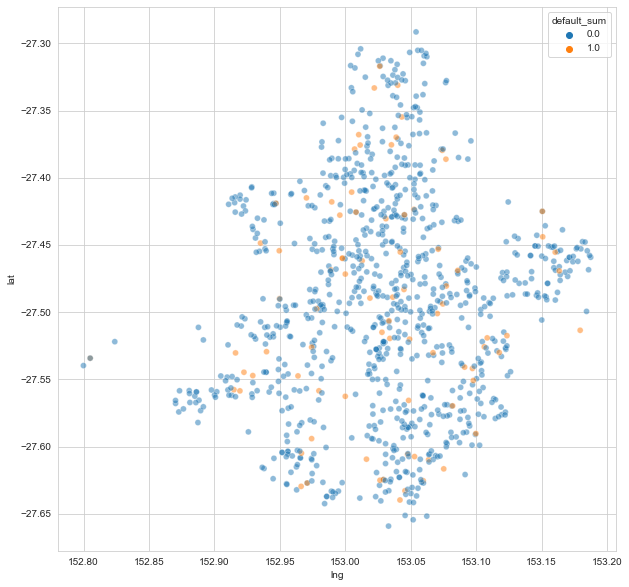
    


```python
pd_residentialAddress_geocoded.groupby('suburb').agg(
    trans_count=('default_sum', 'count'),
    uniqe_addreses=('residentialAddress_clean', 'nunique'),
    default_sum=('default_sum', 'sum')).reset_index().\
assign(dr = lambda x: x['default_sum'] / x['trans_count']).sort_values('dr', ascending=False).head(10)

```


<div>
<style scoped>
    .dataframe tbody tr th:only-of-type {
        vertical-align: middle;
    }

    .dataframe tbody tr th {
        vertical-align: top;
    }

    .dataframe thead th {
        text-align: right;
    }
</style>
<table border="1" class="dataframe">
  <thead>
    <tr style="text-align: right;">
      <th></th>
      <th>suburb</th>
      <th>trans_count</th>
      <th>uniqe_addreses</th>
      <th>default_sum</th>
      <th>dr</th>
    </tr>
  </thead>
  <tbody>
    <tr>
      <th>120</th>
      <td>Pinjarra Hills</td>
      <td>1</td>
      <td>1</td>
      <td>1.0</td>
      <td>1.0</td>
    </tr>
    <tr>
      <th>97</th>
      <td>Middle Park</td>
      <td>1</td>
      <td>1</td>
      <td>1.0</td>
      <td>1.0</td>
    </tr>
    <tr>
      <th>31</th>
      <td>Chandler</td>
      <td>2</td>
      <td>2</td>
      <td>1.0</td>
      <td>0.5</td>
    </tr>
    <tr>
      <th>119</th>
      <td>Petrie Terrace</td>
      <td>2</td>
      <td>2</td>
      <td>1.0</td>
      <td>0.5</td>
    </tr>
    <tr>
      <th>77</th>
      <td>Jindalee</td>
      <td>2</td>
      <td>2</td>
      <td>1.0</td>
      <td>0.5</td>
    </tr>
    <tr>
      <th>129</th>
      <td>Rocklea</td>
      <td>2</td>
      <td>2</td>
      <td>1.0</td>
      <td>0.5</td>
    </tr>
    <tr>
      <th>71</th>
      <td>Highgate Hill</td>
      <td>2</td>
      <td>2</td>
      <td>1.0</td>
      <td>0.5</td>
    </tr>
    <tr>
      <th>134</th>
      <td>Seventeen Mile Rocks</td>
      <td>2</td>
      <td>2</td>
      <td>1.0</td>
      <td>0.5</td>
    </tr>
    <tr>
      <th>144</th>
      <td>Stretton</td>
      <td>4</td>
      <td>4</td>
      <td>2.0</td>
      <td>0.5</td>
    </tr>
    <tr>
      <th>2</th>
      <td>Alderley</td>
      <td>2</td>
      <td>2</td>
      <td>1.0</td>
      <td>0.5</td>
    </tr>
  </tbody>
</table>
</div>


```python
pd_residentialAddress_geocoded.groupby(['suburb','residentialAddress_clean']).agg(
    trans_count=('default_sum', 'count'),
    default=('default_sum', 'mean')).reset_index().sort_values('default').query("suburb=='Stretton'")


```


<div>
<style scoped>
    .dataframe tbody tr th:only-of-type {
        vertical-align: middle;
    }

    .dataframe tbody tr th {
        vertical-align: top;
    }

    .dataframe thead th {
        text-align: right;
    }
</style>
<table border="1" class="dataframe">
  <thead>
    <tr style="text-align: right;">
      <th></th>
      <th>suburb</th>
      <th>residentialAddress_clean</th>
      <th>trans_count</th>
      <th>default</th>
    </tr>
  </thead>
  <tbody>
    <tr>
      <th>731</th>
      <td>Stretton</td>
      <td>Birchwood Place</td>
      <td>1</td>
      <td>0.0</td>
    </tr>
    <tr>
      <th>732</th>
      <td>Stretton</td>
      <td>Compton Road</td>
      <td>1</td>
      <td>0.0</td>
    </tr>
    <tr>
      <th>733</th>
      <td>Stretton</td>
      <td>Oxford Place</td>
      <td>1</td>
      <td>1.0</td>
    </tr>
    <tr>
      <th>734</th>
      <td>Stretton</td>
      <td>The parkway</td>
      <td>1</td>
      <td>1.0</td>
    </tr>
  </tbody>
</table>
</div>


### Analyse if postalAddress is the same as residentialAddress


```python
df_cust_trans.groupby('same_address')['default'].mean()
```


    same_address
    0    0.312876
    1    0.074382
    Name: default, dtype: float64


Default rate is significantly bigger when postalAddress is different then residentialAddress

## Create  "geo risk rating"

rate addreses based on average risk 


```python
df_cust_trans.columns
```


    Index(['customerID', 'sex', 'age', 'residentialAddress', 'postalAddress',
           'income', 'residentialAddress_clean', 'postalAddress_clean',
           'same_address', 'transactionID', 'shopID', 'price', 'paymentStatus1',
           'paymentStatus2', 'paymentStatus3', 'paymentStatus4', 'late', 'default',
           'defualted_payment', 'late_payment_first', 'money_lost', 'fraud',
           'rank', 'default_lag1', 'defualted_payment_lag1', 'money_lost_lag1',
           'late_lag1', 'price_lag1', 'late_payment_first_lag1', 'rank_reverse',
           'hist_trans_count', 'hist_default_sum', 'hist_default_avg',
           'hist_late_sum', 'hist_late_avg', 'hist_price_sum', 'hist_price_avg',
           'default_lst_06_sum', 'defualted_payment_lst_06_sum',
           'money_lost_lst_06_sum', 'late_lst_06_sum', 'price_lst_06_sum',
           'late_payment_first_lst_06_sum', 'default_lst_06_avg',
           'defualted_payment_lst_06_avg', 'money_lost_lst_06_avg',
           'late_lst_06_avg', 'price_lst_06_avg', 'late_payment_first_lst_06_avg',
           'cluster'],
          dtype='object')


```python
_tmp = df_cust_trans.groupby('residentialAddress_clean')[['hist_default_sum','hist_trans_count']]. \
    sum().reset_index().assign(dr = lambda x: x['hist_default_sum']/x['hist_trans_count'])
```


```python
_tmp.dr.hist()
```


    <AxesSubplot:>


    
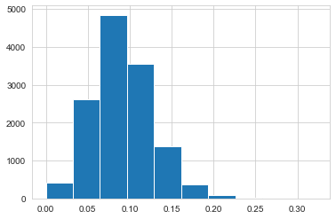
    


```python
np.quantile(_tmp.dr, [i/10 for i in list(range(1,10,2))], axis=0)
```


    array([0.04860437, 0.07142857, 0.08834466, 0.10666667, 0.1372549 ])


```python
bins = [-np.inf, 0.049, 0.071, 0.088, 0.107, 0.137, np.inf]
```


```python
geo_risk_rank = df_cust_trans.groupby('residentialAddress_clean')[['hist_default_sum','hist_trans_count']]. \
    sum().reset_index().assign(geo_risk_rank = lambda x: pd.cut(x['hist_default_sum']/x['hist_trans_count'], bins).cat.codes)

```


```python
df_cust_trans = df_cust_trans.merge(geo_risk_rank[['residentialAddress_clean','geo_risk_rank']], on='residentialAddress_clean', how='left')
```


```python
df_cust_trans
```


<div>
<style scoped>
    .dataframe tbody tr th:only-of-type {
        vertical-align: middle;
    }

    .dataframe tbody tr th {
        vertical-align: top;
    }

    .dataframe thead th {
        text-align: right;
    }
</style>
<table border="1" class="dataframe">
  <thead>
    <tr style="text-align: right;">
      <th></th>
      <th>customerID</th>
      <th>sex</th>
      <th>age</th>
      <th>residentialAddress</th>
      <th>postalAddress</th>
      <th>income</th>
      <th>residentialAddress_clean</th>
      <th>postalAddress_clean</th>
      <th>same_address</th>
      <th>transactionID</th>
      <th>...</th>
      <th>price_lst_06_sum</th>
      <th>late_payment_first_lst_06_sum</th>
      <th>default_lst_06_avg</th>
      <th>defualted_payment_lst_06_avg</th>
      <th>money_lost_lst_06_avg</th>
      <th>late_lst_06_avg</th>
      <th>price_lst_06_avg</th>
      <th>late_payment_first_lst_06_avg</th>
      <th>cluster</th>
      <th>geo_risk_rank</th>
    </tr>
  </thead>
  <tbody>
    <tr>
      <th>0</th>
      <td>1</td>
      <td>male</td>
      <td>25</td>
      <td>28 Irvine Place</td>
      <td>28 Irvine Place</td>
      <td>NaN</td>
      <td>Irvine Place</td>
      <td>Irvine Place</td>
      <td>1</td>
      <td>1697842.0</td>
      <td>...</td>
      <td>358.0</td>
      <td>1.0</td>
      <td>0.000000</td>
      <td>0.000000</td>
      <td>0.00</td>
      <td>0.333333</td>
      <td>119.333333</td>
      <td>0.333333</td>
      <td>1</td>
      <td>4</td>
    </tr>
    <tr>
      <th>1</th>
      <td>2</td>
      <td>male</td>
      <td>19</td>
      <td>72 Bertha Street</td>
      <td>72 Bertha Street</td>
      <td>43200.0</td>
      <td>Bertha Street</td>
      <td>Bertha Street</td>
      <td>1</td>
      <td>1834257.0</td>
      <td>...</td>
      <td>599.0</td>
      <td>2.0</td>
      <td>0.000000</td>
      <td>0.000000</td>
      <td>0.00</td>
      <td>0.333333</td>
      <td>99.833333</td>
      <td>0.333333</td>
      <td>2</td>
      <td>2</td>
    </tr>
    <tr>
      <th>2</th>
      <td>3</td>
      <td>female</td>
      <td>22</td>
      <td>63 Ladberry Street</td>
      <td>63 Ladberry Street</td>
      <td>70200.0</td>
      <td>Ladberry Street</td>
      <td>Ladberry Street</td>
      <td>1</td>
      <td>1974624.0</td>
      <td>...</td>
      <td>577.0</td>
      <td>2.0</td>
      <td>0.166667</td>
      <td>0.333333</td>
      <td>5.50</td>
      <td>0.000000</td>
      <td>96.166667</td>
      <td>0.333333</td>
      <td>-1</td>
      <td>1</td>
    </tr>
    <tr>
      <th>3</th>
      <td>4</td>
      <td>other</td>
      <td>24</td>
      <td>98 Linneman Close</td>
      <td>98 Linneman Close</td>
      <td>93900.0</td>
      <td>Linneman Close</td>
      <td>Linneman Close</td>
      <td>1</td>
      <td>1536291.0</td>
      <td>...</td>
      <td>NaN</td>
      <td>NaN</td>
      <td>NaN</td>
      <td>NaN</td>
      <td>NaN</td>
      <td>NaN</td>
      <td>NaN</td>
      <td>NaN</td>
      <td>4</td>
      <td>3</td>
    </tr>
    <tr>
      <th>4</th>
      <td>5</td>
      <td>male</td>
      <td>53</td>
      <td>56 Salonica Road</td>
      <td>56 Salonica Road</td>
      <td>77000.0</td>
      <td>Salonica Road</td>
      <td>Salonica Road</td>
      <td>1</td>
      <td>661121.0</td>
      <td>...</td>
      <td>289.0</td>
      <td>10.0</td>
      <td>0.500000</td>
      <td>1.750000</td>
      <td>24.25</td>
      <td>0.500000</td>
      <td>72.250000</td>
      <td>2.500000</td>
      <td>2</td>
      <td>4</td>
    </tr>
    <tr>
      <th>...</th>
      <td>...</td>
      <td>...</td>
      <td>...</td>
      <td>...</td>
      <td>...</td>
      <td>...</td>
      <td>...</td>
      <td>...</td>
      <td>...</td>
      <td>...</td>
      <td>...</td>
      <td>...</td>
      <td>...</td>
      <td>...</td>
      <td>...</td>
      <td>...</td>
      <td>...</td>
      <td>...</td>
      <td>...</td>
      <td>...</td>
      <td>...</td>
    </tr>
    <tr>
      <th>490491</th>
      <td>499996</td>
      <td>male</td>
      <td>68</td>
      <td>95 Argyle Parade</td>
      <td>95 Argyle Parade</td>
      <td>40500.0</td>
      <td>Argyle Parade</td>
      <td>Argyle Parade</td>
      <td>1</td>
      <td>665043.0</td>
      <td>...</td>
      <td>173.0</td>
      <td>0.0</td>
      <td>0.000000</td>
      <td>0.000000</td>
      <td>0.00</td>
      <td>0.000000</td>
      <td>173.000000</td>
      <td>0.000000</td>
      <td>-1</td>
      <td>4</td>
    </tr>
    <tr>
      <th>490492</th>
      <td>499997</td>
      <td>female</td>
      <td>22</td>
      <td>34 Bearke Place</td>
      <td>34 Bearke Place</td>
      <td>44900.0</td>
      <td>Bearke Place</td>
      <td>Bearke Place</td>
      <td>1</td>
      <td>1756533.0</td>
      <td>...</td>
      <td>181.0</td>
      <td>0.0</td>
      <td>0.000000</td>
      <td>0.000000</td>
      <td>0.00</td>
      <td>0.000000</td>
      <td>90.500000</td>
      <td>0.000000</td>
      <td>-1</td>
      <td>2</td>
    </tr>
    <tr>
      <th>490493</th>
      <td>499998</td>
      <td>male</td>
      <td>27</td>
      <td>95 Glenhurst Street</td>
      <td>95 Glenhurst Street</td>
      <td>48700.0</td>
      <td>Glenhurst Street</td>
      <td>Glenhurst Street</td>
      <td>1</td>
      <td>1628579.0</td>
      <td>...</td>
      <td>354.0</td>
      <td>0.0</td>
      <td>0.000000</td>
      <td>0.000000</td>
      <td>0.00</td>
      <td>0.000000</td>
      <td>88.500000</td>
      <td>0.000000</td>
      <td>4</td>
      <td>0</td>
    </tr>
    <tr>
      <th>490494</th>
      <td>499999</td>
      <td>male</td>
      <td>55</td>
      <td>34 Kiandra Close</td>
      <td>34 Kiandra Close</td>
      <td>7600.0</td>
      <td>Kiandra Close</td>
      <td>Kiandra Close</td>
      <td>1</td>
      <td>1722718.0</td>
      <td>...</td>
      <td>664.0</td>
      <td>0.0</td>
      <td>0.000000</td>
      <td>0.000000</td>
      <td>0.00</td>
      <td>0.000000</td>
      <td>132.800000</td>
      <td>0.000000</td>
      <td>-1</td>
      <td>1</td>
    </tr>
    <tr>
      <th>490495</th>
      <td>500000</td>
      <td>female</td>
      <td>42</td>
      <td>46 Altola Street</td>
      <td>46 Altola Street</td>
      <td>84700.0</td>
      <td>Altola Street</td>
      <td>Altola Street</td>
      <td>1</td>
      <td>1591096.0</td>
      <td>...</td>
      <td>20.0</td>
      <td>0.0</td>
      <td>0.000000</td>
      <td>0.000000</td>
      <td>0.00</td>
      <td>0.000000</td>
      <td>20.000000</td>
      <td>0.000000</td>
      <td>0</td>
      <td>1</td>
    </tr>
  </tbody>
</table>
<p>490496 rows × 51 columns</p>
</div>


# Model - initial model only to get intuition about model features


```python
categorical_cols = ['sex', 'residentialAddress_clean','postalAddress_clean',
                    'geo_risk_rank', 'shopID',
                    'same_address']
numerical_cols = ['age', 'income', 'price'] + \
    df_cust_trans.filter(regex='(^hist_)|(_lst_)').columns.to_list()

target_def = 'default'
target_late = 'late'
```


```python
[i for i in categorical_cols if i not in df_cust_trans.columns]
```


    []


```python
[i for i in numerical_cols if i not in df_cust_trans.columns]
```


    []


```python
import numpy as np
from category_encoders import *

from sklearn.feature_extraction.text import TfidfVectorizer
from sklearn.compose import ColumnTransformer
from sklearn.pipeline import make_pipeline
from sklearn import metrics

import lightgbm as lgb
```


```python
pipe = ColumnTransformer([
        ('num','passthrough',numerical_cols),
        ('te', WOEEncoder(), categorical_cols),
    ])
```


```python
#df_cust_trans_new_cust = df_cust_trans.loc[df_cust_trans['rank']==1].reset_index(drop=True)
#df_cust_trans_old_cust = df_cust_trans.loc[df_cust_trans['rank']>1].reset_index(drop=True)
```


```python
#df_tr_cust_trans_new_cust = pipe_new.fit_transform(df_cust_trans_new_cust, df_cust_trans_new_cust.default)
#df_tr_cust_trans_old_cust= pipe_old.fit_transform(df_cust_trans_old_cust, df_cust_trans_old_cust.default)

```


```python
df_tr_cust_trans = pipe.fit_transform(df_cust_trans, df_cust_trans.default)
```


```python
d_train = lgb.Dataset(
    df_tr_cust_trans, 
    label=df_cust_trans.default, 
    feature_name=pipe.get_feature_names())
```


```python
lgb_params = {#"learning_rate": 0.01,
              #"num_leaves": 16,
              #"min_data_in_leaf": 20,
              #"max_depth": 20,
              #"boosting": "gbdt",
              "num_iterations": 500,
              #"bagging_fraction": 0.6,
              #"feature_fraction": 1.0,
              "seed": 42,
              "num_threads": -1,
              "objective": "binary", 
              "metric": "auc"
              }
```


```python
cv_results = lgb.cv(lgb_params, d_train, nfold=5, verbose_eval=20, early_stopping_rounds=40)
```

    /Users/xszpo/miniconda3/envs/viabill/lib/python3.8/site-packages/lightgbm/engine.py:527: UserWarning: Found `num_iterations` in params. Will use it instead of argument
      _log_warning("Found `{}` in params. Will use it instead of argument".format(alias))


    [LightGBM] [Info] Number of positive: 35688, number of negative: 356708
    [LightGBM] [Warning] Auto-choosing col-wise multi-threading, the overhead of testing was 0.247507 seconds.
    You can set `force_col_wise=true` to remove the overhead.
    [LightGBM] [Info] Total Bins 2897
    [LightGBM] [Info] Number of data points in the train set: 392396, number of used features: 27
    [LightGBM] [Info] Number of positive: 35688, number of negative: 356709
    [LightGBM] [Warning] Auto-choosing row-wise multi-threading, the overhead of testing was 0.048694 seconds.
    You can set `force_row_wise=true` to remove the overhead.
    And if memory is not enough, you can set `force_col_wise=true`.
    [LightGBM] [Info] Total Bins 2897
    [LightGBM] [Info] Number of data points in the train set: 392397, number of used features: 27
    [LightGBM] [Info] Number of positive: 35688, number of negative: 356709
    [LightGBM] [Warning] Auto-choosing col-wise multi-threading, the overhead of testing was 0.240543 seconds.
    You can set `force_col_wise=true` to remove the overhead.
    [LightGBM] [Info] Total Bins 2897
    [LightGBM] [Info] Number of data points in the train set: 392397, number of used features: 27
    [LightGBM] [Info] Number of positive: 35688, number of negative: 356709
    [LightGBM] [Warning] Auto-choosing row-wise multi-threading, the overhead of testing was 0.057509 seconds.
    You can set `force_row_wise=true` to remove the overhead.
    And if memory is not enough, you can set `force_col_wise=true`.
    [LightGBM] [Info] Total Bins 2897
    [LightGBM] [Info] Number of data points in the train set: 392397, number of used features: 27
    [LightGBM] [Info] Number of positive: 35688, number of negative: 356709
    [LightGBM] [Warning] Auto-choosing row-wise multi-threading, the overhead of testing was 0.043395 seconds.
    You can set `force_row_wise=true` to remove the overhead.
    And if memory is not enough, you can set `force_col_wise=true`.
    [LightGBM] [Info] Total Bins 2897
    [LightGBM] [Info] Number of data points in the train set: 392397, number of used features: 27
    [LightGBM] [Info] [binary:BoostFromScore]: pavg=0.090949 -> initscore=-2.302103
    [LightGBM] [Info] Start training from score -2.302103
    [LightGBM] [Info] [binary:BoostFromScore]: pavg=0.090949 -> initscore=-2.302106
    [LightGBM] [Info] Start training from score -2.302106
    [LightGBM] [Info] [binary:BoostFromScore]: pavg=0.090949 -> initscore=-2.302106
    [LightGBM] [Info] Start training from score -2.302106
    [LightGBM] [Info] [binary:BoostFromScore]: pavg=0.090949 -> initscore=-2.302106
    [LightGBM] [Info] Start training from score -2.302106
    [LightGBM] [Info] [binary:BoostFromScore]: pavg=0.090949 -> initscore=-2.302106
    [LightGBM] [Info] Start training from score -2.302106
    [20]	cv_agg's auc: 0.735241 + 0.00105435
    [40]	cv_agg's auc: 0.735533 + 0.000946371
    [60]	cv_agg's auc: 0.735293 + 0.000890795


```python
model= lgb.train(lgb_params, d_train)
fig, ax2 = plt.subplots(figsize=(10,10))
lgb.plot_importance(model, max_num_features=15, ax=ax2, importance_type = 'gain')
```

    /Users/xszpo/miniconda3/envs/viabill/lib/python3.8/site-packages/lightgbm/engine.py:148: UserWarning: Found `num_iterations` in params. Will use it instead of argument
      _log_warning("Found `{}` in params. Will use it instead of argument".format(alias))


    [LightGBM] [Info] Number of positive: 44610, number of negative: 445886
    [LightGBM] [Warning] Auto-choosing row-wise multi-threading, the overhead of testing was 0.053195 seconds.
    You can set `force_row_wise=true` to remove the overhead.
    And if memory is not enough, you can set `force_col_wise=true`.
    [LightGBM] [Info] Total Bins 2897
    [LightGBM] [Info] Number of data points in the train set: 490496, number of used features: 27
    [LightGBM] [Info] [binary:BoostFromScore]: pavg=0.090949 -> initscore=-2.302105
    [LightGBM] [Info] Start training from score -2.302105


    <AxesSubplot:title={'center':'Feature importance'}, xlabel='Feature importance', ylabel='Features'>


    
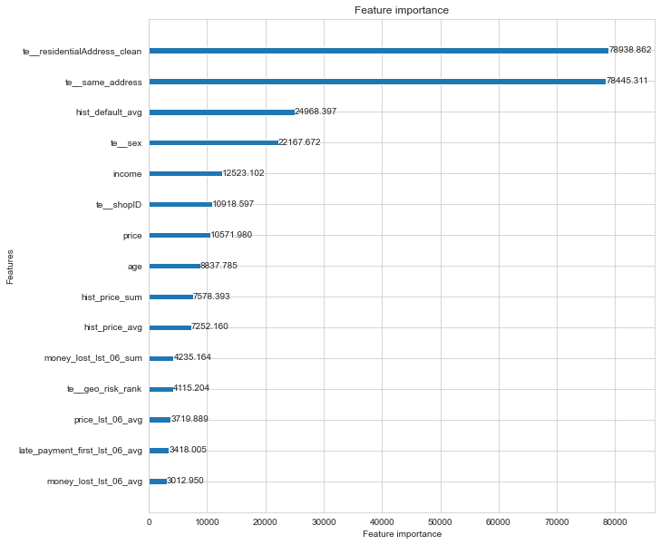
    

