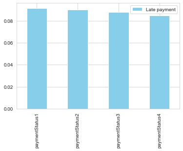

# Description

Look for any data relational patterns and things that would be helpful in understanding the data and customer behavior.

# Prepare data 


```python
import numpy as np
import pandas as pd
import re
import seaborn as sns
import matplotlib.pyplot as plt 
from scipy.stats import chi2_contingency
import geocoder
import statistics

from sklearn.preprocessing import MinMaxScaler, StandardScaler

```


```python
%reload_kedro
```

    /Users/xszpo/miniconda3/envs/viabill/lib/python3.8/site-packages/kedro/framework/project/__init__.py:133: UserWarning: Found duplicate pipeline entries. The following will be overwritten: __default__
      warn(


```python
df_cust = catalog.load("customers")
d_sex = {1: 'male', 2:'female', 0: 'other'}
df_cust.sex = df_cust.sex.apply(lambda x: d_sex[x])

df_cust['residentialAddress_clean'] = df_cust.residentialAddress.apply(lambda x: re.sub(r'[0-9]+', '', x))
df_cust['postalAddress_clean']  = df_cust.postalAddress.apply(lambda x: re.sub(r'[0-9]+', '', x) if x==x else '')
df_cust['same_address'] = (df_cust.residentialAddress==df_cust.postalAddress).astype(int)

```

## Perform some basic future engineering


```python
df_trans = catalog.load("transactions")
df_trans['late'] = df_trans.filter(regex='payment').apply(lambda x: x==1).any(axis=1).astype(int)
df_trans['default'] = df_trans.filter(regex='payment').apply(lambda x: x==2).any(axis=1).astype(int)

df_trans["defualted_payment"] = df_trans.replace({
    'paymentStatus1': {1: 0, 2: 1},
    'paymentStatus2': {1: 0, 2: 2},
    'paymentStatus3': {1: 0, 2: 3},
    'paymentStatus4': {1: 0, 2: 4},
}).filter(regex='payment').replace({0: np.nan}).min(axis=1).fillna(0)

df_trans["late_payment_first"] = df_trans.replace({
    'paymentStatus1': {1: 1, 2: 0},
    'paymentStatus2': {1: 2, 2: 0},
    'paymentStatus3': {1: 3, 2: 0},
    'paymentStatus4': {1: 4, 2: 0},
}).filter(regex='payment').replace({0: np.nan}).min(axis=1).fillna(0)
```


```python
df_trans = df_trans.assign(
    money_lost = lambda x: x.apply(
        lambda y:y['price'] * (5-y['defualted_payment'])/4 if y['defualted_payment']>0 else 0, axis=1
    )
)
```


```python
print(f"""
Numer of rows in 'customers' table - {df_cust.shape[0]/1000:.0f} K.
Numer of columns in 'customers' table - {df_cust.shape[1]}.

Numer of rows in 'transactions' table - {df_trans.shape[0]/1000000:.0f} M.
Numer of columns in 'transactions' table - {df_trans.shape[1]}.

Numer of uniqe customers in 'customers' table - {len(df_cust.customerID.unique())/1000:.0f} K.
Numer of uniqe customers in 'transactions' table - {len(df_trans.customerID.unique())/1000:.0f} K.
""")
```

    
    Numer of rows in 'customers' table - 500 K.
    Numer of columns in 'customers' table - 9.
    
    Numer of rows in 'transactions' table - 2 M.
    Numer of columns in 'transactions' table - 13.
    
    Numer of uniqe customers in 'customers' table - 500 K.
    Numer of uniqe customers in 'transactions' table - 491 K.
    


## Perform some basic quality check

Check if rows in data in Customer and Transactions tables are not duplicated


```python
if df_cust.customerID.nunique() == df_cust.shape[0]:
    print("Data in Customer table are NOT duplicated.")
else:
    print("Data in Customer table ARE duplicated.")
```

    Data in Customer table are NOT duplicated.


```python
if df_trans.transactionID.nunique() == df_trans.shape[0]:
    print("Data in Transactions table are NOT duplicated.")
else:
    print("Data in Transactions table ARE duplicated.")
```

    Data in Transactions table are NOT duplicated.


# Analyze the data

## Customers table


```python
df_cust.head()
```


<div>
<style scoped>
    .dataframe tbody tr th:only-of-type {
        vertical-align: middle;
    }

    .dataframe tbody tr th {
        vertical-align: top;
    }

    .dataframe thead th {
        text-align: right;
    }
</style>
<table border="1" class="dataframe">
  <thead>
    <tr style="text-align: right;">
      <th></th>
      <th>customerID</th>
      <th>sex</th>
      <th>age</th>
      <th>residentialAddress</th>
      <th>postalAddress</th>
      <th>income</th>
      <th>residentialAddress_clean</th>
      <th>postalAddress_clean</th>
      <th>same_address</th>
    </tr>
  </thead>
  <tbody>
    <tr>
      <th>0</th>
      <td>1</td>
      <td>male</td>
      <td>25</td>
      <td>28 Irvine Place</td>
      <td>28 Irvine Place</td>
      <td>NaN</td>
      <td>Irvine Place</td>
      <td>Irvine Place</td>
      <td>1</td>
    </tr>
    <tr>
      <th>1</th>
      <td>2</td>
      <td>male</td>
      <td>19</td>
      <td>72 Bertha Street</td>
      <td>72 Bertha Street</td>
      <td>43200.0</td>
      <td>Bertha Street</td>
      <td>Bertha Street</td>
      <td>1</td>
    </tr>
    <tr>
      <th>2</th>
      <td>3</td>
      <td>female</td>
      <td>22</td>
      <td>63 Ladberry Street</td>
      <td>63 Ladberry Street</td>
      <td>70200.0</td>
      <td>Ladberry Street</td>
      <td>Ladberry Street</td>
      <td>1</td>
    </tr>
    <tr>
      <th>3</th>
      <td>4</td>
      <td>other</td>
      <td>24</td>
      <td>98 Linneman Close</td>
      <td>98 Linneman Close</td>
      <td>93900.0</td>
      <td>Linneman Close</td>
      <td>Linneman Close</td>
      <td>1</td>
    </tr>
    <tr>
      <th>4</th>
      <td>5</td>
      <td>male</td>
      <td>53</td>
      <td>56 Salonica Road</td>
      <td>56 Salonica Road</td>
      <td>77000.0</td>
      <td>Salonica Road</td>
      <td>Salonica Road</td>
      <td>1</td>
    </tr>
  </tbody>
</table>
</div>


```python
df_cust.describe().T.style.format({'mean': '{:.2f}'})
```


<style  type="text/css" >
</style><table id="T_a5f71_" ><thead>    <tr>        <th class="blank level0" ></th>        <th class="col_heading level0 col0" >count</th>        <th class="col_heading level0 col1" >mean</th>        <th class="col_heading level0 col2" >std</th>        <th class="col_heading level0 col3" >min</th>        <th class="col_heading level0 col4" >25%</th>        <th class="col_heading level0 col5" >50%</th>        <th class="col_heading level0 col6" >75%</th>        <th class="col_heading level0 col7" >max</th>    </tr></thead><tbody>
                <tr>
                        <th id="T_a5f71_level0_row0" class="row_heading level0 row0" >customerID</th>
                        <td id="T_a5f71_row0_col0" class="data row0 col0" >500000.000000</td>
                        <td id="T_a5f71_row0_col1" class="data row0 col1" >250000.50</td>
                        <td id="T_a5f71_row0_col2" class="data row0 col2" >144337.711635</td>
                        <td id="T_a5f71_row0_col3" class="data row0 col3" >1.000000</td>
                        <td id="T_a5f71_row0_col4" class="data row0 col4" >125000.750000</td>
                        <td id="T_a5f71_row0_col5" class="data row0 col5" >250000.500000</td>
                        <td id="T_a5f71_row0_col6" class="data row0 col6" >375000.250000</td>
                        <td id="T_a5f71_row0_col7" class="data row0 col7" >500000.000000</td>
            </tr>
            <tr>
                        <th id="T_a5f71_level0_row1" class="row_heading level0 row1" >age</th>
                        <td id="T_a5f71_row1_col0" class="data row1 col0" >500000.000000</td>
                        <td id="T_a5f71_row1_col1" class="data row1 col1" >44.63</td>
                        <td id="T_a5f71_row1_col2" class="data row1 col2" >16.178283</td>
                        <td id="T_a5f71_row1_col3" class="data row1 col3" >5.000000</td>
                        <td id="T_a5f71_row1_col4" class="data row1 col4" >27.000000</td>
                        <td id="T_a5f71_row1_col5" class="data row1 col5" >50.000000</td>
                        <td id="T_a5f71_row1_col6" class="data row1 col6" >58.000000</td>
                        <td id="T_a5f71_row1_col7" class="data row1 col7" >90.000000</td>
            </tr>
            <tr>
                        <th id="T_a5f71_level0_row2" class="row_heading level0 row2" >income</th>
                        <td id="T_a5f71_row2_col0" class="data row2 col0" >490025.000000</td>
                        <td id="T_a5f71_row2_col1" class="data row2 col1" >50000.04</td>
                        <td id="T_a5f71_row2_col2" class="data row2 col2" >28899.119696</td>
                        <td id="T_a5f71_row2_col3" class="data row2 col3" >0.000000</td>
                        <td id="T_a5f71_row2_col4" class="data row2 col4" >25000.000000</td>
                        <td id="T_a5f71_row2_col5" class="data row2 col5" >50000.000000</td>
                        <td id="T_a5f71_row2_col6" class="data row2 col6" >75000.000000</td>
                        <td id="T_a5f71_row2_col7" class="data row2 col7" >100000.000000</td>
            </tr>
            <tr>
                        <th id="T_a5f71_level0_row3" class="row_heading level0 row3" >same_address</th>
                        <td id="T_a5f71_row3_col0" class="data row3 col0" >500000.000000</td>
                        <td id="T_a5f71_row3_col1" class="data row3 col1" >0.93</td>
                        <td id="T_a5f71_row3_col2" class="data row3 col2" >0.254364</td>
                        <td id="T_a5f71_row3_col3" class="data row3 col3" >0.000000</td>
                        <td id="T_a5f71_row3_col4" class="data row3 col4" >1.000000</td>
                        <td id="T_a5f71_row3_col5" class="data row3 col5" >1.000000</td>
                        <td id="T_a5f71_row3_col6" class="data row3 col6" >1.000000</td>
                        <td id="T_a5f71_row3_col7" class="data row3 col7" >1.000000</td>
            </tr>
    </tbody></table>


```python
print("Nulls percentage:")
(df_cust.replace('',np.nan).isna().sum()/ df_cust.shape[0]).map(lambda x:'{:.2f}%'.format(x*100))
```

    Nulls percentage:


    customerID                  0.00%
    sex                         0.00%
    age                         0.00%
    residentialAddress          0.00%
    postalAddress               2.02%
    income                      1.99%
    residentialAddress_clean    0.00%
    postalAddress_clean         2.02%
    same_address                0.00%
    dtype: object


```python
%matplotlib inline
df_cust[['age','income']].hist(bins=50, figsize=(15,5)) 
plt.show()
```


    

    


* there are two customer segments, given age: ~25 years, ~55 years, 


### sex vs age


```python
%matplotlib inline
fig, ax = plt.subplots(figsize=(7,5))
sns.histplot(df_cust, x="age", hue="sex", ax=ax, alpha=0.5, bins=20, element="step", stat="probability", common_norm=False)
plt.show()
```


    

    


```python
_tmp = pd.crosstab(df_cust.sex, pd.cut(df_cust.age, 7), rownames=['sex'], colnames=['age'])
_tmp.style.background_gradient(cmap ='Blues',axis=1)

```


<style  type="text/css" >
#T_ec986_row0_col0,#T_ec986_row1_col0,#T_ec986_row2_col0{
            background-color:  #eef5fc;
            color:  #000000;
        }#T_ec986_row0_col1{
            background-color:  #084c95;
            color:  #f1f1f1;
        }#T_ec986_row0_col2{
            background-color:  #d5e5f4;
            color:  #000000;
        }#T_ec986_row0_col3{
            background-color:  #1967ad;
            color:  #f1f1f1;
        }#T_ec986_row0_col4,#T_ec986_row1_col4,#T_ec986_row2_col4{
            background-color:  #08306b;
            color:  #f1f1f1;
        }#T_ec986_row0_col5,#T_ec986_row2_col5{
            background-color:  #d3e3f3;
            color:  #000000;
        }#T_ec986_row0_col6,#T_ec986_row1_col6,#T_ec986_row2_col6{
            background-color:  #f7fbff;
            color:  #000000;
        }#T_ec986_row1_col1{
            background-color:  #084990;
            color:  #f1f1f1;
        }#T_ec986_row1_col2{
            background-color:  #d3e4f3;
            color:  #000000;
        }#T_ec986_row1_col3{
            background-color:  #1966ad;
            color:  #f1f1f1;
        }#T_ec986_row1_col5{
            background-color:  #d2e3f3;
            color:  #000000;
        }#T_ec986_row2_col1{
            background-color:  #084a91;
            color:  #f1f1f1;
        }#T_ec986_row2_col2{
            background-color:  #d6e5f4;
            color:  #000000;
        }#T_ec986_row2_col3{
            background-color:  #1865ac;
            color:  #f1f1f1;
        }</style><table id="T_ec986_" ><thead>    <tr>        <th class="index_name level0" >age</th>        <th class="col_heading level0 col0" >(4.915, 17.143]</th>        <th class="col_heading level0 col1" >(17.143, 29.286]</th>        <th class="col_heading level0 col2" >(29.286, 41.429]</th>        <th class="col_heading level0 col3" >(41.429, 53.571]</th>        <th class="col_heading level0 col4" >(53.571, 65.714]</th>        <th class="col_heading level0 col5" >(65.714, 77.857]</th>        <th class="col_heading level0 col6" >(77.857, 90.0]</th>    </tr>    <tr>        <th class="index_name level0" >sex</th>        <th class="blank" ></th>        <th class="blank" ></th>        <th class="blank" ></th>        <th class="blank" ></th>        <th class="blank" ></th>        <th class="blank" ></th>        <th class="blank" ></th>    </tr></thead><tbody>
                <tr>
                        <th id="T_ec986_level0_row0" class="row_heading level0 row0" >female</th>
                        <td id="T_ec986_row0_col0" class="data row0 col0" >1778</td>
                        <td id="T_ec986_row0_col1" class="data row0 col1" >28840</td>
                        <td id="T_ec986_row0_col2" class="data row0 col2" >5806</td>
                        <td id="T_ec986_row0_col3" class="data row0 col3" >25381</td>
                        <td id="T_ec986_row0_col4" class="data row0 col4" >32238</td>
                        <td id="T_ec986_row0_col5" class="data row0 col5" >6095</td>
                        <td id="T_ec986_row0_col6" class="data row0 col6" >190</td>
            </tr>
            <tr>
                        <th id="T_ec986_level0_row1" class="row_heading level0 row1" >male</th>
                        <td id="T_ec986_row1_col0" class="data row1 col0" >6574</td>
                        <td id="T_ec986_row1_col1" class="data row1 col1" >108134</td>
                        <td id="T_ec986_row1_col2" class="data row1 col2" >22081</td>
                        <td id="T_ec986_row1_col3" class="data row1 col3" >94778</td>
                        <td id="T_ec986_row1_col4" class="data row1 col4" >119441</td>
                        <td id="T_ec986_row1_col5" class="data row1 col5" >22950</td>
                        <td id="T_ec986_row1_col6" class="data row1 col6" >587</td>
            </tr>
            <tr>
                        <th id="T_ec986_level0_row2" class="row_heading level0 row2" >other</th>
                        <td id="T_ec986_row2_col0" class="data row2 col0" >438</td>
                        <td id="T_ec986_row2_col1" class="data row2 col1" >7246</td>
                        <td id="T_ec986_row2_col2" class="data row2 col2" >1408</td>
                        <td id="T_ec986_row2_col3" class="data row2 col3" >6409</td>
                        <td id="T_ec986_row2_col4" class="data row2 col4" >8053</td>
                        <td id="T_ec986_row2_col5" class="data row2 col5" >1532</td>
                        <td id="T_ec986_row2_col6" class="data row2 col6" >41</td>
            </tr>
    </tbody></table>


```python
# Tests whether two categorical variables are related or independent.
# assumptions:
# * Observations used in the calculation of the contingency table are independent.
# 25 or more examples in each cell of the contingency table.
#H0: the two samples are independent.
#H1: there is a dependency between the samples.

table = [_tmp.values]
stat, p, dof, expected = chi2_contingency(table)
print('stat=%.3f, p=%.3f' % (stat, p))
if p > 0.05:
    print('Probably independent')
else:
    print('Probably dependent')
```

    stat=12.594, p=0.399
    Probably independent


Sex and age are probably independent

### sex vs income


```python
%matplotlib inline

def move_legend(ax, new_loc, **kws):
    old_legend = ax.legend_
    handles = old_legend.legendHandles
    labels = [t.get_text() for t in old_legend.get_texts()]
    title = old_legend.get_title().get_text()
    ax.legend(handles, labels, loc=new_loc, title=title, **kws)
    
fig, ax = plt.subplots(figsize=(7,5))
g = sns.histplot(df_cust, x="income", hue="sex", ax=ax, alpha=0.5, bins=5, 
             element="step", stat="probability", common_norm=False)

move_legend(ax, 4)

```


    

    


```python
_tmp = pd.crosstab(df_cust.sex, pd.cut(df_cust.income, 5), rownames=['sex'], colnames=['income'])
_tmp.style.background_gradient(cmap ='Blues',axis=1)
```


<style  type="text/css" >
#T_71b53_row0_col0{
            background-color:  #6fb0d7;
            color:  #000000;
        }#T_71b53_row0_col1{
            background-color:  #add0e6;
            color:  #000000;
        }#T_71b53_row0_col2,#T_71b53_row1_col4,#T_71b53_row2_col0{
            background-color:  #f7fbff;
            color:  #000000;
        }#T_71b53_row0_col3{
            background-color:  #529dcc;
            color:  #000000;
        }#T_71b53_row0_col4,#T_71b53_row1_col0,#T_71b53_row2_col1{
            background-color:  #08306b;
            color:  #f1f1f1;
        }#T_71b53_row1_col1{
            background-color:  #e6f0f9;
            color:  #000000;
        }#T_71b53_row1_col2{
            background-color:  #084f99;
            color:  #f1f1f1;
        }#T_71b53_row1_col3{
            background-color:  #eef5fc;
            color:  #000000;
        }#T_71b53_row2_col2{
            background-color:  #0b559f;
            color:  #f1f1f1;
        }#T_71b53_row2_col3{
            background-color:  #cde0f1;
            color:  #000000;
        }#T_71b53_row2_col4{
            background-color:  #71b1d7;
            color:  #000000;
        }</style><table id="T_71b53_" ><thead>    <tr>        <th class="index_name level0" >income</th>        <th class="col_heading level0 col0" >(-100.0, 20000.0]</th>        <th class="col_heading level0 col1" >(20000.0, 40000.0]</th>        <th class="col_heading level0 col2" >(40000.0, 60000.0]</th>        <th class="col_heading level0 col3" >(60000.0, 80000.0]</th>        <th class="col_heading level0 col4" >(80000.0, 100000.0]</th>    </tr>    <tr>        <th class="index_name level0" >sex</th>        <th class="blank" ></th>        <th class="blank" ></th>        <th class="blank" ></th>        <th class="blank" ></th>        <th class="blank" ></th>    </tr></thead><tbody>
                <tr>
                        <th id="T_71b53_level0_row0" class="row_heading level0 row0" >female</th>
                        <td id="T_71b53_row0_col0" class="data row0 col0" >19683</td>
                        <td id="T_71b53_row0_col1" class="data row0 col1" >19591</td>
                        <td id="T_71b53_row0_col2" class="data row0 col2" >19400</td>
                        <td id="T_71b53_row0_col3" class="data row0 col3" >19731</td>
                        <td id="T_71b53_row0_col4" class="data row0 col4" >19976</td>
            </tr>
            <tr>
                        <th id="T_71b53_level0_row1" class="row_heading level0 row1" >male</th>
                        <td id="T_71b53_row1_col0" class="data row1 col0" >73967</td>
                        <td id="T_71b53_row1_col1" class="data row1 col1" >73099</td>
                        <td id="T_71b53_row1_col2" class="data row1 col2" >73852</td>
                        <td id="T_71b53_row1_col3" class="data row1 col3" >73061</td>
                        <td id="T_71b53_row1_col4" class="data row1 col4" >73017</td>
            </tr>
            <tr>
                        <th id="T_71b53_level0_row2" class="row_heading level0 row2" >other</th>
                        <td id="T_71b53_row2_col0" class="data row2 col0" >4879</td>
                        <td id="T_71b53_row2_col1" class="data row2 col1" >4978</td>
                        <td id="T_71b53_row2_col2" class="data row2 col2" >4964</td>
                        <td id="T_71b53_row2_col3" class="data row2 col3" >4900</td>
                        <td id="T_71b53_row2_col4" class="data row2 col4" >4927</td>
            </tr>
    </tbody></table>


```python
#Chi-Squared Test
table = [_tmp.values]
stat, p, dof, expected = chi2_contingency(table)
print('stat=%.3f, p=%.3f' % (stat, p))
if p > 0.05:
    print('Probably independent')
else:
    print('Probably dependent')
```

    stat=16.843, p=0.032
    Probably dependent


There may be dependency between sex and income, 

### age vs income


```python
from pandas.plotting import scatter_matrix
```


```python
%matplotlib inline
attributes = ['age','income']
scatter_matrix(df_cust[attributes].fillna(-999), figsize=(8, 6))
plt.show()
```


    

    


```python
_tmp = pd.crosstab(pd.cut(df_cust.fillna(-999).income, 7), pd.cut(df_cust.age, 7), rownames=['income'], colnames=['age'])
_tmp.style.background_gradient(cmap ='Blues',axis=1)
```


<style  type="text/css" >
#T_bce0c_row0_col0,#T_bce0c_row2_col0,#T_bce0c_row3_col0,#T_bce0c_row4_col0{
            background-color:  #eef5fc;
            color:  #000000;
        }#T_bce0c_row0_col1,#T_bce0c_row2_col1,#T_bce0c_row6_col1{
            background-color:  #084990;
            color:  #f1f1f1;
        }#T_bce0c_row0_col2,#T_bce0c_row2_col2,#T_bce0c_row4_col2,#T_bce0c_row5_col2{
            background-color:  #d4e4f4;
            color:  #000000;
        }#T_bce0c_row0_col3,#T_bce0c_row1_col3{
            background-color:  #1764ab;
            color:  #f1f1f1;
        }#T_bce0c_row0_col4,#T_bce0c_row1_col4,#T_bce0c_row2_col4,#T_bce0c_row3_col4,#T_bce0c_row4_col4,#T_bce0c_row5_col4,#T_bce0c_row6_col4{
            background-color:  #08306b;
            color:  #f1f1f1;
        }#T_bce0c_row0_col5,#T_bce0c_row1_col5,#T_bce0c_row6_col5{
            background-color:  #d2e3f3;
            color:  #000000;
        }#T_bce0c_row0_col6,#T_bce0c_row1_col6,#T_bce0c_row2_col6,#T_bce0c_row3_col6,#T_bce0c_row4_col6,#T_bce0c_row5_col6,#T_bce0c_row6_col6{
            background-color:  #f7fbff;
            color:  #000000;
        }#T_bce0c_row1_col0,#T_bce0c_row5_col0,#T_bce0c_row6_col0{
            background-color:  #edf4fc;
            color:  #000000;
        }#T_bce0c_row1_col1{
            background-color:  #08478d;
            color:  #f1f1f1;
        }#T_bce0c_row1_col2,#T_bce0c_row2_col5,#T_bce0c_row3_col5,#T_bce0c_row5_col5{
            background-color:  #d3e3f3;
            color:  #000000;
        }#T_bce0c_row2_col3{
            background-color:  #1865ac;
            color:  #f1f1f1;
        }#T_bce0c_row3_col1{
            background-color:  #08488e;
            color:  #f1f1f1;
        }#T_bce0c_row3_col2{
            background-color:  #d5e5f4;
            color:  #000000;
        }#T_bce0c_row3_col3{
            background-color:  #1c6bb0;
            color:  #f1f1f1;
        }#T_bce0c_row4_col1{
            background-color:  #084a91;
            color:  #f1f1f1;
        }#T_bce0c_row4_col3{
            background-color:  #1a68ae;
            color:  #f1f1f1;
        }#T_bce0c_row4_col5,#T_bce0c_row6_col2{
            background-color:  #d3e4f3;
            color:  #000000;
        }#T_bce0c_row5_col1{
            background-color:  #084e98;
            color:  #f1f1f1;
        }#T_bce0c_row5_col3{
            background-color:  #1966ad;
            color:  #f1f1f1;
        }#T_bce0c_row6_col3{
            background-color:  #1663aa;
            color:  #f1f1f1;
        }</style><table id="T_bce0c_" ><thead>    <tr>        <th class="index_name level0" >age</th>        <th class="col_heading level0 col0" >(4.915, 17.143]</th>        <th class="col_heading level0 col1" >(17.143, 29.286]</th>        <th class="col_heading level0 col2" >(29.286, 41.429]</th>        <th class="col_heading level0 col3" >(41.429, 53.571]</th>        <th class="col_heading level0 col4" >(53.571, 65.714]</th>        <th class="col_heading level0 col5" >(65.714, 77.857]</th>        <th class="col_heading level0 col6" >(77.857, 90.0]</th>    </tr>    <tr>        <th class="index_name level0" >income</th>        <th class="blank" ></th>        <th class="blank" ></th>        <th class="blank" ></th>        <th class="blank" ></th>        <th class="blank" ></th>        <th class="blank" ></th>        <th class="blank" ></th>    </tr></thead><tbody>
                <tr>
                        <th id="T_bce0c_level0_row0" class="row_heading level0 row0" >(-1099.999, 13429.429]</th>
                        <td id="T_bce0c_row0_col0" class="data row0 col0" >1324</td>
                        <td id="T_bce0c_row0_col1" class="data row0 col1" >21957</td>
                        <td id="T_bce0c_row0_col2" class="data row0 col2" >4434</td>
                        <td id="T_bce0c_row0_col3" class="data row0 col3" >19351</td>
                        <td id="T_bce0c_row0_col4" class="data row0 col4" >24249</td>
                        <td id="T_bce0c_row0_col5" class="data row0 col5" >4669</td>
                        <td id="T_bce0c_row0_col6" class="data row0 col6" >120</td>
            </tr>
            <tr>
                        <th id="T_bce0c_level0_row1" class="row_heading level0 row1" >(13429.429, 27857.857]</th>
                        <td id="T_bce0c_row1_col0" class="data row1 col0" >1244</td>
                        <td id="T_bce0c_row1_col1" class="data row1 col1" >20311</td>
                        <td id="T_bce0c_row1_col2" class="data row1 col2" >4188</td>
                        <td id="T_bce0c_row1_col3" class="data row1 col3" >17871</td>
                        <td id="T_bce0c_row1_col4" class="data row1 col4" >22293</td>
                        <td id="T_bce0c_row1_col5" class="data row1 col5" >4348</td>
                        <td id="T_bce0c_row1_col6" class="data row1 col6" >113</td>
            </tr>
            <tr>
                        <th id="T_bce0c_level0_row2" class="row_heading level0 row2" >(27857.857, 42286.286]</th>
                        <td id="T_bce0c_row2_col0" class="data row2 col0" >1238</td>
                        <td id="T_bce0c_row2_col1" class="data row2 col1" >20360</td>
                        <td id="T_bce0c_row2_col2" class="data row2 col2" >4114</td>
                        <td id="T_bce0c_row2_col3" class="data row2 col3" >17930</td>
                        <td id="T_bce0c_row2_col4" class="data row2 col4" >22551</td>
                        <td id="T_bce0c_row2_col5" class="data row2 col5" >4312</td>
                        <td id="T_bce0c_row2_col6" class="data row2 col6" >110</td>
            </tr>
            <tr>
                        <th id="T_bce0c_level0_row3" class="row_heading level0 row3" >(42286.286, 56714.714]</th>
                        <td id="T_bce0c_row3_col0" class="data row3 col0" >1203</td>
                        <td id="T_bce0c_row3_col1" class="data row3 col1" >20784</td>
                        <td id="T_bce0c_row3_col2" class="data row3 col2" >4091</td>
                        <td id="T_bce0c_row3_col3" class="data row3 col3" >17650</td>
                        <td id="T_bce0c_row3_col4" class="data row3 col4" >22829</td>
                        <td id="T_bce0c_row3_col5" class="data row3 col5" >4332</td>
                        <td id="T_bce0c_row3_col6" class="data row3 col6" >125</td>
            </tr>
            <tr>
                        <th id="T_bce0c_level0_row4" class="row_heading level0 row4" >(56714.714, 71143.143]</th>
                        <td id="T_bce0c_row4_col0" class="data row4 col0" >1258</td>
                        <td id="T_bce0c_row4_col1" class="data row4 col1" >20409</td>
                        <td id="T_bce0c_row4_col2" class="data row4 col2" >4162</td>
                        <td id="T_bce0c_row4_col3" class="data row4 col3" >17753</td>
                        <td id="T_bce0c_row4_col4" class="data row4 col4" >22666</td>
                        <td id="T_bce0c_row4_col5" class="data row4 col5" >4231</td>
                        <td id="T_bce0c_row4_col6" class="data row4 col6" >121</td>
            </tr>
            <tr>
                        <th id="T_bce0c_level0_row5" class="row_heading level0 row5" >(71143.143, 85571.571]</th>
                        <td id="T_bce0c_row5_col0" class="data row5 col0" >1273</td>
                        <td id="T_bce0c_row5_col1" class="data row5 col1" >19978</td>
                        <td id="T_bce0c_row5_col2" class="data row5 col2" >4100</td>
                        <td id="T_bce0c_row5_col3" class="data row5 col3" >17859</td>
                        <td id="T_bce0c_row5_col4" class="data row5 col4" >22549</td>
                        <td id="T_bce0c_row5_col5" class="data row5 col5" >4275</td>
                        <td id="T_bce0c_row5_col6" class="data row5 col6" >121</td>
            </tr>
            <tr>
                        <th id="T_bce0c_level0_row6" class="row_heading level0 row6" >(85571.571, 100000.0]</th>
                        <td id="T_bce0c_row6_col0" class="data row6 col0" >1250</td>
                        <td id="T_bce0c_row6_col1" class="data row6 col1" >20421</td>
                        <td id="T_bce0c_row6_col2" class="data row6 col2" >4206</td>
                        <td id="T_bce0c_row6_col3" class="data row6 col3" >18154</td>
                        <td id="T_bce0c_row6_col4" class="data row6 col4" >22595</td>
                        <td id="T_bce0c_row6_col5" class="data row6 col5" >4410</td>
                        <td id="T_bce0c_row6_col6" class="data row6 col6" >108</td>
            </tr>
    </tbody></table>


```python
#Chi-Squared Test
table = [_tmp.values]
stat, p, dof, expected = chi2_contingency(table)
print('stat=%.3f, p=%.3f' % (stat, p))
if p > 0.05:
    print('Probably independent')
else:
    print('Probably dependent')
```

    stat=34.090, p=0.560
    Probably independent


Age and income are probably independent

# Transactions table


```python
df_trans.head()
```


<div>
<style scoped>
    .dataframe tbody tr th:only-of-type {
        vertical-align: middle;
    }

    .dataframe tbody tr th {
        vertical-align: top;
    }

    .dataframe thead th {
        text-align: right;
    }
</style>
<table border="1" class="dataframe">
  <thead>
    <tr style="text-align: right;">
      <th></th>
      <th>transactionID</th>
      <th>shopID</th>
      <th>customerID</th>
      <th>price</th>
      <th>paymentStatus1</th>
      <th>paymentStatus2</th>
      <th>paymentStatus3</th>
      <th>paymentStatus4</th>
      <th>late</th>
      <th>default</th>
      <th>defualted_payment</th>
      <th>late_payment_first</th>
      <th>money_lost</th>
    </tr>
  </thead>
  <tbody>
    <tr>
      <th>0</th>
      <td>1</td>
      <td>114</td>
      <td>2869.0</td>
      <td>140</td>
      <td>0</td>
      <td>0</td>
      <td>0</td>
      <td>0</td>
      <td>0</td>
      <td>0</td>
      <td>0.0</td>
      <td>0.0</td>
      <td>0.0</td>
    </tr>
    <tr>
      <th>1</th>
      <td>2</td>
      <td>855</td>
      <td>124077.0</td>
      <td>70</td>
      <td>0</td>
      <td>0</td>
      <td>0</td>
      <td>0</td>
      <td>0</td>
      <td>0</td>
      <td>0.0</td>
      <td>0.0</td>
      <td>0.0</td>
    </tr>
    <tr>
      <th>2</th>
      <td>3</td>
      <td>752</td>
      <td>86184.0</td>
      <td>85</td>
      <td>0</td>
      <td>0</td>
      <td>0</td>
      <td>0</td>
      <td>0</td>
      <td>0</td>
      <td>0.0</td>
      <td>0.0</td>
      <td>0.0</td>
    </tr>
    <tr>
      <th>3</th>
      <td>4</td>
      <td>246</td>
      <td>248861.0</td>
      <td>43</td>
      <td>1</td>
      <td>0</td>
      <td>0</td>
      <td>0</td>
      <td>1</td>
      <td>0</td>
      <td>0.0</td>
      <td>1.0</td>
      <td>0.0</td>
    </tr>
    <tr>
      <th>4</th>
      <td>5</td>
      <td>973</td>
      <td>162112.0</td>
      <td>127</td>
      <td>0</td>
      <td>0</td>
      <td>0</td>
      <td>0</td>
      <td>0</td>
      <td>0</td>
      <td>0.0</td>
      <td>0.0</td>
      <td>0.0</td>
    </tr>
  </tbody>
</table>
</div>


General data statistics


```python
df_trans.describe().T.style.format({'mean': '{:.2f}'})
```


<style  type="text/css" >
</style><table id="T_381bb_" ><thead>    <tr>        <th class="blank level0" ></th>        <th class="col_heading level0 col0" >count</th>        <th class="col_heading level0 col1" >mean</th>        <th class="col_heading level0 col2" >std</th>        <th class="col_heading level0 col3" >min</th>        <th class="col_heading level0 col4" >25%</th>        <th class="col_heading level0 col5" >50%</th>        <th class="col_heading level0 col6" >75%</th>        <th class="col_heading level0 col7" >max</th>    </tr></thead><tbody>
                <tr>
                        <th id="T_381bb_level0_row0" class="row_heading level0 row0" >transactionID</th>
                        <td id="T_381bb_row0_col0" class="data row0 col0" >2000000.000000</td>
                        <td id="T_381bb_row0_col1" class="data row0 col1" >1000000.50</td>
                        <td id="T_381bb_row0_col2" class="data row0 col2" >577350.413527</td>
                        <td id="T_381bb_row0_col3" class="data row0 col3" >1.000000</td>
                        <td id="T_381bb_row0_col4" class="data row0 col4" >500000.750000</td>
                        <td id="T_381bb_row0_col5" class="data row0 col5" >1000000.500000</td>
                        <td id="T_381bb_row0_col6" class="data row0 col6" >1500000.250000</td>
                        <td id="T_381bb_row0_col7" class="data row0 col7" >2000000.000000</td>
            </tr>
            <tr>
                        <th id="T_381bb_level0_row1" class="row_heading level0 row1" >shopID</th>
                        <td id="T_381bb_row1_col0" class="data row1 col0" >2000000.000000</td>
                        <td id="T_381bb_row1_col1" class="data row1 col1" >549.25</td>
                        <td id="T_381bb_row1_col2" class="data row1 col2" >259.847443</td>
                        <td id="T_381bb_row1_col3" class="data row1 col3" >100.000000</td>
                        <td id="T_381bb_row1_col4" class="data row1 col4" >324.000000</td>
                        <td id="T_381bb_row1_col5" class="data row1 col5" >549.000000</td>
                        <td id="T_381bb_row1_col6" class="data row1 col6" >774.000000</td>
                        <td id="T_381bb_row1_col7" class="data row1 col7" >999.000000</td>
            </tr>
            <tr>
                        <th id="T_381bb_level0_row2" class="row_heading level0 row2" >customerID</th>
                        <td id="T_381bb_row2_col0" class="data row2 col0" >1979983.000000</td>
                        <td id="T_381bb_row2_col1" class="data row2 col1" >250095.15</td>
                        <td id="T_381bb_row2_col2" class="data row2 col2" >144288.944851</td>
                        <td id="T_381bb_row2_col3" class="data row2 col3" >1.000000</td>
                        <td id="T_381bb_row2_col4" class="data row2 col4" >125139.000000</td>
                        <td id="T_381bb_row2_col5" class="data row2 col5" >250096.000000</td>
                        <td id="T_381bb_row2_col6" class="data row2 col6" >375093.000000</td>
                        <td id="T_381bb_row2_col7" class="data row2 col7" >500000.000000</td>
            </tr>
            <tr>
                        <th id="T_381bb_level0_row3" class="row_heading level0 row3" >price</th>
                        <td id="T_381bb_row3_col0" class="data row3 col0" >2000000.000000</td>
                        <td id="T_381bb_row3_col1" class="data row3 col1" >101.53</td>
                        <td id="T_381bb_row3_col2" class="data row3 col2" >57.175753</td>
                        <td id="T_381bb_row3_col3" class="data row3 col3" >3.000000</td>
                        <td id="T_381bb_row3_col4" class="data row3 col4" >52.000000</td>
                        <td id="T_381bb_row3_col5" class="data row3 col5" >102.000000</td>
                        <td id="T_381bb_row3_col6" class="data row3 col6" >151.000000</td>
                        <td id="T_381bb_row3_col7" class="data row3 col7" >200.000000</td>
            </tr>
            <tr>
                        <th id="T_381bb_level0_row4" class="row_heading level0 row4" >paymentStatus1</th>
                        <td id="T_381bb_row4_col0" class="data row4 col0" >2000000.000000</td>
                        <td id="T_381bb_row4_col1" class="data row4 col1" >0.12</td>
                        <td id="T_381bb_row4_col2" class="data row4 col2" >0.360735</td>
                        <td id="T_381bb_row4_col3" class="data row4 col3" >0.000000</td>
                        <td id="T_381bb_row4_col4" class="data row4 col4" >0.000000</td>
                        <td id="T_381bb_row4_col5" class="data row4 col5" >0.000000</td>
                        <td id="T_381bb_row4_col6" class="data row4 col6" >0.000000</td>
                        <td id="T_381bb_row4_col7" class="data row4 col7" >2.000000</td>
            </tr>
            <tr>
                        <th id="T_381bb_level0_row5" class="row_heading level0 row5" >paymentStatus2</th>
                        <td id="T_381bb_row5_col0" class="data row5 col0" >2000000.000000</td>
                        <td id="T_381bb_row5_col1" class="data row5 col1" >0.15</td>
                        <td id="T_381bb_row5_col2" class="data row5 col2" >0.427886</td>
                        <td id="T_381bb_row5_col3" class="data row5 col3" >0.000000</td>
                        <td id="T_381bb_row5_col4" class="data row5 col4" >0.000000</td>
                        <td id="T_381bb_row5_col5" class="data row5 col5" >0.000000</td>
                        <td id="T_381bb_row5_col6" class="data row5 col6" >0.000000</td>
                        <td id="T_381bb_row5_col7" class="data row5 col7" >2.000000</td>
            </tr>
            <tr>
                        <th id="T_381bb_level0_row6" class="row_heading level0 row6" >paymentStatus3</th>
                        <td id="T_381bb_row6_col0" class="data row6 col0" >2000000.000000</td>
                        <td id="T_381bb_row6_col1" class="data row6 col1" >0.19</td>
                        <td id="T_381bb_row6_col2" class="data row6 col2" >0.505364</td>
                        <td id="T_381bb_row6_col3" class="data row6 col3" >0.000000</td>
                        <td id="T_381bb_row6_col4" class="data row6 col4" >0.000000</td>
                        <td id="T_381bb_row6_col5" class="data row6 col5" >0.000000</td>
                        <td id="T_381bb_row6_col6" class="data row6 col6" >0.000000</td>
                        <td id="T_381bb_row6_col7" class="data row6 col7" >2.000000</td>
            </tr>
            <tr>
                        <th id="T_381bb_level0_row7" class="row_heading level0 row7" >paymentStatus4</th>
                        <td id="T_381bb_row7_col0" class="data row7 col0" >2000000.000000</td>
                        <td id="T_381bb_row7_col1" class="data row7 col1" >0.27</td>
                        <td id="T_381bb_row7_col2" class="data row7 col2" >0.616858</td>
                        <td id="T_381bb_row7_col3" class="data row7 col3" >0.000000</td>
                        <td id="T_381bb_row7_col4" class="data row7 col4" >0.000000</td>
                        <td id="T_381bb_row7_col5" class="data row7 col5" >0.000000</td>
                        <td id="T_381bb_row7_col6" class="data row7 col6" >0.000000</td>
                        <td id="T_381bb_row7_col7" class="data row7 col7" >2.000000</td>
            </tr>
            <tr>
                        <th id="T_381bb_level0_row8" class="row_heading level0 row8" >late</th>
                        <td id="T_381bb_row8_col0" class="data row8 col0" >2000000.000000</td>
                        <td id="T_381bb_row8_col1" class="data row8 col1" >0.29</td>
                        <td id="T_381bb_row8_col2" class="data row8 col2" >0.455622</td>
                        <td id="T_381bb_row8_col3" class="data row8 col3" >0.000000</td>
                        <td id="T_381bb_row8_col4" class="data row8 col4" >0.000000</td>
                        <td id="T_381bb_row8_col5" class="data row8 col5" >0.000000</td>
                        <td id="T_381bb_row8_col6" class="data row8 col6" >1.000000</td>
                        <td id="T_381bb_row8_col7" class="data row8 col7" >1.000000</td>
            </tr>
            <tr>
                        <th id="T_381bb_level0_row9" class="row_heading level0 row9" >default</th>
                        <td id="T_381bb_row9_col0" class="data row9 col0" >2000000.000000</td>
                        <td id="T_381bb_row9_col1" class="data row9 col1" >0.09</td>
                        <td id="T_381bb_row9_col2" class="data row9 col2" >0.289078</td>
                        <td id="T_381bb_row9_col3" class="data row9 col3" >0.000000</td>
                        <td id="T_381bb_row9_col4" class="data row9 col4" >0.000000</td>
                        <td id="T_381bb_row9_col5" class="data row9 col5" >0.000000</td>
                        <td id="T_381bb_row9_col6" class="data row9 col6" >0.000000</td>
                        <td id="T_381bb_row9_col7" class="data row9 col7" >1.000000</td>
            </tr>
            <tr>
                        <th id="T_381bb_level0_row10" class="row_heading level0 row10" >defualted_payment</th>
                        <td id="T_381bb_row10_col0" class="data row10 col0" >2000000.000000</td>
                        <td id="T_381bb_row10_col1" class="data row10 col1" >0.28</td>
                        <td id="T_381bb_row10_col2" class="data row10 col2" >0.926016</td>
                        <td id="T_381bb_row10_col3" class="data row10 col3" >0.000000</td>
                        <td id="T_381bb_row10_col4" class="data row10 col4" >0.000000</td>
                        <td id="T_381bb_row10_col5" class="data row10 col5" >0.000000</td>
                        <td id="T_381bb_row10_col6" class="data row10 col6" >0.000000</td>
                        <td id="T_381bb_row10_col7" class="data row10 col7" >4.000000</td>
            </tr>
            <tr>
                        <th id="T_381bb_level0_row11" class="row_heading level0 row11" >late_payment_first</th>
                        <td id="T_381bb_row11_col0" class="data row11 col0" >2000000.000000</td>
                        <td id="T_381bb_row11_col1" class="data row11 col1" >0.90</td>
                        <td id="T_381bb_row11_col2" class="data row11 col2" >1.360083</td>
                        <td id="T_381bb_row11_col3" class="data row11 col3" >0.000000</td>
                        <td id="T_381bb_row11_col4" class="data row11 col4" >0.000000</td>
                        <td id="T_381bb_row11_col5" class="data row11 col5" >0.000000</td>
                        <td id="T_381bb_row11_col6" class="data row11 col6" >2.000000</td>
                        <td id="T_381bb_row11_col7" class="data row11 col7" >4.000000</td>
            </tr>
            <tr>
                        <th id="T_381bb_level0_row12" class="row_heading level0 row12" >money_lost</th>
                        <td id="T_381bb_row12_col0" class="data row12 col0" >2000000.000000</td>
                        <td id="T_381bb_row12_col1" class="data row12 col1" >4.70</td>
                        <td id="T_381bb_row12_col2" class="data row12 col2" >19.657777</td>
                        <td id="T_381bb_row12_col3" class="data row12 col3" >0.000000</td>
                        <td id="T_381bb_row12_col4" class="data row12 col4" >0.000000</td>
                        <td id="T_381bb_row12_col5" class="data row12 col5" >0.000000</td>
                        <td id="T_381bb_row12_col6" class="data row12 col6" >0.000000</td>
                        <td id="T_381bb_row12_col7" class="data row12 col7" >200.000000</td>
            </tr>
    </tbody></table>


25% of customers are late with second payment    
max price is `$200`, average price is `$102`    
average lost on transaction is `$5`
 


```python
print("Nulls percentage:")
(df_trans.replace('',np.nan).isna().sum()/ df_trans.shape[0]).map(lambda x:'{:.2f}%'.format(x*100))
```

    Nulls percentage:


    transactionID         0.00%
    shopID                0.00%
    customerID            1.00%
    price                 0.00%
    paymentStatus1        0.00%
    paymentStatus2        0.00%
    paymentStatus3        0.00%
    paymentStatus4        0.00%
    late                  0.00%
    default               0.00%
    defualted_payment     0.00%
    late_payment_first    0.00%
    money_lost            0.00%
    dtype: object


There are some transacions withou customer ID.   
Lets have a look at it


```python
_tmp = pd.concat([
    df_trans.describe().T[['mean']].reset_index(drop=False),
    df_trans.query("customerID != customerID").describe().T[['mean']].reset_index(drop=True)
], axis=1)
_tmp.columns=['column','all-mean','noCustId-mean']
_tmp.style.format({'all-mean': '{:.2f}','noCustId-mean': '{:.2f}'})
```


<style  type="text/css" >
</style><table id="T_14545_" ><thead>    <tr>        <th class="blank level0" ></th>        <th class="col_heading level0 col0" >column</th>        <th class="col_heading level0 col1" >all-mean</th>        <th class="col_heading level0 col2" >noCustId-mean</th>    </tr></thead><tbody>
                <tr>
                        <th id="T_14545_level0_row0" class="row_heading level0 row0" >0</th>
                        <td id="T_14545_row0_col0" class="data row0 col0" >transactionID</td>
                        <td id="T_14545_row0_col1" class="data row0 col1" >1000000.50</td>
                        <td id="T_14545_row0_col2" class="data row0 col2" >994726.03</td>
            </tr>
            <tr>
                        <th id="T_14545_level0_row1" class="row_heading level0 row1" >1</th>
                        <td id="T_14545_row1_col0" class="data row1 col0" >shopID</td>
                        <td id="T_14545_row1_col1" class="data row1 col1" >549.25</td>
                        <td id="T_14545_row1_col2" class="data row1 col2" >551.78</td>
            </tr>
            <tr>
                        <th id="T_14545_level0_row2" class="row_heading level0 row2" >2</th>
                        <td id="T_14545_row2_col0" class="data row2 col0" >customerID</td>
                        <td id="T_14545_row2_col1" class="data row2 col1" >250095.15</td>
                        <td id="T_14545_row2_col2" class="data row2 col2" >nan</td>
            </tr>
            <tr>
                        <th id="T_14545_level0_row3" class="row_heading level0 row3" >3</th>
                        <td id="T_14545_row3_col0" class="data row3 col0" >price</td>
                        <td id="T_14545_row3_col1" class="data row3 col1" >101.53</td>
                        <td id="T_14545_row3_col2" class="data row3 col2" >102.37</td>
            </tr>
            <tr>
                        <th id="T_14545_level0_row4" class="row_heading level0 row4" >4</th>
                        <td id="T_14545_row4_col0" class="data row4 col0" >paymentStatus1</td>
                        <td id="T_14545_row4_col1" class="data row4 col1" >0.12</td>
                        <td id="T_14545_row4_col2" class="data row4 col2" >0.12</td>
            </tr>
            <tr>
                        <th id="T_14545_level0_row5" class="row_heading level0 row5" >5</th>
                        <td id="T_14545_row5_col0" class="data row5 col0" >paymentStatus2</td>
                        <td id="T_14545_row5_col1" class="data row5 col1" >0.15</td>
                        <td id="T_14545_row5_col2" class="data row5 col2" >0.15</td>
            </tr>
            <tr>
                        <th id="T_14545_level0_row6" class="row_heading level0 row6" >6</th>
                        <td id="T_14545_row6_col0" class="data row6 col0" >paymentStatus3</td>
                        <td id="T_14545_row6_col1" class="data row6 col1" >0.19</td>
                        <td id="T_14545_row6_col2" class="data row6 col2" >0.18</td>
            </tr>
            <tr>
                        <th id="T_14545_level0_row7" class="row_heading level0 row7" >7</th>
                        <td id="T_14545_row7_col0" class="data row7 col0" >paymentStatus4</td>
                        <td id="T_14545_row7_col1" class="data row7 col1" >0.27</td>
                        <td id="T_14545_row7_col2" class="data row7 col2" >0.27</td>
            </tr>
            <tr>
                        <th id="T_14545_level0_row8" class="row_heading level0 row8" >8</th>
                        <td id="T_14545_row8_col0" class="data row8 col0" >late</td>
                        <td id="T_14545_row8_col1" class="data row8 col1" >0.29</td>
                        <td id="T_14545_row8_col2" class="data row8 col2" >0.29</td>
            </tr>
            <tr>
                        <th id="T_14545_level0_row9" class="row_heading level0 row9" >9</th>
                        <td id="T_14545_row9_col0" class="data row9 col0" >default</td>
                        <td id="T_14545_row9_col1" class="data row9 col1" >0.09</td>
                        <td id="T_14545_row9_col2" class="data row9 col2" >0.09</td>
            </tr>
            <tr>
                        <th id="T_14545_level0_row10" class="row_heading level0 row10" >10</th>
                        <td id="T_14545_row10_col0" class="data row10 col0" >defualted_payment</td>
                        <td id="T_14545_row10_col1" class="data row10 col1" >0.28</td>
                        <td id="T_14545_row10_col2" class="data row10 col2" >0.28</td>
            </tr>
            <tr>
                        <th id="T_14545_level0_row11" class="row_heading level0 row11" >11</th>
                        <td id="T_14545_row11_col0" class="data row11 col0" >late_payment_first</td>
                        <td id="T_14545_row11_col1" class="data row11 col1" >0.90</td>
                        <td id="T_14545_row11_col2" class="data row11 col2" >0.90</td>
            </tr>
            <tr>
                        <th id="T_14545_level0_row12" class="row_heading level0 row12" >12</th>
                        <td id="T_14545_row12_col0" class="data row12 col0" >money_lost</td>
                        <td id="T_14545_row12_col1" class="data row12 col1" >4.70</td>
                        <td id="T_14545_row12_col2" class="data row12 col2" >4.73</td>
            </tr>
    </tbody></table>


there is almost no difference in data distribution, it makes no harm 

## Shops


```python
df_trans.head()
```


<div>
<style scoped>
    .dataframe tbody tr th:only-of-type {
        vertical-align: middle;
    }

    .dataframe tbody tr th {
        vertical-align: top;
    }

    .dataframe thead th {
        text-align: right;
    }
</style>
<table border="1" class="dataframe">
  <thead>
    <tr style="text-align: right;">
      <th></th>
      <th>transactionID</th>
      <th>shopID</th>
      <th>customerID</th>
      <th>price</th>
      <th>paymentStatus1</th>
      <th>paymentStatus2</th>
      <th>paymentStatus3</th>
      <th>paymentStatus4</th>
      <th>late</th>
      <th>default</th>
      <th>defualted_payment</th>
      <th>late_payment_first</th>
      <th>money_lost</th>
    </tr>
  </thead>
  <tbody>
    <tr>
      <th>0</th>
      <td>1</td>
      <td>114</td>
      <td>2869.0</td>
      <td>140</td>
      <td>0</td>
      <td>0</td>
      <td>0</td>
      <td>0</td>
      <td>0</td>
      <td>0</td>
      <td>0.0</td>
      <td>0.0</td>
      <td>0.0</td>
    </tr>
    <tr>
      <th>1</th>
      <td>2</td>
      <td>855</td>
      <td>124077.0</td>
      <td>70</td>
      <td>0</td>
      <td>0</td>
      <td>0</td>
      <td>0</td>
      <td>0</td>
      <td>0</td>
      <td>0.0</td>
      <td>0.0</td>
      <td>0.0</td>
    </tr>
    <tr>
      <th>2</th>
      <td>3</td>
      <td>752</td>
      <td>86184.0</td>
      <td>85</td>
      <td>0</td>
      <td>0</td>
      <td>0</td>
      <td>0</td>
      <td>0</td>
      <td>0</td>
      <td>0.0</td>
      <td>0.0</td>
      <td>0.0</td>
    </tr>
    <tr>
      <th>3</th>
      <td>4</td>
      <td>246</td>
      <td>248861.0</td>
      <td>43</td>
      <td>1</td>
      <td>0</td>
      <td>0</td>
      <td>0</td>
      <td>1</td>
      <td>0</td>
      <td>0.0</td>
      <td>1.0</td>
      <td>0.0</td>
    </tr>
    <tr>
      <th>4</th>
      <td>5</td>
      <td>973</td>
      <td>162112.0</td>
      <td>127</td>
      <td>0</td>
      <td>0</td>
      <td>0</td>
      <td>0</td>
      <td>0</td>
      <td>0</td>
      <td>0.0</td>
      <td>0.0</td>
      <td>0.0</td>
    </tr>
  </tbody>
</table>
</div>


```python
pd.DataFrame(df_trans.shopID.value_counts().values, columns=['Number of transactions in Shops']).describe()
```


<div>
<style scoped>
    .dataframe tbody tr th:only-of-type {
        vertical-align: middle;
    }

    .dataframe tbody tr th {
        vertical-align: top;
    }

    .dataframe thead th {
        text-align: right;
    }
</style>
<table border="1" class="dataframe">
  <thead>
    <tr style="text-align: right;">
      <th></th>
      <th>Number of transactions in Shops</th>
    </tr>
  </thead>
  <tbody>
    <tr>
      <th>count</th>
      <td>900.000000</td>
    </tr>
    <tr>
      <th>mean</th>
      <td>2222.222222</td>
    </tr>
    <tr>
      <th>std</th>
      <td>46.310741</td>
    </tr>
    <tr>
      <th>min</th>
      <td>2087.000000</td>
    </tr>
    <tr>
      <th>25%</th>
      <td>2192.000000</td>
    </tr>
    <tr>
      <th>50%</th>
      <td>2223.000000</td>
    </tr>
    <tr>
      <th>75%</th>
      <td>2253.000000</td>
    </tr>
    <tr>
      <th>max</th>
      <td>2379.000000</td>
    </tr>
  </tbody>
</table>
</div>


```python
pd.DataFrame(df_trans.shopID.value_counts().values, columns=['Number of transactions in Shops']).hist()
```


    array([[<AxesSubplot:title={'center':'Number of transactions in Shops'}>]],
          dtype=object)


    

    


```python
fig, ax = plt.subplots(figsize=(7,5))

df_trans.groupby('shopID').agg(
    transaction_count=('transactionID', 'count'),
    price=('price', 'mean')
).reset_index().plot(x='shopID',y='transaction_count', c= 'price', kind='scatter',colormap="Blues", ax=ax)
```


    <AxesSubplot:xlabel='shopID', ylabel='transaction_count'>


    

    


Number of transactions and average price are almost the same for all shops.


```python
fig, ax = plt.subplots(figsize=(7,5))

df_trans.groupby('shopID').agg(
    transaction_count=('transactionID', 'count'),
    default=('default', 'mean')
).reset_index().plot(x='shopID',y='transaction_count', c= 'default', kind='scatter',colormap="Blues", ax=ax)
```


    <AxesSubplot:xlabel='shopID', ylabel='transaction_count'>


    

    


There is one shop that seems to be fraud.


```python
df_trans.groupby('shopID').agg(
    transaction_count=('transactionID', 'count'),
    default=('default', 'mean')
).sort_values(by='default').tail(5)
```


<div>
<style scoped>
    .dataframe tbody tr th:only-of-type {
        vertical-align: middle;
    }

    .dataframe tbody tr th {
        vertical-align: top;
    }

    .dataframe thead th {
        text-align: right;
    }
</style>
<table border="1" class="dataframe">
  <thead>
    <tr style="text-align: right;">
      <th></th>
      <th>transaction_count</th>
      <th>default</th>
    </tr>
    <tr>
      <th>shopID</th>
      <th></th>
      <th></th>
    </tr>
  </thead>
  <tbody>
    <tr>
      <th>190</th>
      <td>2260</td>
      <td>0.107080</td>
    </tr>
    <tr>
      <th>623</th>
      <td>2269</td>
      <td>0.107096</td>
    </tr>
    <tr>
      <th>658</th>
      <td>2123</td>
      <td>0.107866</td>
    </tr>
    <tr>
      <th>450</th>
      <td>2199</td>
      <td>0.108686</td>
    </tr>
    <tr>
      <th>113</th>
      <td>2256</td>
      <td>1.000000</td>
    </tr>
  </tbody>
</table>
</div>


Instalments from shop "113" are never paid back- it either corrupted data or fraud.    
I will indicate this shop initially as fraud and will be omitting in further analysis.    


```python
df_trans.loc[df_trans.shopID == 113]
```


<div>
<style scoped>
    .dataframe tbody tr th:only-of-type {
        vertical-align: middle;
    }

    .dataframe tbody tr th {
        vertical-align: top;
    }

    .dataframe thead th {
        text-align: right;
    }
</style>
<table border="1" class="dataframe">
  <thead>
    <tr style="text-align: right;">
      <th></th>
      <th>transactionID</th>
      <th>shopID</th>
      <th>customerID</th>
      <th>price</th>
      <th>paymentStatus1</th>
      <th>paymentStatus2</th>
      <th>paymentStatus3</th>
      <th>paymentStatus4</th>
      <th>late</th>
      <th>default</th>
      <th>defualted_payment</th>
      <th>late_payment_first</th>
      <th>money_lost</th>
    </tr>
  </thead>
  <tbody>
    <tr>
      <th>1701</th>
      <td>1702</td>
      <td>113</td>
      <td>9169.0</td>
      <td>9</td>
      <td>2</td>
      <td>2</td>
      <td>2</td>
      <td>2</td>
      <td>0</td>
      <td>1</td>
      <td>1.0</td>
      <td>1.0</td>
      <td>9.0</td>
    </tr>
    <tr>
      <th>2530</th>
      <td>2531</td>
      <td>113</td>
      <td>325418.0</td>
      <td>122</td>
      <td>2</td>
      <td>2</td>
      <td>2</td>
      <td>2</td>
      <td>0</td>
      <td>1</td>
      <td>1.0</td>
      <td>1.0</td>
      <td>122.0</td>
    </tr>
    <tr>
      <th>3567</th>
      <td>3568</td>
      <td>113</td>
      <td>457004.0</td>
      <td>123</td>
      <td>2</td>
      <td>2</td>
      <td>2</td>
      <td>2</td>
      <td>0</td>
      <td>1</td>
      <td>1.0</td>
      <td>1.0</td>
      <td>123.0</td>
    </tr>
    <tr>
      <th>4577</th>
      <td>4578</td>
      <td>113</td>
      <td>93714.0</td>
      <td>70</td>
      <td>2</td>
      <td>2</td>
      <td>2</td>
      <td>2</td>
      <td>0</td>
      <td>1</td>
      <td>1.0</td>
      <td>1.0</td>
      <td>70.0</td>
    </tr>
    <tr>
      <th>4723</th>
      <td>4724</td>
      <td>113</td>
      <td>177400.0</td>
      <td>96</td>
      <td>2</td>
      <td>2</td>
      <td>2</td>
      <td>2</td>
      <td>0</td>
      <td>1</td>
      <td>1.0</td>
      <td>1.0</td>
      <td>96.0</td>
    </tr>
    <tr>
      <th>...</th>
      <td>...</td>
      <td>...</td>
      <td>...</td>
      <td>...</td>
      <td>...</td>
      <td>...</td>
      <td>...</td>
      <td>...</td>
      <td>...</td>
      <td>...</td>
      <td>...</td>
      <td>...</td>
      <td>...</td>
    </tr>
    <tr>
      <th>1995352</th>
      <td>1995353</td>
      <td>113</td>
      <td>337672.0</td>
      <td>80</td>
      <td>2</td>
      <td>2</td>
      <td>2</td>
      <td>2</td>
      <td>0</td>
      <td>1</td>
      <td>1.0</td>
      <td>1.0</td>
      <td>80.0</td>
    </tr>
    <tr>
      <th>1996060</th>
      <td>1996061</td>
      <td>113</td>
      <td>120027.0</td>
      <td>180</td>
      <td>2</td>
      <td>2</td>
      <td>2</td>
      <td>2</td>
      <td>0</td>
      <td>1</td>
      <td>1.0</td>
      <td>1.0</td>
      <td>180.0</td>
    </tr>
    <tr>
      <th>1998490</th>
      <td>1998491</td>
      <td>113</td>
      <td>287125.0</td>
      <td>34</td>
      <td>2</td>
      <td>2</td>
      <td>2</td>
      <td>2</td>
      <td>0</td>
      <td>1</td>
      <td>1.0</td>
      <td>1.0</td>
      <td>34.0</td>
    </tr>
    <tr>
      <th>1998904</th>
      <td>1998905</td>
      <td>113</td>
      <td>419778.0</td>
      <td>180</td>
      <td>2</td>
      <td>2</td>
      <td>2</td>
      <td>2</td>
      <td>0</td>
      <td>1</td>
      <td>1.0</td>
      <td>1.0</td>
      <td>180.0</td>
    </tr>
    <tr>
      <th>1999599</th>
      <td>1999600</td>
      <td>113</td>
      <td>146421.0</td>
      <td>160</td>
      <td>2</td>
      <td>2</td>
      <td>2</td>
      <td>2</td>
      <td>0</td>
      <td>1</td>
      <td>1.0</td>
      <td>1.0</td>
      <td>160.0</td>
    </tr>
  </tbody>
</table>
<p>2256 rows  13 columns</p>
</div>


```python
df_trans['fraud'] = 0
df_trans.loc[df_trans.shopID == 113,'fraud'] = 1
```

### shops without fraudulent one


```python
fig, ax = plt.subplots(figsize=(7,5))

df_trans.query("fraud==0").groupby('shopID').agg(
    transaction_count=('transactionID', 'count'),
    default=('default', 'mean')
).reset_index().plot(x='shopID',y='transaction_count', c= 'default', kind='scatter',colormap="Blues", ax=ax)

```


    <AxesSubplot:xlabel='shopID', ylabel='transaction_count'>


    

    


```python
df_trans.query("fraud==0").groupby('shopID').agg(
    transaction_count=('transactionID', 'count'),
    defualted_payment=('defualted_payment', 'mean')
).reset_index().sort_values('defualted_payment')
```


<div>
<style scoped>
    .dataframe tbody tr th:only-of-type {
        vertical-align: middle;
    }

    .dataframe tbody tr th {
        vertical-align: top;
    }

    .dataframe thead th {
        text-align: right;
    }
</style>
<table border="1" class="dataframe">
  <thead>
    <tr style="text-align: right;">
      <th></th>
      <th>shopID</th>
      <th>transaction_count</th>
      <th>defualted_payment</th>
    </tr>
  </thead>
  <tbody>
    <tr>
      <th>463</th>
      <td>564</td>
      <td>2289</td>
      <td>0.211883</td>
    </tr>
    <tr>
      <th>252</th>
      <td>353</td>
      <td>2278</td>
      <td>0.216418</td>
    </tr>
    <tr>
      <th>629</th>
      <td>730</td>
      <td>2216</td>
      <td>0.216606</td>
    </tr>
    <tr>
      <th>598</th>
      <td>699</td>
      <td>2179</td>
      <td>0.217531</td>
    </tr>
    <tr>
      <th>1</th>
      <td>101</td>
      <td>2258</td>
      <td>0.219221</td>
    </tr>
    <tr>
      <th>...</th>
      <td>...</td>
      <td>...</td>
      <td>...</td>
    </tr>
    <tr>
      <th>883</th>
      <td>984</td>
      <td>2233</td>
      <td>0.330945</td>
    </tr>
    <tr>
      <th>821</th>
      <td>922</td>
      <td>2306</td>
      <td>0.331310</td>
    </tr>
    <tr>
      <th>562</th>
      <td>663</td>
      <td>2215</td>
      <td>0.331828</td>
    </tr>
    <tr>
      <th>349</th>
      <td>450</td>
      <td>2199</td>
      <td>0.332879</td>
    </tr>
    <tr>
      <th>89</th>
      <td>190</td>
      <td>2260</td>
      <td>0.339823</td>
    </tr>
  </tbody>
</table>
<p>899 rows  3 columns</p>
</div>


```python
fig, ax = plt.subplots(figsize=(7,5))

df_trans.query("fraud==0").groupby('shopID').agg(
    transaction_count=('transactionID', 'count'),
    late=('late', 'mean')
).reset_index().plot(x='shopID',y='transaction_count', c= 'late', kind='scatter',colormap="Blues", ax=ax)
```


    <AxesSubplot:xlabel='shopID', ylabel='transaction_count'>


    

    


# Customers transactions


```python
df_trans
```


<div>
<style scoped>
    .dataframe tbody tr th:only-of-type {
        vertical-align: middle;
    }

    .dataframe tbody tr th {
        vertical-align: top;
    }

    .dataframe thead th {
        text-align: right;
    }
</style>
<table border="1" class="dataframe">
  <thead>
    <tr style="text-align: right;">
      <th></th>
      <th>transactionID</th>
      <th>shopID</th>
      <th>customerID</th>
      <th>price</th>
      <th>paymentStatus1</th>
      <th>paymentStatus2</th>
      <th>paymentStatus3</th>
      <th>paymentStatus4</th>
      <th>late</th>
      <th>default</th>
      <th>defualted_payment</th>
      <th>late_payment_first</th>
      <th>money_lost</th>
      <th>fraud</th>
    </tr>
  </thead>
  <tbody>
    <tr>
      <th>0</th>
      <td>1</td>
      <td>114</td>
      <td>2869.0</td>
      <td>140</td>
      <td>0</td>
      <td>0</td>
      <td>0</td>
      <td>0</td>
      <td>0</td>
      <td>0</td>
      <td>0.0</td>
      <td>0.0</td>
      <td>0.00</td>
      <td>0</td>
    </tr>
    <tr>
      <th>1</th>
      <td>2</td>
      <td>855</td>
      <td>124077.0</td>
      <td>70</td>
      <td>0</td>
      <td>0</td>
      <td>0</td>
      <td>0</td>
      <td>0</td>
      <td>0</td>
      <td>0.0</td>
      <td>0.0</td>
      <td>0.00</td>
      <td>0</td>
    </tr>
    <tr>
      <th>2</th>
      <td>3</td>
      <td>752</td>
      <td>86184.0</td>
      <td>85</td>
      <td>0</td>
      <td>0</td>
      <td>0</td>
      <td>0</td>
      <td>0</td>
      <td>0</td>
      <td>0.0</td>
      <td>0.0</td>
      <td>0.00</td>
      <td>0</td>
    </tr>
    <tr>
      <th>3</th>
      <td>4</td>
      <td>246</td>
      <td>248861.0</td>
      <td>43</td>
      <td>1</td>
      <td>0</td>
      <td>0</td>
      <td>0</td>
      <td>1</td>
      <td>0</td>
      <td>0.0</td>
      <td>1.0</td>
      <td>0.00</td>
      <td>0</td>
    </tr>
    <tr>
      <th>4</th>
      <td>5</td>
      <td>973</td>
      <td>162112.0</td>
      <td>127</td>
      <td>0</td>
      <td>0</td>
      <td>0</td>
      <td>0</td>
      <td>0</td>
      <td>0</td>
      <td>0.0</td>
      <td>0.0</td>
      <td>0.00</td>
      <td>0</td>
    </tr>
    <tr>
      <th>...</th>
      <td>...</td>
      <td>...</td>
      <td>...</td>
      <td>...</td>
      <td>...</td>
      <td>...</td>
      <td>...</td>
      <td>...</td>
      <td>...</td>
      <td>...</td>
      <td>...</td>
      <td>...</td>
      <td>...</td>
      <td>...</td>
    </tr>
    <tr>
      <th>1999995</th>
      <td>1999996</td>
      <td>758</td>
      <td>333312.0</td>
      <td>12</td>
      <td>0</td>
      <td>0</td>
      <td>1</td>
      <td>1</td>
      <td>1</td>
      <td>0</td>
      <td>0.0</td>
      <td>3.0</td>
      <td>0.00</td>
      <td>0</td>
    </tr>
    <tr>
      <th>1999996</th>
      <td>1999997</td>
      <td>932</td>
      <td>31802.0</td>
      <td>145</td>
      <td>0</td>
      <td>2</td>
      <td>2</td>
      <td>2</td>
      <td>0</td>
      <td>1</td>
      <td>2.0</td>
      <td>2.0</td>
      <td>108.75</td>
      <td>0</td>
    </tr>
    <tr>
      <th>1999997</th>
      <td>1999998</td>
      <td>932</td>
      <td>449391.0</td>
      <td>19</td>
      <td>0</td>
      <td>0</td>
      <td>0</td>
      <td>0</td>
      <td>0</td>
      <td>0</td>
      <td>0.0</td>
      <td>0.0</td>
      <td>0.00</td>
      <td>0</td>
    </tr>
    <tr>
      <th>1999998</th>
      <td>1999999</td>
      <td>878</td>
      <td>433902.0</td>
      <td>198</td>
      <td>0</td>
      <td>1</td>
      <td>0</td>
      <td>0</td>
      <td>1</td>
      <td>0</td>
      <td>0.0</td>
      <td>2.0</td>
      <td>0.00</td>
      <td>0</td>
    </tr>
    <tr>
      <th>1999999</th>
      <td>2000000</td>
      <td>175</td>
      <td>229142.0</td>
      <td>48</td>
      <td>0</td>
      <td>0</td>
      <td>0</td>
      <td>1</td>
      <td>1</td>
      <td>0</td>
      <td>0.0</td>
      <td>4.0</td>
      <td>0.00</td>
      <td>0</td>
    </tr>
  </tbody>
</table>
<p>2000000 rows  14 columns</p>
</div>


```python
_tmp = df_trans.groupby("customerID").agg(
    transaction_count=('transactionID', 'count'),
    price_avg=('price', 'mean'),
    money_lost_avg=('money_lost', 'mean'),
    late_avg=('late', 'mean'),
    default_avg=('default', 'mean'),
).reset_index()
```


```python
_tmp.describe()
```


<div>
<style scoped>
    .dataframe tbody tr th:only-of-type {
        vertical-align: middle;
    }

    .dataframe tbody tr th {
        vertical-align: top;
    }

    .dataframe thead th {
        text-align: right;
    }
</style>
<table border="1" class="dataframe">
  <thead>
    <tr style="text-align: right;">
      <th></th>
      <th>customerID</th>
      <th>transaction_count</th>
      <th>price_avg</th>
      <th>money_lost_avg</th>
      <th>late_avg</th>
      <th>default_avg</th>
    </tr>
  </thead>
  <tbody>
    <tr>
      <th>count</th>
      <td>490533.000000</td>
      <td>490533.000000</td>
      <td>490533.000000</td>
      <td>490533.000000</td>
      <td>490533.000000</td>
      <td>490533.000000</td>
    </tr>
    <tr>
      <th>mean</th>
      <td>249973.179978</td>
      <td>4.036391</td>
      <td>101.538044</td>
      <td>4.685877</td>
      <td>0.294494</td>
      <td>0.091845</td>
    </tr>
    <tr>
      <th>std</th>
      <td>144332.983398</td>
      <td>1.927140</td>
      <td>32.957038</td>
      <td>12.189746</td>
      <td>0.294082</td>
      <td>0.185714</td>
    </tr>
    <tr>
      <th>min</th>
      <td>1.000000</td>
      <td>1.000000</td>
      <td>3.000000</td>
      <td>0.000000</td>
      <td>0.000000</td>
      <td>0.000000</td>
    </tr>
    <tr>
      <th>25%</th>
      <td>124989.000000</td>
      <td>3.000000</td>
      <td>80.600000</td>
      <td>0.000000</td>
      <td>0.000000</td>
      <td>0.000000</td>
    </tr>
    <tr>
      <th>50%</th>
      <td>249977.000000</td>
      <td>4.000000</td>
      <td>101.500000</td>
      <td>0.000000</td>
      <td>0.250000</td>
      <td>0.000000</td>
    </tr>
    <tr>
      <th>75%</th>
      <td>374973.000000</td>
      <td>5.000000</td>
      <td>122.500000</td>
      <td>2.000000</td>
      <td>0.500000</td>
      <td>0.142857</td>
    </tr>
    <tr>
      <th>max</th>
      <td>500000.000000</td>
      <td>16.000000</td>
      <td>200.000000</td>
      <td>200.000000</td>
      <td>1.000000</td>
      <td>1.000000</td>
    </tr>
  </tbody>
</table>
</div>


average lost on client is ~`$19` (4 * $4,7).  


```python
%matplotlib inline
attributes = ['transaction_count','price_avg','default_avg','money_lost_avg']
scatter_matrix(_tmp[attributes].sample(10000, random_state=1), figsize=(11, 11), diagonal='kde')
plt.show()
```


    

    


```python
_tmp.groupby('transaction_count').agg(price=('price_avg', 'mean')).plot()
```


    <AxesSubplot:xlabel='transaction_count'>


    

    


```python
%matplotlib inline
attributes = ['transaction_count','price_avg','late_avg']
scatter_matrix(_tmp[attributes].sample(10000, random_state=1), figsize=(10, 10), diagonal='kde')
plt.show()
```


    

    


# Shops transactions


```python
_tmp = df_trans.query("fraud==0").groupby('shopID').agg(
    transaction_count=('transactionID', 'count'),
    price_avg=('price', 'mean'),
    late_avg=('late', 'mean'),
    default_avg=('default', 'mean'),
    defualted_payment_avg=('defualted_payment', 'mean'),
    money_lost_avg=('money_lost', 'sum')
).reset_index()
_tmp.describe()
```


<div>
<style scoped>
    .dataframe tbody tr th:only-of-type {
        vertical-align: middle;
    }

    .dataframe tbody tr th {
        vertical-align: top;
    }

    .dataframe thead th {
        text-align: right;
    }
</style>
<table border="1" class="dataframe">
  <thead>
    <tr style="text-align: right;">
      <th></th>
      <th>shopID</th>
      <th>transaction_count</th>
      <th>price_avg</th>
      <th>late_avg</th>
      <th>default_avg</th>
      <th>defualted_payment_avg</th>
      <th>money_lost_avg</th>
    </tr>
  </thead>
  <tbody>
    <tr>
      <th>count</th>
      <td>899.000000</td>
      <td>899.000000</td>
      <td>899.000000</td>
      <td>899.000000</td>
      <td>899.000000</td>
      <td>899.000000</td>
      <td>899.000000</td>
    </tr>
    <tr>
      <th>mean</th>
      <td>549.985539</td>
      <td>2222.184650</td>
      <td>101.529381</td>
      <td>0.294394</td>
      <td>0.091015</td>
      <td>0.274566</td>
      <td>10195.674360</td>
    </tr>
    <tr>
      <th>std</th>
      <td>259.687968</td>
      <td>46.322792</td>
      <td>1.228684</td>
      <td>0.009453</td>
      <td>0.006199</td>
      <td>0.020652</td>
      <td>897.595488</td>
    </tr>
    <tr>
      <th>min</th>
      <td>100.000000</td>
      <td>2087.000000</td>
      <td>97.857409</td>
      <td>0.263541</td>
      <td>0.072958</td>
      <td>0.211883</td>
      <td>7833.000000</td>
    </tr>
    <tr>
      <th>25%</th>
      <td>325.500000</td>
      <td>2192.000000</td>
      <td>100.716603</td>
      <td>0.287597</td>
      <td>0.087015</td>
      <td>0.260724</td>
      <td>9594.625000</td>
    </tr>
    <tr>
      <th>50%</th>
      <td>550.000000</td>
      <td>2223.000000</td>
      <td>101.510975</td>
      <td>0.294742</td>
      <td>0.091150</td>
      <td>0.274833</td>
      <td>10174.250000</td>
    </tr>
    <tr>
      <th>75%</th>
      <td>774.500000</td>
      <td>2253.000000</td>
      <td>102.306196</td>
      <td>0.301154</td>
      <td>0.095195</td>
      <td>0.288432</td>
      <td>10828.625000</td>
    </tr>
    <tr>
      <th>max</th>
      <td>999.000000</td>
      <td>2379.000000</td>
      <td>105.557029</td>
      <td>0.326386</td>
      <td>0.108686</td>
      <td>0.339823</td>
      <td>12838.500000</td>
    </tr>
  </tbody>
</table>
</div>


Numerical data distribution


```python
%matplotlib inline

sns.set_style("whitegrid")
fig, axs = plt.subplots(2, 2, figsize=(7, 7))

sns.histplot(data=_tmp, x="transaction_count", kde=True, color="skyblue", ax=axs[0, 0], element="step", stat="probability")
sns.histplot(data=_tmp.astype(np.float32), x="price_avg", kde=True, color="olive", ax=axs[0, 1], element="step", stat="probability")
sns.histplot(data=_tmp, x="default_avg", kde=True, color="teal", ax=axs[1, 1], element="step", stat="probability")
sns.histplot(data=_tmp, x="money_lost_avg", kde=True, color="gold", ax=axs[1, 0], element="step", stat="probability")

plt.show()
```


    

    


```python
_tmp.describe()
```


<div>
<style scoped>
    .dataframe tbody tr th:only-of-type {
        vertical-align: middle;
    }

    .dataframe tbody tr th {
        vertical-align: top;
    }

    .dataframe thead th {
        text-align: right;
    }
</style>
<table border="1" class="dataframe">
  <thead>
    <tr style="text-align: right;">
      <th></th>
      <th>shopID</th>
      <th>transaction_count</th>
      <th>price_avg</th>
      <th>late_avg</th>
      <th>default_avg</th>
      <th>defualted_payment_avg</th>
      <th>money_lost_avg</th>
    </tr>
  </thead>
  <tbody>
    <tr>
      <th>count</th>
      <td>899.000000</td>
      <td>899.000000</td>
      <td>899.000000</td>
      <td>899.000000</td>
      <td>899.000000</td>
      <td>899.000000</td>
      <td>899.000000</td>
    </tr>
    <tr>
      <th>mean</th>
      <td>549.985539</td>
      <td>2222.184650</td>
      <td>101.529381</td>
      <td>0.294394</td>
      <td>0.091015</td>
      <td>0.274566</td>
      <td>10195.674360</td>
    </tr>
    <tr>
      <th>std</th>
      <td>259.687968</td>
      <td>46.322792</td>
      <td>1.228684</td>
      <td>0.009453</td>
      <td>0.006199</td>
      <td>0.020652</td>
      <td>897.595488</td>
    </tr>
    <tr>
      <th>min</th>
      <td>100.000000</td>
      <td>2087.000000</td>
      <td>97.857409</td>
      <td>0.263541</td>
      <td>0.072958</td>
      <td>0.211883</td>
      <td>7833.000000</td>
    </tr>
    <tr>
      <th>25%</th>
      <td>325.500000</td>
      <td>2192.000000</td>
      <td>100.716603</td>
      <td>0.287597</td>
      <td>0.087015</td>
      <td>0.260724</td>
      <td>9594.625000</td>
    </tr>
    <tr>
      <th>50%</th>
      <td>550.000000</td>
      <td>2223.000000</td>
      <td>101.510975</td>
      <td>0.294742</td>
      <td>0.091150</td>
      <td>0.274833</td>
      <td>10174.250000</td>
    </tr>
    <tr>
      <th>75%</th>
      <td>774.500000</td>
      <td>2253.000000</td>
      <td>102.306196</td>
      <td>0.301154</td>
      <td>0.095195</td>
      <td>0.288432</td>
      <td>10828.625000</td>
    </tr>
    <tr>
      <th>max</th>
      <td>999.000000</td>
      <td>2379.000000</td>
      <td>105.557029</td>
      <td>0.326386</td>
      <td>0.108686</td>
      <td>0.339823</td>
      <td>12838.500000</td>
    </tr>
  </tbody>
</table>
</div>


### Try to create a segments of the similar shops

There are many shops and it's hard to look and analyse each one.    
Check if it is possible to create segments of similar shops.   


```python
from sklearn.preprocessing import MinMaxScaler, StandardScaler

scaler = MinMaxScaler()
X=scaler.fit_transform(_tmp.iloc[:,1:])
```


```python
from sklearn.manifold import TSNE
data_sample_pca_embedded = TSNE(n_components=2, verbose=1, perplexity=40, n_iter=300).fit_transform(X)

```

    [t-SNE] Computing 121 nearest neighbors...
    [t-SNE] Indexed 899 samples in 0.001s...
    [t-SNE] Computed neighbors for 899 samples in 0.040s...
    [t-SNE] Computed conditional probabilities for sample 899 / 899
    [t-SNE] Mean sigma: 0.125951
    [t-SNE] KL divergence after 250 iterations with early exaggeration: 64.830185
    [t-SNE] KL divergence after 300 iterations: 1.323774


```python

from sklearn.cluster import DBSCAN
from sklearn.decomposition import PCA, IncrementalPCA

clustering = DBSCAN(eps=0.13, min_samples=10).fit(X)
set(clustering.labels_)

pca_clusters = pd.DataFrame(data_sample_pca_embedded, columns=['x','y']).assign(
    cluster=clustering.labels_, 
    dr=_tmp.iloc[:,1:].default_avg)
sns.scatterplot(data=pca_clusters, x="x", y="y", hue="cluster")


```


    <AxesSubplot:xlabel='x', ylabel='y'>


    

    


Ive tried to deduce the number of shops using clustering (T-SNE + DBSCAN) but the shops in dataset does not differ between each other and I did not succeed extract any interesting group of shops.

# Default and late payment on single transactions

Here I want to verify it there is any relation between late payment and default on single transaction. 
For example, is it true that client who will be late with payment on the first instalment, is more likely to not pay back the second instalment at all?


```python
# late
_tmp = (df_trans.query("fraud==0").filter(regex='paymentS') == 1).astype(int)
_tmp.mean(axis=0).plot(label='Late payment', kind='bar', color='skyblue')
plt.legend() 
plt.show()
```


    

    


```python
# default
_tmp = (df_trans.query("fraud==0").filter(regex='paymentS') == 2).astype(int)
_tmp.mean(axis=0).plot(label = 'default', kind='bar', color='olive')
plt.legend() 
plt.show()
```


    

    


### Transaction payment instalments

### First late, next late

If first late, then next late - no dependency (chi2 test, p-value 0.38)


```python
def check_dependency(x_0, x_1, name='paymentStatus1', test=False):
    if test:
        table = [x_0,x_1]
    else:
        table = [list(x_0.sum()),list(x_1.sum())]
    stat, p, dof, expected = chi2_contingency(table)
    print(table)
    print('stat=%.3f, p=%.3f' % (stat, p))
    if p > 0.05:
        print('Probably independent')
    else:
        print('Probably dependent')
    if test:
        return None
    return x_0.mean().to_frame(name=f'{name}_0').join(x_1.mean().to_frame(name=f'{name}_1'))
```


```python
_tmp_f0 = df_trans.query("fraud==0").loc[df_trans.paymentStatus1==0].filter(regex='paymentStatus[2-4]').apply(lambda x: x==1).astype(int)
_tmp_f1 = df_trans.query("fraud==0").loc[df_trans.paymentStatus1==1].filter(regex='paymentStatus[2-4]').apply(lambda x: x==1).astype(int)

check_dependency(_tmp_f0, _tmp_f1).style.background_gradient(cmap ='Blues',axis=1)
```

    [[157382, 153374, 147757], [22530, 22275, 21235]]
    stat=2.167, p=0.338
    Probably independent


<style  type="text/css" >
#T_2a542_row0_col0,#T_2a542_row1_col0,#T_2a542_row2_col0{
            background-color:  #f7fbff;
            color:  #000000;
        }#T_2a542_row0_col1,#T_2a542_row1_col1,#T_2a542_row2_col1{
            background-color:  #08306b;
            color:  #f1f1f1;
        }</style><table id="T_2a542_" ><thead>    <tr>        <th class="blank level0" ></th>        <th class="col_heading level0 col0" >paymentStatus1_0</th>        <th class="col_heading level0 col1" >paymentStatus1_1</th>    </tr></thead><tbody>
                <tr>
                        <th id="T_2a542_level0_row0" class="row_heading level0 row0" >paymentStatus2</th>
                        <td id="T_2a542_row0_col0" class="data row0 col0" >0.087864</td>
                        <td id="T_2a542_row0_col1" class="data row0 col1" >0.123492</td>
            </tr>
            <tr>
                        <th id="T_2a542_level0_row1" class="row_heading level0 row1" >paymentStatus3</th>
                        <td id="T_2a542_row1_col0" class="data row1 col0" >0.085627</td>
                        <td id="T_2a542_row1_col1" class="data row1 col1" >0.122094</td>
            </tr>
            <tr>
                        <th id="T_2a542_level0_row2" class="row_heading level0 row2" >paymentStatus4</th>
                        <td id="T_2a542_row2_col0" class="data row2 col0" >0.082491</td>
                        <td id="T_2a542_row2_col1" class="data row2 col1" >0.116394</td>
            </tr>
    </tbody></table>


### First late, next default

If first late, then next default - no dependency (chi2 test, p-value 0.16)


```python
_tmp_f0 = df_trans.query("fraud==0").loc[df_trans.paymentStatus1==0].filter(regex='paymentStatus[2-4]').apply(lambda x: x==2).astype(int)
_tmp_f1 = df_trans.query("fraud==0").loc[df_trans.paymentStatus1==1].filter(regex='paymentStatus[2-4]').apply(lambda x: x==2).astype(int)

check_dependency(_tmp_f0, _tmp_f1).style.background_gradient(cmap ='Blues',axis=1)
```

    [[28201, 68647, 143732], [2857, 6739, 13974]]
    stat=3.685, p=0.158
    Probably independent


<style  type="text/css" >
#T_38be3_row0_col0,#T_38be3_row1_col0,#T_38be3_row2_col0{
            background-color:  #08306b;
            color:  #f1f1f1;
        }#T_38be3_row0_col1,#T_38be3_row1_col1,#T_38be3_row2_col1{
            background-color:  #f7fbff;
            color:  #000000;
        }</style><table id="T_38be3_" ><thead>    <tr>        <th class="blank level0" ></th>        <th class="col_heading level0 col0" >paymentStatus1_0</th>        <th class="col_heading level0 col1" >paymentStatus1_1</th>    </tr></thead><tbody>
                <tr>
                        <th id="T_38be3_level0_row0" class="row_heading level0 row0" >paymentStatus2</th>
                        <td id="T_38be3_row0_col0" class="data row0 col0" >0.015744</td>
                        <td id="T_38be3_row0_col1" class="data row0 col1" >0.015660</td>
            </tr>
            <tr>
                        <th id="T_38be3_level0_row1" class="row_heading level0 row1" >paymentStatus3</th>
                        <td id="T_38be3_row1_col0" class="data row1 col0" >0.038325</td>
                        <td id="T_38be3_row1_col1" class="data row1 col1" >0.036938</td>
            </tr>
            <tr>
                        <th id="T_38be3_level0_row2" class="row_heading level0 row2" >paymentStatus4</th>
                        <td id="T_38be3_row2_col0" class="data row2 col0" >0.080244</td>
                        <td id="T_38be3_row2_col1" class="data row2 col1" >0.076595</td>
            </tr>
    </tbody></table>


### Second late, next late


```python
_tmp_s0 = df_trans.query("fraud==0").loc[df_trans.paymentStatus2==0].filter(regex='paymentStatus[3-4]').apply(lambda x: x==1).astype(int)
_tmp_s1 = df_trans.query("fraud==0").loc[df_trans.paymentStatus2==1].filter(regex='paymentStatus[3-4]').apply(lambda x: x==1).astype(int)

check_dependency(_tmp_s0, _tmp_s1).style.background_gradient(cmap ='Blues',axis=1)
```

    [[153563, 147509], [22086, 21483]]
    stat=1.483, p=0.223
    Probably independent


<style  type="text/css" >
#T_a02da_row0_col0,#T_a02da_row1_col0{
            background-color:  #f7fbff;
            color:  #000000;
        }#T_a02da_row0_col1,#T_a02da_row1_col1{
            background-color:  #08306b;
            color:  #f1f1f1;
        }</style><table id="T_a02da_" ><thead>    <tr>        <th class="blank level0" ></th>        <th class="col_heading level0 col0" >paymentStatus1_0</th>        <th class="col_heading level0 col1" >paymentStatus1_1</th>    </tr></thead><tbody>
                <tr>
                        <th id="T_a02da_level0_row0" class="row_heading level0 row0" >paymentStatus3</th>
                        <td id="T_a02da_row0_col0" class="data row0 col0" >0.087120</td>
                        <td id="T_a02da_row0_col1" class="data row0 col1" >0.122760</td>
            </tr>
            <tr>
                        <th id="T_a02da_level0_row1" class="row_heading level0 row1" >paymentStatus4</th>
                        <td id="T_a02da_row1_col0" class="data row1 col0" >0.083685</td>
                        <td id="T_a02da_row1_col1" class="data row1 col1" >0.119408</td>
            </tr>
    </tbody></table>


### Second late, next default


```python
_tmp_s0 = df_trans.query("fraud==0").loc[df_trans.paymentStatus2==0].filter(regex='paymentStatus[3-4]').apply(lambda x: x==2).astype(int)
_tmp_s1 = df_trans.query("fraud==0").loc[df_trans.paymentStatus2==1].filter(regex='paymentStatus[3-4]').apply(lambda x: x==2).astype(int)

check_dependency(_tmp_s0, _tmp_s1).style.background_gradient(cmap ='Blues',axis=1)
```

    [[40431, 115478], [3897, 11170]]
    stat=0.030, p=0.863
    Probably independent


<style  type="text/css" >
#T_5be13_row0_col0,#T_5be13_row1_col0{
            background-color:  #08306b;
            color:  #f1f1f1;
        }#T_5be13_row0_col1,#T_5be13_row1_col1{
            background-color:  #f7fbff;
            color:  #000000;
        }</style><table id="T_5be13_" ><thead>    <tr>        <th class="blank level0" ></th>        <th class="col_heading level0 col0" >paymentStatus1_0</th>        <th class="col_heading level0 col1" >paymentStatus1_1</th>    </tr></thead><tbody>
                <tr>
                        <th id="T_5be13_level0_row0" class="row_heading level0 row0" >paymentStatus3</th>
                        <td id="T_5be13_row0_col0" class="data row0 col0" >0.022937</td>
                        <td id="T_5be13_row0_col1" class="data row0 col1" >0.021661</td>
            </tr>
            <tr>
                        <th id="T_5be13_level0_row1" class="row_heading level0 row1" >paymentStatus4</th>
                        <td id="T_5be13_row1_col0" class="data row1 col0" >0.065513</td>
                        <td id="T_5be13_row1_col1" class="data row1 col1" >0.062086</td>
            </tr>
    </tbody></table>


# Create an Observation based on the last transaction of the clinet


```python
df_trans['rank_reverse'] = df_trans.groupby("customerID")["transactionID"].rank("dense", ascending=False)
```


```python
df_trans_newest = df_trans.loc[df_trans.rank_reverse==1].reset_index(drop=True)
df_trans_history = df_trans.loc[df_trans.rank_reverse>1].reset_index(drop=True)
```

Prepare some basic aggregation


```python
"""
df_trans_history_aggr = df_trans_history. \
    groupby('customerID'). \
    agg(
        trans_count=('default', 'count'),
        default_sum=('default', 'sum'),
        default_mean=('default', 'mean'),
        late_sum=('late', 'sum'),
        late_mean=('late', 'mean'),
        price_sum=('price', 'sum'),
        price_mean=('price', 'mean'),
).reset_index(drop=False)
"""
df_trans_history_aggr = df_trans_history. \
    groupby('customerID'). \
    agg(
        hist_trans_count=('default', 'count'),
        hist_default_sum=('default', 'sum'),
        hist_default_avg=('default', 'mean'),
        hist_late_sum=('late', 'sum'),
        hist_late_avg=('late', 'mean'),
        hist_price_sum=('price', 'sum'),
        hist_price_avg=('price', 'mean')
    ).reset_index(drop=False)
```


```python
df_trans_newest = df_trans_newest.merge(df_trans_history_aggr, on='customerID', how='left')
```


```python
df_cust_trans = df_cust.merge(df_trans_newest, on = ['customerID'], how='left')
```

drop clients without transactions


```python
df_cust_trans = df_cust_trans.dropna(subset=['default'])
```

# Sex vs default and late payemnts


```python
_tmp = df_cust_trans.groupby('sex').agg(default_1 = ('default','sum'), default_0=('default',lambda x: np.sum(x==0)))
_tmp.T.style.format('{:.0f}')
```


<style  type="text/css" >
</style><table id="T_8b64c_" ><thead>    <tr>        <th class="index_name level0" >sex</th>        <th class="col_heading level0 col0" >female</th>        <th class="col_heading level0 col1" >male</th>        <th class="col_heading level0 col2" >other</th>    </tr></thead><tbody>
                <tr>
                        <th id="T_8b64c_level0_row0" class="row_heading level0 row0" >default_1</th>
                        <td id="T_8b64c_row0_col0" class="data row0 col0" >13774</td>
                        <td id="T_8b64c_row0_col1" class="data row0 col1" >27891</td>
                        <td id="T_8b64c_row0_col2" class="data row0 col2" >3460</td>
            </tr>
            <tr>
                        <th id="T_8b64c_level0_row1" class="row_heading level0 row1" >default_0</th>
                        <td id="T_8b64c_row1_col0" class="data row1 col0" >84680</td>
                        <td id="T_8b64c_row1_col1" class="data row1 col1" >339496</td>
                        <td id="T_8b64c_row1_col2" class="data row1 col2" >21232</td>
            </tr>
    </tbody></table>


```python
#Chi-Squared Test
table = [_tmp.T.values]
stat, p, dof, expected = chi2_contingency(table)
print('stat=%.3f, p=%.3f' % (stat, p))
if p > 0.05:
    print('Probably independent')
else:
    print('Probably dependent')
```

    stat=4527.014, p=0.000
    Probably dependent


```python
df_cust_trans.groupby('sex').agg(default_rate=('default','mean'))
```


<div>
<style scoped>
    .dataframe tbody tr th:only-of-type {
        vertical-align: middle;
    }

    .dataframe tbody tr th {
        vertical-align: top;
    }

    .dataframe thead th {
        text-align: right;
    }
</style>
<table border="1" class="dataframe">
  <thead>
    <tr style="text-align: right;">
      <th></th>
      <th>default_rate</th>
    </tr>
    <tr>
      <th>sex</th>
      <th></th>
    </tr>
  </thead>
  <tbody>
    <tr>
      <th>female</th>
      <td>0.139903</td>
    </tr>
    <tr>
      <th>male</th>
      <td>0.075917</td>
    </tr>
    <tr>
      <th>other</th>
      <td>0.140126</td>
    </tr>
  </tbody>
</table>
</div>


```python
0.139903/0.075917
```


    1.842841524296271


**Female and other are twice likely to default then man.**


```python
_tmp = df_cust_trans.groupby('sex').agg(late_1 = ('late','sum'), late_0=('late',lambda x: np.sum(x==0)))
_tmp.style.format('{:.0f}')
```


<style  type="text/css" >
</style><table id="T_6f13b_" ><thead>    <tr>        <th class="blank level0" ></th>        <th class="col_heading level0 col0" >late_1</th>        <th class="col_heading level0 col1" >late_0</th>    </tr>    <tr>        <th class="index_name level0" >sex</th>        <th class="blank" ></th>        <th class="blank" ></th>    </tr></thead><tbody>
                <tr>
                        <th id="T_6f13b_level0_row0" class="row_heading level0 row0" >female</th>
                        <td id="T_6f13b_row0_col0" class="data row0 col0" >22525</td>
                        <td id="T_6f13b_row0_col1" class="data row0 col1" >75929</td>
            </tr>
            <tr>
                        <th id="T_6f13b_level0_row1" class="row_heading level0 row1" >male</th>
                        <td id="T_6f13b_row1_col0" class="data row1 col0" >116211</td>
                        <td id="T_6f13b_row1_col1" class="data row1 col1" >251176</td>
            </tr>
            <tr>
                        <th id="T_6f13b_level0_row2" class="row_heading level0 row2" >other</th>
                        <td id="T_6f13b_row2_col0" class="data row2 col0" >5532</td>
                        <td id="T_6f13b_row2_col1" class="data row2 col1" >19160</td>
            </tr>
    </tbody></table>


```python
#Chi-Squared Test
table = [_tmp.T.values]
stat, p, dof, expected = chi2_contingency(table)
print('stat=%.3f, p=%.3f' % (stat, p))
if p > 0.05:
    print('Probably independent')
else:
    print('Probably dependent')
```

    stat=3480.288, p=0.000
    Probably dependent


```python
df_cust_trans.groupby('sex').agg(late_rate=('late','mean'))
```


<div>
<style scoped>
    .dataframe tbody tr th:only-of-type {
        vertical-align: middle;
    }

    .dataframe tbody tr th {
        vertical-align: top;
    }

    .dataframe thead th {
        text-align: right;
    }
</style>
<table border="1" class="dataframe">
  <thead>
    <tr style="text-align: right;">
      <th></th>
      <th>late_rate</th>
    </tr>
    <tr>
      <th>sex</th>
      <th></th>
    </tr>
  </thead>
  <tbody>
    <tr>
      <th>female</th>
      <td>0.228787</td>
    </tr>
    <tr>
      <th>male</th>
      <td>0.316318</td>
    </tr>
    <tr>
      <th>other</th>
      <td>0.224040</td>
    </tr>
  </tbody>
</table>
</div>


```python
0.316318/0.224040
```


    1.4118818068202106


**male are 50% more likely to be late with payments**

# Age vs risk


```python
_tmp = df_cust_trans.assign(age=pd.cut(df_cust.age, 5)).groupby('age').agg(default_1 = ('default','sum'), default_0=('default',lambda x: np.sum(x==0)))
_tmp.T.style.format('{:.0f}')
```


<style  type="text/css" >
</style><table id="T_82d9e_" ><thead>    <tr>        <th class="index_name level0" >age</th>        <th class="col_heading level0 col0" >(4.915, 22.0]</th>        <th class="col_heading level0 col1" >(22.0, 39.0]</th>        <th class="col_heading level0 col2" >(39.0, 56.0]</th>        <th class="col_heading level0 col3" >(56.0, 73.0]</th>        <th class="col_heading level0 col4" >(73.0, 90.0]</th>    </tr></thead><tbody>
                <tr>
                        <th id="T_82d9e_level0_row0" class="row_heading level0 row0" >default_1</th>
                        <td id="T_82d9e_row0_col0" class="data row0 col0" >5417</td>
                        <td id="T_82d9e_row0_col1" class="data row0 col1" >10574</td>
                        <td id="T_82d9e_row0_col2" class="data row0 col2" >16432</td>
                        <td id="T_82d9e_row0_col3" class="data row0 col3" >12384</td>
                        <td id="T_82d9e_row0_col4" class="data row0 col4" >318</td>
            </tr>
            <tr>
                        <th id="T_82d9e_level0_row1" class="row_heading level0 row1" >default_0</th>
                        <td id="T_82d9e_row1_col0" class="data row1 col0" >52614</td>
                        <td id="T_82d9e_row1_col1" class="data row1 col1" >103831</td>
                        <td id="T_82d9e_row1_col2" class="data row1 col2" >162851</td>
                        <td id="T_82d9e_row1_col3" class="data row1 col3" >123037</td>
                        <td id="T_82d9e_row1_col4" class="data row1 col4" >3075</td>
            </tr>
    </tbody></table>


```python
#Chi-Squared Test
table = [_tmp.values]
stat, p, dof, expected = chi2_contingency(table)
print('stat=%.3f, p=%.3f' % (stat, p))
if p > 0.05:
    print('Probably independent')
else:
    print('Probably dependent')
```

    stat=2.379, p=0.666
    Probably independent


```python
_tmp = df_cust_trans.assign(age=pd.cut(df_cust.age, 5)).groupby('age').agg(late_1 = ('late','sum'), late_0=('late',lambda x: np.sum(x==0)))
_tmp.T.style.format('{:.0f}')
```


<style  type="text/css" >
</style><table id="T_c8a3b_" ><thead>    <tr>        <th class="index_name level0" >age</th>        <th class="col_heading level0 col0" >(4.915, 22.0]</th>        <th class="col_heading level0 col1" >(22.0, 39.0]</th>        <th class="col_heading level0 col2" >(39.0, 56.0]</th>        <th class="col_heading level0 col3" >(56.0, 73.0]</th>        <th class="col_heading level0 col4" >(73.0, 90.0]</th>    </tr></thead><tbody>
                <tr>
                        <th id="T_c8a3b_level0_row0" class="row_heading level0 row0" >late_1</th>
                        <td id="T_c8a3b_row0_col0" class="data row0 col0" >17106</td>
                        <td id="T_c8a3b_row0_col1" class="data row0 col1" >33612</td>
                        <td id="T_c8a3b_row0_col2" class="data row0 col2" >52681</td>
                        <td id="T_c8a3b_row0_col3" class="data row0 col3" >39909</td>
                        <td id="T_c8a3b_row0_col4" class="data row0 col4" >960</td>
            </tr>
            <tr>
                        <th id="T_c8a3b_level0_row1" class="row_heading level0 row1" >late_0</th>
                        <td id="T_c8a3b_row1_col0" class="data row1 col0" >40925</td>
                        <td id="T_c8a3b_row1_col1" class="data row1 col1" >80793</td>
                        <td id="T_c8a3b_row1_col2" class="data row1 col2" >126602</td>
                        <td id="T_c8a3b_row1_col3" class="data row1 col3" >95512</td>
                        <td id="T_c8a3b_row1_col4" class="data row1 col4" >2433</td>
            </tr>
    </tbody></table>


```python
#Chi-Squared Test
table = [_tmp.values]
stat, p, dof, expected = chi2_contingency(table)
print('stat=%.3f, p=%.3f' % (stat, p))
if p > 0.05:
    print('Probably independent')
else:
    print('Probably dependent')
```

    stat=2.509, p=0.643
    Probably independent


# Income vs default and late payemnts


```python
_tmp = df_cust_trans.fillna({'income':0}).\
    assign(income= lambda x: pd.cut(x.income, 5)). \
    groupby('income'). \
    agg(default_1 = ('default','sum'), default_0=('default',lambda x: np.sum(x==0)))
_tmp.T.style.format('{:.0f}')
```


<style  type="text/css" >
</style><table id="T_8d9af_" ><thead>    <tr>        <th class="index_name level0" >income</th>        <th class="col_heading level0 col0" >(-100.0, 20000.0]</th>        <th class="col_heading level0 col1" >(20000.0, 40000.0]</th>        <th class="col_heading level0 col2" >(40000.0, 60000.0]</th>        <th class="col_heading level0 col3" >(60000.0, 80000.0]</th>        <th class="col_heading level0 col4" >(80000.0, 100000.0]</th>    </tr></thead><tbody>
                <tr>
                        <th id="T_8d9af_level0_row0" class="row_heading level0 row0" >default_1</th>
                        <td id="T_8d9af_row0_col0" class="data row0 col0" >9826</td>
                        <td id="T_8d9af_row0_col1" class="data row0 col1" >8818</td>
                        <td id="T_8d9af_row0_col2" class="data row0 col2" >8876</td>
                        <td id="T_8d9af_row0_col3" class="data row0 col3" >8856</td>
                        <td id="T_8d9af_row0_col4" class="data row0 col4" >8749</td>
            </tr>
            <tr>
                        <th id="T_8d9af_level0_row1" class="row_heading level0 row1" >default_0</th>
                        <td id="T_8d9af_row1_col0" class="data row1 col0" >96654</td>
                        <td id="T_8d9af_row1_col1" class="data row1 col1" >86916</td>
                        <td id="T_8d9af_row1_col2" class="data row1 col2" >87534</td>
                        <td id="T_8d9af_row1_col3" class="data row1 col3" >87040</td>
                        <td id="T_8d9af_row1_col4" class="data row1 col4" >87264</td>
            </tr>
    </tbody></table>


```python
#Chi-Squared Test
table = [_tmp.values]
stat, p, dof, expected = chi2_contingency(table)
print('stat=%.3f, p=%.3f' % (stat, p))
if p > 0.05:
    print('Probably independent')
else:
    print('Probably dependent')
```

    stat=1.143, p=0.887
    Probably independent


```python
_tmp = df_cust_trans.fillna({'income':0}).\
    assign(income= lambda x: pd.cut(x.income, 5)). \
    groupby('income'). \
    agg(late_1 = ('late','sum'), default_0=('late',lambda x: np.sum(x==0)))
_tmp.T.style.format('{:.0f}')
```


<style  type="text/css" >
</style><table id="T_c30c1_" ><thead>    <tr>        <th class="index_name level0" >income</th>        <th class="col_heading level0 col0" >(-100.0, 20000.0]</th>        <th class="col_heading level0 col1" >(20000.0, 40000.0]</th>        <th class="col_heading level0 col2" >(40000.0, 60000.0]</th>        <th class="col_heading level0 col3" >(60000.0, 80000.0]</th>        <th class="col_heading level0 col4" >(80000.0, 100000.0]</th>    </tr></thead><tbody>
                <tr>
                        <th id="T_c30c1_level0_row0" class="row_heading level0 row0" >late_1</th>
                        <td id="T_c30c1_row0_col0" class="data row0 col0" >31213</td>
                        <td id="T_c30c1_row0_col1" class="data row0 col1" >28168</td>
                        <td id="T_c30c1_row0_col2" class="data row0 col2" >28434</td>
                        <td id="T_c30c1_row0_col3" class="data row0 col3" >28182</td>
                        <td id="T_c30c1_row0_col4" class="data row0 col4" >28271</td>
            </tr>
            <tr>
                        <th id="T_c30c1_level0_row1" class="row_heading level0 row1" >default_0</th>
                        <td id="T_c30c1_row1_col0" class="data row1 col0" >75267</td>
                        <td id="T_c30c1_row1_col1" class="data row1 col1" >67566</td>
                        <td id="T_c30c1_row1_col2" class="data row1 col2" >67976</td>
                        <td id="T_c30c1_row1_col3" class="data row1 col3" >67714</td>
                        <td id="T_c30c1_row1_col4" class="data row1 col4" >67742</td>
            </tr>
    </tbody></table>


```python
#Chi-Squared Test
table = [_tmp.values]
stat, p, dof, expected = chi2_contingency(table)
print('stat=%.3f, p=%.3f' % (stat, p))
if p > 0.05:
    print('Probably independent')
else:
    print('Probably dependent')
```

    stat=0.883, p=0.927
    Probably independent


# Geospatial data

Use openstreetmap api to geocode residentialAddress to get information like: country, city, district/neighbourhood


```python
residentialAddress_geocoded = []
for adr in df_cust.residentialAddress.sample(500, random_state=1).to_list():
    residentialAddress_geocoded += [geocoder.osm(adr.strip()).json]

```


```python
_tmp = []
for k in residentialAddress_geocoded:
    _tmp += [pd.DataFrame.from_dict([k])]
pd_residentialAddress_geocoded = pd.concat(_tmp)
```


```python
pd_residentialAddress_geocoded.country.value_counts() / pd_residentialAddress_geocoded.shape[0]
```


    Australia                 0.528
    United States             0.272
    United Kingdom            0.090
    Canada                    0.040
    New Zealand / Aotearoa    0.036
    Deutschland               0.010
    Nederland                 0.008
    Polska                    0.002
    Italia                    0.002
    Trkiye                   0.002
    sterreich                0.002
    Moldova                   0.002
    Trinidad and Tobago       0.002
    South Africa              0.002
    Name: country, dtype: float64


```python
pd_residentialAddress_geocoded.city.value_counts() / pd_residentialAddress_geocoded.shape[0]
```


    Brisbane City    0.496
    London           0.034
    New York         0.020
    Melbourne        0.014
    Rochester        0.008
                     ...  
    Long Beach       0.002
    Chaguanas        0.002
    Ottawa           0.002
    Toronto          0.002
    Birmingham       0.002
    Name: city, Length: 98, dtype: float64


### Are geo data  real and is there any "risky" neighbourhood?


```python
sample = df_cust_trans.sample(1000, random_state=1)
```


```python
l_residentialAddress_geocoded = []
for adr in sample.residentialAddress.to_list():
    l_residentialAddress_geocoded += [geocoder.osm(adr.strip()+" ,Brisbane, Australia").json]

```


```python
_tmp = []
for k in l_residentialAddress_geocoded:
    _tmp += [pd.DataFrame.from_dict([k])]
pd_residentialAddress_geocoded = pd.concat(_tmp)
```


```python
pd_residentialAddress_geocoded['default_sum'] = sample.default.to_list()
```


```python
pd_residentialAddress_geocoded['residentialAddress_clean'] = sample.residentialAddress_clean.to_list()
```


```python
%matplotlib inline
fig, ax = plt.subplots(figsize=(10,10))
sns.scatterplot(data=pd_residentialAddress_geocoded, x="lng", y="lat", hue="default_sum", alpha=0.5, ax=ax)
plt.show()
```


    

    


```python
pd_residentialAddress_geocoded.groupby('suburb').agg(
    trans_count=('default_sum', 'count'),
    uniqe_addreses=('residentialAddress_clean', 'nunique'),
    default_sum=('default_sum', 'sum')).reset_index().\
assign(dr = lambda x: x['default_sum'] / x['trans_count']).sort_values('dr', ascending=False).head(10)

```


<div>
<style scoped>
    .dataframe tbody tr th:only-of-type {
        vertical-align: middle;
    }

    .dataframe tbody tr th {
        vertical-align: top;
    }

    .dataframe thead th {
        text-align: right;
    }
</style>
<table border="1" class="dataframe">
  <thead>
    <tr style="text-align: right;">
      <th></th>
      <th>suburb</th>
      <th>trans_count</th>
      <th>uniqe_addreses</th>
      <th>default_sum</th>
      <th>dr</th>
    </tr>
  </thead>
  <tbody>
    <tr>
      <th>127</th>
      <td>Rocklea</td>
      <td>1</td>
      <td>1</td>
      <td>1.0</td>
      <td>1.000000</td>
    </tr>
    <tr>
      <th>119</th>
      <td>Pinkenba</td>
      <td>1</td>
      <td>1</td>
      <td>1.0</td>
      <td>1.000000</td>
    </tr>
    <tr>
      <th>52</th>
      <td>Everton Park</td>
      <td>3</td>
      <td>3</td>
      <td>2.0</td>
      <td>0.666667</td>
    </tr>
    <tr>
      <th>88</th>
      <td>Lutwyche</td>
      <td>2</td>
      <td>2</td>
      <td>1.0</td>
      <td>0.500000</td>
    </tr>
    <tr>
      <th>87</th>
      <td>Kuraby</td>
      <td>7</td>
      <td>7</td>
      <td>3.0</td>
      <td>0.428571</td>
    </tr>
    <tr>
      <th>28</th>
      <td>Carina Heights</td>
      <td>5</td>
      <td>5</td>
      <td>2.0</td>
      <td>0.400000</td>
    </tr>
    <tr>
      <th>17</th>
      <td>Bowen Hills</td>
      <td>3</td>
      <td>3</td>
      <td>1.0</td>
      <td>0.333333</td>
    </tr>
    <tr>
      <th>166</th>
      <td>Yeronga</td>
      <td>3</td>
      <td>3</td>
      <td>1.0</td>
      <td>0.333333</td>
    </tr>
    <tr>
      <th>100</th>
      <td>Morningside</td>
      <td>9</td>
      <td>9</td>
      <td>3.0</td>
      <td>0.333333</td>
    </tr>
    <tr>
      <th>7</th>
      <td>Ashgrove</td>
      <td>3</td>
      <td>3</td>
      <td>1.0</td>
      <td>0.333333</td>
    </tr>
  </tbody>
</table>
</div>


```python
pd_residentialAddress_geocoded.groupby(['suburb','residentialAddress_clean']).agg(
    trans_count=('default_sum', 'count'),
    default=('default_sum', 'mean')).reset_index().sort_values('default').query("suburb=='Stretton'")


```


<div>
<style scoped>
    .dataframe tbody tr th:only-of-type {
        vertical-align: middle;
    }

    .dataframe tbody tr th {
        vertical-align: top;
    }

    .dataframe thead th {
        text-align: right;
    }
</style>
<table border="1" class="dataframe">
  <thead>
    <tr style="text-align: right;">
      <th></th>
      <th>suburb</th>
      <th>residentialAddress_clean</th>
      <th>trans_count</th>
      <th>default</th>
    </tr>
  </thead>
  <tbody>
    <tr>
      <th>755</th>
      <td>Stretton</td>
      <td>White cedar Circuit</td>
      <td>1</td>
      <td>0.0</td>
    </tr>
    <tr>
      <th>754</th>
      <td>Stretton</td>
      <td>Gardenia Close</td>
      <td>1</td>
      <td>0.0</td>
    </tr>
  </tbody>
</table>
</div>


### Analyse if postalAddress is the same as residentialAddress


```python
df_cust_trans.groupby('same_address')['default'].mean()
```


    same_address
    0    0.313669
    1    0.075445
    Name: default, dtype: float64


```python
0.313669/0.075445
```


    4.1575849956922255


Default rate is significantly bigger when postalAddress is different then residentialAddress

## Create  "geo risk rating"

rate addreses based on average risk 


```python
df_cust_trans.columns
```


    Index(['customerID', 'sex', 'age', 'residentialAddress', 'postalAddress',
           'income', 'residentialAddress_clean', 'postalAddress_clean',
           'same_address', 'transactionID', 'shopID', 'price', 'paymentStatus1',
           'paymentStatus2', 'paymentStatus3', 'paymentStatus4', 'late', 'default',
           'defualted_payment', 'late_payment_first', 'money_lost', 'fraud',
           'rank_reverse', 'hist_trans_count', 'hist_default_sum',
           'hist_default_avg', 'hist_late_sum', 'hist_late_avg', 'hist_price_sum',
           'hist_price_avg'],
          dtype='object')


```python
_tmp = df_cust_trans.groupby('residentialAddress_clean')[['hist_default_sum','hist_trans_count']]. \
    sum().reset_index().assign(dr = lambda x: x['hist_default_sum']/x['hist_trans_count'])
```


```python
_tmp.dr.hist()
```


    <AxesSubplot:>


    

    


```python
np.quantile(_tmp.dr, [i/10 for i in list(range(1,10,2))], axis=0)
```


    array([0.04950495, 0.07216495, 0.08955224, 0.10784314, 0.13829787])


```python
bins = [-np.inf, 0.049, 0.071, 0.088, 0.107, 0.137, np.inf]
```


```python
geo_risk_rank = df_cust_trans.groupby('residentialAddress_clean')[['hist_default_sum','hist_trans_count']]. \
    sum().reset_index().assign(geo_risk_rank = lambda x: pd.cut(x['hist_default_sum']/x['hist_trans_count'], bins).cat.codes)

```


```python
df_cust_trans = df_cust_trans.merge(geo_risk_rank[['residentialAddress_clean','geo_risk_rank']], on='residentialAddress_clean', how='left')
```


```python
df_cust_trans
```


<div>
<style scoped>
    .dataframe tbody tr th:only-of-type {
        vertical-align: middle;
    }

    .dataframe tbody tr th {
        vertical-align: top;
    }

    .dataframe thead th {
        text-align: right;
    }
</style>
<table border="1" class="dataframe">
  <thead>
    <tr style="text-align: right;">
      <th></th>
      <th>customerID</th>
      <th>sex</th>
      <th>age</th>
      <th>residentialAddress</th>
      <th>postalAddress</th>
      <th>income</th>
      <th>residentialAddress_clean</th>
      <th>postalAddress_clean</th>
      <th>same_address</th>
      <th>transactionID</th>
      <th>...</th>
      <th>fraud</th>
      <th>rank_reverse</th>
      <th>hist_trans_count</th>
      <th>hist_default_sum</th>
      <th>hist_default_avg</th>
      <th>hist_late_sum</th>
      <th>hist_late_avg</th>
      <th>hist_price_sum</th>
      <th>hist_price_avg</th>
      <th>geo_risk_rank</th>
    </tr>
  </thead>
  <tbody>
    <tr>
      <th>0</th>
      <td>1</td>
      <td>male</td>
      <td>25</td>
      <td>28 Irvine Place</td>
      <td>28 Irvine Place</td>
      <td>NaN</td>
      <td>Irvine Place</td>
      <td>Irvine Place</td>
      <td>1</td>
      <td>1697842.0</td>
      <td>...</td>
      <td>0.0</td>
      <td>1.0</td>
      <td>3.0</td>
      <td>0.0</td>
      <td>0.000</td>
      <td>1.0</td>
      <td>0.333333</td>
      <td>358.0</td>
      <td>119.333333</td>
      <td>4</td>
    </tr>
    <tr>
      <th>1</th>
      <td>2</td>
      <td>male</td>
      <td>19</td>
      <td>72 Bertha Street</td>
      <td>72 Bertha Street</td>
      <td>43200.0</td>
      <td>Bertha Street</td>
      <td>Bertha Street</td>
      <td>1</td>
      <td>1834257.0</td>
      <td>...</td>
      <td>0.0</td>
      <td>1.0</td>
      <td>6.0</td>
      <td>0.0</td>
      <td>0.000</td>
      <td>2.0</td>
      <td>0.333333</td>
      <td>599.0</td>
      <td>99.833333</td>
      <td>2</td>
    </tr>
    <tr>
      <th>2</th>
      <td>3</td>
      <td>female</td>
      <td>22</td>
      <td>63 Ladberry Street</td>
      <td>63 Ladberry Street</td>
      <td>70200.0</td>
      <td>Ladberry Street</td>
      <td>Ladberry Street</td>
      <td>1</td>
      <td>1974624.0</td>
      <td>...</td>
      <td>0.0</td>
      <td>1.0</td>
      <td>8.0</td>
      <td>1.0</td>
      <td>0.125</td>
      <td>1.0</td>
      <td>0.125000</td>
      <td>781.0</td>
      <td>97.625000</td>
      <td>1</td>
    </tr>
    <tr>
      <th>3</th>
      <td>4</td>
      <td>other</td>
      <td>24</td>
      <td>98 Linneman Close</td>
      <td>98 Linneman Close</td>
      <td>93900.0</td>
      <td>Linneman Close</td>
      <td>Linneman Close</td>
      <td>1</td>
      <td>1536291.0</td>
      <td>...</td>
      <td>0.0</td>
      <td>1.0</td>
      <td>NaN</td>
      <td>NaN</td>
      <td>NaN</td>
      <td>NaN</td>
      <td>NaN</td>
      <td>NaN</td>
      <td>NaN</td>
      <td>3</td>
    </tr>
    <tr>
      <th>4</th>
      <td>5</td>
      <td>male</td>
      <td>53</td>
      <td>56 Salonica Road</td>
      <td>56 Salonica Road</td>
      <td>77000.0</td>
      <td>Salonica Road</td>
      <td>Salonica Road</td>
      <td>1</td>
      <td>661121.0</td>
      <td>...</td>
      <td>0.0</td>
      <td>1.0</td>
      <td>4.0</td>
      <td>2.0</td>
      <td>0.500</td>
      <td>2.0</td>
      <td>0.500000</td>
      <td>289.0</td>
      <td>72.250000</td>
      <td>4</td>
    </tr>
    <tr>
      <th>...</th>
      <td>...</td>
      <td>...</td>
      <td>...</td>
      <td>...</td>
      <td>...</td>
      <td>...</td>
      <td>...</td>
      <td>...</td>
      <td>...</td>
      <td>...</td>
      <td>...</td>
      <td>...</td>
      <td>...</td>
      <td>...</td>
      <td>...</td>
      <td>...</td>
      <td>...</td>
      <td>...</td>
      <td>...</td>
      <td>...</td>
      <td>...</td>
    </tr>
    <tr>
      <th>490528</th>
      <td>499996</td>
      <td>male</td>
      <td>68</td>
      <td>95 Argyle Parade</td>
      <td>95 Argyle Parade</td>
      <td>40500.0</td>
      <td>Argyle Parade</td>
      <td>Argyle Parade</td>
      <td>1</td>
      <td>665043.0</td>
      <td>...</td>
      <td>0.0</td>
      <td>1.0</td>
      <td>1.0</td>
      <td>0.0</td>
      <td>0.000</td>
      <td>0.0</td>
      <td>0.000000</td>
      <td>173.0</td>
      <td>173.000000</td>
      <td>4</td>
    </tr>
    <tr>
      <th>490529</th>
      <td>499997</td>
      <td>female</td>
      <td>22</td>
      <td>34 Bearke Place</td>
      <td>34 Bearke Place</td>
      <td>44900.0</td>
      <td>Bearke Place</td>
      <td>Bearke Place</td>
      <td>1</td>
      <td>1756533.0</td>
      <td>...</td>
      <td>0.0</td>
      <td>1.0</td>
      <td>2.0</td>
      <td>0.0</td>
      <td>0.000</td>
      <td>0.0</td>
      <td>0.000000</td>
      <td>181.0</td>
      <td>90.500000</td>
      <td>2</td>
    </tr>
    <tr>
      <th>490530</th>
      <td>499998</td>
      <td>male</td>
      <td>27</td>
      <td>95 Glenhurst Street</td>
      <td>95 Glenhurst Street</td>
      <td>48700.0</td>
      <td>Glenhurst Street</td>
      <td>Glenhurst Street</td>
      <td>1</td>
      <td>1628579.0</td>
      <td>...</td>
      <td>0.0</td>
      <td>1.0</td>
      <td>4.0</td>
      <td>0.0</td>
      <td>0.000</td>
      <td>0.0</td>
      <td>0.000000</td>
      <td>354.0</td>
      <td>88.500000</td>
      <td>0</td>
    </tr>
    <tr>
      <th>490531</th>
      <td>499999</td>
      <td>male</td>
      <td>55</td>
      <td>34 Kiandra Close</td>
      <td>34 Kiandra Close</td>
      <td>7600.0</td>
      <td>Kiandra Close</td>
      <td>Kiandra Close</td>
      <td>1</td>
      <td>1722718.0</td>
      <td>...</td>
      <td>0.0</td>
      <td>1.0</td>
      <td>5.0</td>
      <td>0.0</td>
      <td>0.000</td>
      <td>0.0</td>
      <td>0.000000</td>
      <td>664.0</td>
      <td>132.800000</td>
      <td>1</td>
    </tr>
    <tr>
      <th>490532</th>
      <td>500000</td>
      <td>female</td>
      <td>42</td>
      <td>46 Altola Street</td>
      <td>46 Altola Street</td>
      <td>84700.0</td>
      <td>Altola Street</td>
      <td>Altola Street</td>
      <td>1</td>
      <td>1591096.0</td>
      <td>...</td>
      <td>0.0</td>
      <td>1.0</td>
      <td>1.0</td>
      <td>0.0</td>
      <td>0.000</td>
      <td>0.0</td>
      <td>0.000000</td>
      <td>20.0</td>
      <td>20.000000</td>
      <td>1</td>
    </tr>
  </tbody>
</table>
<p>490533 rows  31 columns</p>
</div>


