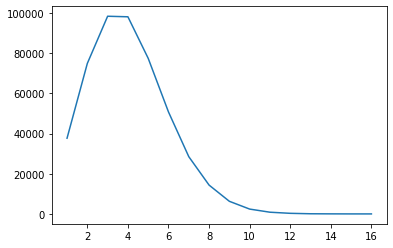
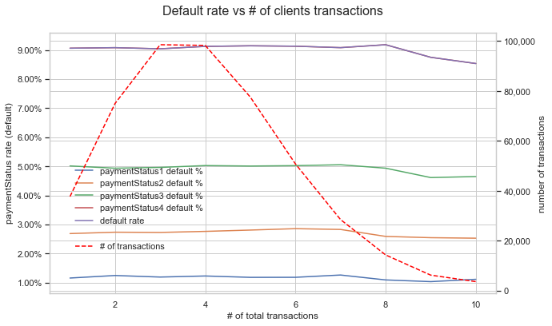
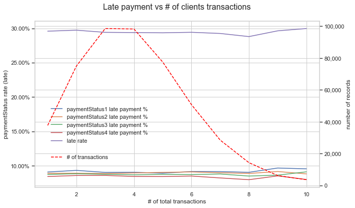
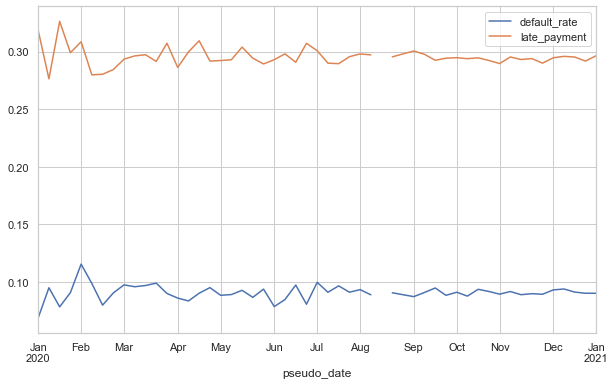
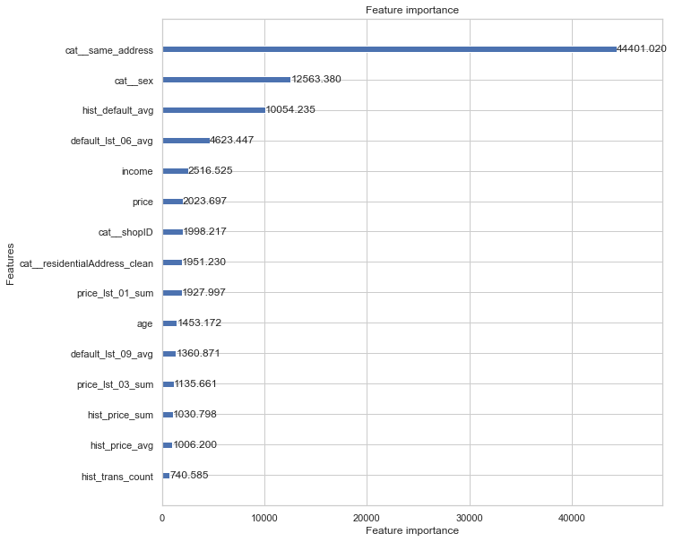

```python
import pandas as pd
import matplotlib
import matplotlib.pyplot as plt
import seaborn as sns
```


```python
df = catalog.load('master_table')
```

    2021-04-19 16:48:41,550 - kedro.io.data_catalog - INFO - Loading data from `master_table` (ParquetDataSet)...


Clients differ between each other on different levels.    

At this point I want to focus only on the information that says if it is a New customer or if it is Existing Customer.

I don't have a historical transaction for a New customers and in this case they should have a separate model build.
Below I want to check if having at least 1 transaction is enough.     

# Default rate (traget) vs #clients transactions


```python
df['rank'].value_counts().sort_index().plot()
```


    <AxesSubplot:>


    

    


For the sake of analysis simplicity I round down transaction to 10.


```python
df.loc[df['rank']>9,'rank'] = 10
```

    2021-04-19 17:11:18,858 - numexpr.utils - INFO - NumExpr defaulting to 4 threads.


```python
%matplotlib inline
from matplotlib.ticker import FuncFormatter

sns.set(style="whitegrid")

fig, ax1 = plt.subplots(figsize=(10,6))
ax2 = ax1.twinx()

df.assign(paymentStatus1=lambda x: x['paymentStatus1']==2).groupby('rank')['paymentStatus1'].mean().sort_index().plot(label='paymentStatus1 default %', ax=ax1)
df.assign(paymentStatus2=lambda x: x['paymentStatus2']==2).groupby('rank')['paymentStatus2'].mean().sort_index().plot(label='paymentStatus2 default %', ax=ax1)
df.assign(paymentStatus3=lambda x: x['paymentStatus3']==2).groupby('rank')['paymentStatus3'].mean().sort_index().plot(label='paymentStatus3 default %', ax=ax1)
df.assign(paymentStatus4=lambda x: x['paymentStatus4']==2).groupby('rank')['paymentStatus4'].mean().sort_index().plot(label='paymentStatus4 default %', ax=ax1)
df.groupby('rank')['default'].mean().sort_index().plot(label='default rate', ax=ax1)

df['rank'].value_counts().sort_index().plot(color='red', label='# of transactions' ,ax=ax2)

ax2.lines[0].set_linestyle("--")

ax1.legend(loc = (.05,.25), frameon = False)
ax2.legend(loc = (.05, .15), frameon = False)

ax1.set(xlabel='# of total transactions', ylabel='paymentStatus rate (default)')
ax2.set(ylabel='number of transactions')

plt.title('Default rate vs # of clients transactions', y=1.05, fontsize = 16)
ax1.yaxis.set_major_formatter(FuncFormatter(lambda y, _: '{:.2%}'.format(y))) 
ax2.yaxis.set_major_formatter(FuncFormatter(lambda y, _: '{:,.0f}'.format(y))) 

plt.show()

```


    

    


There is no difference in default rate given the number of transactions that customer has already made.     
In reall life it's rarely the case.    


```python
%matplotlib inline
from matplotlib.ticker import FuncFormatter

sns.set(style="whitegrid")

fig, ax1 = plt.subplots(figsize=(10,6))
ax2 = ax1.twinx()

df.assign(paymentStatus1=lambda x: x['paymentStatus1']==1).groupby('rank')['paymentStatus1'].mean().sort_index().plot(label='paymentStatus1 late payment %', ax=ax1)
df.assign(paymentStatus2=lambda x: x['paymentStatus2']==1).groupby('rank')['paymentStatus2'].mean().sort_index().plot(label='paymentStatus2 late payment %', ax=ax1)
df.assign(paymentStatus3=lambda x: x['paymentStatus3']==1).groupby('rank')['paymentStatus3'].mean().sort_index().plot(label='paymentStatus3 late payment %', ax=ax1)
df.assign(paymentStatus4=lambda x: x['paymentStatus4']==1).groupby('rank')['paymentStatus4'].mean().sort_index().plot(label='paymentStatus4 late payment %', ax=ax1)
df.groupby('rank')['late'].mean().sort_index().plot(label='late rate', ax=ax1)

df['rank'].value_counts().sort_index().plot(color='red', label='# of transactions' ,ax=ax2)

ax2.lines[0].set_linestyle("--")

ax1.legend(loc = (.05,.25), frameon = False)
ax2.legend(loc = (.05, .15), frameon = False)

ax1.set(xlabel='# of total transactions', ylabel='paymentStatus rate (late)')
ax2.set(ylabel='number of records')

plt.title('Late payment vs # of clients transactions', y=1.05, fontsize = 16)
ax1.yaxis.set_major_formatter(FuncFormatter(lambda y, _: '{:.2%}'.format(y))) 
ax2.yaxis.set_major_formatter(FuncFormatter(lambda y, _: '{:,.0f}'.format(y))) 

plt.show()

```


    

    


There is no difference in late payments given the number of transactions that customer has already made.     


# Default rate vs "pseudo time"

It is important to be be aware of your target doesn't change over time.
There is no transaction data available, but since transactions ID are increasing, I can asume that the higher ID is, the older transaction is.       
Based on this assumption I'm creating 'pseudo time' dimension to show target behaves over time.


```python
number_of_weeks = 52
fig, ax1 = plt.subplots(figsize=(10,6))

dates = dict([i for i in zip(range(number_of_weeks), pd.date_range(start='2020-01-01', end='2020-12-31',periods=number_of_weeks))])
div = round(df.transactionID.max()/(number_of_weeks-1),0)
df['pseudo_date'] = df.transactionID.apply(lambda x: int(round(x/div,0))).map(lambda x: dates[x])
df.set_index('pseudo_date').resample('W')[['default']].agg(default_rate=('default', 'mean')).plot(ax=ax1)
df.set_index('pseudo_date').resample('W')[['late']].agg(late_payment=('late', 'mean')).plot(ax=ax1)

```


    <AxesSubplot:xlabel='pseudo_date'>


    

    


# Create segments


```python
df_new_customer.shape
```


    (37721, 99)


```python
df_existing_customer.shape
```


    (452775, 99)


```python
df_new_customer = df.loc[df['rank']==1].reset_index(drop=True)
df_existing_customer = df.loc[df['rank']>1].reset_index(drop=True)
```


```python
df_new_customer.default.mean()
```


    0.09066567694387742


```python
df_existing_customer.default.mean()
```


    0.09097233725360278


```python
df_new_customer.late.mean()
```


    0.2958829299329286


```python
df_existing_customer.late.mean()
```


    0.2942764066037215


Further in this analysis I will focus on Existing Customer

# Data split


```python
params_ds = catalog.load('params:data_set')
```

    2021-04-19 17:38:54,654 - kedro.io.data_catalog - INFO - Loading data from `params:data_set` (MemoryDataSet)...


df_oot   - data set that will allow to check model performance on the latest available data (out of time),    
df_train - dataset for model training,    
df_test  - dataset for model performance assessing (out of sample)    
df_valid - dataset for hp tuning (out of sample),   


```python
params_ds
```


    {'oot': 50000, 'train': 0.7, 'test': 0.2, 'valid': 0.1}


```python
df_oot = df_existing_customer.sort_values('customerID').iloc[-params_ds['oot']:].sort_index()
df_existing_customer = df_existing_customer.sort_values('customerID').iloc[:-params_ds['oot']]
```


```python
size=df_existing_customer.shape[0]
train_size = int(size * params_ds['train'])
test_size = int(size * params_ds['test'])

df_existing_customer=df_existing_customer.sample(frac=1, random_state=1)
df_train = df_existing_customer.iloc[:train_size].sort_index()
df_test = df_existing_customer.iloc[train_size:(train_size+test_size)].sort_index()
df_valid = df_existing_customer.iloc[(train_size+test_size):].sort_index()

```

# model lightgbm - no hp, just for feature importance


```python
import numpy as np
from category_encoders import *

from sklearn.feature_extraction.text import TfidfVectorizer
from sklearn.compose import ColumnTransformer
from sklearn.pipeline import make_pipeline
from sklearn.model_selection import cross_val_predict
from sklearn import metrics
from sklearn.metrics import roc_auc_score

import lightgbm as lgb
from lightgbm import LGBMClassifier

import matplotlib.pyplot as plt 

import warnings

warnings.simplefilter(action='ignore', category=FutureWarning)
warnings.simplefilter(action='ignore', category=DeprecationWarning)

```


```python
categorical_cols = ['sex', 'residentialAddress_clean',
                    'geo_risk_rank','shopID','same_address']
numerical_cols = ['age', 'income', 'price'] + \
    df.filter(regex='(^hist_)|(_lst_)').columns.to_list()
target_column = ['default']


```


```python
lgb_params = {"seed": 42,
              "objective": "binary", 
              "learning_rate": 0.1,
              "metric":"auc"
              }
```


```python
transformer = make_pipeline(
    ColumnTransformer([
        ('num','passthrough', numerical_cols),
        ('cat', OrdinalEncoder(), categorical_cols),    
    ]),
)
```


```python
d_train = lgb.Dataset(
    transformer.fit_transform(df_train, df_train['default']), 
    label=df_train['default'], 
    feature_name=transformer.named_steps['columntransformer'].get_feature_names(),
    params={'verbose': -1})

d_valid = lgb.Dataset(
    transformer.transform(df_valid), 
    label=df_valid['default'], 
    feature_name=transformer.named_steps['columntransformer'].get_feature_names(),
    params={'verbose': -1})

d_test = lgb.Dataset(
    transformer.transform(df_test), 
    label=df_test['default'], 
    feature_name=transformer.named_steps['columntransformer'].get_feature_names(),
    params={'verbose': -1})
```


```python
classifier = make_pipeline(
    ColumnTransformer([
        ('num','passthrough', numerical_cols),
        ('cat', OrdinalEncoder(), categorical_cols),       
    ]),
    LGBMClassifier(n_estimators=500, random_state=1, metric= "auc", importance_type='gain')
)
```


```python
%%time
results=[]

for i in range(1,11): 
    _tmp_target = df.loc[df['rank']==i].reset_index(drop=True)[target_column].values.reshape(-1,)
    oof_pred = cross_val_predict(classifier, 
                                 df.loc[df['rank']==i].reset_index(drop=True), 
                                 _tmp_target, 
                                 cv=5,
                                 method="predict_proba")
    _tmp_roc_score = roc_auc_score(_tmp_target, oof_pred[:,1])
    results += [(i, _tmp_roc_score)]
    print("#{}, Cross validation AUC {:.4f}".format(i, _tmp_roc_score))

    
_tmp_target = df[target_column].values.reshape(-1,)
oof_pred = cross_val_predict(classifier, 
                             df, 
                             _tmp_target, 
                             cv=5,
                             method="predict_proba")
_tmp_roc_score = roc_auc_score(_tmp_target, oof_pred[:,1])
results += [(i, _tmp_roc_score)]
print("#ALL, Cross validation AUC {:.4f}".format(_tmp_roc_score))
```

    #1, Cross validation AUC 0.6159
    #2, Cross validation AUC 0.6189
    #3, Cross validation AUC 0.6305
    #4, Cross validation AUC 0.6392
    #5, Cross validation AUC 0.6423
    #6, Cross validation AUC 0.6363
    #7, Cross validation AUC 0.6219
    #8, Cross validation AUC 0.6135
    #9, Cross validation AUC 0.5910
    #10, Cross validation AUC 0.5682
    #ALL, Cross validation AUC 0.6593
    CPU times: user 12min 3s, sys: 41.8 s, total: 12min 45s
    Wall time: 5min 27s


```python
model = lgb.train(
    lgb_params,
    d_train,
    valid_sets=[d_train, d_valid],
    valid_names=['train', 'valid'],
)
```

    [LightGBM] [Info] Number of positive: 25746, number of negative: 256196
    [LightGBM] [Warning] Auto-choosing row-wise multi-threading, the overhead of testing was 0.188444 seconds.
    You can set `force_row_wise=true` to remove the overhead.
    And if memory is not enough, you can set `force_col_wise=true`.
    [LightGBM] [Info] Total Bins 7639
    [LightGBM] [Info] Number of data points in the train set: 281942, number of used features: 75
    [1]	train's auc: 0.663891	valid's auc: 0.66805
    [2]	train's auc: 0.66787	valid's auc: 0.670116
    [3]	train's auc: 0.668155	valid's auc: 0.670198
    [4]	train's auc: 0.669665	valid's auc: 0.66827
    [5]	train's auc: 0.670228	valid's auc: 0.668222
    [6]	train's auc: 0.670556	valid's auc: 0.668546
    [7]	train's auc: 0.671059	valid's auc: 0.668611
    [8]	train's auc: 0.671422	valid's auc: 0.668542
    [9]	train's auc: 0.671699	valid's auc: 0.668565
    [10]	train's auc: 0.671979	valid's auc: 0.66848
    [11]	train's auc: 0.672065	valid's auc: 0.668526
    [12]	train's auc: 0.67265	valid's auc: 0.668807
    [13]	train's auc: 0.672786	valid's auc: 0.668682
    [14]	train's auc: 0.674076	valid's auc: 0.66871
    [15]	train's auc: 0.674105	valid's auc: 0.668735
    [16]	train's auc: 0.674165	valid's auc: 0.668772
    [17]	train's auc: 0.674214	valid's auc: 0.668791
    [18]	train's auc: 0.674533	valid's auc: 0.66863
    [19]	train's auc: 0.674736	valid's auc: 0.668517
    [20]	train's auc: 0.674761	valid's auc: 0.668498
    [21]	train's auc: 0.675583	valid's auc: 0.668636
    [22]	train's auc: 0.676065	valid's auc: 0.668523
    [23]	train's auc: 0.676332	valid's auc: 0.668489
    [24]	train's auc: 0.676449	valid's auc: 0.668536
    [25]	train's auc: 0.676834	valid's auc: 0.668486
    [26]	train's auc: 0.678041	valid's auc: 0.668343
    [27]	train's auc: 0.678067	valid's auc: 0.66835
    [28]	train's auc: 0.679088	valid's auc: 0.668924
    [29]	train's auc: 0.679674	valid's auc: 0.668958
    [30]	train's auc: 0.679686	valid's auc: 0.668952
    [31]	train's auc: 0.679907	valid's auc: 0.669009
    [32]	train's auc: 0.679952	valid's auc: 0.669031
    [33]	train's auc: 0.680751	valid's auc: 0.66899
    [34]	train's auc: 0.681656	valid's auc: 0.668648
    [35]	train's auc: 0.681688	valid's auc: 0.668684
    [36]	train's auc: 0.682637	valid's auc: 0.668893
    [37]	train's auc: 0.683702	valid's auc: 0.668826
    [38]	train's auc: 0.683866	valid's auc: 0.668807
    [39]	train's auc: 0.684314	valid's auc: 0.668995
    [40]	train's auc: 0.684736	valid's auc: 0.668921
    [41]	train's auc: 0.685688	valid's auc: 0.668653
    [42]	train's auc: 0.685909	valid's auc: 0.668487
    [43]	train's auc: 0.686018	valid's auc: 0.668582
    [44]	train's auc: 0.686107	valid's auc: 0.668585
    [45]	train's auc: 0.686243	valid's auc: 0.668508
    [46]	train's auc: 0.686667	valid's auc: 0.668446
    [47]	train's auc: 0.687193	valid's auc: 0.668495
    [48]	train's auc: 0.687656	valid's auc: 0.668404
    [49]	train's auc: 0.688358	valid's auc: 0.6682
    [50]	train's auc: 0.688871	valid's auc: 0.667924
    [51]	train's auc: 0.68936	valid's auc: 0.667543
    [52]	train's auc: 0.689407	valid's auc: 0.667553
    [53]	train's auc: 0.6897	valid's auc: 0.667315
    [54]	train's auc: 0.690046	valid's auc: 0.667455
    [55]	train's auc: 0.690539	valid's auc: 0.667563
    [56]	train's auc: 0.691653	valid's auc: 0.667622
    [57]	train's auc: 0.691952	valid's auc: 0.667988
    [58]	train's auc: 0.692389	valid's auc: 0.66783
    [59]	train's auc: 0.692665	valid's auc: 0.667647
    [60]	train's auc: 0.69315	valid's auc: 0.667618
    [61]	train's auc: 0.69421	valid's auc: 0.66744
    [62]	train's auc: 0.694606	valid's auc: 0.667631
    [63]	train's auc: 0.695105	valid's auc: 0.668162
    [64]	train's auc: 0.695194	valid's auc: 0.668087
    [65]	train's auc: 0.695939	valid's auc: 0.667831
    [66]	train's auc: 0.696375	valid's auc: 0.667892
    [67]	train's auc: 0.696379	valid's auc: 0.667888
    [68]	train's auc: 0.69662	valid's auc: 0.667922
    [69]	train's auc: 0.69723	valid's auc: 0.668079
    [70]	train's auc: 0.697295	valid's auc: 0.668061
    [71]	train's auc: 0.697675	valid's auc: 0.667915
    [72]	train's auc: 0.698151	valid's auc: 0.667755
    [73]	train's auc: 0.698543	valid's auc: 0.667791
    [74]	train's auc: 0.699111	valid's auc: 0.667817
    [75]	train's auc: 0.699249	valid's auc: 0.667891
    [76]	train's auc: 0.699649	valid's auc: 0.667767
    [77]	train's auc: 0.700243	valid's auc: 0.667625
    [78]	train's auc: 0.700349	valid's auc: 0.667634
    [79]	train's auc: 0.700857	valid's auc: 0.667565
    [80]	train's auc: 0.701083	valid's auc: 0.667439
    [81]	train's auc: 0.701725	valid's auc: 0.667351
    [82]	train's auc: 0.702467	valid's auc: 0.667344
    [83]	train's auc: 0.70304	valid's auc: 0.667374
    [84]	train's auc: 0.70326	valid's auc: 0.66734
    [85]	train's auc: 0.703971	valid's auc: 0.667681
    [86]	train's auc: 0.704548	valid's auc: 0.668173
    [87]	train's auc: 0.704887	valid's auc: 0.668173
    [88]	train's auc: 0.704962	valid's auc: 0.668119
    [89]	train's auc: 0.705457	valid's auc: 0.668195
    [90]	train's auc: 0.705777	valid's auc: 0.668131
    [91]	train's auc: 0.705963	valid's auc: 0.668107
    [92]	train's auc: 0.706189	valid's auc: 0.668135
    [93]	train's auc: 0.706715	valid's auc: 0.668076
    [94]	train's auc: 0.707165	valid's auc: 0.668045
    [95]	train's auc: 0.707644	valid's auc: 0.667901
    [96]	train's auc: 0.707898	valid's auc: 0.667915
    [97]	train's auc: 0.708673	valid's auc: 0.667924
    [98]	train's auc: 0.708981	valid's auc: 0.668018
    [99]	train's auc: 0.7094	valid's auc: 0.667928
    [100]	train's auc: 0.709624	valid's auc: 0.668075


```python
fig, ax2 = plt.subplots(figsize=(10,10))
lgb.plot_importance(model, max_num_features=15, ax=ax2, importance_type = 'gain')
```


    <AxesSubplot:title={'center':'Feature importance'}, xlabel='Feature importance', ylabel='Features'>


    

    

