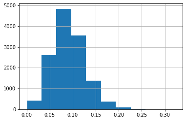
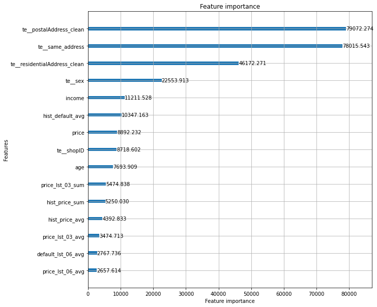

# Description

Create new features based on clients transaction history.

# Prepare data 


```python
import numpy as np
import pandas as pd
import re
import seaborn as sns
import matplotlib.pyplot as plt 
from scipy.stats import chi2_contingency
import geocoder
import statistics
import time
```


```python
%reload_kedro
```

    /Users/xszpo/miniconda3/envs/viabill/lib/python3.8/site-packages/kedro/framework/project/__init__.py:133: UserWarning: Found duplicate pipeline entries. The following will be overwritten: __default__
      warn(


```python
df_cust = catalog.load("customers")
d_sex = {1: 'male', 2:'female', 0: 'other'}
df_cust.sex = df_cust.sex.apply(lambda x: d_sex[x])

df_cust['residentialAddress_clean'] = df_cust.residentialAddress.apply(lambda x: re.sub(r'[0-9]+', '', x))
df_cust['postalAddress_clean']  = df_cust.postalAddress.apply(lambda x: re.sub(r'[0-9]+', '', x) if x==x else '')
df_cust['same_address'] = (df_cust.residentialAddress==df_cust.postalAddress).astype(int)

```

## Perform some basic future engineering


```python
df_trans = catalog.load("transactions")
df_trans['late'] = df_trans.filter(regex='payment').apply(lambda x: x==1).any(axis=1).astype(int)
df_trans['default'] = df_trans.filter(regex='payment').apply(lambda x: x==2).any(axis=1).astype(int)

df_trans["defualted_payment"] = df_trans.replace({
    'paymentStatus1': {1: 0, 2: 1},
    'paymentStatus2': {1: 0, 2: 2},
    'paymentStatus3': {1: 0, 2: 3},
    'paymentStatus4': {1: 0, 2: 4},
}).filter(regex='payment').replace({0: np.nan}).min(axis=1).fillna(0)

df_trans["late_payment_first"] = df_trans.replace({
    'paymentStatus1': {1: 1, 2: 0},
    'paymentStatus2': {1: 2, 2: 0},
    'paymentStatus3': {1: 3, 2: 0},
    'paymentStatus4': {1: 4, 2: 0},
}).filter(regex='payment').replace({0: np.nan}).min(axis=1).fillna(0)
```


```python
df_trans = df_trans.assign(
    money_lost = lambda x: x.apply(
        lambda y:y['price'] * (5-y['defualted_payment'])/4 if y['defualted_payment']>0 else 0, axis=1
    )
)
```


```python
# mark transactions from shop 113 as a fraud
df_trans['fraud'] = 0
df_trans.loc[df_trans.shopID == 113, 'fraud'] = 1
```


```python
# drop transaction marked as a fraud and transaction without customerID
df_trans = df_trans.loc[df_trans.fraud == 0].dropna(
    subset=['customerID']).reset_index(drop=True)
```


```python
# rank customer transactions
df_trans['rank'] = df_trans.groupby("customerID")["transactionID"].rank(
    "dense", ascending=True)
```


```python
# create default lag - informtion about default from previous cutomers
# transaction
df_trans['default_lag1'] = df_trans. \
    set_index('rank'). \
    groupby('customerID')[['default']]. \
    shift(1).reset_index(drop=True)

# create defualted_payment lag - informtion about number of defaulte
# payment from previous cutomers transaction
df_trans['defualted_payment_lag1'] = df_trans. \
    set_index('rank'). \
    groupby('customerID')[['defualted_payment']]. \
    shift(1).reset_index(drop=True)

# create lost lag - informtion about lost from previous cutomers
# transaction
df_trans['money_lost_lag1'] = df_trans. \
    set_index('rank'). \
    groupby('customerID')[['money_lost']]. \
    shift(1).reset_index(drop=True)

# create late payment lag - infroamtion about late payment from previous
# cutomer transaction
df_trans['late_lag1'] = df_trans. \
    set_index('rank'). \
    groupby('customerID')[['late']]. \
    shift(1).reset_index(drop=True)

# create price lag
df_trans['price_lag1'] = df_trans. \
    set_index('rank'). \
    groupby('customerID')[['price']]. \
    shift(1).reset_index(drop=True)

# create late_payment_first lag - informtion about number payment which
# was late as first from previous cutomers transaction
df_trans['late_payment_first_lag1'] = df_trans. \
    set_index('rank'). \
    groupby('customerID')[['late_payment_first']]. \
    shift(1).reset_index(drop=True)

```


```python
# 
trans_back_aggreg_list = [3,6,9]
```


```python
# aggregate data about previouse customer transactions using window
# functions

start_time = time.time()

aggreate_list = df_trans.filter(regex="lag").columns.to_list()

results = []
for i in trans_back_aggreg_list:

    print(f"starting aggregation for #{i} transactions back")
    names_sum = [f'{k}_lst_{str(i).zfill(2)}_sum' for k in list(map(lambda x: x.replace('_lag1',''), aggreate_list))]
    names_avg = [f'{k}_lst_{str(i).zfill(2)}_avg' for k in list(map(lambda x: x.replace('_lag1',''), aggreate_list))]

    if len(results) == 0 or len(trans_back_aggreg_list) <= 1:
        results += [pd.concat([
            df_trans.set_index('rank').groupby('customerID')[aggreate_list].rolling(i, min_periods=1).sum().reset_index(),
            df_trans.set_index('rank').groupby('customerID')[aggreate_list].rolling(i, min_periods=1).mean().reset_index().iloc[:, 2:]
            ], axis=1)]

        results[-1].columns = ['customerID', 'rank']+names_sum+names_avg
    else:
        results += [pd.concat([
            df_trans.set_index('rank').groupby('customerID')[aggreate_list].rolling(i, min_periods=1).sum().reset_index().iloc[:, 2:],
            df_trans.set_index('rank').groupby('customerID')[aggreate_list].rolling(i, min_periods=1).mean().reset_index().iloc[:, 2:]
            ], axis=1)]

        results[-1].columns = names_sum+names_avg

    print("--- %s seconds ---" % (time.time() - start_time))


```

    starting aggregation for #3 transactions back
    --- 603.1424798965454 seconds ---
    starting aggregation for #6 transactions back
    --- 1370.2203180789948 seconds ---
    starting aggregation for #9 transactions back
    --- 1882.3201460838318 seconds ---


```python
defaults = pd.concat(results, axis=1)
df_trans_all = df_trans.merge(defaults, on=['customerID', 'rank'],
                              how='left')
```


```python

# treat last customer transaction as current credit application
df_trans['rank_reverse'] = df_trans.groupby("customerID")["transactionID"]. \
    rank("dense", ascending=False)
```


```python
# split transactions into current transaction and historical
df_trans_newest = df_trans.loc[df_trans.rank_reverse == 1]. \
    reset_index(drop=True)
df_trans_history = df_trans.loc[df_trans.rank_reverse > 1].\
    reset_index(drop=True)
```


```python
# aggregate transaction history
df_trans_history_aggr = df_trans_history. \
    groupby('customerID'). \
    agg(
        hist_trans_count=('default', 'count'),
        hist_default_sum=('default', 'sum'),
        hist_default_avg=('default', 'mean'),
        hist_late_sum=('late', 'sum'),
        hist_late_avg=('late', 'mean'),
        hist_price_sum=('price', 'sum'),
        hist_price_avg=('price', 'mean')
    ).reset_index(drop=False)
```


```python
# join historical transaction features created by aggregation all values
df_trans_newest = df_trans_newest.merge(
    df_trans_history_aggr, on='customerID', how='left')

# join historical transaction features created by window functions
df_trans = df_trans_newest.merge(
    defaults, on=['customerID', 'rank'], how='left')
```


```python
master_table = df_cust.merge(df_trans, on=['customerID'], how='left')
```


```python
# create geo risk ranking
# temporary solution, if used in final solution, need to prepare in fit/transform maner
bins = [-np.inf, 0.049, 0.071, 0.088, 0.107, 0.137, np.inf]
geo_risk_rank = master_table.groupby('residentialAddress_clean')[['hist_default_sum', 'hist_trans_count']]. \
    sum().reset_index(). \
    assign(geo_risk_rank=lambda x: pd.cut(x['hist_default_sum']/x['hist_trans_count'], bins).cat.codes)


```


```python
master_table = master_table.merge(geo_risk_rank[['residentialAddress_clean', 'geo_risk_rank']], on='residentialAddress_clean', how='left')

# drop clients without transactions
master_table = master_table.dropna(subset=['default'])

```


```python
master_table.describe().T
```


<div>
<style scoped>
    .dataframe tbody tr th:only-of-type {
        vertical-align: middle;
    }

    .dataframe tbody tr th {
        vertical-align: top;
    }

    .dataframe thead th {
        text-align: right;
    }
</style>
<table border="1" class="dataframe">
  <thead>
    <tr style="text-align: right;">
      <th></th>
      <th>count</th>
      <th>mean</th>
      <th>std</th>
      <th>min</th>
      <th>25%</th>
      <th>50%</th>
      <th>75%</th>
      <th>max</th>
    </tr>
  </thead>
  <tbody>
    <tr>
      <th>customerID</th>
      <td>490496.0</td>
      <td>2.499744e+05</td>
      <td>144333.696329</td>
      <td>1.0</td>
      <td>124989.75</td>
      <td>249979.50</td>
      <td>374975.25</td>
      <td>500000.0</td>
    </tr>
    <tr>
      <th>age</th>
      <td>490496.0</td>
      <td>4.463071e+01</td>
      <td>16.176153</td>
      <td>5.0</td>
      <td>27.00</td>
      <td>50.00</td>
      <td>58.00</td>
      <td>90.0</td>
    </tr>
    <tr>
      <th>income</th>
      <td>480711.0</td>
      <td>4.999817e+04</td>
      <td>28897.827794</td>
      <td>0.0</td>
      <td>25000.00</td>
      <td>50000.00</td>
      <td>75000.00</td>
      <td>100000.0</td>
    </tr>
    <tr>
      <th>same_address</th>
      <td>490496.0</td>
      <td>9.305377e-01</td>
      <td>0.254239</td>
      <td>0.0</td>
      <td>1.00</td>
      <td>1.00</td>
      <td>1.00</td>
      <td>1.0</td>
    </tr>
    <tr>
      <th>transactionID</th>
      <td>490496.0</td>
      <td>1.534202e+06</td>
      <td>418827.975187</td>
      <td>76.0</td>
      <td>1328190.75</td>
      <td>1659686.50</td>
      <td>1857921.25</td>
      <td>2000000.0</td>
    </tr>
    <tr>
      <th>...</th>
      <td>...</td>
      <td>...</td>
      <td>...</td>
      <td>...</td>
      <td>...</td>
      <td>...</td>
      <td>...</td>
      <td>...</td>
    </tr>
    <tr>
      <th>money_lost_lst_09_avg</th>
      <td>452775.0</td>
      <td>4.558257e+00</td>
      <td>13.223073</td>
      <td>0.0</td>
      <td>0.00</td>
      <td>0.00</td>
      <td>0.00</td>
      <td>200.0</td>
    </tr>
    <tr>
      <th>late_lst_09_avg</th>
      <td>452775.0</td>
      <td>2.947874e-01</td>
      <td>0.322444</td>
      <td>0.0</td>
      <td>0.00</td>
      <td>0.25</td>
      <td>0.50</td>
      <td>1.0</td>
    </tr>
    <tr>
      <th>price_lst_09_avg</th>
      <td>452775.0</td>
      <td>1.014531e+02</td>
      <td>37.435170</td>
      <td>3.0</td>
      <td>77.50</td>
      <td>101.50</td>
      <td>125.50</td>
      <td>200.0</td>
    </tr>
    <tr>
      <th>late_payment_first_lst_09_avg</th>
      <td>452775.0</td>
      <td>9.005973e-01</td>
      <td>0.934349</td>
      <td>0.0</td>
      <td>0.00</td>
      <td>0.75</td>
      <td>1.50</td>
      <td>4.0</td>
    </tr>
    <tr>
      <th>geo_risk_rank</th>
      <td>490496.0</td>
      <td>2.526131e+00</td>
      <td>1.407079</td>
      <td>0.0</td>
      <td>1.00</td>
      <td>3.00</td>
      <td>4.00</td>
      <td>5.0</td>
    </tr>
  </tbody>
</table>
<p>69 rows × 8 columns</p>
</div>


## Perform some basic quality check

Check if rows in data in Master tables are not duplicated


```python
if master_table.customerID.nunique() == master_table.shape[0]:
    print("Data in Master table are NOT duplicated.")
else:
    print("Data in Master table ARE duplicated.")
```

    Data in Master table are NOT duplicated.


## Create  "geo risk rating"

rate addreses based on average risk 


```python
master_table.columns
```


    Index(['customerID', 'sex', 'age', 'residentialAddress', 'postalAddress',
           'income', 'residentialAddress_clean', 'postalAddress_clean',
           'same_address', 'transactionID', 'shopID', 'price', 'paymentStatus1',
           'paymentStatus2', 'paymentStatus3', 'paymentStatus4', 'late', 'default',
           'defualted_payment', 'late_payment_first', 'money_lost', 'fraud',
           'rank', 'default_lag1', 'defualted_payment_lag1', 'money_lost_lag1',
           'late_lag1', 'price_lag1', 'late_payment_first_lag1', 'rank_reverse',
           'hist_trans_count', 'hist_default_sum', 'hist_default_avg',
           'hist_late_sum', 'hist_late_avg', 'hist_price_sum', 'hist_price_avg',
           'default_lst_03_sum', 'defualted_payment_lst_03_sum',
           'money_lost_lst_03_sum', 'late_lst_03_sum', 'price_lst_03_sum',
           'late_payment_first_lst_03_sum', 'default_lst_03_avg',
           'defualted_payment_lst_03_avg', 'money_lost_lst_03_avg',
           'late_lst_03_avg', 'price_lst_03_avg', 'late_payment_first_lst_03_avg',
           'default_lst_06_sum', 'defualted_payment_lst_06_sum',
           'money_lost_lst_06_sum', 'late_lst_06_sum', 'price_lst_06_sum',
           'late_payment_first_lst_06_sum', 'default_lst_06_avg',
           'defualted_payment_lst_06_avg', 'money_lost_lst_06_avg',
           'late_lst_06_avg', 'price_lst_06_avg', 'late_payment_first_lst_06_avg',
           'default_lst_09_sum', 'defualted_payment_lst_09_sum',
           'money_lost_lst_09_sum', 'late_lst_09_sum', 'price_lst_09_sum',
           'late_payment_first_lst_09_sum', 'default_lst_09_avg',
           'defualted_payment_lst_09_avg', 'money_lost_lst_09_avg',
           'late_lst_09_avg', 'price_lst_09_avg', 'late_payment_first_lst_09_avg',
           'geo_risk_rank'],
          dtype='object')


```python
_tmp = master_table.groupby('residentialAddress_clean')[['hist_default_sum','hist_trans_count']]. \
    sum().reset_index().assign(dr = lambda x: x['hist_default_sum']/x['hist_trans_count'])
```


```python
_tmp.dr.hist()
```


    <AxesSubplot:>


    

    


```python
np.quantile(_tmp.dr, [i/10 for i in list(range(1,10,2))], axis=0)
```


    array([0.04860437, 0.07142857, 0.08834466, 0.10666667, 0.1372549 ])


```python
bins = [-np.inf, 0.049, 0.071, 0.088, 0.107, 0.137, np.inf]
```


```python
geo_risk_rank = master_table.groupby('residentialAddress_clean')[['hist_default_sum','hist_trans_count']]. \
    sum().reset_index().assign(geo_risk_rank = lambda x: pd.cut(x['hist_default_sum']/x['hist_trans_count'], bins).cat.codes)

```


```python
master_table = master_table.merge(geo_risk_rank[['residentialAddress_clean','geo_risk_rank']], on='residentialAddress_clean', how='left')
```


```python
master_table
```


<div>
<style scoped>
    .dataframe tbody tr th:only-of-type {
        vertical-align: middle;
    }

    .dataframe tbody tr th {
        vertical-align: top;
    }

    .dataframe thead th {
        text-align: right;
    }
</style>
<table border="1" class="dataframe">
  <thead>
    <tr style="text-align: right;">
      <th></th>
      <th>customerID</th>
      <th>sex</th>
      <th>age</th>
      <th>residentialAddress</th>
      <th>postalAddress</th>
      <th>income</th>
      <th>residentialAddress_clean</th>
      <th>postalAddress_clean</th>
      <th>same_address</th>
      <th>transactionID</th>
      <th>...</th>
      <th>price_lst_09_sum</th>
      <th>late_payment_first_lst_09_sum</th>
      <th>default_lst_09_avg</th>
      <th>defualted_payment_lst_09_avg</th>
      <th>money_lost_lst_09_avg</th>
      <th>late_lst_09_avg</th>
      <th>price_lst_09_avg</th>
      <th>late_payment_first_lst_09_avg</th>
      <th>geo_risk_rank_x</th>
      <th>geo_risk_rank_y</th>
    </tr>
  </thead>
  <tbody>
    <tr>
      <th>0</th>
      <td>1</td>
      <td>male</td>
      <td>25</td>
      <td>28 Irvine Place</td>
      <td>28 Irvine Place</td>
      <td>NaN</td>
      <td>Irvine Place</td>
      <td>Irvine Place</td>
      <td>1</td>
      <td>1697842.0</td>
      <td>...</td>
      <td>358.0</td>
      <td>1.0</td>
      <td>0.000</td>
      <td>0.00</td>
      <td>0.0000</td>
      <td>0.333333</td>
      <td>119.333333</td>
      <td>0.333333</td>
      <td>4</td>
      <td>4</td>
    </tr>
    <tr>
      <th>1</th>
      <td>2</td>
      <td>male</td>
      <td>19</td>
      <td>72 Bertha Street</td>
      <td>72 Bertha Street</td>
      <td>43200.0</td>
      <td>Bertha Street</td>
      <td>Bertha Street</td>
      <td>1</td>
      <td>1834257.0</td>
      <td>...</td>
      <td>599.0</td>
      <td>2.0</td>
      <td>0.000</td>
      <td>0.00</td>
      <td>0.0000</td>
      <td>0.333333</td>
      <td>99.833333</td>
      <td>0.333333</td>
      <td>2</td>
      <td>2</td>
    </tr>
    <tr>
      <th>2</th>
      <td>3</td>
      <td>female</td>
      <td>22</td>
      <td>63 Ladberry Street</td>
      <td>63 Ladberry Street</td>
      <td>70200.0</td>
      <td>Ladberry Street</td>
      <td>Ladberry Street</td>
      <td>1</td>
      <td>1974624.0</td>
      <td>...</td>
      <td>781.0</td>
      <td>4.0</td>
      <td>0.125</td>
      <td>0.25</td>
      <td>6.1875</td>
      <td>0.125000</td>
      <td>97.625000</td>
      <td>0.500000</td>
      <td>1</td>
      <td>1</td>
    </tr>
    <tr>
      <th>3</th>
      <td>4</td>
      <td>other</td>
      <td>24</td>
      <td>98 Linneman Close</td>
      <td>98 Linneman Close</td>
      <td>93900.0</td>
      <td>Linneman Close</td>
      <td>Linneman Close</td>
      <td>1</td>
      <td>1536291.0</td>
      <td>...</td>
      <td>NaN</td>
      <td>NaN</td>
      <td>NaN</td>
      <td>NaN</td>
      <td>NaN</td>
      <td>NaN</td>
      <td>NaN</td>
      <td>NaN</td>
      <td>3</td>
      <td>3</td>
    </tr>
    <tr>
      <th>4</th>
      <td>5</td>
      <td>male</td>
      <td>53</td>
      <td>56 Salonica Road</td>
      <td>56 Salonica Road</td>
      <td>77000.0</td>
      <td>Salonica Road</td>
      <td>Salonica Road</td>
      <td>1</td>
      <td>661121.0</td>
      <td>...</td>
      <td>289.0</td>
      <td>10.0</td>
      <td>0.500</td>
      <td>1.75</td>
      <td>13.5625</td>
      <td>0.500000</td>
      <td>72.250000</td>
      <td>2.500000</td>
      <td>4</td>
      <td>4</td>
    </tr>
    <tr>
      <th>...</th>
      <td>...</td>
      <td>...</td>
      <td>...</td>
      <td>...</td>
      <td>...</td>
      <td>...</td>
      <td>...</td>
      <td>...</td>
      <td>...</td>
      <td>...</td>
      <td>...</td>
      <td>...</td>
      <td>...</td>
      <td>...</td>
      <td>...</td>
      <td>...</td>
      <td>...</td>
      <td>...</td>
      <td>...</td>
      <td>...</td>
      <td>...</td>
    </tr>
    <tr>
      <th>490491</th>
      <td>499996</td>
      <td>male</td>
      <td>68</td>
      <td>95 Argyle Parade</td>
      <td>95 Argyle Parade</td>
      <td>40500.0</td>
      <td>Argyle Parade</td>
      <td>Argyle Parade</td>
      <td>1</td>
      <td>665043.0</td>
      <td>...</td>
      <td>173.0</td>
      <td>0.0</td>
      <td>0.000</td>
      <td>0.00</td>
      <td>0.0000</td>
      <td>0.000000</td>
      <td>173.000000</td>
      <td>0.000000</td>
      <td>4</td>
      <td>4</td>
    </tr>
    <tr>
      <th>490492</th>
      <td>499997</td>
      <td>female</td>
      <td>22</td>
      <td>34 Bearke Place</td>
      <td>34 Bearke Place</td>
      <td>44900.0</td>
      <td>Bearke Place</td>
      <td>Bearke Place</td>
      <td>1</td>
      <td>1756533.0</td>
      <td>...</td>
      <td>181.0</td>
      <td>0.0</td>
      <td>0.000</td>
      <td>0.00</td>
      <td>0.0000</td>
      <td>0.000000</td>
      <td>90.500000</td>
      <td>0.000000</td>
      <td>2</td>
      <td>2</td>
    </tr>
    <tr>
      <th>490493</th>
      <td>499998</td>
      <td>male</td>
      <td>27</td>
      <td>95 Glenhurst Street</td>
      <td>95 Glenhurst Street</td>
      <td>48700.0</td>
      <td>Glenhurst Street</td>
      <td>Glenhurst Street</td>
      <td>1</td>
      <td>1628579.0</td>
      <td>...</td>
      <td>354.0</td>
      <td>0.0</td>
      <td>0.000</td>
      <td>0.00</td>
      <td>0.0000</td>
      <td>0.000000</td>
      <td>88.500000</td>
      <td>0.000000</td>
      <td>0</td>
      <td>0</td>
    </tr>
    <tr>
      <th>490494</th>
      <td>499999</td>
      <td>male</td>
      <td>55</td>
      <td>34 Kiandra Close</td>
      <td>34 Kiandra Close</td>
      <td>7600.0</td>
      <td>Kiandra Close</td>
      <td>Kiandra Close</td>
      <td>1</td>
      <td>1722718.0</td>
      <td>...</td>
      <td>664.0</td>
      <td>0.0</td>
      <td>0.000</td>
      <td>0.00</td>
      <td>0.0000</td>
      <td>0.000000</td>
      <td>132.800000</td>
      <td>0.000000</td>
      <td>1</td>
      <td>1</td>
    </tr>
    <tr>
      <th>490495</th>
      <td>500000</td>
      <td>female</td>
      <td>42</td>
      <td>46 Altola Street</td>
      <td>46 Altola Street</td>
      <td>84700.0</td>
      <td>Altola Street</td>
      <td>Altola Street</td>
      <td>1</td>
      <td>1591096.0</td>
      <td>...</td>
      <td>20.0</td>
      <td>0.0</td>
      <td>0.000</td>
      <td>0.00</td>
      <td>0.0000</td>
      <td>0.000000</td>
      <td>20.000000</td>
      <td>0.000000</td>
      <td>1</td>
      <td>1</td>
    </tr>
  </tbody>
</table>
<p>490496 rows × 75 columns</p>
</div>


# Model - initial model only to get intuition about model features


```python
categorical_cols = ['sex', 'residentialAddress_clean','postalAddress_clean',
                    'shopID',
                    'same_address']
numerical_cols = ['age', 'income', 'price'] + \
    master_table.filter(regex='(^hist_)|(_lst_)').columns.to_list()

target_def = 'default'
target_late = 'late'
```


```python
[i for i in categorical_cols if i not in master_table.columns]
```


    []


```python
[i for i in numerical_cols if i not in master_table.columns]
```


    []


```python
import numpy as np
from category_encoders import *

from sklearn.feature_extraction.text import TfidfVectorizer
from sklearn.compose import ColumnTransformer
from sklearn.pipeline import make_pipeline
from sklearn import metrics

import lightgbm as lgb
```


```python
pipe = ColumnTransformer([
        ('num','passthrough',numerical_cols),
        ('te', WOEEncoder(), categorical_cols),
    ])
```


```python
#df_cust_trans_new_cust = df_cust_trans.loc[df_cust_trans['rank']==1].reset_index(drop=True)
#df_cust_trans_old_cust = df_cust_trans.loc[df_cust_trans['rank']>1].reset_index(drop=True)
```


```python
#df_tr_cust_trans_new_cust = pipe_new.fit_transform(df_cust_trans_new_cust, df_cust_trans_new_cust.default)
#df_tr_cust_trans_old_cust= pipe_old.fit_transform(df_cust_trans_old_cust, df_cust_trans_old_cust.default)

```


```python
df_tr_cust_trans = pipe.fit_transform(master_table, master_table.default)
```


```python
master_table.drop(columns=['geo_risk_rank_x','geo_risk_rank_y'], inplace=True)
```


```python
d_train = lgb.Dataset(
    df_tr_cust_trans, 
    label=master_table.default, 
    feature_name=pipe.get_feature_names())
```


```python
lgb_params = {#"learning_rate": 0.01,
              #"num_leaves": 16,
              #"min_data_in_leaf": 20,
              #"max_depth": 20,
              #"boosting": "gbdt",
              "num_iterations": 500,
              #"bagging_fraction": 0.6,
              #"feature_fraction": 1.0,
              "seed": 42,
              "num_threads": -1,
              "objective": "binary", 
              "metric": "auc"
              }
```


```python
cv_results = lgb.cv(lgb_params, d_train, nfold=5, verbose_eval=20, early_stopping_rounds=40)
```

    /Users/xszpo/miniconda3/envs/viabill/lib/python3.8/site-packages/lightgbm/engine.py:527: UserWarning: Found `num_iterations` in params. Will use it instead of argument
      _log_warning("Found `{}` in params. Will use it instead of argument".format(alias))


    [LightGBM] [Info] Number of positive: 35688, number of negative: 356708
    [LightGBM] [Warning] Auto-choosing row-wise multi-threading, the overhead of testing was 0.126578 seconds.
    You can set `force_row_wise=true` to remove the overhead.
    And if memory is not enough, you can set `force_col_wise=true`.
    [LightGBM] [Info] Total Bins 5592
    [LightGBM] [Info] Number of data points in the train set: 392396, number of used features: 51
    [LightGBM] [Info] Number of positive: 35688, number of negative: 356709
    [LightGBM] [Warning] Auto-choosing col-wise multi-threading, the overhead of testing was 0.322672 seconds.
    You can set `force_col_wise=true` to remove the overhead.
    [LightGBM] [Info] Total Bins 5592
    [LightGBM] [Info] Number of data points in the train set: 392397, number of used features: 51
    [LightGBM] [Info] Number of positive: 35688, number of negative: 356709
    [LightGBM] [Warning] Auto-choosing row-wise multi-threading, the overhead of testing was 0.179838 seconds.
    You can set `force_row_wise=true` to remove the overhead.
    And if memory is not enough, you can set `force_col_wise=true`.
    [LightGBM] [Info] Total Bins 5592
    [LightGBM] [Info] Number of data points in the train set: 392397, number of used features: 51
    [LightGBM] [Info] Number of positive: 35688, number of negative: 356709
    [LightGBM] [Warning] Auto-choosing row-wise multi-threading, the overhead of testing was 0.155300 seconds.
    You can set `force_row_wise=true` to remove the overhead.
    And if memory is not enough, you can set `force_col_wise=true`.
    [LightGBM] [Info] Total Bins 5592
    [LightGBM] [Info] Number of data points in the train set: 392397, number of used features: 51
    [LightGBM] [Info] Number of positive: 35688, number of negative: 356709
    [LightGBM] [Warning] Auto-choosing row-wise multi-threading, the overhead of testing was 0.148285 seconds.
    You can set `force_row_wise=true` to remove the overhead.
    And if memory is not enough, you can set `force_col_wise=true`.
    [LightGBM] [Info] Total Bins 5592
    [LightGBM] [Info] Number of data points in the train set: 392397, number of used features: 51
    [LightGBM] [Info] [binary:BoostFromScore]: pavg=0.090949 -> initscore=-2.302103
    [LightGBM] [Info] Start training from score -2.302103
    [LightGBM] [Info] [binary:BoostFromScore]: pavg=0.090949 -> initscore=-2.302106
    [LightGBM] [Info] Start training from score -2.302106
    [LightGBM] [Info] [binary:BoostFromScore]: pavg=0.090949 -> initscore=-2.302106
    [LightGBM] [Info] Start training from score -2.302106
    [LightGBM] [Info] [binary:BoostFromScore]: pavg=0.090949 -> initscore=-2.302106
    [LightGBM] [Info] Start training from score -2.302106
    [LightGBM] [Info] [binary:BoostFromScore]: pavg=0.090949 -> initscore=-2.302106
    [LightGBM] [Info] Start training from score -2.302106
    [20]	cv_agg's auc: 0.746095 + 0.00166226
    [40]	cv_agg's auc: 0.746747 + 0.0016244
    [60]	cv_agg's auc: 0.746567 + 0.00164846
    [80]	cv_agg's auc: 0.746328 + 0.0016719


```python
model= lgb.train(lgb_params, d_train)
fig, ax2 = plt.subplots(figsize=(10,10))
lgb.plot_importance(model, max_num_features=15, ax=ax2, importance_type = 'gain')
```

    /Users/xszpo/miniconda3/envs/viabill/lib/python3.8/site-packages/lightgbm/engine.py:148: UserWarning: Found `num_iterations` in params. Will use it instead of argument
      _log_warning("Found `{}` in params. Will use it instead of argument".format(alias))


    [LightGBM] [Info] Number of positive: 44610, number of negative: 445886
    [LightGBM] [Warning] Auto-choosing row-wise multi-threading, the overhead of testing was 0.187512 seconds.
    You can set `force_row_wise=true` to remove the overhead.
    And if memory is not enough, you can set `force_col_wise=true`.
    [LightGBM] [Info] Total Bins 5592
    [LightGBM] [Info] Number of data points in the train set: 490496, number of used features: 51
    [LightGBM] [Info] [binary:BoostFromScore]: pavg=0.090949 -> initscore=-2.302105
    [LightGBM] [Info] Start training from score -2.302105


    <AxesSubplot:title={'center':'Feature importance'}, xlabel='Feature importance', ylabel='Features'>


    

    

