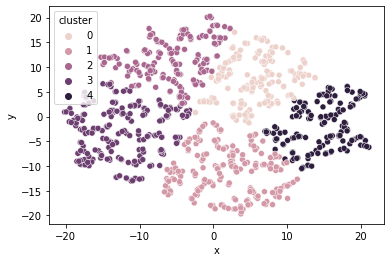
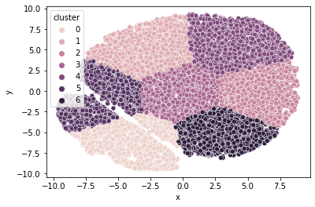
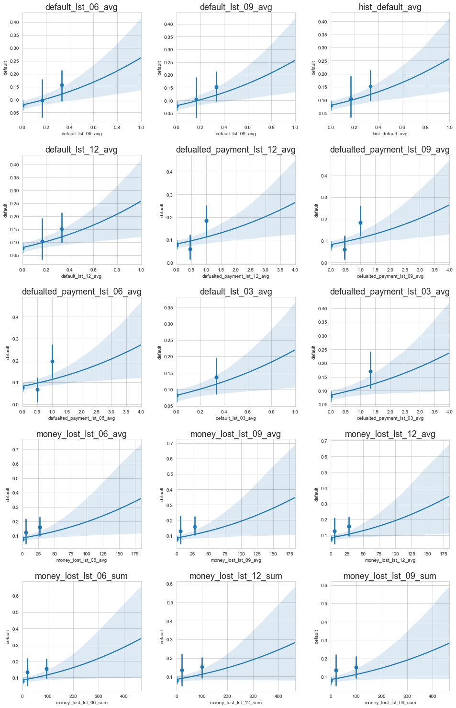
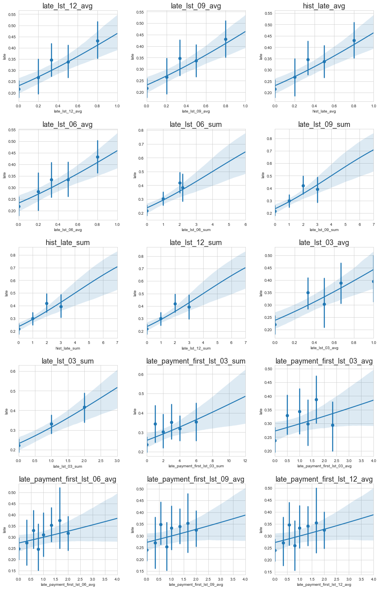

```python
%reload_kedro
```

    2021-04-19 20:56:21,856 - root - INFO - Registered hooks from 2 installed plugin(s): kedro-mlflow-0.7.0
    2021-04-19 20:56:21,870 - kedro.framework.session.store - INFO - `read()` not implemented for `BaseSessionStore`. Assuming empty store.


    /Users/xszpo/miniconda3/envs/viabill/lib/python3.8/site-packages/kedro/framework/project/__init__.py:133: UserWarning: Found duplicate pipeline entries. The following will be overwritten: __default__
      warn(


    2021-04-19 20:56:22,008 - root - INFO - ** Kedro project viabill
    2021-04-19 20:56:22,014 - root - INFO - Defined global variable `context`, `session` and `catalog`
    2021-04-19 20:56:22,065 - root - INFO - Registered line magic `run_viz`


```python
import viabill


```


```python
import warnings

warnings.simplefilter(action='ignore', category=FutureWarning)
warnings.simplefilter(action='ignore', category=DeprecationWarning)

```


```python
df = catalog.load('df_train')
```

    2021-04-19 20:56:22,116 - kedro.io.data_catalog - INFO - Loading data from `df_train` (ParquetDataSet)...


```python
categorical_cols = ['sex', 'residentialAddress_clean',
                    'postalAddress_clean', 'geo_risk_rank', 'shopID',
                    'same_address']
numerical_cols = ['age', 'income', 'price'] + \
    df.filter(regex='(^hist_)|(_lst_)').columns.to_list()
target_column = ['default']
```


```python
categorical_cols
```


    ['sex',
     'residentialAddress_clean',
     'postalAddress_clean',
     'geo_risk_rank',
     'shopID',
     'same_address']


```python
numerical_cols
```


    ['age',
     'income',
     'price',
     'hist_trans_count',
     'hist_default_sum',
     'hist_default_avg',
     'hist_late_sum',
     'hist_late_avg',
     'hist_price_sum',
     'hist_price_avg',
     'default_lst_01_sum',
     'defualted_payment_lst_01_sum',
     'money_lost_lst_01_sum',
     'late_lst_01_sum',
     'price_lst_01_sum',
     'late_payment_first_lst_01_sum',
     'default_lst_01_avg',
     'defualted_payment_lst_01_avg',
     'money_lost_lst_01_avg',
     'late_lst_01_avg',
     'price_lst_01_avg',
     'late_payment_first_lst_01_avg',
     'default_lst_03_sum',
     'defualted_payment_lst_03_sum',
     'money_lost_lst_03_sum',
     'late_lst_03_sum',
     'price_lst_03_sum',
     'late_payment_first_lst_03_sum',
     'default_lst_03_avg',
     'defualted_payment_lst_03_avg',
     'money_lost_lst_03_avg',
     'late_lst_03_avg',
     'price_lst_03_avg',
     'late_payment_first_lst_03_avg',
     'default_lst_06_sum',
     'defualted_payment_lst_06_sum',
     'money_lost_lst_06_sum',
     'late_lst_06_sum',
     'price_lst_06_sum',
     'late_payment_first_lst_06_sum',
     'default_lst_06_avg',
     'defualted_payment_lst_06_avg',
     'money_lost_lst_06_avg',
     'late_lst_06_avg',
     'price_lst_06_avg',
     'late_payment_first_lst_06_avg',
     'default_lst_09_sum',
     'defualted_payment_lst_09_sum',
     'money_lost_lst_09_sum',
     'late_lst_09_sum',
     'price_lst_09_sum',
     'late_payment_first_lst_09_sum',
     'default_lst_09_avg',
     'defualted_payment_lst_09_avg',
     'money_lost_lst_09_avg',
     'late_lst_09_avg',
     'price_lst_09_avg',
     'late_payment_first_lst_09_avg',
     'default_lst_12_sum',
     'defualted_payment_lst_12_sum',
     'money_lost_lst_12_sum',
     'late_lst_12_sum',
     'price_lst_12_sum',
     'late_payment_first_lst_12_sum',
     'default_lst_12_avg',
     'defualted_payment_lst_12_avg',
     'money_lost_lst_12_avg',
     'late_lst_12_avg',
     'price_lst_12_avg',
     'late_payment_first_lst_12_avg']


# Category features


```python
import numpy as np
from collections import Counter

```


```python
def calculate_IV(column, default_column = 'default', default_val=1, nondefault_val=0, df=df, ifprt = False):
    """
    calculate IV - temporary implementation
    """
    total = df.shape[0]
    total_event = np.sum(df[default_column]==default_val)
    total_nonevent= np.sum(df[default_column]==nondefault_val)

    def total_prc(x): return np.round(len(x)/total,4)
    def event_prc(x): return  np.round(len([i for i in list(x) if i==default_val])/total_event,4)
    def nonevent_prc(x): return  np.round(len([i for i in list(x) if i==nondefault_val])/total_nonevent,4)
    def woe(x): return np.log(nonevent_prc(x)/(event_prc(x)+np.finfo(float).eps))
    def iv(x): return (nonevent_prc(x)-event_prc(x))*woe(x)

    wyn = df[[column,default_column]].groupby(column).agg(
        ['count',total_prc,event_prc, nonevent_prc, woe,iv
        ])

    if ifprt:
        print(wyn)
    IV = np.sum(wyn.iloc[:,-1])
    if ifprt:
        print("\n IV value of variable '{}' is {}".format(column,np.round(IV,4)))
    return IV, wyn
```


```python
IV_cat = {}
repl_dic = {}
```

## Sex


```python
IV_cat['sex'], repl_dic['sex'] = calculate_IV('sex', default_column='default', ifprt=True)
```

    2021-04-19 20:56:24,129 - numexpr.utils - INFO - NumExpr defaulting to 4 threads.
           default                                                     
             count total_prc event_prc nonevent_prc       woe        iv
    sex                                                                
    female   63424    0.2001    0.3051       0.1896 -0.475723  0.054946
    male    237598    0.7497    0.6189       0.7627  0.208921  0.030043
    other    15920    0.0502    0.0760       0.0477 -0.465802  0.013182
    
     IV value of variable 'sex' is 0.0982


```python
IV_cat['sex'], repl_dic['sex'] = calculate_IV('sex', default_column='late', ifprt=True)
```

              late                                                     
             count total_prc event_prc nonevent_prc       woe        iv
    sex                                                                
    female   63424    0.2001    0.1552       0.2189  0.343900  0.021906
    male    237598    0.7497    0.8068       0.7258 -0.105801  0.008570
    other    15920    0.0502    0.0380       0.0553  0.375187  0.006491
    
     IV value of variable 'sex' is 0.037


## geo_risk_rank


```python
IV_cat['geo_risk_rank'], repl_dic['geo_risk_rank'] = calculate_IV('geo_risk_rank', default_column='default', ifprt=True)
```

                  default                                                     
                    count total_prc event_prc nonevent_prc       woe        iv
    geo_risk_rank                                                             
    0               25518    0.0805    0.0676       0.0818  0.190669  0.002708
    1               58201    0.1836    0.1642       0.1856  0.122509  0.002622
    2               69972    0.2208    0.2169       0.2212  0.019631  0.000084
    3               76280    0.2407    0.2434       0.2404 -0.012402  0.000037
    4               60926    0.1922    0.2054       0.1909 -0.073210  0.001062
    5               26045    0.0822    0.1025       0.0801 -0.246587  0.005524
    
     IV value of variable 'geo_risk_rank' is 0.012


```python
IV_cat['geo_risk_rank'], repl_dic['geo_risk_rank'] = calculate_IV('geo_risk_rank', default_column='late', ifprt=True)
```

                    late                                                         
                   count total_prc event_prc nonevent_prc           woe        iv
    geo_risk_rank                                                                
    0              25518    0.0805    0.0826       0.0797 -3.574009e-02  0.000104
    1              58201    0.1836    0.1840       0.1835 -2.721090e-03  0.000001
    2              69972    0.2208    0.2192       0.2214  9.986465e-03  0.000022
    3              76280    0.2407    0.2410       0.2405 -2.076844e-03  0.000001
    4              60926    0.1922    0.1922       0.1922 -1.110223e-15 -0.000000
    5              26045    0.0822    0.0811       0.0826  1.832672e-02  0.000027
    
     IV value of variable 'geo_risk_rank' is 0.0002


## same_address (postalAddress & residentialAddress)


```python
IV_cat['same_address'], repl_dic['same_address'] = calculate_IV('same_address', default_column='default', ifprt=True)
```

                 default                                                     
                   count total_prc event_prc nonevent_prc       woe        iv
    same_address                                                             
    0              21970    0.0693    0.2387       0.0524 -1.516301  0.282487
    1             294972    0.9307    0.7613       0.9476  0.218905  0.040782
    
     IV value of variable 'same_address' is 0.3233


```python
IV_cat['same_address'], repl_dic['same_address'] = calculate_IV('same_address', default_column='late', ifprt=True)
```

                    late                                                     
                   count total_prc event_prc nonevent_prc       woe        iv
    same_address                                                             
    0              21970    0.0693    0.0621       0.0723  0.152078  0.001551
    1             294972    0.9307    0.9379       0.9277 -0.010935  0.000112
    
     IV value of variable 'same_address' is 0.0017


## shopID


```python
from sklearn.cluster import DBSCAN, KMeans, AgglomerativeClustering
from sklearn.decomposition import PCA, IncrementalPCA
from sklearn.preprocessing import MinMaxScaler, StandardScaler
from sklearn.manifold import TSNE

import pandas as pd
import seaborn as sns
import matplotlib.pyplot as plt 
```


```python
%matplotlib inline
shopID_pca = df.groupby('shopID').agg(
    default_rate=('default', 'mean'),
    age_avg=('age', 'mean'),
    price_avg=('price', 'mean'),
    income_avg=('income','mean')
)


scaler = MinMaxScaler()
X=scaler.fit_transform(shopID_pca)

#pc = PCA(n_components=2, random_state=1)
#X=pc.fit_transform(X)

X = TSNE(n_components=2, verbose=1, perplexity=20, n_iter=300, random_state=1).fit_transform(X)

```

    [t-SNE] Computing 61 nearest neighbors...
    [t-SNE] Indexed 899 samples in 0.001s...
    [t-SNE] Computed neighbors for 899 samples in 0.025s...
    [t-SNE] Computed conditional probabilities for sample 899 / 899
    [t-SNE] Mean sigma: 0.074406
    [t-SNE] KL divergence after 250 iterations with early exaggeration: 72.616844
    [t-SNE] KL divergence after 300 iterations: 1.368713


```python
#clustering = DBSCAN(eps=0.07, min_samples=5).fit(X)
clustering = KMeans(n_clusters=5).fit(X)
set(clustering.labels_)

pca_clusters = pd.DataFrame(X, columns=['x','y']).assign(
    cluster=clustering.labels_, 
    dr=shopID_pca.default_rate)
sns.scatterplot(data=pca_clusters, x="x", y="y", hue="cluster")

```


    <AxesSubplot:xlabel='x', ylabel='y'>


    

    


```python
shop_clusters = pd.DataFrame({'shopID':shopID_pca.index.to_list(), 'shop_cluster':clustering.labels_})
IV_cat['shop_cluster'], repl_dic['shop_cluster'] = calculate_IV('shop_cluster', default_column='late', df=df.merge(shop_clusters, on='shopID', how='left'), ifprt=True)

```

                   late                                                     
                  count total_prc event_prc nonevent_prc       woe        iv
    shop_cluster                                                            
    0             57109    0.1802    0.1816       0.1796 -0.011074  0.000022
    1             71777    0.2265    0.2257       0.2268  0.004862  0.000005
    2             57227    0.1806    0.1793       0.1811  0.009989  0.000018
    3             76224    0.2405    0.2399       0.2407  0.003329  0.000003
    4             54605    0.1723    0.1735       0.1718 -0.009847  0.000017
    
     IV value of variable 'shop_cluster' is 0.0001


## residentialAddress_clean


```python
residentialAddress_clean_pca = df.groupby('residentialAddress_clean').agg(
    default_rate=('default', 'mean'),
    age_avg=('age', 'mean'),
    price_avg=('price', 'mean'),
    income_avg=('income','mean')
)

scaler = MinMaxScaler()
X=scaler.fit_transform(residentialAddress_clean_pca)

X = TSNE(n_components=2, verbose=1, perplexity=30, n_iter=300, random_state=1).fit_transform(X)


```

    [t-SNE] Computing 91 nearest neighbors...
    [t-SNE] Indexed 13260 samples in 0.005s...
    [t-SNE] Computed neighbors for 13260 samples in 0.639s...
    [t-SNE] Computed conditional probabilities for sample 1000 / 13260
    [t-SNE] Computed conditional probabilities for sample 2000 / 13260
    [t-SNE] Computed conditional probabilities for sample 3000 / 13260
    [t-SNE] Computed conditional probabilities for sample 4000 / 13260
    [t-SNE] Computed conditional probabilities for sample 5000 / 13260
    [t-SNE] Computed conditional probabilities for sample 6000 / 13260
    [t-SNE] Computed conditional probabilities for sample 7000 / 13260
    [t-SNE] Computed conditional probabilities for sample 8000 / 13260
    [t-SNE] Computed conditional probabilities for sample 9000 / 13260
    [t-SNE] Computed conditional probabilities for sample 10000 / 13260
    [t-SNE] Computed conditional probabilities for sample 11000 / 13260
    [t-SNE] Computed conditional probabilities for sample 12000 / 13260
    [t-SNE] Computed conditional probabilities for sample 13000 / 13260
    [t-SNE] Computed conditional probabilities for sample 13260 / 13260
    [t-SNE] Mean sigma: 0.033114
    [t-SNE] KL divergence after 250 iterations with early exaggeration: 90.185936
    [t-SNE] KL divergence after 300 iterations: 3.513824


```python
%matplotlib inline
#clustering = DBSCAN(eps=0.32, min_samples=10).fit(X)
clustering = KMeans(n_clusters=7).fit(X)
#clustering = AgglomerativeClustering(n_clusters=4).fit(X)
set(clustering.labels_)

pca_clusters = pd.DataFrame(X, columns=['x','y']).assign(
    cluster=clustering.labels_, 
    dr=residentialAddress_clean_pca.default_rate)
sns.scatterplot(data=pca_clusters, x="x", y="y", hue="cluster")

```


    <AxesSubplot:xlabel='x', ylabel='y'>


    

    


```python
residentialAddress_clusters = pd.DataFrame({'residentialAddress_clean': residentialAddress_clean_pca.index.to_list(), 
              'residentialAddress_cluster':clustering.labels_})

IV_cat['residentialAddress_cluster'], repl_dic['residentialAddress_cluster'] = calculate_IV('residentialAddress_cluster', default_column='late', df=df.merge(residentialAddress_clusters, on='residentialAddress_clean', how='left'), ifprt=True)

```

                                 late                                             \
                                count total_prc event_prc nonevent_prc       woe   
    residentialAddress_cluster                                                     
    0                           36509    0.1152    0.1201       0.1131 -0.060052   
    1                           47576    0.1501    0.1494       0.1504  0.006671   
    2                           43114    0.1360    0.1316       0.1379  0.046762   
    3                           63736    0.2011    0.2033       0.2002 -0.015366   
    4                           46784    0.1476    0.1392       0.1511  0.082030   
    5                           37662    0.1188    0.1220       0.1175 -0.037583   
    6                           41561    0.1311    0.1343       0.1298 -0.034081   
    
                                          
                                      iv  
    residentialAddress_cluster            
    0                           0.000420  
    1                           0.000007  
    2                           0.000295  
    3                           0.000048  
    4                           0.000976  
    5                           0.000169  
    6                           0.000153  
    
     IV value of variable 'residentialAddress_cluster' is 0.0021


## postalAddress_clean


```python
postalAddress_clean_pca = df.groupby('postalAddress_clean').agg(
    default_rate=('default', 'mean'),
    age_avg=('age', 'mean'),
    price_avg=('price', 'mean'),
    income_avg=('income','mean')
)

scaler = MinMaxScaler()
X=scaler.fit_transform(postalAddress_clean_pca)

X = TSNE(n_components=2, verbose=1, perplexity=30, n_iter=300, random_state=1).fit_transform(X)


```

    [t-SNE] Computing 91 nearest neighbors...
    [t-SNE] Indexed 13261 samples in 0.013s...
    [t-SNE] Computed neighbors for 13261 samples in 0.907s...
    [t-SNE] Computed conditional probabilities for sample 1000 / 13261
    [t-SNE] Computed conditional probabilities for sample 2000 / 13261
    [t-SNE] Computed conditional probabilities for sample 3000 / 13261
    [t-SNE] Computed conditional probabilities for sample 4000 / 13261
    [t-SNE] Computed conditional probabilities for sample 5000 / 13261
    [t-SNE] Computed conditional probabilities for sample 6000 / 13261
    [t-SNE] Computed conditional probabilities for sample 7000 / 13261
    [t-SNE] Computed conditional probabilities for sample 8000 / 13261
    [t-SNE] Computed conditional probabilities for sample 9000 / 13261
    [t-SNE] Computed conditional probabilities for sample 10000 / 13261
    [t-SNE] Computed conditional probabilities for sample 11000 / 13261
    [t-SNE] Computed conditional probabilities for sample 12000 / 13261
    [t-SNE] Computed conditional probabilities for sample 13000 / 13261
    [t-SNE] Computed conditional probabilities for sample 13261 / 13261
    [t-SNE] Mean sigma: 0.032942
    [t-SNE] KL divergence after 250 iterations with early exaggeration: 90.833862
    [t-SNE] KL divergence after 300 iterations: 3.527931


```python
%matplotlib inline
#clustering = DBSCAN(eps=0.32, min_samples=10).fit(X)
clustering = KMeans(n_clusters=7).fit(X)
#clustering = AgglomerativeClustering(n_clusters=4).fit(X)
set(clustering.labels_)

pca_clusters = pd.DataFrame(X, columns=['x','y']).assign(
    cluster=clustering.labels_, 
    dr=postalAddress_clean_pca.default_rate)
sns.scatterplot(data=pca_clusters, x="x", y="y", hue="cluster")


```


    <AxesSubplot:xlabel='x', ylabel='y'>


    

    


```python
postalAddress_clusters = pd.DataFrame({'postalAddress_clean': postalAddress_clean_pca.index.to_list(), 
              'postalAddress_cluster':clustering.labels_})

IV_cat['postalAddress_cluster'], repl_dic['postalAddress_cluster'] = calculate_IV('postalAddress_cluster', default_column='late', df=df.merge(postalAddress_clusters, on='postalAddress_clean', how='left'), ifprt=True)

```

                            late                                             \
                           count total_prc event_prc nonevent_prc       woe   
    postalAddress_cluster                                                     
    0                      71764    0.2264    0.2279       0.2258 -0.009257   
    1                      33392    0.1054    0.1080       0.1043 -0.034860   
    2                      46950    0.1481    0.1496       0.1475 -0.014137   
    3                      45586    0.1438    0.1449       0.1434 -0.010406   
    4                      33761    0.1065    0.1108       0.1047 -0.056628   
    5                      43671    0.1378    0.1300       0.1410  0.081225   
    6                      41818    0.1319    0.1287       0.1333  0.035118   
    
                                     
                                 iv  
    postalAddress_cluster            
    0                      0.000019  
    1                      0.000129  
    2                      0.000030  
    3                      0.000016  
    4                      0.000345  
    5                      0.000893  
    6                      0.000162  
    
     IV value of variable 'postalAddress_cluster' is 0.0016


# Numerical


```python
import matplotlib

```


```python
from sklearn.preprocessing import KBinsDiscretizer
```


```python
est = viabill.pipelines.model.DecisionTreeDiscretizer_DF(max_depth = 3, min_samples_prc_leaf=0.05)
```


```python
num2cat_np = est.fit_transform(df[numerical_cols].fillna({'income':-999}), df.default)
num2cat = pd.DataFrame(num2cat_np, columns=num2cat_np.columns)
```


```python
IV_num = {}
df_IV_num = {}

for col in num2cat.columns.to_list():
    IV_num[col], df_IV_num[col] = calculate_IV(col, default_column='default', df=pd.concat([num2cat,df['default']], axis=1))

```


```python
pd.DataFrame([(i,IV_num[i]) for i in IV_num], columns=['feature', 'iv']).sort_values('iv', ascending=False).query("iv>0.01").reset_index()

```


<div>
<style scoped>
    .dataframe tbody tr th:only-of-type {
        vertical-align: middle;
    }

    .dataframe tbody tr th {
        vertical-align: top;
    }

    .dataframe thead th {
        text-align: right;
    }
</style>
<table border="1" class="dataframe">
  <thead>
    <tr style="text-align: right;">
      <th></th>
      <th>index</th>
      <th>feature</th>
      <th>iv</th>
    </tr>
  </thead>
  <tbody>
    <tr>
      <th>0</th>
      <td>40</td>
      <td>default_lst_06_avg</td>
      <td>0.234209</td>
    </tr>
    <tr>
      <th>1</th>
      <td>52</td>
      <td>default_lst_09_avg</td>
      <td>0.233518</td>
    </tr>
    <tr>
      <th>2</th>
      <td>5</td>
      <td>hist_default_avg</td>
      <td>0.233406</td>
    </tr>
    <tr>
      <th>3</th>
      <td>64</td>
      <td>default_lst_12_avg</td>
      <td>0.233406</td>
    </tr>
    <tr>
      <th>4</th>
      <td>65</td>
      <td>defualted_payment_lst_12_avg</td>
      <td>0.225660</td>
    </tr>
    <tr>
      <th>5</th>
      <td>53</td>
      <td>defualted_payment_lst_09_avg</td>
      <td>0.225492</td>
    </tr>
    <tr>
      <th>6</th>
      <td>41</td>
      <td>defualted_payment_lst_06_avg</td>
      <td>0.224849</td>
    </tr>
    <tr>
      <th>7</th>
      <td>28</td>
      <td>default_lst_03_avg</td>
      <td>0.215565</td>
    </tr>
    <tr>
      <th>8</th>
      <td>29</td>
      <td>defualted_payment_lst_03_avg</td>
      <td>0.210290</td>
    </tr>
    <tr>
      <th>9</th>
      <td>42</td>
      <td>money_lost_lst_06_avg</td>
      <td>0.203530</td>
    </tr>
    <tr>
      <th>10</th>
      <td>54</td>
      <td>money_lost_lst_09_avg</td>
      <td>0.203207</td>
    </tr>
    <tr>
      <th>11</th>
      <td>66</td>
      <td>money_lost_lst_12_avg</td>
      <td>0.203167</td>
    </tr>
    <tr>
      <th>12</th>
      <td>36</td>
      <td>money_lost_lst_06_sum</td>
      <td>0.194367</td>
    </tr>
    <tr>
      <th>13</th>
      <td>60</td>
      <td>money_lost_lst_12_sum</td>
      <td>0.192580</td>
    </tr>
    <tr>
      <th>14</th>
      <td>48</td>
      <td>money_lost_lst_09_sum</td>
      <td>0.192444</td>
    </tr>
    <tr>
      <th>15</th>
      <td>30</td>
      <td>money_lost_lst_03_avg</td>
      <td>0.189618</td>
    </tr>
    <tr>
      <th>16</th>
      <td>24</td>
      <td>money_lost_lst_03_sum</td>
      <td>0.186599</td>
    </tr>
    <tr>
      <th>17</th>
      <td>35</td>
      <td>defualted_payment_lst_06_sum</td>
      <td>0.185148</td>
    </tr>
    <tr>
      <th>18</th>
      <td>23</td>
      <td>defualted_payment_lst_03_sum</td>
      <td>0.184550</td>
    </tr>
    <tr>
      <th>19</th>
      <td>47</td>
      <td>defualted_payment_lst_09_sum</td>
      <td>0.183879</td>
    </tr>
    <tr>
      <th>20</th>
      <td>59</td>
      <td>defualted_payment_lst_12_sum</td>
      <td>0.183824</td>
    </tr>
    <tr>
      <th>21</th>
      <td>22</td>
      <td>default_lst_03_sum</td>
      <td>0.179232</td>
    </tr>
    <tr>
      <th>22</th>
      <td>34</td>
      <td>default_lst_06_sum</td>
      <td>0.176835</td>
    </tr>
    <tr>
      <th>23</th>
      <td>46</td>
      <td>default_lst_09_sum</td>
      <td>0.175567</td>
    </tr>
    <tr>
      <th>24</th>
      <td>58</td>
      <td>default_lst_12_sum</td>
      <td>0.175533</td>
    </tr>
    <tr>
      <th>25</th>
      <td>4</td>
      <td>hist_default_sum</td>
      <td>0.175533</td>
    </tr>
    <tr>
      <th>26</th>
      <td>16</td>
      <td>default_lst_01_avg</td>
      <td>0.130996</td>
    </tr>
    <tr>
      <th>27</th>
      <td>11</td>
      <td>defualted_payment_lst_01_sum</td>
      <td>0.130996</td>
    </tr>
    <tr>
      <th>28</th>
      <td>10</td>
      <td>default_lst_01_sum</td>
      <td>0.130996</td>
    </tr>
    <tr>
      <th>29</th>
      <td>17</td>
      <td>defualted_payment_lst_01_avg</td>
      <td>0.130996</td>
    </tr>
    <tr>
      <th>30</th>
      <td>18</td>
      <td>money_lost_lst_01_avg</td>
      <td>0.130721</td>
    </tr>
    <tr>
      <th>31</th>
      <td>12</td>
      <td>money_lost_lst_01_sum</td>
      <td>0.130721</td>
    </tr>
    <tr>
      <th>32</th>
      <td>45</td>
      <td>late_payment_first_lst_06_avg</td>
      <td>0.051987</td>
    </tr>
    <tr>
      <th>33</th>
      <td>57</td>
      <td>late_payment_first_lst_09_avg</td>
      <td>0.051986</td>
    </tr>
    <tr>
      <th>34</th>
      <td>69</td>
      <td>late_payment_first_lst_12_avg</td>
      <td>0.051941</td>
    </tr>
    <tr>
      <th>35</th>
      <td>33</td>
      <td>late_payment_first_lst_03_avg</td>
      <td>0.044284</td>
    </tr>
    <tr>
      <th>36</th>
      <td>27</td>
      <td>late_payment_first_lst_03_sum</td>
      <td>0.041634</td>
    </tr>
    <tr>
      <th>37</th>
      <td>39</td>
      <td>late_payment_first_lst_06_sum</td>
      <td>0.041155</td>
    </tr>
    <tr>
      <th>38</th>
      <td>51</td>
      <td>late_payment_first_lst_09_sum</td>
      <td>0.039519</td>
    </tr>
    <tr>
      <th>39</th>
      <td>63</td>
      <td>late_payment_first_lst_12_sum</td>
      <td>0.039368</td>
    </tr>
    <tr>
      <th>40</th>
      <td>15</td>
      <td>late_payment_first_lst_01_sum</td>
      <td>0.024068</td>
    </tr>
    <tr>
      <th>41</th>
      <td>21</td>
      <td>late_payment_first_lst_01_avg</td>
      <td>0.024068</td>
    </tr>
  </tbody>
</table>
</div>


```python
best_numerical_default = pd.DataFrame([(i,IV_num[i]) for i in IV_num], columns=['feature', 'iv']).sort_values('iv', ascending=False).query("iv>0.05").reset_index(drop=True)
best_numerical_default
```


<div>
<style scoped>
    .dataframe tbody tr th:only-of-type {
        vertical-align: middle;
    }

    .dataframe tbody tr th {
        vertical-align: top;
    }

    .dataframe thead th {
        text-align: right;
    }
</style>
<table border="1" class="dataframe">
  <thead>
    <tr style="text-align: right;">
      <th></th>
      <th>feature</th>
      <th>iv</th>
    </tr>
  </thead>
  <tbody>
    <tr>
      <th>0</th>
      <td>default_lst_06_avg</td>
      <td>0.234209</td>
    </tr>
    <tr>
      <th>1</th>
      <td>default_lst_09_avg</td>
      <td>0.233518</td>
    </tr>
    <tr>
      <th>2</th>
      <td>hist_default_avg</td>
      <td>0.233406</td>
    </tr>
    <tr>
      <th>3</th>
      <td>default_lst_12_avg</td>
      <td>0.233406</td>
    </tr>
    <tr>
      <th>4</th>
      <td>defualted_payment_lst_12_avg</td>
      <td>0.225660</td>
    </tr>
    <tr>
      <th>5</th>
      <td>defualted_payment_lst_09_avg</td>
      <td>0.225492</td>
    </tr>
    <tr>
      <th>6</th>
      <td>defualted_payment_lst_06_avg</td>
      <td>0.224849</td>
    </tr>
    <tr>
      <th>7</th>
      <td>default_lst_03_avg</td>
      <td>0.215565</td>
    </tr>
    <tr>
      <th>8</th>
      <td>defualted_payment_lst_03_avg</td>
      <td>0.210290</td>
    </tr>
    <tr>
      <th>9</th>
      <td>money_lost_lst_06_avg</td>
      <td>0.203530</td>
    </tr>
    <tr>
      <th>10</th>
      <td>money_lost_lst_09_avg</td>
      <td>0.203207</td>
    </tr>
    <tr>
      <th>11</th>
      <td>money_lost_lst_12_avg</td>
      <td>0.203167</td>
    </tr>
    <tr>
      <th>12</th>
      <td>money_lost_lst_06_sum</td>
      <td>0.194367</td>
    </tr>
    <tr>
      <th>13</th>
      <td>money_lost_lst_12_sum</td>
      <td>0.192580</td>
    </tr>
    <tr>
      <th>14</th>
      <td>money_lost_lst_09_sum</td>
      <td>0.192444</td>
    </tr>
    <tr>
      <th>15</th>
      <td>money_lost_lst_03_avg</td>
      <td>0.189618</td>
    </tr>
    <tr>
      <th>16</th>
      <td>money_lost_lst_03_sum</td>
      <td>0.186599</td>
    </tr>
    <tr>
      <th>17</th>
      <td>defualted_payment_lst_06_sum</td>
      <td>0.185148</td>
    </tr>
    <tr>
      <th>18</th>
      <td>defualted_payment_lst_03_sum</td>
      <td>0.184550</td>
    </tr>
    <tr>
      <th>19</th>
      <td>defualted_payment_lst_09_sum</td>
      <td>0.183879</td>
    </tr>
    <tr>
      <th>20</th>
      <td>defualted_payment_lst_12_sum</td>
      <td>0.183824</td>
    </tr>
    <tr>
      <th>21</th>
      <td>default_lst_03_sum</td>
      <td>0.179232</td>
    </tr>
    <tr>
      <th>22</th>
      <td>default_lst_06_sum</td>
      <td>0.176835</td>
    </tr>
    <tr>
      <th>23</th>
      <td>default_lst_09_sum</td>
      <td>0.175567</td>
    </tr>
    <tr>
      <th>24</th>
      <td>default_lst_12_sum</td>
      <td>0.175533</td>
    </tr>
    <tr>
      <th>25</th>
      <td>hist_default_sum</td>
      <td>0.175533</td>
    </tr>
    <tr>
      <th>26</th>
      <td>default_lst_01_avg</td>
      <td>0.130996</td>
    </tr>
    <tr>
      <th>27</th>
      <td>defualted_payment_lst_01_sum</td>
      <td>0.130996</td>
    </tr>
    <tr>
      <th>28</th>
      <td>default_lst_01_sum</td>
      <td>0.130996</td>
    </tr>
    <tr>
      <th>29</th>
      <td>defualted_payment_lst_01_avg</td>
      <td>0.130996</td>
    </tr>
    <tr>
      <th>30</th>
      <td>money_lost_lst_01_avg</td>
      <td>0.130721</td>
    </tr>
    <tr>
      <th>31</th>
      <td>money_lost_lst_01_sum</td>
      <td>0.130721</td>
    </tr>
    <tr>
      <th>32</th>
      <td>late_payment_first_lst_06_avg</td>
      <td>0.051987</td>
    </tr>
    <tr>
      <th>33</th>
      <td>late_payment_first_lst_09_avg</td>
      <td>0.051986</td>
    </tr>
    <tr>
      <th>34</th>
      <td>late_payment_first_lst_12_avg</td>
      <td>0.051941</td>
    </tr>
  </tbody>
</table>
</div>


```python
IV_num_late = {}
df_IV_num_late = {}

for col in num2cat.columns.to_list():
    IV_num_late[col], df_IV_num_late[col] = calculate_IV(col, default_column='late', df=pd.concat([num2cat,df['late']], axis=1))

```


```python
best_numerical_late = pd.DataFrame([(i,IV_num_late[i]) for i in IV_num_late], columns=['feature', 'iv']).sort_values('iv', ascending=False).query("iv>0.01")
best_numerical_late

```


<div>
<style scoped>
    .dataframe tbody tr th:only-of-type {
        vertical-align: middle;
    }

    .dataframe tbody tr th {
        vertical-align: top;
    }

    .dataframe thead th {
        text-align: right;
    }
</style>
<table border="1" class="dataframe">
  <thead>
    <tr style="text-align: right;">
      <th></th>
      <th>feature</th>
      <th>iv</th>
    </tr>
  </thead>
  <tbody>
    <tr>
      <th>67</th>
      <td>late_lst_12_avg</td>
      <td>0.164569</td>
    </tr>
    <tr>
      <th>55</th>
      <td>late_lst_09_avg</td>
      <td>0.164406</td>
    </tr>
    <tr>
      <th>7</th>
      <td>hist_late_avg</td>
      <td>0.163753</td>
    </tr>
    <tr>
      <th>43</th>
      <td>late_lst_06_avg</td>
      <td>0.163724</td>
    </tr>
    <tr>
      <th>37</th>
      <td>late_lst_06_sum</td>
      <td>0.150422</td>
    </tr>
    <tr>
      <th>49</th>
      <td>late_lst_09_sum</td>
      <td>0.149015</td>
    </tr>
    <tr>
      <th>6</th>
      <td>hist_late_sum</td>
      <td>0.148953</td>
    </tr>
    <tr>
      <th>61</th>
      <td>late_lst_12_sum</td>
      <td>0.148953</td>
    </tr>
    <tr>
      <th>31</th>
      <td>late_lst_03_avg</td>
      <td>0.147539</td>
    </tr>
    <tr>
      <th>25</th>
      <td>late_lst_03_sum</td>
      <td>0.143543</td>
    </tr>
    <tr>
      <th>27</th>
      <td>late_payment_first_lst_03_sum</td>
      <td>0.087564</td>
    </tr>
    <tr>
      <th>33</th>
      <td>late_payment_first_lst_03_avg</td>
      <td>0.086875</td>
    </tr>
    <tr>
      <th>45</th>
      <td>late_payment_first_lst_06_avg</td>
      <td>0.084060</td>
    </tr>
    <tr>
      <th>57</th>
      <td>late_payment_first_lst_09_avg</td>
      <td>0.083723</td>
    </tr>
    <tr>
      <th>69</th>
      <td>late_payment_first_lst_12_avg</td>
      <td>0.083634</td>
    </tr>
    <tr>
      <th>39</th>
      <td>late_payment_first_lst_06_sum</td>
      <td>0.081138</td>
    </tr>
    <tr>
      <th>63</th>
      <td>late_payment_first_lst_12_sum</td>
      <td>0.080129</td>
    </tr>
    <tr>
      <th>51</th>
      <td>late_payment_first_lst_09_sum</td>
      <td>0.080088</td>
    </tr>
    <tr>
      <th>13</th>
      <td>late_lst_01_sum</td>
      <td>0.072618</td>
    </tr>
    <tr>
      <th>19</th>
      <td>late_lst_01_avg</td>
      <td>0.072618</td>
    </tr>
    <tr>
      <th>15</th>
      <td>late_payment_first_lst_01_sum</td>
      <td>0.052195</td>
    </tr>
    <tr>
      <th>21</th>
      <td>late_payment_first_lst_01_avg</td>
      <td>0.052195</td>
    </tr>
  </tbody>
</table>
</div>


```python
list_bnd = best_numerical_default.feature.to_list()+['income']
```


```python
sns.set_style("whitegrid")
fig = plt.figure(figsize=(16,26))
gs = matplotlib.gridspec.GridSpec(nrows=5, 
                       ncols=3, 
                       figure=fig, 
                       wspace=0.3,
                       hspace=0.3)

ax_dic = {}


counter = 0
for row in range(5):
    for col in range(3):
        if counter < len(list_bnd):
            col_name = list_bnd[counter]
            ax_dic[counter] = fig.add_subplot(gs[row, col])
            sns.regplot(x=col_name, y="default",logistic=True,y_jitter=.03,
                        data=df.sample(1000, random_state=666), x_bins=10, ax=ax_dic[counter])
            ax_dic[counter].set_title(col_name,fontsize=18)
            counter +=1
        
```


    

    


```python
list_bnl = best_numerical_late.feature.to_list()+['income']
```


```python
sns.set_style("whitegrid")
fig = plt.figure(figsize=(16,26))
gs = matplotlib.gridspec.GridSpec(nrows=5, 
                       ncols=3, 
                       figure=fig, 
                       wspace=0.3,
                       hspace=0.3)

ax_dic = {}


counter = 0
for row in range(5):
    for col in range(3):
        if counter < len(list_bnl):
            col_name = list_bnl[counter]
            ax_dic[counter] = fig.add_subplot(gs[row, col])
            sns.regplot(x=col_name, y="late",logistic=True,y_jitter=.03,
                        data=df.sample(1000, random_state=666), x_bins=10, ax=ax_dic[counter])
            ax_dic[counter].set_title(col_name,fontsize=18)
            counter +=1
        
```


    

    

