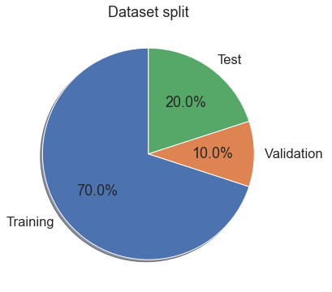
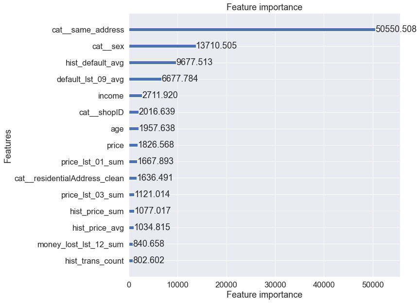

```python
import pandas as pd
import matplotlib
import matplotlib.pyplot as plt
import seaborn as sns
```


```python
df = catalog.load('master_table')
```

Clients differ between each other on different levels.    

At this point I want to focus only on the information that says if it is a New customer or if it is Existing Customer.

I don't have a historical transaction for a New customers and in this case they should have a separate model build.
Below I want to check if having at least 1 transaction is enough.     

# Create segments


```python
df_new_customer = df.loc[df['rank']==1].reset_index(drop=True)
df_existing_customer = df.loc[df['rank']>1].reset_index(drop=True)
```


```python
df_new_customer.default.mean()
```


    0.09066567694387742


```python
df_existing_customer.default.mean()
```


    0.09097233725360278


```python
df_new_customer.late.mean()
```


    0.2958829299329286


```python
df_existing_customer.late.mean()
```


    0.2942764066037215


Further in this analysis I will focus on Existing Customer

# Data split


```python
params_ds = catalog.load('params:data_set')
```

df_train - dataset for model training,    
df_test  - dataset for model performance assessing (out of sample)    
df_valid - dataset for hp tuning (out of sample),   


```python
params_ds
```


    {'train': 0.7, 'test': 0.2, 'valid': 0.1}


```python
size=df_existing_customer.shape[0]
train_size = int(size * params_ds['train'])
test_size = int(size * params_ds['test'])

df_existing_customer=df_existing_customer.sample(frac=1, random_state=1)
df_train = df_existing_customer.iloc[:train_size].sort_index()
df_test = df_existing_customer.iloc[train_size:(train_size+test_size)].sort_index()
df_valid = df_existing_customer.iloc[(train_size+test_size):].sort_index()

```


```python

sns.set(font_scale=1.5)

# Pie chart
labels = ['Training', 'Validation ', 'Test']
sizes = [df_train.shape[0], df_valid.shape[0], df_test.shape[0]]
# only "explode" the 2nd slice (i.e. 'Hogs')
fig1, ax1 = plt.subplots(figsize=(10,6))
ax1.pie(sizes,  labels=labels, autopct='%1.1f%%',
        shadow=True, startangle=90)

plt.title('Dataset split')

plt.show()
```


    

    


There are around 450K of observation in the segment of Existing Customer. 

* **df_train** - dataset for model training (EXISTING CUSTOMER),
* **df_test**  - dataset for model performance assessing (out of sample) (EXISTING CUSTOMER),
* **df_valid** - dataset for hp tuning (out of sample) (EXISTING CUSTOMER),


When there isn't so plenty of data, df_valid could be excluded from training data set at the stage of hyperparameter tuning, and put back before final training.

There could be at least one another dataset, but I don't use is because of nature of the data and the fact I don't have transaction date.

* **df_oot** - data set that will allow to check model performance on the latest available data (out of time) (EXISTING CUSTOMER),

# model lightgbm - no hp, just for feature importance


```python
import numpy as np
from category_encoders import *

from sklearn.feature_extraction.text import TfidfVectorizer
from sklearn.compose import ColumnTransformer
from sklearn.pipeline import make_pipeline
from sklearn.model_selection import cross_val_predict
from sklearn import metrics
from sklearn.metrics import roc_auc_score

import lightgbm as lgb
from lightgbm import LGBMClassifier

import matplotlib.pyplot as plt 

import warnings

warnings.simplefilter(action='ignore', category=FutureWarning)
warnings.simplefilter(action='ignore', category=DeprecationWarning)

```


```python
categorical_cols = ['sex', 'residentialAddress_clean',
                    'geo_risk_rank','shopID','same_address']
numerical_cols = ['age', 'income', 'price'] + \
    df.filter(regex='(^hist_)|(_lst_)').columns.to_list()
target_column = ['default']


```


```python
lgb_params = {"seed": 42,
              "objective": "binary", 
              "learning_rate": 0.1,
              "metric":"auc"
              }
```


```python
transformer = make_pipeline(
    ColumnTransformer([
        ('num','passthrough', numerical_cols),
        ('cat', OrdinalEncoder(), categorical_cols),    
    ]),
)
```


```python
d_train = lgb.Dataset(
    transformer.fit_transform(df_train, df_train['default']), 
    label=df_train['default'], 
    feature_name=transformer.named_steps['columntransformer'].get_feature_names(),
    params={'verbose': -1})

d_valid = lgb.Dataset(
    transformer.transform(df_valid), 
    label=df_valid['default'], 
    feature_name=transformer.named_steps['columntransformer'].get_feature_names(),
    params={'verbose': -1})

d_test = lgb.Dataset(
    transformer.transform(df_test), 
    label=df_test['default'], 
    feature_name=transformer.named_steps['columntransformer'].get_feature_names(),
    params={'verbose': -1})
```


```python
classifier = make_pipeline(
    ColumnTransformer([
        ('num','passthrough', numerical_cols),
        ('cat', OrdinalEncoder(), categorical_cols),       
    ]),
    LGBMClassifier(n_estimators=500, random_state=1, metric= "auc", importance_type='gain')
)
```


```python
%%time
results=[]

for i in range(1,11): 
    _tmp_target = df.loc[df['rank']==i].reset_index(drop=True)[target_column].values.reshape(-1,)
    oof_pred = cross_val_predict(classifier, 
                                 df.loc[df['rank']==i].reset_index(drop=True), 
                                 _tmp_target, 
                                 cv=5,
                                 method="predict_proba")
    _tmp_roc_score = roc_auc_score(_tmp_target, oof_pred[:,1])
    results += [(i, _tmp_roc_score)]
    print("#{}, Cross validation AUC {:.4f}".format(i, _tmp_roc_score))

    
_tmp_target = df[target_column].values.reshape(-1,)
oof_pred = cross_val_predict(classifier, 
                             df, 
                             _tmp_target, 
                             cv=5,
                             method="predict_proba")
_tmp_roc_score = roc_auc_score(_tmp_target, oof_pred[:,1])
results += [(i, _tmp_roc_score)]
print("#ALL, Cross validation AUC {:.4f}".format(_tmp_roc_score))
```

    #1, Cross validation AUC 0.6159
    #2, Cross validation AUC 0.6189
    #3, Cross validation AUC 0.6307
    #4, Cross validation AUC 0.6387
    #5, Cross validation AUC 0.6421
    #6, Cross validation AUC 0.6311
    #7, Cross validation AUC 0.6276
    #8, Cross validation AUC 0.6191
    #9, Cross validation AUC 0.5909
    #10, Cross validation AUC 0.5702
    #ALL, Cross validation AUC 0.6597
    CPU times: user 13min 13s, sys: 1min 36s, total: 14min 49s
    Wall time: 11min 54s


```python
model = lgb.train(
    lgb_params,
    d_train,
    valid_sets=[d_train, d_valid],
    valid_names=['train', 'valid'],
)
```

    [LightGBM] [Info] Number of positive: 28816, number of negative: 288126
    [LightGBM] [Warning] Auto-choosing row-wise multi-threading, the overhead of testing was 0.152218 seconds.
    You can set `force_row_wise=true` to remove the overhead.
    And if memory is not enough, you can set `force_col_wise=true`.
    [LightGBM] [Info] Total Bins 7655
    [LightGBM] [Info] Number of data points in the train set: 316942, number of used features: 75
    [1]	train's auc: 0.664217	valid's auc: 0.672178
    [2]	train's auc: 0.667457	valid's auc: 0.671004
    [3]	train's auc: 0.667925	valid's auc: 0.671931
    [4]	train's auc: 0.6688	valid's auc: 0.671506
    [5]	train's auc: 0.669049	valid's auc: 0.672512
    [6]	train's auc: 0.669668	valid's auc: 0.671635
    [7]	train's auc: 0.670048	valid's auc: 0.671611
    [8]	train's auc: 0.670568	valid's auc: 0.671816
    [9]	train's auc: 0.671118	valid's auc: 0.671536
    [10]	train's auc: 0.671737	valid's auc: 0.671632
    [11]	train's auc: 0.671894	valid's auc: 0.67148
    [12]	train's auc: 0.671976	valid's auc: 0.671394
    [13]	train's auc: 0.672536	valid's auc: 0.67147
    [14]	train's auc: 0.672638	valid's auc: 0.671531
    [15]	train's auc: 0.67269	valid's auc: 0.671546
    [16]	train's auc: 0.673406	valid's auc: 0.671487
    [17]	train's auc: 0.673599	valid's auc: 0.671489
    [18]	train's auc: 0.675077	valid's auc: 0.671642
    [19]	train's auc: 0.67533	valid's auc: 0.671649
    [20]	train's auc: 0.675828	valid's auc: 0.671128
    [21]	train's auc: 0.676069	valid's auc: 0.671267
    [22]	train's auc: 0.676358	valid's auc: 0.671343
    [23]	train's auc: 0.676395	valid's auc: 0.671338
    [24]	train's auc: 0.676617	valid's auc: 0.671376
    [25]	train's auc: 0.67672	valid's auc: 0.671389
    [26]	train's auc: 0.677529	valid's auc: 0.671242
    [27]	train's auc: 0.677549	valid's auc: 0.671217
    [28]	train's auc: 0.678759	valid's auc: 0.671394
    [29]	train's auc: 0.678777	valid's auc: 0.671391
    [30]	train's auc: 0.679106	valid's auc: 0.67138
    [31]	train's auc: 0.679746	valid's auc: 0.67108
    [32]	train's auc: 0.679791	valid's auc: 0.671046
    [33]	train's auc: 0.680017	valid's auc: 0.671202
    [34]	train's auc: 0.680189	valid's auc: 0.671121
    [35]	train's auc: 0.68041	valid's auc: 0.671125
    [36]	train's auc: 0.680927	valid's auc: 0.67088
    [37]	train's auc: 0.680946	valid's auc: 0.670884
    [38]	train's auc: 0.681084	valid's auc: 0.670932
    [39]	train's auc: 0.681226	valid's auc: 0.670905
    [40]	train's auc: 0.681766	valid's auc: 0.670832
    [41]	train's auc: 0.682511	valid's auc: 0.671011
    [42]	train's auc: 0.682711	valid's auc: 0.670936
    [43]	train's auc: 0.68315	valid's auc: 0.670814
    [44]	train's auc: 0.683823	valid's auc: 0.670905
    [45]	train's auc: 0.684322	valid's auc: 0.670919
    [46]	train's auc: 0.68442	valid's auc: 0.67093
    [47]	train's auc: 0.684961	valid's auc: 0.670748
    [48]	train's auc: 0.684991	valid's auc: 0.670777
    [49]	train's auc: 0.685939	valid's auc: 0.670557
    [50]	train's auc: 0.686409	valid's auc: 0.670756
    [51]	train's auc: 0.686566	valid's auc: 0.670701
    [52]	train's auc: 0.687273	valid's auc: 0.670659
    [53]	train's auc: 0.687886	valid's auc: 0.670999
    [54]	train's auc: 0.688552	valid's auc: 0.670695
    [55]	train's auc: 0.688857	valid's auc: 0.670665
    [56]	train's auc: 0.68893	valid's auc: 0.670662
    [57]	train's auc: 0.689467	valid's auc: 0.670758
    [58]	train's auc: 0.689971	valid's auc: 0.670771
    [59]	train's auc: 0.690086	valid's auc: 0.670777
    [60]	train's auc: 0.690876	valid's auc: 0.670565
    [61]	train's auc: 0.691106	valid's auc: 0.670461
    [62]	train's auc: 0.691638	valid's auc: 0.670297
    [63]	train's auc: 0.692203	valid's auc: 0.670396
    [64]	train's auc: 0.692622	valid's auc: 0.670393
    [65]	train's auc: 0.69298	valid's auc: 0.670263
    [66]	train's auc: 0.69341	valid's auc: 0.670565
    [67]	train's auc: 0.694191	valid's auc: 0.670762
    [68]	train's auc: 0.694377	valid's auc: 0.670667
    [69]	train's auc: 0.694921	valid's auc: 0.670616
    [70]	train's auc: 0.695539	valid's auc: 0.670582
    [71]	train's auc: 0.695855	valid's auc: 0.670558
    [72]	train's auc: 0.696152	valid's auc: 0.670606
    [73]	train's auc: 0.696767	valid's auc: 0.670425
    [74]	train's auc: 0.696975	valid's auc: 0.670663
    [75]	train's auc: 0.697893	valid's auc: 0.670602
    [76]	train's auc: 0.698195	valid's auc: 0.670631
    [77]	train's auc: 0.698324	valid's auc: 0.670617
    [78]	train's auc: 0.698665	valid's auc: 0.670808
    [79]	train's auc: 0.698703	valid's auc: 0.670793
    [80]	train's auc: 0.698866	valid's auc: 0.670708
    [81]	train's auc: 0.699163	valid's auc: 0.670387
    [82]	train's auc: 0.699534	valid's auc: 0.670221
    [83]	train's auc: 0.699885	valid's auc: 0.670359
    [84]	train's auc: 0.700431	valid's auc: 0.670308
    [85]	train's auc: 0.700933	valid's auc: 0.670723
    [86]	train's auc: 0.701285	valid's auc: 0.670514
    [87]	train's auc: 0.70192	valid's auc: 0.670261
    [88]	train's auc: 0.702301	valid's auc: 0.670241
    [89]	train's auc: 0.702785	valid's auc: 0.670254
    [90]	train's auc: 0.703254	valid's auc: 0.670228
    [91]	train's auc: 0.703508	valid's auc: 0.670287
    [92]	train's auc: 0.703614	valid's auc: 0.670255
    [93]	train's auc: 0.703875	valid's auc: 0.670282
    [94]	train's auc: 0.704221	valid's auc: 0.670342
    [95]	train's auc: 0.704376	valid's auc: 0.670175
    [96]	train's auc: 0.704761	valid's auc: 0.670327
    [97]	train's auc: 0.705186	valid's auc: 0.67033
    [98]	train's auc: 0.705314	valid's auc: 0.670394
    [99]	train's auc: 0.705339	valid's auc: 0.670404
    [100]	train's auc: 0.706166	valid's auc: 0.670464


```python
fig, ax2 = plt.subplots(figsize=(10,10))
lgb.plot_importance(model, max_num_features=15, ax=ax2, importance_type = 'gain')
```


    <AxesSubplot:title={'center':'Feature importance'}, xlabel='Feature importance', ylabel='Features'>


    

    

